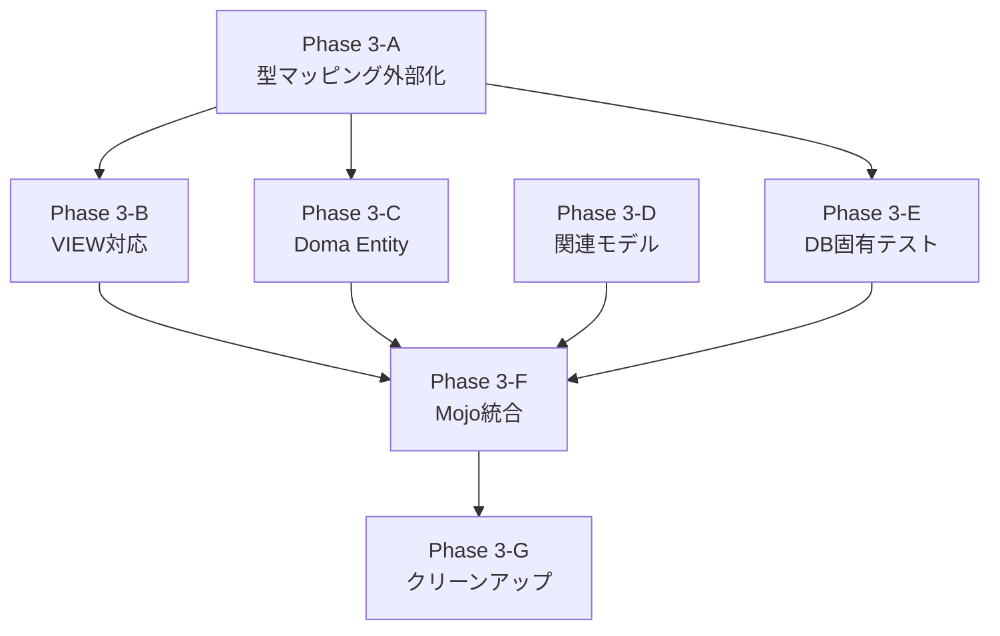

# Phase 3 実装計画: S2JDBC-Gen完全置換

**作成日**: 2026-02-14
**基盤**: Phase 2 PoC（feature/phase2-jooq-poc ブランチ）
**レビュー統合元**:
- アーキテクチャレビュー (`jooq-architecture-review.md`) — 評価: B+
- 互換性レビュー (`jooq-compatibility-review.md`) — 評価: B
- リスクレビュー (`jooq-risk-review.md`) — 評価: B

---

## 1. レビュー指摘事項への対応方針

### 1.1 アーキテクチャレビューからの指摘

| # | 指摘 | 対応方針 | 優先度 |
|---|------|---------|--------|
| A1 | `GspJpaEntityGenerator.getJavaType()`の型マッピングがswitch文でハードコード。SRPに違反 | `GspColumnTypeMapper`に型マッピングロジックを移動。MapベースのDB型→Java型変換に変更 | **高** |
| A2 | VIEW対応の未実装 | `GspViewSupport`クラスを新設し、`DbTableMetaReaderWithView`の推定ロジックを移植 | **高** |
| A3 | FreeMarkerテンプレート非対応 | 移行ガイドを作成。`JavaGenerator`拡張による代替手段をドキュメント化 | **低** |
| A4 | `DataTypeDefinition`の具象クラスへの依存（DIP違反） | 型マッピングをインターフェース経由に変更し、テスト容易性を向上 | **中** |

### 1.2 互換性レビューからの指摘

| # | 指摘 | 対応方針 | 優先度 |
|---|------|---------|--------|
| C1 | `genDialectClassName`パラメータの廃止 | 指定してもwarning出力し無視する互換性レイヤーを`GenerateEntity` Mojoに追加 | **中** |
| C2 | `dialectClassName`パラメータの廃止 | 同上 | **中** |
| C3 | `diconDir`パラメータの不要化 | deprecated化。warning出力 | **低** |
| C4 | `entityTemplate`/`templateFilePrimaryDir`の仕様変更 | 移行ガイドに記載。将来的にブリッジレイヤー検討 | **低** |
| C5 | Phase 3で対応: `useAccessor`, `useJSR310`, `allocationSize`, `versionColumnNamePattern` | Phase 3で順次実装 | **高** |
| C6 | メジャーバージョンアップ（6.0.0）としてリリース | バージョニング戦略として採用 | — |

### 1.3 リスクレビューからの指摘

| # | 指摘 | 対応方針 | 優先度 |
|---|------|---------|--------|
| R1 | Oracle NUMBER型のprecision推定精度 | Oracle実機テストで既存GenDialectとの差異を検証。`GspColumnTypeMapper`にOracle固有設定追加 | **最高** |
| R2 | VIEW対応の複雑性 | 独立サブタスクとして分離。`GspViewSupport`で`ViewAnalyzer`ロジックを移植 | **最高** |
| R3 | Doma Entity生成 | `GspDomaEntityGenerator`を`GspJpaEntityGenerator`と同パターンで実装 | **高** |
| R4 | FreeMarkerテンプレートカスタマイズの互換性断絶 | 移行ガイド作成（A3と統合） | **低** |
| R5 | 6DB全対応のテスト負荷 | Docker化DB環境 + TestcontainersでCI組込み | **高** |

---

## 2. 実装タスクの分解と優先順位

### Phase 3-A: 型マッピング外部化 + Mojoパラメータ連携（最優先）

**目的**: Phase 2 PoCのアーキテクチャ改善 + 既存パラメータの完全連携

#### タスク 3A-1: 型マッピングの外部化
- `GspJpaEntityGenerator.getJavaType()`のswitch文を`GspColumnTypeMapper`に移動
- `Map<String, Function<DataTypeDefinition, String>>`ベースの変換に変更
- DB固有の型マッピング設定を追加可能な設計に
- **ファイル**: `GspColumnTypeMapper.java`（大幅改修）、`GspJpaEntityGenerator.java`（軽量化）

#### タスク 3A-2: Mojoパラメータ連携
- `useAccessor` → `GspJpaEntityGenerator`でgetter/setter生成の切替
- `useJSR310` → `GspColumnTypeMapper`でのForcedType設定（Phase 2で設定構築は実装済み、Generator内反映）
- `allocationSize` → `GspEntityGenerationConfig`経由でGeneratorに渡す
- `versionColumnNamePattern` → `@Version`アノテーション付与判定ロジック
- **ファイル**: `GspJpaEntityGenerator.java`、`GspEntityGenerationConfig.java`

#### タスク 3A-3: 非推奨パラメータの互換性レイヤー
- `genDialectClassName`: 指定時にwarning + 無視
- `dialectClassName`: 指定時にwarning + 無視
- `diconDir`: `@Deprecated`化 + warning
- **ファイル**: `GenerateEntity.java`（Mojo）

### Phase 3-B: VIEW対応（高優先）

**目的**: VIEWベースのEntity生成機能の移植

#### タスク 3B-1: GspViewSupport実装
- `DbTableMetaReaderWithView`のVIEW判定ロジック移植
- VIEWの基底テーブルからPK/FK情報を推定するロジック
- jOOQ `JDBCDatabase`のメタデータをpost-processで補完
- **ファイル**: `GspViewSupport.java`（新規）

#### タスク 3B-2: VIEW対応テスト
- H2でVIEW + 基底テーブルのテストケース作成
- VIEW Entity生成の正確性検証
- **ファイル**: `GspViewSupportTest.java`（新規）

### Phase 3-C: Doma Entity生成（高優先）

**目的**: Doma Entity生成モードの実装

#### タスク 3C-1: GspDomaEntityGenerator実装
- `JavaGenerator`を拡張し、Domaアノテーション付きEntity生成
- `@org.seasar.doma.Entity`, `@Column`, `@Id`, `@GeneratedValue`等
- `DomaGspFactoryImpl`の`DomaEntityModelFactory`ロジックを移植
- **ファイル**: `GspDomaEntityGenerator.java`（新規）

#### タスク 3C-2: entityType切替実装
- `GspEntityGenerationConfig`で`entityType`パラメータによりGeneratorクラスを切替
- `"jpa"` → `GspJpaEntityGenerator`、`"doma"` → `GspDomaEntityGenerator`
- **ファイル**: `GspEntityGenerationConfig.java`（改修）

#### タスク 3C-3: Doma Entity生成テスト
- H2でのDoma Entity生成テスト
- JPA Entity生成テストとの差異検証
- **ファイル**: `GspDomaEntityGeneratorTest.java`（新規）

### Phase 3-D: 関連モデル対応（中優先）

**目的**: 外部キー関連アノテーションの生成

#### タスク 3D-1: FK→JPA関連アノテーション
- `@JoinColumn`, `@ManyToOne`, `@OneToMany`の生成
- jOOQ `ForeignKeyDefinition`からの情報取得
- **ファイル**: `GspJpaEntityGenerator.java`（追加）

#### タスク 3D-2: 複合ユニーク制約
- `@UniqueConstraint`の生成
- jOOQ `UniqueKeyDefinition`からの情報取得
- **ファイル**: `GspJpaEntityGenerator.java`（追加）

### Phase 3-E: DB固有テスト（高優先）

**目的**: 6DB全てでの動作検証

#### タスク 3E-1: Oracle DB テスト
- Oracle型マッピングの精度検証（NUMBER, DATE, TIMESTAMP等）
- 既存`ExtendedOracleGenDialect`の型マッピングとの差異検出
- 差異がある場合、`GspColumnTypeMapper`にOracle固有設定追加
- **環境**: Testcontainers + gvenzl/oracle-free

#### タスク 3E-2: PostgreSQL テスト
- PostgreSQL固有型（SERIAL, TEXT, JSONB等）の検証
- **環境**: Testcontainers + postgres

#### タスク 3E-3: MySQL テスト
- MySQL固有型（TINYINT, MEDIUMINT, ENUM等）の検証
- AUTO_INCREMENT → `@GeneratedValue(strategy = IDENTITY)`の検証
- **環境**: Testcontainers + mysql

#### タスク 3E-4: SQL Server テスト
- SQL Server固有型（NVARCHAR, UNIQUEIDENTIFIER等）の検証
- IDENTITY列の検証
- **環境**: Testcontainers + mcr.microsoft.com/mssql/server

#### タスク 3E-5: DB2 テスト
- DB2固有型の検証
- **環境**: Testcontainers + ibmcom/db2

### Phase 3-F: GenerateEntity Mojo統合（高優先）

**目的**: 既存のMojoからjOOQ Code Generationを呼び出す

#### タスク 3F-1: GenerateEntity Mojoの改修
- 既存のdicon生成 + S2JDBC-Gen呼び出しを、`GspEntityGenerationConfig.create()` + `GenerationTool.generate()` に置換
- 既存パラメータを全て`GspEntityGenerationConfig`に渡す
- **ファイル**: `GenerateEntity.java`（大幅改修）

#### タスク 3F-2: GenerateService Mojoの検討
- `GenerateService.java`もS2JDBC-Genに依存。Entity生成後のService/Names生成をどう扱うか検討
- 方針: Phase 3ではEntity生成のみ対応。Service/Namesは別タスクで検討
- **ファイル**: `GenerateService.java`（影響評価のみ）

### Phase 3-G: クリーンアップ（低優先、Phase 3完了時）

**目的**: S2JDBC-Gen関連コードの除去

#### タスク 3G-1: S2JDBC-Gen依存コード除去
- `ExtendedGenerateEntityCommand.java` 除去
- `GspFactoryImpl.java` 除去
- `DomaGspFactoryImpl.java` 除去
- `DbTableMetaReaderWithView.java` 除去（VIEW機能はGspViewSupportに移植済み）
- `GspAttributeDescFactoryImpl.java` 除去
- `JakartaEntityModelFactoryImpl.java` 除去
- `JSR310AttributeModelFactoryImpl.java` 除去
- 6つの`ExtendedXxxGenDialect.java` 除去

#### タスク 3G-2: FreeMarkerテンプレート除去
- `gsp_entity.ftl` 除去
- `gsp_doma_entity.ftl` 除去
- `convention.dicon.ftl` 除去
- `jdbc.dicon.ftl` 除去
- `s2jdbc.dicon.ftl` 除去

#### タスク 3G-3: pom.xml依存の除去
- `s2-framework`, `s2-extension`, `s2-tiger`, `s2jdbc-gen` 除去
- `freemarker` 除去（テンプレートエンジン不要化）
- Seasar Maven Repository除去
- jOOQ依存のバージョン確定

#### タスク 3G-4: 移行ガイド作成
- 5.x → 6.0.0の移行ガイド
- パラメータ変更一覧
- `entityTemplate`カスタマイズの代替手段
- Entity出力形式の差異説明

---

## 3. 実装スケジュール（推奨順序）

```
Phase 3-A（型マッピング外部化 + パラメータ連携）
    ↓ （アーキテクチャ改善が他タスクの前提）
Phase 3-B（VIEW対応） ←→ Phase 3-C（Doma Entity生成）
    ↓                        ↓
Phase 3-E（DB固有テスト） ← 並行実施
    ↓
Phase 3-D（関連モデル対応）
    ↓
Phase 3-F（Mojo統合）
    ↓ （全機能が揃ってからMojo統合）
Phase 3-G（クリーンアップ）
    ↓
リリース 6.0.0
```

### 依存関係



---

## 4. リスク緩和策の具体的な実装方法

### 4.1 R1: Oracle NUMBER型精度の確保

**問題**: `DatabaseMetaData.getColumns()`がOracle NUMBER型のprecision/scaleを正確に返さないケースがある。

**実装方法**:
```java
// GspColumnTypeMapper に Oracle固有の ForcedType を追加
public static List<ForcedType> createOracleForcedTypes() {
    List<ForcedType> types = new ArrayList<>();
    // NUMBER(1,0) → boolean
    types.add(new ForcedType()
        .withUserType("boolean")
        .withIncludeTypes("DECIMAL\\(1,0\\)")
    );
    // NUMBER(p,0) where p < 10 → Integer
    types.add(new ForcedType()
        .withUserType("java.lang.Integer")
        .withIncludeTypes("DECIMAL\\([2-9],0\\)")
    );
    return types;
}
```

**検証方法**: `ExtendedOracleGenDialect.columnTypeMap`の全エントリをテストケースとして再現し、jOOQ版出力と比較。

### 4.2 R2: VIEW対応

**問題**: jOOQ JDBCDatabaseではVIEWのPK情報が取得できない。

**実装方法**:
```java
public class GspViewSupport {
    /**
     * VIEWの基底テーブルからPK/FK情報を推定する。
     * DbTableMetaReaderWithViewの推定ロジックを移植。
     */
    public static List<ColumnDefinition> inferPrimaryKeyColumns(
            TableDefinition view, Connection connection) {
        // 1. INFORMATION_SCHEMA.VIEW_TABLE_USAGE（または同等）でVIEWの基底テーブルを特定
        // 2. 基底テーブルのPKカラムを取得
        // 3. VIEW内に同名カラムがあればPKとみなす
        // 4. DB固有のVIEW定義解析が必要な場合はDialect経由で処理
    }
}
```

### 4.3 R5: テスト環境整備

**実装方法**: `pom.xml`にTestcontainers依存を追加し、DBテストをプロファイルで管理。

```xml
<profile>
    <id>oracle-test</id>
    <dependencies>
        <dependency>
            <groupId>org.testcontainers</groupId>
            <artifactId>oracle-free</artifactId>
            <scope>test</scope>
        </dependency>
    </dependencies>
</profile>
```

デフォルトの`mvn clean test`はH2のみ。`mvn clean test -Poracle-test`でOracle含むテスト実行。

---

## 5. 成功基準

Phase 3が完了したと判断する基準:

1. **機能完全性**: S2JDBC-Genの全機能（Entity生成、VIEW対応、Doma Entity）がjOOQ版で動作
2. **テストパス**: `mvn clean test`で既存テスト + 新規テストが全パス
3. **6DBテスト**: H2, PostgreSQL, MySQL, Oracle, SQL Server, DB2でEntity生成テストがパス
4. **S2JDBC-Gen除去**: s2-framework, s2-extension, s2-tiger, s2jdbc-gen依存がpom.xmlから除去
5. **Seasar Maven Repository除去**: `<repository>` から `maven.seasar.org` 除去
6. **移行ガイド**: 5.x → 6.0.0の移行ガイドが完成
7. **既存Entity互換**: 既存テストの期待出力ファイルとjOOQ版出力の差異が許容範囲内

---

## 6. Phase 3のサブタスク分割案

Phase 3の下位タスクとして以下を推奨:

| サブタスクID | 内容 | 依存 | 推定規模 |
|-------------|------|------|---------|
| Phase3-A | Phase 3-A: 型マッピング外部化 + パラメータ連携 | Phase 2完了 | 中 |
| Phase3-B | Phase 3-B: VIEW対応 | Phase3-A | 大 |
| Phase3-C | Phase 3-C: Doma Entity生成 | Phase3-A | 中 |
| Phase3-D | Phase 3-D: 関連モデル対応 | Phase3-A | 中 |
| Phase3-E | Phase 3-E: DB固有テスト | Phase3-A | 大 |
| Phase3-F | Phase 3-F: Mojo統合 | Phase3-A〜f | 大 |
| Phase3-G | Phase 3-G: クリーンアップ + 移行ガイド | Phase3-F | 中 |
