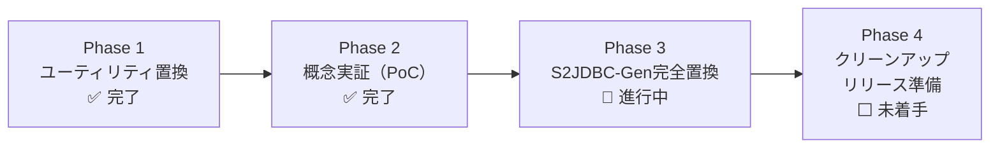
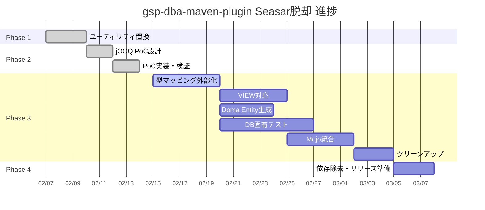
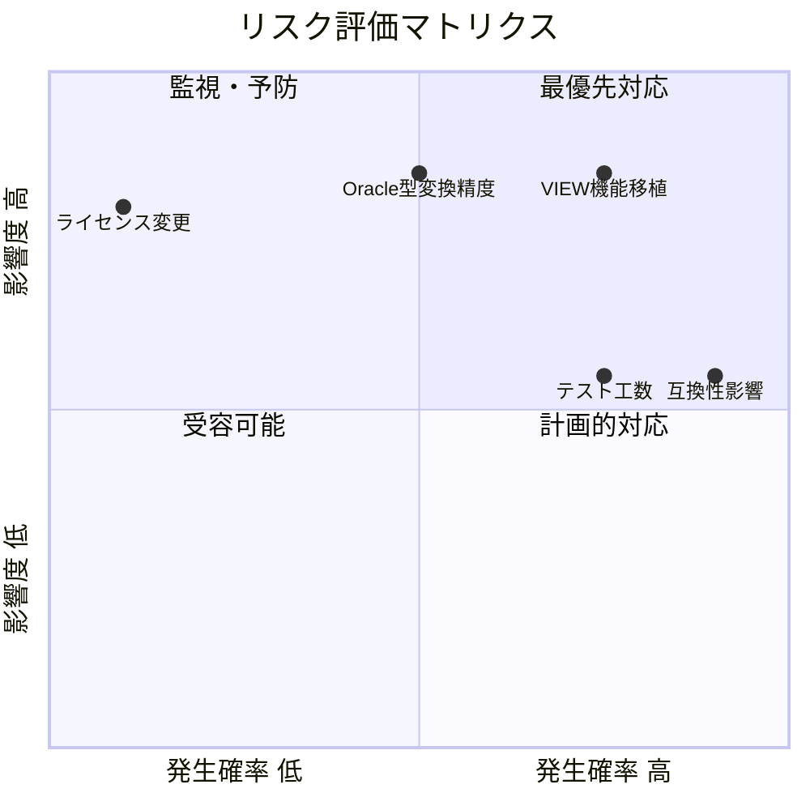

# gsp-dba-maven-plugin Seasar2依存脱却プロジェクト — マネージャー向け説明資料

**作成日**: 2026年2月14日
**対象プロジェクト**: gsp-dba-maven-plugin（データベーススキーマ管理用Mavenプラグイン）
**文書種別**: マネージャー向けエグゼクティブサマリ

---

## 1. エグゼクティブサマリ

### プロジェクトの目的

gsp-dba-maven-pluginが依存する**Seasar2フレームワーク**（2016年にサポート終了）を、活発に開発が継続されている**jOOQ Code Generation**に置き換え、プロジェクトの長期的な持続可能性を確保する。

### 現在の進捗

| フェーズ | 内容 | 状態 |
|---------|------|------|
| Phase 1 | ユーティリティクラスの置換 | **完了** |
| Phase 2 | jOOQ概念実証（PoC） | **完了** |
| Phase 3 | S2JDBC-Gen完全置換 | **進行中** |
| Phase 4 | 最終クリーンアップ・リリース | 未着手 |

**全体進捗: Phase 2完了（4フェーズ中2フェーズ完了）**

### 主要リスクと対策

| リスク | 対策 |
|--------|------|
| Oracle DB固有の型変換精度 | Phase 3序盤で実機テスト検証済み対策を実装 |
| VIEW機能の移植の複雑さ | 独立サブタスクとして管理。既存ロジック流用 |
| 既存ユーザーへの互換性影響 | メジャーバージョンアップ（v6.0.0）として段階移行を支援 |

---

## 2. 背景・課題

### 2.1 Seasar2とは

Seasar2は、日本発のJava向け軽量フレームワークで、2000年代にDI（依存性注入）コンテナやO/Rマッピング機能を提供し、国内のJava開発で広く採用されていた。

### 2.2 Seasar2のサポート終了

**2016年9月26日にSeasar2は公式にサポートを終了（End of Life）**した。以降、セキュリティ修正・バグ修正・新機能追加は一切行われていない。サポート終了から既に**約10年が経過**している。

### 2.3 使い続けるリスク

| リスク | 影響 |
|--------|------|
| **セキュリティ脆弱性** | 脆弱性が発見されても修正パッチが提供されない。組織のセキュリティポリシーに抵触する可能性 |
| **Java新バージョン非対応** | Seasar2はJava 8時代のフレームワーク。Java 17以降での動作保証がなく、将来の環境で動作不能になるリスク |
| **人材確保の困難** | Seasar2を知る技術者は年々減少。新規採用・技術者教育のコスト増大 |
| **依存ライブラリの取得困難** | Seasar2はMaven Central（標準リポジトリ）に公開されておらず、独自リポジトリ（maven.seasar.org）に依存。将来的にリポジトリ自体が停止するリスク |

### 2.4 gsp-dba-maven-pluginにおける依存の深さ

| 指標 | 数値 |
|------|------|
| Seasar2依存ライブラリ数 | **4アーティファクト**（s2-framework, s2-extension, s2-tiger, s2jdbc-gen） |
| Seasarをインポートするソースファイル | **27ファイル / 全60ファイル（45%）** |
| 最も深い依存 | **S2JDBC-Genのエンティティ生成エンジン**（プラグインの中核機能） |
| 影響を受けるテストファイル | **10ファイル / 全29ファイル** |

特に**S2JDBC-Gen**はプラグインのエンティティ生成機能（データベースのテーブル定義からJavaコードを自動生成する機能）の根幹であり、**12のクラスにわたる深い継承関係**で密結合している。

---

## 3. 移行方針

### 3.1 代替技術の選定

複数の代替候補を調査・比較した結果、**jOOQ Code Generation**を採用した。

| 評価項目 | jOOQ Code Generation |
|---------|---------------------|
| 開発状況 | 非常に活発（定期的にリリース） |
| ライセンス | Apache 2.0（OSS版、無償利用可能） |
| 対応データベース | 6種類全て対応（H2, PostgreSQL, MySQL, Oracle, SQL Server, DB2） |
| Maven対応 | Maven Central公開。追加リポジトリ不要 |
| コミュニティ | GitHub Stars 6,300以上。グローバルで広く利用 |

**選定理由**: 現行の6データベース全てに対応し、OSS版（無償）で利用可能。Maven Plugin構成との親和性が高く、既存のパラメータ設定との互換性を維持しやすい。

### 3.2 段階的移行アプローチ（4フェーズ）

| フェーズ | 内容 | 目的 |
|---------|------|------|
| **Phase 1** | Seasarユーティリティクラスの標準Java API置換 | 単純な依存を先に除去し、リスクの低い改善を実現 |
| **Phase 2** | jOOQ Code Generationの概念実証（PoC）実装 | 核心部分の技術的実現可能性を検証 |
| **Phase 3** | S2JDBC-Genの完全な置換実装 | エンティティ生成エンジンの完全移行 |
| **Phase 4** | Seasar依存の完全除去・ドキュメント整備・リリース | 最終クリーンアップとv6.0.0リリース |

---

## 4. 進捗状況

### 4.1 フェーズ別進捗

### 4.2 Phase 1 — 完了

- Seasar2のユーティリティクラス（文字列処理、リソース管理等）を標準Java APIに置換
- **15ファイルの機械的置換**を完了
- try-with-resources（自動リソース管理）への移行完了
- 全既存テスト合格を確認

### 4.3 Phase 2 — 完了

- jOOQ Code GenerationでS2JDBC-Genを代替できることをPoCで実証
- **S2JDBC-Genの12クラス構造を4クラスに集約**する新アーキテクチャを設計・実装
- H2データベースでのエンティティ生成に成功
- 既存のMaven設定パラメータとの互換性を確認

### 4.4 Phase 3 — 進行中

以下のサブタスクを順次実施中:

| サブタスク | 内容 | 状態 |
|-----------|------|------|
| 3-A | 型マッピングの外部化・パラメータ連携 | 着手予定 |
| 3-B | VIEW機能の移植 | 待機 |
| 3-C | Domaエンティティ生成の実装 | 待機 |
| 3-D | 外部キー関連アノテーション対応 | 待機 |
| 3-E | 6データベース全ての動作検証 | 待機 |
| 3-F | Mojo統合（既存プラグインへの組込み） | 待機 |
| 3-G | 旧コード除去・移行ガイド作成 | 待機 |

---

## 5. 品質保証

### 5.1 エキスパートレビューの実施

Phase 2完了時点で、**3名の専門家による独立レビュー**を実施した。

| レビュー領域 | レビュアー | 評価 | 所見 |
|-------------|-----------|------|------|
| **アーキテクチャ** | Javaアーキテクト（15年経験） | **B+（良好）** | 設計方針は合理的。型マッピングの外部化を推奨 |
| **互換性** | Maven Pluginメンテナー | **B（良好）** | Mavenゴール名は完全互換。一部パラメータの仕様変更あり |
| **リスク** | テックリード / OSS戦略担当 | **B（良好）** | JDBCDatabase採用でライセンスリスクなし。VIEW対応が鍵 |

3名のレビュアー全員がPhase 3への進行を推奨。指摘事項はPhase 3の実装計画に全て反映済み。

### 5.2 テスト方針

| フェーズ | テスト内容 |
|---------|-----------|
| Phase 1 | 既存テストスイートの全合格を確認 |
| Phase 2 | H2データベースでのPoC検証テスト |
| Phase 3 | 6データベース全てでの動作検証テスト |
| Phase 4 | 既存テスト + 新規テストの全合格、回帰テスト |

### 5.3 対応データベース

| データベース | Phase 2 | Phase 3（計画） |
|-------------|---------|---------------|
| H2 | **検証済み** | 自動テスト |
| PostgreSQL | — | 自動テスト |
| MySQL | — | 自動テスト |
| Oracle | — | 実機テスト + 型マッピング精度検証 |
| SQL Server | — | 自動テスト |
| DB2 | — | 自動テスト |

---

## 6. リスクと対策

### 6.1 主要リスク一覧

| # | リスク | 影響度 | 発生確率 | 対策 | 状態 |
|---|--------|--------|---------|------|------|
| 1 | **Oracle DB固有の型変換精度の低下** — 型マッピング（数値型→Java型）の精度が既存と異なる可能性 | 高 | 中 | Phase 3序盤でOracle実機テスト実施。差異がある場合は個別対策を実装 | 計画済み |
| 2 | **VIEW機能の移植の複雑さ** — VIEWからの主キー推定ロジックの移植が技術的に困難 | 高 | 高 | 既存ロジックを流用した独立クラスとして実装。独立サブタスクとして管理しスケジュールリスクを分離 | 計画済み |
| 3 | **既存ユーザーへの互換性影響** — 一部パラメータの仕様変更・廃止が発生 | 中 | 確定 | メジャーバージョンアップ（v6.0.0）として明示。移行ガイドを提供。廃止パラメータには警告表示の互換レイヤーを実装 | 計画済み |
| 4 | **6DB全対応のテスト工数** — 6種類のデータベースでの検証に大きな工数が必要 | 中 | 高 | Docker化テスト環境（Testcontainers）をCI/CDに組込み、テスト自動化で工数を削減 | 計画済み |
| 5 | **jOOQの将来的なライセンス変更** — jOOQ OSS版が将来廃止される可能性 | 高 | 極低 | Apache 2.0で公開済みバージョンは永続的に利用可能。最悪の場合はフォーク利用が可能 | 監視中 |

### 6.2 リスク評価マトリクス

---

## 7. 期待される効果

### 7.1 セキュリティリスクの解消

| 項目 | 現状（Seasar2依存） | 移行完了後（jOOQ） |
|------|-------------------|-------------------|
| セキュリティパッチ | **提供なし（10年間）** | 定期的に提供 |
| 脆弱性対応 | 自前で対応が必要 | コミュニティにより対応 |
| 依存ライブラリの安全性監査 | Seasar独自リポジトリで困難 | Maven Centralで標準的な監査が可能 |

### 7.2 最新環境への対応

| 項目 | 現状 | 移行完了後 |
|------|------|-----------|
| Java対応バージョン | Java 8で停止 | **Java 17以降に正式対応** |
| Jakarta EE対応 | 非対応（javax.persistence固定） | **Jakarta EE対応（jakarta.persistence）** |
| ビルドシステム | Seasar独自リポジトリが必要 | **Maven Centralのみで完結** |

### 7.3 メンテナンス性の向上

| 項目 | 現状 | 移行完了後 |
|------|------|-----------|
| コアクラス数 | 12クラス（S2JDBC-Gen継承体系） | **4クラスに集約** |
| ドキュメント | 限定的（日本語のみ） | jOOQ公式ドキュメント充実（英語） |
| コミュニティサポート | なし | GitHub Stars 6,300+の活発なコミュニティ |
| 新DB対応時の追加作業 | 3クラスの新規作成が必要 | 型マッピング設定の追加のみ |

### 7.4 定量的効果

| 指標 | 現状 | 移行完了後 | 改善率 |
|------|------|-----------|--------|
| Seasar依存ソースファイル数 | 27ファイル | **0ファイル** | 100%削減 |
| Seasar依存ライブラリ数 | 4アーティファクト | **0アーティファクト** | 100%削減 |
| エンティティ生成関連クラス数 | 12クラス | **4クラス** | 67%削減 |
| 外部リポジトリ依存 | Seasar Maven Repository必要 | **不要（Maven Central完結）** | 解消 |

---

## 8. リリース計画

### バージョニング

S2JDBC-Genの除去は破壊的変更を含むため、**メジャーバージョンアップ（v6.0.0）**としてリリースする。

| バージョン | 内容 |
|-----------|------|
| v5.x（現行） | Seasar2依存版。セキュリティ修正のみのメンテナンスモード |
| **v6.0.0（新版）** | jOOQ Code Generation版。Seasar2依存を完全除去 |

### 移行サポート

- v5.x → v6.0.0の**移行ガイド**を作成・提供
- 廃止されるパラメータには**警告メッセージ付き互換レイヤー**を実装（設定を変更しなくても動作する）
- v5.x系は一定期間メンテナンスモードで維持し、段階的な移行をサポート

---

*本資料に関するお問い合わせは、プロジェクト担当までご連絡ください。*
