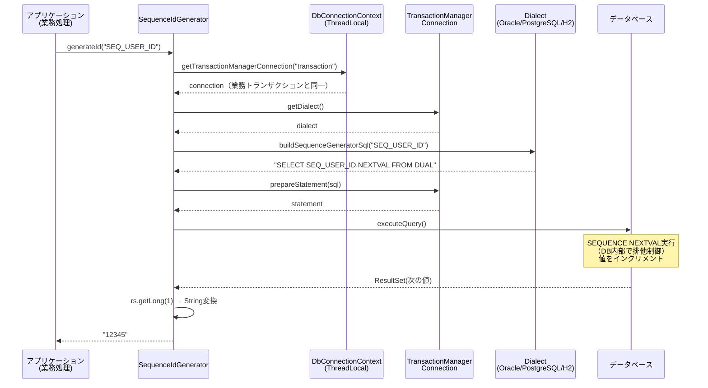
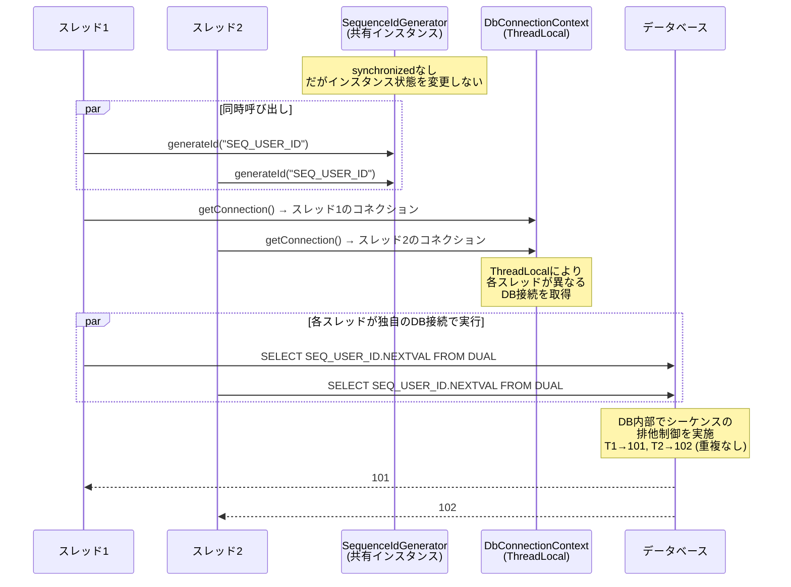
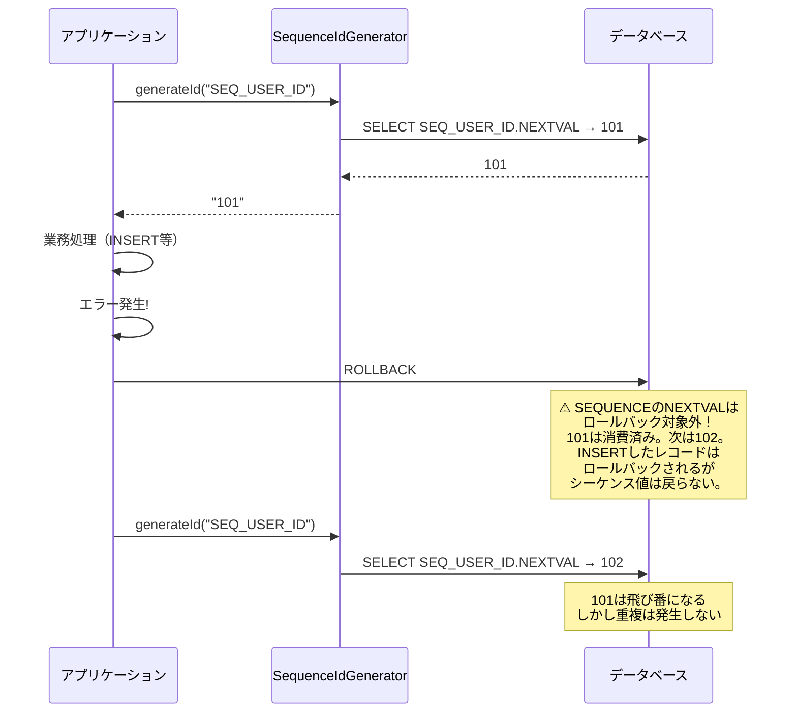
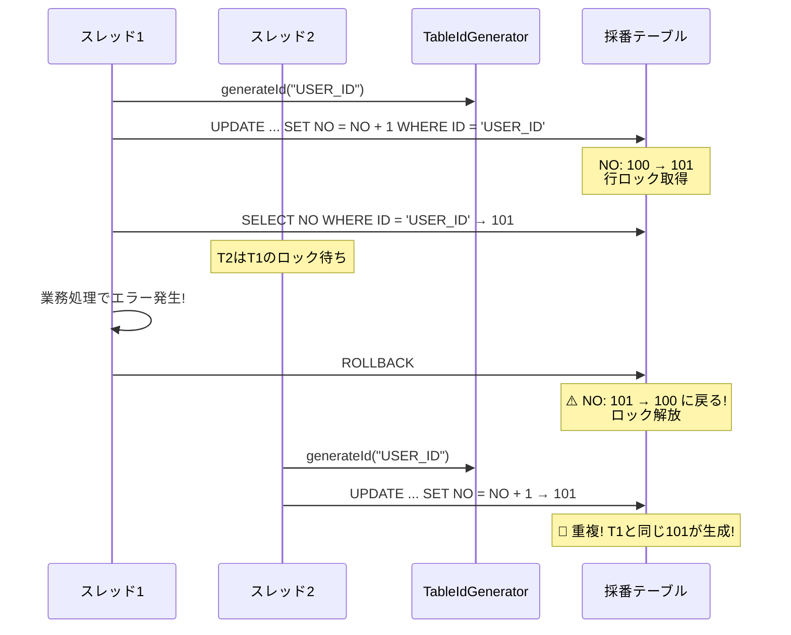

# Nablarch IdGenerator DBシーケンス採番 重複リスク調査レポート

**作成日**: 2026-02-14
**緊急度**: Critical

---

## 1. 調査対象クラス一覧

| クラス | リポジトリ | 役割 |
|-------|-----------|------|
| `IdGenerator` | nablarch-common-idgenerator | 採番インターフェース |
| `SequenceIdGenerator` | nablarch-common-idgenerator-jdbc | **DBシーケンス採番（本調査の主対象）** |
| `SequenceIdGeneratorSupport` | nablarch-common-idgenerator-jdbc | 旧シーケンス採番（`@Deprecated`） |
| `TableIdGenerator` | nablarch-common-idgenerator-jdbc | テーブル採番（比較用） |
| `FastTableIdGenerator` | nablarch-common-idgenerator-jdbc | 高速テーブル採番（比較用） |
| `DbConnectionContext` | nablarch-core-jdbc | スレッドローカルDB接続管理 |
| `SimpleDbTransactionExecutor` | nablarch-core-jdbc | 簡易トランザクション実行 |
| `Dialect`（各DB実装） | nablarch-core-jdbc | `buildSequenceGeneratorSql()`提供 |

---

## 2. SequenceIdGenerator 内部動作フロー

### 2.1 ソースコード分析

`SequenceIdGenerator`のコアロジック（GitHub実ソースより抜粋）:

```java
public String generateId(String sequenceName, IdFormatter formatter) {
    // 1. ThreadLocalからDB接続を取得（業務トランザクションと同一）
    final TransactionManagerConnection connection =
        DbConnectionContext.getTransactionManagerConnection(dbTransactionName);

    // 2. Dialect経由でSEQUENCE NEXTVAL SQLを構築
    final SqlPStatement statement = connection.prepareStatement(
        connection.getDialect().buildSequenceGeneratorSql(sequenceName));

    // 3. SQL実行（NEXTVAL取得）
    final ResultSetIterator rs = statement.executeQuery();
    if (!rs.next()) {
        throw new SequenceGeneratorFailedException(sequenceName);
    }
    try {
        final String id = String.valueOf(rs.getLong(1));
        if (formatter == null) {
            return id;
        }
        return formatter.format(sequenceName, id);
    } finally {
        try { rs.close(); } catch (RuntimeException e) {
            LOGGER.logWarn("failed to ResultSetIterator#close", e);
        }
    }
}
```

### 2.2 各DBの生成SQL

| DB | `buildSequenceGeneratorSql()` の出力 |
|----|-------------------------------------|
| Oracle | `SELECT <sequenceName>.NEXTVAL FROM DUAL` |
| PostgreSQL | `select nextval('<sequenceName>')` |
| H2 | `select nextval('<sequenceName>')` |

### 2.3 処理フロー（Mermaidシーケンス図）



### 2.4 重要な特性

| 特性 | SequenceIdGenerator の実装 |
|------|--------------------------|
| **synchronized** | **なし** — Javaレベルの排他制御は一切ない |
| **キャッシュ** | **なし** — Nablarch側のキャッシュ機構は存在しない |
| **トランザクション** | **業務トランザクションと同一**の接続を使用 |
| **インスタンス状態** | `dbTransactionName`のみ（デフォルト: `"transaction"`） |
| **スレッド安全性** | **DB接続がスレッドごとに分離されている限り安全** |

---

## 3. 重複リスク分析

### 3.1 結論（先出し）

**SequenceIdGeneratorは、正しく使用すれば重複リスクは極めて低い。**
ただし、以下の特定条件下では問題が発生しうる。

### 3.2 リスクシナリオ一覧

#### シナリオ1: マルチスレッド同時呼び出し — ⚠️ 条件付き安全



**分析**:
- `DbConnectionContext`は`ThreadLocal<Map<String, AppDbConnection>>`でDB接続を管理
- 各スレッドは**独立したDB接続**を取得するため、NEXTVAL呼び出しはスレッド間で干渉しない
- DBの**SEQUENCE自体がアトミックな排他制御**を提供
- **重複は発生しない**（正常ケース）

**リスク条件**: 複数スレッドが**同一のAppDbConnection**を共有した場合のみ問題になりうるが、`DbConnectionContext`の設計上そのようなケースは通常発生しない。

#### シナリオ2: マルチプロセス（複数JVM）環境 — ✅ 安全

- 各JVMが異なるDB接続を持ち、DBのSEQUENCEに対してNEXTVALを発行
- **DBシーケンスはプロセス間でもアトミックに動作**するため重複しない
- これはSequenceIdGeneratorの最大の利点

#### シナリオ3: トランザクションのロールバック時 — ⚠️ 番号飛びは発生するが重複しない



**分析**:
- `SequenceIdGenerator`は**業務トランザクションと同一接続**を使用
- ロールバックしてもSEQUENCEのNEXTVALは**元に戻らない**（DB仕様）
- **番号飛び（欠番）は発生するが、重複は発生しない**
- これはDBシーケンスの標準的な挙動であり、Nablarch固有の問題ではない

#### シナリオ4: DB側SEQUENCEキャッシュとの組み合わせ — ✅ 安全（欠番は増える）

```sql
-- Oracle例: キャッシュサイズ20
CREATE SEQUENCE SEQ_USER_ID START WITH 1 INCREMENT BY 1 CACHE 20;
```

- DB側のSEQUENCEキャッシュは**メモリに先読みした値を配布**する仕組み
- RAC（Oracle Real Application Clusters）では各インスタンスが異なるキャッシュ範囲を持つ
- **重複は発生しない**が、DB再起動時にキャッシュされた値が失われ**欠番が増える**
- Nablarch側にキャッシュ機構はないため、DB側キャッシュのみが影響

#### シナリオ5: アプリケーション再起動時 — ✅ 安全

- `SequenceIdGenerator`は**インスタンス内に状態を持たない**（`dbTransactionName`のみ）
- 再起動しても、DBのSEQUENCE自体が状態を保持するため重複しない
- DB側のキャッシュによる欠番は発生しうる（シナリオ4参照）

#### シナリオ6: 🚨 コンポーネント定義ミス — 危険

**これが最も現実的なリスク。**

##### 危険パターン6a: dbTransactionNameの設定ミス

```xml
<!-- ❌ 危険: 存在しないトランザクション名を指定 -->
<component name="idGenerator"
           class="nablarch.common.idgenerator.SequenceIdGenerator">
    <property name="dbTransactionName" value="nonExistentTransaction"/>
</component>
```

→ `DbConnectionContext.getTransactionManagerConnection("nonExistentTransaction")`が`IllegalArgumentException`をスロー。採番失敗（重複ではなくエラー）。

##### 危険パターン6b: 業務トランザクション外での使用

```java
// ❌ 危険: ハンドラキューのDB接続確立前に採番しようとする
public class SomeInitializer implements Initializable {
    @Override
    public void initialize() {
        // この時点ではDbConnectionContextにコネクションが存在しない
        idGenerator.generateId("SEQ_INIT"); // → IllegalArgumentException
    }
}
```

→ DB接続がスレッドに紐付けられる前に呼び出すとエラー。

#### シナリオ7: 🚨 TableIdGeneratorとの混同 — 危険

`TableIdGenerator`は**業務トランザクションと同一トランザクション**で採番するため、ロールバック時に**値も戻る**。
これにより**重複が発生する**。



**これがTableIdGeneratorの根本的な問題**: 業務トランザクションと同一のため、ロールバックで採番も巻き戻る。

**FastTableIdGenerator**はこの問題を解決するために、**独立トランザクション**（`SimpleDbTransactionExecutor`）で採番し即座にコミットする。

---

## 4. 安全/危険パターンの整理

### 4.1 安全パターン

#### パターンA: SequenceIdGenerator（推奨）

```xml
<!-- ✅ 安全: 標準的なSequenceIdGenerator設定 -->
<component name="idGenerator"
           class="nablarch.common.idgenerator.SequenceIdGenerator">
    <!-- dbTransactionNameはデフォルト("transaction")で通常OK -->
</component>

<!-- BasicDaoContextFactoryへの設定 -->
<component name="daoContextFactory"
           class="nablarch.common.dao.BasicDaoContextFactory">
    <property name="sequenceIdGenerator" ref="idGenerator"/>
</component>
```

```java
// ✅ 安全: UniversalDAO経由で自動採番
@Entity
@Table(name = "USER_TABLE")
public class UserTable {
    @Id
    @Column(name = "USER_ID")
    @GeneratedValue(strategy = GenerationType.SEQUENCE,
                    generator = "SEQ_USER_ID")
    @SequenceGenerator(name = "SEQ_USER_ID",
                       sequenceName = "SEQ_USER_ID")
    private Long userId;
}

// Actionクラスでの使用
UniversalDao.insert(userEntity); // 内部でSequenceIdGenerator.generateId()が呼ばれる
```

**安全な理由**:
1. DBシーケンスのNEXTVALがアトミックな排他制御を提供
2. ロールバックしてもシーケンス値は戻らない → 重複しない
3. マルチプロセスでも安全（DB側で保証）
4. `DbConnectionContext`のThreadLocalにより各スレッドが独立したDB接続を使用

#### パターンB: FastTableIdGenerator（独立トランザクション）

```xml
<!-- ✅ 安全: 独立トランザクションで採番→即コミット -->
<component name="idGenerator"
           class="nablarch.common.idgenerator.FastTableIdGenerator">
    <property name="tableName" value="ID_GENERATE"/>
    <property name="idColumnName" value="ID"/>
    <property name="noColumnName" value="NO"/>
    <property name="dbTransactionManager" ref="idGeneratorTransaction"/>
</component>

<component name="idGeneratorTransaction"
           class="nablarch.core.db.transaction.SimpleDbTransactionManager">
    <property name="dbTransactionName" value="idGenerator"/>
    <property name="transactionFactory" ref="jdbcTransactionFactory"/>
    <property name="connectionFactory" ref="connectionFactory"/>
</component>
```

**安全な理由**:
1. `SimpleDbTransactionExecutor.doTransaction()`で**独立トランザクション**を開始
2. 採番成功後に**即座にコミット**→ 業務ロールバックの影響を受けない
3. 独立トランザクションにより、業務処理のロック待ちが発生しない

### 4.2 危険パターン

#### パターンC: TableIdGenerator — ⚠️ 重複リスクあり

```xml
<!-- ❌ 危険: 業務トランザクションと同一トランザクションで採番 -->
<component name="idGenerator"
           class="nablarch.common.idgenerator.TableIdGenerator">
    <property name="tableName" value="ID_GENERATE"/>
    <property name="idColumnName" value="ID"/>
    <property name="noColumnName" value="NO"/>
</component>
```

**危険な理由**:
1. 業務トランザクションのロールバック時に採番値も巻き戻る
2. 別スレッドが同じ値を採番する可能性がある
3. 採番行のロックが業務トランザクション完了まで保持され、性能劣化を引き起こす

#### パターンD: SequenceIdGeneratorの直接呼び出し（コンテキスト外）

```java
// ❌ 危険: DB接続がスレッドに紐付けられていないコンテキストで呼び出し
public class StandaloneProcessor {
    private SequenceIdGenerator idGenerator;

    public void process() {
        // DbConnectionContextにコネクションがない場合、
        // IllegalArgumentExceptionが発生
        String id = idGenerator.generateId("SEQ_ID"); // 例外!
    }
}
```

**危険な理由**:
- Nablarchのハンドラキュー外（DB接続ハンドラが動作していない環境）では使用不可
- エラーにはなるが重複にはならない

#### パターンE: 旧SequenceIdGeneratorSupport — @Deprecated

```xml
<!-- ⚠️ 非推奨: Deprecated版（idTableによるマッピングが必要） -->
<component name="idGenerator"
           class="nablarch.common.idgenerator.OracleSequenceIdGenerator">
    <property name="idTable">
        <map>
            <entry key="USER_ID" value="SEQ_USER_ID"/>
        </map>
    </property>
</component>
```

**注意点**:
- `SequenceIdGeneratorSupport`は`@Deprecated`
- DB固有サブクラス（`OracleSequenceIdGenerator`等）が必要だった
- 新版`SequenceIdGenerator`は`Dialect`経由でDB差異を吸収するため、この旧版を使う理由はない
- SQLキャッシュに`ConcurrentHashMap`使用 + double-checked lockingパターン → スレッドセーフ

---

## 5. 公式ドキュメントとの照合

### 5.1 ドキュメントに記載されている注意事項

[Nablarch解説書 - サロゲートキーの採番](https://nablarch.github.io/docs/5u7/doc/application_framework/application_framework/libraries/database/generator.html) より:

| 記載事項 | 内容 |
|---------|------|
| テーブル採番の性能警告 | 「テーブルを使った採番はバッチ処理で大量データを扱う場合にボトルネックになることが多い。データベースのオートインクリメントカラムやシーケンスを使用すること」 |
| レコード事前登録の必要性 | 「必要なレコードはあらかじめ登録しておく必要がある。指定されたIDに対応するレコードがない場合は例外が発生する」 |
| 推奨方式 | シーケンス採番を推奨。テーブル採番は「データベースの機能が使えない場合のみ」 |
| UniversalDAO連携 | `BasicDaoContextFactory`の`sequenceIdGenerator`プロパティに設定 |

### 5.2 ドキュメントに記載されていないが注意が必要な点

| 未記載の注意点 | 詳細 |
|-------------|------|
| **synchronizedなし** | `SequenceIdGenerator`にはJavaレベルの排他制御がないが、DBのSEQUENCEが排他制御を提供するため問題ない。ただしこの設計判断はドキュメントに明記されていない |
| **業務トランザクションと同一接続** | `SequenceIdGenerator`は業務トランザクションのDB接続を使用する。これはドキュメントで明示されていないが、`DbConnectionContext.getTransactionManagerConnection()`の呼び出しから明確 |
| **ロールバック時の欠番** | シーケンスのNEXTVALはロールバック対象外であり欠番が発生する。これはDB仕様だがNablarchドキュメントでは言及なし |
| **TableIdGeneratorの重複リスク** | TableIdGeneratorが業務トランザクション内で動作し、ロールバック時に重複が起きうることは明示的に警告されていない。Javadocには「コミット処理は行わずに採番した値を返却する」「ロックが保有される」との記述があるが、重複リスクへの直接的な言及はない |
| **FastTableIdGeneratorの独立トランザクション** | `FastTableIdGenerator`が`SimpleDbTransactionExecutor`で独立トランザクションを使用し、即座にコミットすることで重複を防ぐ設計はJavadocに記載があるが、Nablarch解説書には詳細がない |
| **DB側SEQUENCEキャッシュ** | DB側のCACHE設定による欠番増加については言及なし |

---

## 6. 総合評価

### 6.1 SequenceIdGenerator の安全性評価

| 評価項目 | 評価 | 根拠 |
|---------|------|------|
| **マルチスレッド安全性** | ✅ 安全 | ThreadLocal DB接続 + DB SEQUENCE排他制御 |
| **マルチプロセス安全性** | ✅ 安全 | DB SEQUENCEがプロセス間で排他制御 |
| **ロールバック時の重複** | ✅ 安全 | NEXTVALはロールバック対象外（欠番は発生） |
| **アプリ再起動時** | ✅ 安全 | インスタンス状態なし。DB SEQUENCEが値保持 |
| **DB SEQUENCEキャッシュ** | ✅ 安全 | キャッシュ範囲内でも重複しない（欠番は増加） |
| **コンポーネント定義ミス** | ⚠️ 要注意 | エラーにはなるが重複にはならない |

### 6.2 重複が発生しうるのはTableIdGeneratorのみ

**SequenceIdGeneratorでは重複は発生しない。**
重複リスクがあるのは`TableIdGenerator`のみ（業務トランザクションと同一のため、ロールバック時に値が戻る）。

### 6.3 推奨事項

1. **シーケンス採番（SequenceIdGenerator）を使用すること** — 重複リスクなし
2. **テーブル採番が必要な場合はFastTableIdGeneratorを使用すること** — 独立トランザクションで重複防止
3. **TableIdGeneratorは使用しないこと** — ロールバック時の重複リスクあり
4. **欠番が許容できない場合**: DBシーケンスは仕様上欠番が発生する。欠番不可の要件がある場合は`FastTableIdGenerator`を使い、業務トランザクションと分離した独立採番を行う
5. **DB側SEQUENCEのCACHE設定**: パフォーマンス向上のためCACHEを設定する場合、DB再起動時の欠番範囲がCACHEサイズ分まで拡大することを認識しておく

---

## 参考資料

### ソースコード（GitHub）
- [SequenceIdGenerator.java](https://github.com/nablarch/nablarch-common-idgenerator-jdbc/blob/master/src/main/java/nablarch/common/idgenerator/SequenceIdGenerator.java)
- [SequenceIdGeneratorSupport.java](https://github.com/nablarch/nablarch-common-idgenerator-jdbc/blob/master/src/main/java/nablarch/common/idgenerator/SequenceIdGeneratorSupport.java)
- [TableIdGenerator.java](https://github.com/nablarch/nablarch-common-idgenerator-jdbc/blob/master/src/main/java/nablarch/common/idgenerator/TableIdGenerator.java)
- [FastTableIdGenerator.java](https://github.com/nablarch/nablarch-common-idgenerator-jdbc/blob/master/src/main/java/nablarch/common/idgenerator/FastTableIdGenerator.java)
- [IdGenerator.java](https://github.com/nablarch/nablarch-common-idgenerator/blob/master/src/main/java/nablarch/common/idgenerator/IdGenerator.java)
- [DbConnectionContext.java](https://github.com/nablarch/nablarch-core-jdbc/blob/master/src/main/java/nablarch/core/db/connection/DbConnectionContext.java)
- [SimpleDbTransactionExecutor.java](https://github.com/nablarch/nablarch-core-jdbc/blob/master/src/main/java/nablarch/core/db/transaction/SimpleDbTransactionExecutor.java)
- [OracleDialect.java](https://github.com/nablarch/nablarch-core-jdbc/blob/master/src/main/java/nablarch/core/db/dialect/OracleDialect.java)

### 公式ドキュメント
- [Nablarch解説書 - サロゲートキーの採番](https://nablarch.github.io/docs/5u7/doc/application_framework/application_framework/libraries/database/generator.html)
- [SequenceIdGenerator Javadoc](https://nablarch.github.io/docs/5u8/javadoc/nablarch/common/idgenerator/SequenceIdGenerator.html)
- [IdGenerator Javadoc](https://nablarch.github.io/docs/5u8/javadoc/nablarch/common/idgenerator/IdGenerator.html)
