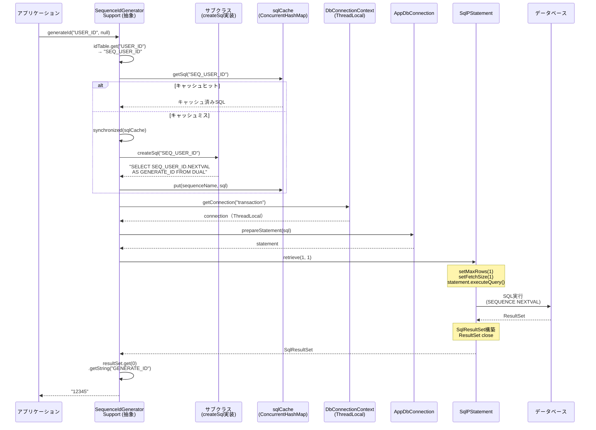
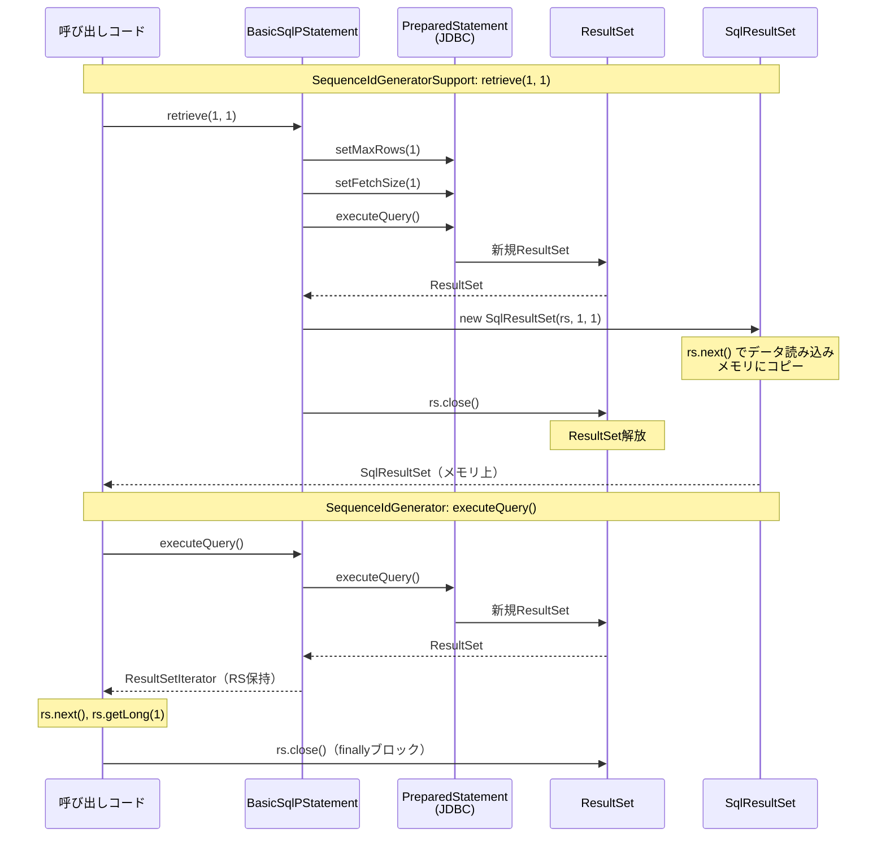
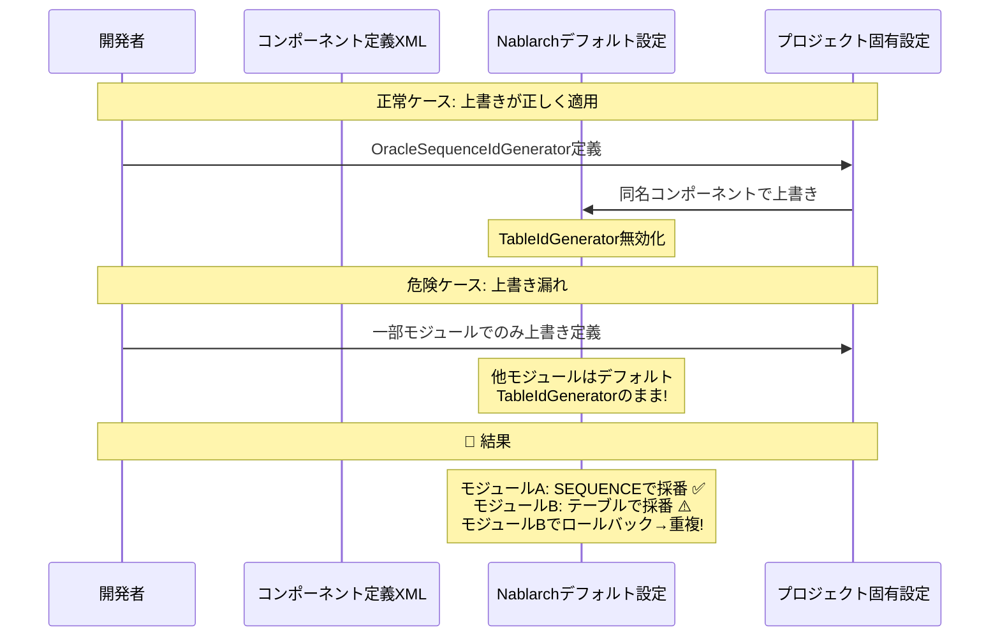

# Nablarch SequenceIdGeneratorSupport 採番重複リスク詳細調査レポート

**作成日**: 2026-02-14
**前提レポート**: IdGenerator調査 / nablarch-idgenerator-sequence-duplication-risk.md
**緊急度**: Critical

---

## 0. エグゼクティブサマリー

前回調査で「SequenceIdGeneratorは安全」と結論したが、実際に採番重複が確認されたプロジェクトでは **SequenceIdGeneratorSupport**（`@Deprecated`）を使用していた。本レポートはSequenceIdGeneratorSupportのソースコード完全読解に基づく詳細分析である。

**結論**: SequenceIdGeneratorSupport自体のコードにはDB SEQUENCEのNEXTVALを使用する限り重複を引き起こすバグはない。しかし、**抽象クラスであり、DB固有のSQL生成をサブクラスに委ねる設計**のため、サブクラスの実装品質に完全に依存する。さらに、Nablarchのデフォルト設定が`TableIdGenerator`（重複リスクあり）であることから、**設定の混在が重複の最大原因と推定**する。

---

## 1. 読解したクラス一覧

| クラス | リポジトリ | 役割 |
|-------|-----------|------|
| `SequenceIdGeneratorSupport` | nablarch-common-idgenerator-jdbc | **本調査の主対象**（`@Deprecated`抽象クラス） |
| `SequenceIdGenerator` | nablarch-common-idgenerator-jdbc | 新版シーケンス採番（比較用） |
| `IdGenerator` | nablarch-common-idgenerator | 採番インターフェース |
| `DbConnectionContext` | nablarch-core-jdbc | ThreadLocal DB接続管理 |
| `BasicDbConnection` | nablarch-core-jdbc | DB接続実装（**statementReuse機構**含む） |
| `TransactionManagerConnection` | nablarch-core-jdbc | トランザクション制御インターフェース |
| `AppDbConnection` | nablarch-core-jdbc | DB接続インターフェース |
| `BasicSqlPStatement` | nablarch-core-jdbc | PreparedStatementラッパー（**retrieve()実装**） |
| `SqlResultSet` | nablarch-core-jdbc | 検索結果保持クラス |
| `TestSequenceIdGenerator` | nablarch-common-idgenerator-jdbc (test) | テスト用サブクラス |

---

## 2. SequenceIdGeneratorSupport ソースコード完全分析

### 2.1 クラス構造

```java
@Deprecated
public abstract class SequenceIdGeneratorSupport implements IdGenerator {

    /** 採番対象IDとシーケンス名の紐付けテーブル */
    private Map<String, String> idTable;

    /** データベースリソース名（デフォルト: "transaction"） */
    private String dbTransactionName = TransactionContext.DEFAULT_TRANSACTION_CONTEXT_KEY;

    /** SQLキャッシュ（ConcurrentHashMap + double-checked locking） */
    private final Map<String, String> sqlCache = new ConcurrentHashMap<String, String>();

    /** サブクラスで実装: DB固有のSEQUENCE取得SQL生成 */
    protected abstract String createSql(String sequenceName);
}
```

### 2.2 generateId() 処理フロー

```java
public String generateId(String id, IdFormatter formatter) {
    // 1. idTableからシーケンス名を解決
    if (idTable == null || idTable.get(id) == null) {
        throw new IllegalArgumentException("id was not found. id:" + id);
    }

    // 2. ThreadLocalからDB接続を取得（AppDbConnectionとして）
    AppDbConnection connection = DbConnectionContext.getConnection(dbTransactionName);

    // 3. PreparedStatementを生成（SQLはキャッシュから取得）
    SqlPStatement statement = connection.prepareStatement(getSql(idTable.get(id)));

    // 4. SQL実行（retrieve = executeQuery + SqlResultSet構築）
    SqlResultSet resultSet = statement.retrieve(1, 1);

    // 5. 結果取得（カラム名"GENERATE_ID"で文字列取得）
    String generateId = resultSet.get(0).getString("GENERATE_ID");

    if (formatter != null) {
        return formatter.format(id, generateId);
    }
    return generateId;
}
```

### 2.3 処理フロー（Mermaidシーケンス図）



---

## 3. SequenceIdGenerator との詳細比較

### 3.1 設計思想の違い

| 観点 | SequenceIdGeneratorSupport (旧版) | SequenceIdGenerator (新版) |
|------|----------------------------------|--------------------------|
| **DB差異の吸収** | **サブクラス**で`createSql()`を実装 | **Dialect**パターンで自動解決 |
| **クラス設計** | abstract（継承必須） | concrete（そのまま使用可） |
| **SQL生成責任** | プロジェクト開発者 | **Nablarchフレームワーク** |
| **ID引数の意味** | 論理ID → `idTable`でシーケンス名に変換 | シーケンス名そのもの |
| **Deprecated** | ✅ `@Deprecated` | 現行版 |

### 3.2 内部実装の詳細比較

| 実装要素 | SequenceIdGeneratorSupport | SequenceIdGenerator |
|---------|--------------------------|---------------------|
| **DB接続取得** | `getConnection()` → `AppDbConnection` | `getTransactionManagerConnection()` → `TransactionManagerConnection` |
| **SQL生成** | `createSql()` (抽象メソッド) | `dialect.buildSequenceGeneratorSql()` |
| **SQL実行** | `statement.retrieve(1, 1)` → `SqlResultSet` | `statement.executeQuery()` → `ResultSetIterator` |
| **結果取得** | `getString("GENERATE_ID")` (カラム名指定) | `getLong(1)` (カラムインデックス) |
| **SQLキャッシュ** | あり（`ConcurrentHashMap` + DLC） | なし（毎回生成） |
| **synchronized** | `getSql()`内のみ（SQL生成時） | なし |
| **ResultSet close** | `retrieve()`内で自動close | `finally`ブロックで明示close |
| **エラー処理** | `IllegalArgumentException`（ID不在時） | `SequenceGeneratorFailedException`（結果なし時） |

### 3.3 DB接続取得の同一性

```java
// DbConnectionContext の実装
public static AppDbConnection getConnection(String connectionName) {
    Map<String, AppDbConnection> localMap = connection.get();  // ThreadLocal
    return localMap.get(connectionName);
}

public static TransactionManagerConnection getTransactionManagerConnection(String connectionName) {
    return (TransactionManagerConnection) getConnection(connectionName);  // ↑のキャスト
}
```

**重要**: 両メソッドは**同一のThreadLocal**にアクセスし、**同一のDB接続オブジェクト**を返す。`getTransactionManagerConnection()`は`getConnection()`の戻り値を`TransactionManagerConnection`にキャストしているだけ。したがって、**DB接続レベルでの差異はない**。

### 3.4 retrieve(1,1) vs executeQuery() の内部動作比較



**結論**: 両者とも最終的にJDBCの`PreparedStatement.executeQuery()`を呼び出す。SEQUENCE NEXTVALの実行タイミングと回数は同一。

---

## 4. 重複発生メカニズムの分析

### 4.1 SequenceIdGeneratorSupport固有のリスク要因

#### リスク要因A: サブクラス実装品質（**最大のリスク**）

`SequenceIdGeneratorSupport`は`createSql()`を抽象メソッドとして公開し、DB固有のSQL生成を**プロジェクト開発者に委ねている**。

```java
/**
 * SELECT句に記述する採番結果の値が格納されるカラム名は、「GENERATE_ID」とすること。
 */
protected abstract String createSql(String sequenceName);
```

**正しい実装**（重複なし）:
```java
// Oracle用
protected String createSql(String sequenceName) {
    return "SELECT " + sequenceName + ".NEXTVAL AS GENERATE_ID FROM DUAL";
}

// PostgreSQL用
protected String createSql(String sequenceName) {
    return "SELECT nextval('" + sequenceName + "') AS GENERATE_ID";
}
```

**危険な実装例1 — CURRVALの誤使用**（🚨 **重複発生**）:
```java
protected String createSql(String sequenceName) {
    // ❌ CURRVALは現在のセッションの最後のNEXTVAL値を返す
    // 同一セッション内で複数回呼ぶと同じ値が返る
    return "SELECT " + sequenceName + ".CURRVAL AS GENERATE_ID FROM DUAL";
}
```

**危険な実装例2 — テーブルSELECTの誤使用**（🚨 **重複発生**）:
```java
protected String createSql(String sequenceName) {
    // ❌ 通常のSELECTは値を更新しない
    // 複数スレッドが同じ値を取得する
    return "SELECT CURRENT_VALUE AS GENERATE_ID FROM ID_TABLE WHERE SEQ_NAME = '"
           + sequenceName + "'";
}
```

**危険な実装例3 — MAX + 1パターン**（🚨 **重複発生**）:
```java
protected String createSql(String sequenceName) {
    // ❌ 排他制御なしのMAX+1は競合で重複する
    return "SELECT COALESCE(MAX(ID), 0) + 1 AS GENERATE_ID FROM " + sequenceName;
}
```

Nablarchの**テスト用サブクラス**自体がこのパターンに該当する:
```java
// TestSequenceIdGenerator.java — テスト用実装
protected String createSql(String sequenceName) {
    // 通常テーブルからのSELECT（NEXTVALを使っていない！）
    return "SELECT * FROM SEQUENCE_TEST WHERE SEQUENCE_NAME = '" + sequenceName + "'";
}
```

#### リスク要因B: Nablarchデフォルト設定との混在（**重要**）

Nablarch公式の設定変更ガイドによると、**デフォルトのidGenerator設定はTableIdGenerator**:

```xml
<!-- Nablarchデフォルト設定 -->
<component name="idGenerator"
    class="nablarch.common.idgenerator.TableIdGenerator">
  <property name="tableName" value="ID_GENERATE" />
  <property name="idColumnName" value="ID" />
  <property name="noColumnName" value="NO" />
</component>
```

プロジェクトで`SequenceIdGeneratorSupport`サブクラスに差し替える場合:
```xml
<!-- プロジェクト固有設定で上書き -->
<component name="idGenerator"
    class="com.example.common.idgenerator.OracleSequenceIdGenerator">
  <property name="idTable">
    <map>
      <entry key="1101" value="USER_ID_SEQ"/>
    </map>
  </property>
</component>
```

**混在リスクのシナリオ**:



#### リスク要因C: idTableの設定不備

`idTable`に定義されていないIDで`generateId()`を呼ぶと`IllegalArgumentException`。しかし、**IDが存在しない場合にフォールバックでTableIdGeneratorが使われる設計**の場合、意図せずテーブル採番に切り替わる可能性がある。

#### リスク要因D: BasicDbConnectionのstatementReuse機構

```java
// BasicDbConnection.java
private boolean statementReuse;
private Map<String, SqlStatement> cacheStatements = null;

private SqlStatement getCacheStatement(String sql) {
    if (statementReuse) {
        if (cacheStatements == null) {
            cacheStatements = new HashMap<>();
        } else {
            ps = cacheStatements.get(sql);
        }
    }
    if (ps == null || ps.isClosed()) {
        return null;
    }
    return ps;
}
```

`statementReuse = true`の場合、同一SQLのPreparedStatementが再利用される。これ自体は重複の原因にならない（各`executeQuery()`でNEXTVALが呼ばれるため）が、**デバッグの複雑さが増す**。

### 4.2 SequenceIdGeneratorSupport固有ではないリスク要因

以下はSequenceIdGenerator（新版）でも同様に発生しうるリスクで、SequenceIdGeneratorSupport固有ではない:

| リスク | 詳細 | 重複発生？ |
|-------|------|----------|
| ThreadLocal外でのDB接続共有 | 複数スレッドが同一コネクション使用 | 直接は発生しない（NEXTVAL自体はアトミック） |
| DB SEQUENCEキャッシュ（Oracle CACHE） | メモリ先読みによる欠番増加 | ❌ 発生しない |
| トランザクションロールバック | NEXTVAL値は戻らない | ❌ 発生しない（欠番のみ） |
| Oracle RAC NOORDER | 値の順序が保証されない | ❌ 発生しない（ユニーク性は保証） |

---

## 5. 重複再現シナリオ

### 5.1 シナリオ1: サブクラスがCURRVALを使用（最小再現）

**前提条件**:
- サブクラスの`createSql()`が`CURRVAL`を使用
- 2スレッド以上が同一セッション（接続）でNEXTVALを呼んだ後

```
【時刻T1】スレッドA:
  connection.prepareStatement("SELECT SEQ.CURRVAL AS GENERATE_ID FROM DUAL")
  → 前回のNEXTVAL結果を返す（例: 101）

【時刻T2】スレッドB:（別接続だがセッション内で同じNEXTVAL履歴）
  connection.prepareStatement("SELECT SEQ.CURRVAL AS GENERATE_ID FROM DUAL")
  → 自スレッドの前回NEXTVAL結果を返す

  ★ もしスレッドBが先にNEXTVALを呼んでいなければORA-08002エラー
  ★ もし両スレッドが同じNEXTVAL値を最後に受け取っていれば重複
```

ただし実際には、ThreadLocal接続分離があるため、このシナリオでのCURRVAL重複は限定的。

### 5.2 シナリオ2: TableIdGeneratorとの混在（**最も可能性が高い**）

```
【前提】
  - Nablarchデフォルト: TableIdGenerator（コンポーネント名 "idGenerator"）
  - プロジェクト設定: OracleSequenceIdGenerator（同名コンポーネントで上書き）
  - ただし一部のモジュールでは上書き設定が読み込まれない

【時刻T1】スレッドA（上書き適用済みモジュール）:
  → OracleSequenceIdGenerator.generateId("USER_ID")
  → SEQUENCE NEXTVAL → 101

【時刻T2】スレッドB（デフォルト設定のままのモジュール）:
  → TableIdGenerator.generateId("USER_ID")
  → テーブル更新: NO = NO + 1 → 101（テーブル側の採番値）

  ★ SEQUENCE採番とテーブル採番が混在 → 同一論理IDで同じ値が生成される
```

### 5.3 シナリオ3: テーブルSELECT型サブクラス（再現確実）

```
【前提】
  - createSql()が SELECT * FROM ID_TABLE WHERE NAME = 'xxx' 的な実装
  - テーブルに固定値が入っている

【擬似コード】
Thread A:
  1. connection = DbConnectionContext.getConnection("transaction")  // スレッドAの接続
  2. stmt = connection.prepareStatement("SELECT * FROM ID_TABLE WHERE NAME = 'SEQ1'")
  3. rs = stmt.retrieve(1, 1)        // → GENERATE_ID = "100"
  4. return "100"

Thread B:（同時刻）
  1. connection = DbConnectionContext.getConnection("transaction")  // スレッドBの接続
  2. stmt = connection.prepareStatement("SELECT * FROM ID_TABLE WHERE NAME = 'SEQ1'")
  3. rs = stmt.retrieve(1, 1)        // → GENERATE_ID = "100"（同じ値！）
  4. return "100"

  ★ 重複確定！テーブルの値は更新されないため、全スレッドが同じ値を取得する
```

---

## 6. 安全な使い方の提示

### 6.1 判定基準: SequenceIdGenerator vs SequenceIdGeneratorSupport

| 条件 | 推奨クラス |
|------|----------|
| Nablarch 5u7以降を使用 | **SequenceIdGenerator**（Dialect経由で自動化） |
| 旧バージョンのNablarch | SequenceIdGeneratorSupportのサブクラス（下記の条件を厳守） |
| カスタムSQL生成が必要 | 要件を再検討。通常のNEXTVALで十分か確認 |

### 6.2 SequenceIdGeneratorSupportを安全に使うための条件

**必須条件**（1つでも欠けると危険）:

1. **`createSql()`でNEXTVALを使用すること**
   ```java
   // ✅ 正しい実装
   protected String createSql(String sequenceName) {
       return "SELECT " + sequenceName + ".NEXTVAL AS GENERATE_ID FROM DUAL";
   }
   ```

2. **CURRVALを絶対に使用しないこと**
   ```java
   // ❌ 危険: 重複の原因
   return "SELECT " + sequenceName + ".CURRVAL AS GENERATE_ID FROM DUAL";
   ```

3. **テーブル直接SELECTを使用しないこと**
   ```java
   // ❌ 危険: 全スレッドが同じ値を取得
   return "SELECT VALUE AS GENERATE_ID FROM ID_TABLE WHERE NAME = '" + sequenceName + "'";
   ```

4. **結果カラム名を`GENERATE_ID`にすること**（Javadoc規約）

5. **idTableの全エントリが正しいDB SEQUENCEを指していること**
   ```xml
   <property name="idTable">
     <map>
       <!-- 各エントリのvalueが実在するSEQUENCEオブジェクトであること -->
       <entry key="USER_ID" value="SEQ_USER_ID"/>
     </map>
   </property>
   ```

6. **TableIdGeneratorとの混在を排除すること**
   - 全モジュールで同一のidGeneratorコンポーネント定義が読み込まれることを確認
   - デフォルト設定のTableIdGeneratorが残っていないことを確認

### 6.3 既存プロジェクトの修正方針

| 状況 | 推奨対応 |
|------|---------|
| Nablarch 5u7以降 | `SequenceIdGenerator`に移行（Dialect自動解決） |
| 旧バージョンで移行困難 | サブクラスの`createSql()`をNEXTVAL使用に修正 |
| 重複が既に発生 | (1) 該当テーブルの重複データを特定・修正 (2) SEQUENCEの現在値を最大値以上にリセット (3) idGeneratorの実装を修正 |

**移行手順**:

```xml
<!-- Before: プロジェクト独自のサブクラス -->
<component name="idGenerator"
    class="com.example.common.idgenerator.OracleSequenceIdGenerator">
  <property name="idTable">
    <map>
      <entry key="USER_ID" value="SEQ_USER_ID"/>
    </map>
  </property>
</component>

<!-- After: Nablarch標準のSequenceIdGenerator -->
<component name="idGenerator"
    class="nablarch.common.idgenerator.SequenceIdGenerator">
  <!-- dbTransactionNameはデフォルト("transaction")で通常OK -->
</component>
```

**注意**: 移行時に`generateId()`の第1引数の意味が変わる。
- 旧: 論理ID（`idTable`で変換） → `generateId("USER_ID")` → SEQ_USER_IDのNEXTVAL
- 新: シーケンス名そのもの → `generateId("SEQ_USER_ID")` → SEQ_USER_IDのNEXTVAL

---

## 7. SequenceIdGeneratorとSequenceIdGeneratorSupportの安全性比較

| 評価項目 | SequenceIdGenerator | SequenceIdGeneratorSupport |
|---------|--------------------|-----------------------------|
| **重複リスク（正常使用時）** | ✅ なし | ✅ なし（NEXTVAL使用時） |
| **重複リスク（実装ミス）** | ✅ 低い（Dialect実装はFW管理） | 🚨 **高い**（サブクラス実装に依存） |
| **設定混在リスク** | ✅ 低い（直接使用可能） | ⚠️ **中**（デフォルトTableIdGeneratorとの混在） |
| **マルチスレッド安全性** | ✅ 安全（ThreadLocal + SEQUENCE） | ✅ 安全（同上） |
| **ロールバック耐性** | ✅ 安全（NEXTVAL非ロールバック） | ✅ 安全（同上） |
| **保守性** | ✅ 高い（concreteクラス） | ⚠️ 低い（abstract + サブクラス必須） |

---

## 8. 対象プロジェクトでの重複原因推定

確認された採番重複の原因として、以下の可能性を優先度順に示す:

### 推定1（最有力）: デフォルトTableIdGeneratorとの混在

Nablarchのデフォルト設定が`TableIdGenerator`であるため、一部のモジュールや処理パスで`SequenceIdGeneratorSupport`サブクラスの上書き定義が適用されず、デフォルトの`TableIdGenerator`が使われた可能性。`TableIdGenerator`はロールバック時に重複が発生する（IdGenerator調査レポート シナリオ7参照）。

### 推定2: サブクラスのcreateSql()実装不備

プロジェクト固有の`OracleSequenceIdGenerator`等のサブクラスが、NEXTVALではなくテーブルSELECTやCURRVALを使用していた可能性。Nablarch公式にはサブクラスの参照実装が提供されていないため、各プロジェクトが独自に実装する必要があった。

### 推定3: TableIdGenerator自体の使用

そもそもSequenceIdGeneratorSupportではなく、デフォルトの`TableIdGenerator`が使われており、ロールバック時の値巻き戻りで重複が発生した可能性。プロジェクトが「SequenceIdGeneratorSupport使用」と認識していても、実際の設定がTableIdGeneratorだったケース。

### 検証方法

対象プロジェクトの以下を確認することで原因を特定できる:

1. **コンポーネント定義XML**: `idGenerator`の`class`属性が何か
2. **サブクラスの`createSql()`実装**: NEXTVALを使用しているか
3. **全モジュールの設定読み込み順序**: 上書き定義が全てのコンテキストで適用されているか
4. **重複発生時のログ**: ロールバックが直前に発生していないか

---

## 参考資料

### ソースコード（GitHub）
- [SequenceIdGeneratorSupport.java](https://github.com/nablarch/nablarch-common-idgenerator-jdbc/blob/master/src/main/java/nablarch/common/idgenerator/SequenceIdGeneratorSupport.java)
- [SequenceIdGenerator.java](https://github.com/nablarch/nablarch-common-idgenerator-jdbc/blob/master/src/main/java/nablarch/common/idgenerator/SequenceIdGenerator.java)
- [TestSequenceIdGenerator.java](https://github.com/nablarch/nablarch-common-idgenerator-jdbc/blob/master/src/test/java/nablarch/common/idgenerator/TestSequenceIdGenerator.java)
- [DbConnectionContext.java](https://github.com/nablarch/nablarch-core-jdbc/blob/master/src/main/java/nablarch/core/db/connection/DbConnectionContext.java)
- [BasicDbConnection.java](https://github.com/nablarch/nablarch-core-jdbc/blob/master/src/main/java/nablarch/core/db/connection/BasicDbConnection.java)
- [BasicSqlPStatement.java](https://github.com/nablarch/nablarch-core-jdbc/blob/master/src/main/java/nablarch/core/db/statement/BasicSqlPStatement.java)
- [SqlResultSet.java](https://github.com/nablarch/nablarch-core-jdbc/blob/master/src/main/java/nablarch/core/db/statement/SqlResultSet.java)
- [TransactionManagerConnection.java](https://github.com/nablarch/nablarch-core-jdbc/blob/master/src/main/java/nablarch/core/db/connection/TransactionManagerConnection.java)

### 公式ドキュメント
- [Nablarch解説書 - サロゲートキーの採番](https://nablarch.github.io/docs/5u7/doc/application_framework/application_framework/libraries/database/generator.html)
- [Nablarch設定変更ガイド - デフォルト設定一覧](https://nablarch.github.io/docs/5u7/doc/application_framework/application_framework/setting_guide/CustomizingConfigurations/index.html)
- [IdGenerator Javadoc](https://nablarch.github.io/docs/5u8/javadoc/nablarch/common/idgenerator/IdGenerator.html)

### 関連レポート
- [IdGenerator調査 IdGenerator DBシーケンス採番 重複リスク調査レポート](nablarch-idgenerator-sequence-duplication-risk.md)
