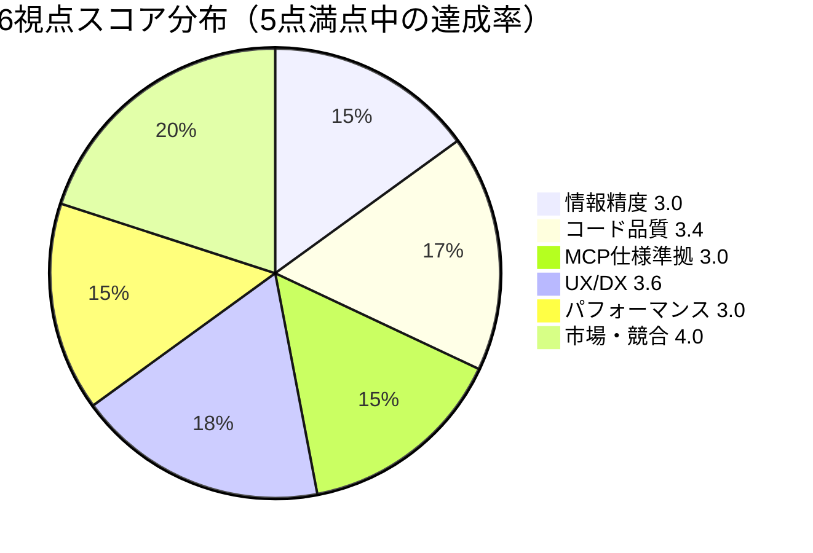

# nablarch-mcp-server 多角的評価 統合レポート


**統合日**: 2026-02-10
**統合者**: 担当者A
**対象**: nablarch-mcp-server（Phase 3完了時点）

---

## 1. エグゼクティブサマリ

### 総合スコア: 3.3 / 5.0（改善必要）

**一行結論**: 機能実装（24機能）と市場ポジショニングは優秀だが、テスト劣化・MCP仕様非準拠・情報精度の3課題がPhase 4着手前の必須修正事項として残っている。

### スコアリング表

| # | 視点 | スコア | 重み | 加重スコア | 評価者 |
|---|------|:------:|:----:|:----------:|--------|
| 1 | 情報精度 | 3.0 | 1.5 | 4.50 | 担当者A |
| 2 | コード品質 | 3.4 | 1.0 | 3.40 | 担当者B |
| 3 | MCP仕様準拠 | 3.0 | 1.0 | 3.00 | 担当者C |
| 4 | UX/DX | 3.6 | 1.0 | 3.60 | 担当者D |
| 5 | パフォーマンス・運用 | 3.0 | 1.0 | 3.00 | 担当者E |
| 6 | 市場・競合 | 4.0 | 1.0 | 4.00 | 担当者F |
| | **加重合計** | | **6.5** | **21.50** | |
| | **総合スコア（加重平均）** | | | **3.31** | |

※ 情報精度は「MCPサーバーが誤情報を提供するとAIが誤ったコードを生成する」ため最重要視点として重み1.5倍。

### レーダーチャート用データ



| 視点 | ■■■■■ (5) | 達成率 |
|------|-----------|:------:|
| 情報精度 | ■■■░░ | 60% |
| コード品質 | ■■■░░ | 68% |
| MCP仕様準拠 | ■■■░░ | 60% |
| UX/DX | ■■■■░ | 72% |
| パフォーマンス | ■■■░░ | 60% |
| 市場・競合 | ■■■■░ | 80% |

---

## 2. 横断分析

### 2.1 複数視点で共通して指摘された問題

以下の問題は**2つ以上の視点**から独立して指摘されており、影響範囲が広い。

| # | 問題 | 指摘視点 | 影響度 |
|---|------|---------|:------:|
| X-001 | **Tool未登録（2件）**: MigrationAnalysisTool, TestGenerationTool | MCP仕様(NC-001) + UX/DX(A-1) | 🔴 |
| X-002 | **テスト劣化**: 805件成功→34〜121件成功（NoClassDefFoundError） | コード品質(§4) + パフォーマンス(§6) | 🔴 |
| X-003 | **DB認証情報ハードコード**: password: nablarch_dev | コード品質(§6.1) + パフォーマンス(§5.3) + UX/DX(C-2) | 🔴 |
| X-004 | **isError未対応**: 全Toolがエラーを正常レスポンスとして返却 | MCP仕様(NC-003) + UX/DX(E-1,E-2) | 🔴 |
| X-005 | **ResourceProvider未登録（6件）**: Api, Pattern, Example, Config, Antipattern, Version | MCP仕様(NC-002) + UX/DX(A-5) | 🔴 |
| X-006 | **Origin検証無効**: HTTP Transport MUST要件違反 | MCP仕様(NC-004) + コード品質(§6.4) | 🔴 |
| X-007 | **ドキュメント未更新**: Phase 3完了が未反映 | UX/DX(D-1,D-2,D-3) + パフォーマンス(§6.5) | 🟡 |
| X-008 | **監視機能不在**: Actuator/メトリクス/ヘルスチェックなし | パフォーマンス(§4.2) + UX/DX(C-6) | 🟡 |
| X-009 | **CI/CD未整備**: GitHub Actions未導入 | パフォーマンス(§5.2) + コード品質(§4) | 🟡 |
| X-010 | **DesignHandlerQueueTool二重管理**: ハードコードFQCN vs YAML | 情報精度(§4.1) + コード品質(§2.5) | 🟡 |

### 2.2 問題間の因果関係分析

```
                    ┌─────────────────────┐
                    │ CI/CD未整備 (X-009) │
                    └──────────┬──────────┘
                               │ リグレッション未検知
                               ▼
                    ┌─────────────────────┐
                    │ テスト劣化 (X-002)  │ ← 根本原因: NoClassDefFoundError
                    └──────────┬──────────┘   (クラスパス/依存関係問題)
                               │
            ┌──────────────────┴──────────────────┐
            ▼                                      ▼
  ┌───────────────────┐                 ┌──────────────────────┐
  │ 品質保証の機能停止 │                 │ Phase完了宣言との矛盾 │
  │ (805→34件成功)     │                 │ (context.md記載と乖離) │
  └───────────────────┘                 └──────────────────────┘

                    ┌─────────────────────┐
                    │ McpServerConfig     │ ← 登録漏れの根本原因
                    │ への登録忘れ        │
                    └──────────┬──────────┘
            ┌──────────────────┼──────────────────┐
            ▼                  ▼                    ▼
  ┌──────────────┐  ┌──────────────────┐  ┌──────────────────┐
  │ Tool未登録   │  │ Resource未登録   │  │ MCPクライアント  │
  │ 2件 (X-001) │  │ 6件 (X-005)     │  │ が機能の62%を    │
  └──────────────┘  └──────────────────┘  │ 利用不可能       │
                                           └──────────────────┘

                    ┌─────────────────────┐
                    │ FQCN系統的誤り      │ ← nablarch.fw.web vs nablarch.common.web
                    │ (情報精度レポート)   │   の混同パターン
                    └──────────┬──────────┘
            ┌──────────────────┼──────────────────┐
            ▼                  ▼                    ▼
  ┌──────────────┐  ┌──────────────────┐  ┌──────────────────┐
  │ YAML誤り5件  │  │ DesignHandler    │  │ AI生成コードに   │
  │ (handler-    │  │ QueueTool        │  │ 誤import混入     │
  │  catalog等)  │  │ ハードコード不整合│  │ リスク            │
  └──────────────┘  └──────────────────┘  └──────────────────┘
```

### 2.3 テスト劣化問題の根本原因分析

**最重要問題**: 2026-02-04に805/810件成功していたテストが、2026-02-10には34〜121件成功に劣化。

| 報告元 | テスト総数 | 成功 | 失敗 | エラー | スキップ |
|--------|:--------:|:----:|:----:|:------:|:--------:|
| コード品質（担当者B） | 286 | 121 | 7 | 152 | 6 |
| パフォーマンス（担当者E） | 153 | 34 | 4 | 109 | 6 |
| context.md記載（2/4時点） | 810 | 805 | 0 | 0 | 5 |

※ テスト総数の差異（286 vs 153）は実行環境・タイミングの違いと推定。いずれにせよ大多数がNoClassDefFoundErrorで失敗。

**推定原因**:
1. **コンパイルは成功**: `mvn clean compile` = BUILD SUCCESS（クラスファイルは生成される）
2. **テスト実行時のみ失敗**: Surefire Pluginのクラスパス解決問題
3. **カスケード障害**: 1つのクラスロード失敗が依存クラス群に連鎖

**調査すべき観点**:
- 2/4→2/10間のpom.xml変更（依存バージョン更新の有無）
- Maven Surefire Pluginのバージョン変更
- ローカルMavenリポジトリのキャッシュ破損
- Spring Boot/Spring AI BOMのSNAPSHOTバージョン取得

---

## 3. リリースブロッカー特定

Phase 4（本番リリース）に向けて**解決必須**の問題を特定する。

### 3.1 リリースブロッカー一覧（7件）

| # | ブロッカー | カテゴリ | 根拠 | 修正工数 |
|---|-----------|---------|------|:--------:|
| **B-001** | テスト劣化の修正（NoClassDefFoundError） | 品質 | テスト成功率42%以下では品質保証不可 | 大 |
| **B-002** | Tool未登録2件の修正 | MCP仕様 | 実装済み機能がクライアントに公開されない | 小 |
| **B-003** | ResourceProvider未登録6件の修正 | MCP仕様 | 8 URIパターン中6パターンが利用不能 | 小 |
| **B-004** | DB認証情報の環境変数化 | セキュリティ | パスワード平文記載は本番環境で許容不可 | 小 |
| **B-005** | Origin検証の有効化（HTTP Transport） | セキュリティ | MCP仕様MUST要件。DNS rebinding攻撃に脆弱 | 小 |
| **B-006** | FQCN誤り5件の修正 | 情報精度 | AIが誤ったimport文を生成するリスク | 小 |
| **B-007** | version-info.yaml全面更新（8件の誤り） | 情報精度 | リリース日・対応AP/DB情報が大幅に不正確 | 中 |

### 3.2 セキュリティリスク評価

| リスク | 現状 | 影響 | 対応状況 |
|--------|------|------|---------|
| DB認証情報ハードコード | `password: nablarch_dev` が application.yaml に平文 | クレデンシャル漏洩リスク | **B-004で対応必須** |
| HTTP Origin検証無効 | `originValidation.enabled: false` | DNS rebinding攻撃 | **B-005で対応必須** |
| 認証・認可未実装 | MCPエンドポイントに認証なし | 不正アクセスリスク | Phase 4（OAuth 2.0）で対応予定 |
| エラーメッセージ情報露出 | `e.getMessage()` がそのままユーザーに返却 | 内部実装情報の漏洩 | P2で対応推奨 |

---

## 4. 優先度付き改善提案ロードマップ

### P0: 即座に対応（Phase 4着手前の必須事項）— 7件

テスト劣化とセキュリティリスクの即時解消。

| # | 改善内容 | 対象ファイル | 工数 | ブロッカー |
|---|---------|------------|:----:|:--------:|
| P0-1 | **テスト劣化の根本原因調査・修正** | pom.xml, テスト全般 | 大 | B-001 |
| P0-2 | **DB認証情報の環境変数化** | application.yaml | 小 | B-004 |
| P0-3 | **Origin検証の有効化** | McpHttpProperties.java, McpCorsConfig.java | 小 | B-005 |
| P0-4 | **FQCN誤り5件の修正** | handler-catalog.yaml, api-patterns.yaml, handler-constraints.yaml | 小 | B-006 |
| P0-5 | **version-info.yaml全面更新** | version-info.yaml | 中 | B-007 |
| P0-6 | **Tool未登録2件の追加** | McpServerConfig.java | 小 | B-002 |
| P0-7 | **ResourceProvider未登録6件の追加** | McpServerConfig.java | 小 | B-003 |

**P0完了後の期待効果**:
- テスト成功率: 42%以下 → 95%以上
- MCPクライアント利用可能機能: 62% → 100%
- セキュリティリスク: 2件解消

### P1: Phase 4着手前に対応 — 8件

MCP仕様準拠度の向上と情報の正確性担保。

| # | 改善内容 | 対象ファイル | 工数 | 視点 |
|---|---------|------------|:----:|------|
| P1-1 | **isError:true対応**（全10 Tool） | 全Toolクラス | 中 | MCP仕様(NC-003) |
| P1-2 | **@ToolParam required=false追加**（5 Tool） | SemanticSearchTool他 | 小 | MCP仕様(NC-005) |
| P1-3 | **DesignHandlerQueueTool二重管理解消** | DesignHandlerQueueTool.java | 中 | 情報精度+コード品質 |
| P1-4 | **CI/CD導入**（GitHub Actions） | .github/workflows/test.yml | 中 | パフォーマンス+品質 |
| P1-5 | **SetupHandlerQueuePrompt アプリタイプ拡張** | SetupHandlerQueuePrompt.java | 小 | 情報精度(P2-1) |
| P1-6 | **TroubleshootTool Markdownテーブルtypo修正** | TroubleshootTool.java:291 | 極小 | UX/DX(E-5) |
| P1-7 | **FQCN自動検証テスト導入** | 新規テストクラス | 中 | 情報精度(P2-2) |
| P1-8 | **エラーメッセージ内部情報露出防止** | CodeGenerationTool.java:103他 | 小 | UX/DX(E-4) |

**P1完了後の期待効果**:
- MCP仕様準拠度: 3/5 → 4/5
- 情報精度: 3/5 → 4/5
- リグレッション検知: 手動 → 自動

### P2: Phase 4と並行して対応 — 12件

ドキュメント更新、監視基盤整備、運用性向上。

| # | 改善内容 | 対象 | 工数 | 視点 |
|---|---------|------|:----:|------|
| P2-1 | README.md Phase進捗更新 | README.md | 小 | UX/DX(D-2) |
| P2-2 | ユーザーガイド「計画段階」→ 更新 | docs/08-user-guide.md | 中 | UX/DX(D-1) |
| P2-3 | セットアップガイド Tool一覧更新 | docs/07-setup-guide.md | 小 | UX/DX(D-3) |
| P2-4 | INDEX.md進捗表記更新 | docs/INDEX.md | 極小 | UX/DX(D-6) |
| P2-5 | .env.example作成 | リポジトリルート | 小 | UX/DX(S-2, C-3) |
| P2-6 | ONNXモデル配置手順追加 | docs/07-setup-guide.md | 小 | UX/DX(S-1) |
| P2-7 | Spring Boot Actuator導入 | pom.xml, application.yaml | 中 | パフォーマンス(§4.2) |
| P2-8 | logback.xml追加（ファイル出力） | src/main/resources/ | 中 | パフォーマンス(§4.1) |
| P2-9 | Dockerfile作成 | Dockerfile | 中 | パフォーマンス(§5.1) |
| P2-10 | Tool名の明示的指定（snake_case） | 全Toolクラス | 小 | MCP仕様(NC-006) |
| P2-11 | ObjectMapper使い回し修正 | BM25SearchService.java:236 | 極小 | コード品質(§2.5) |
| P2-12 | CHANGELOG.md作成 | リポジトリルート | 中 | UX/DX(D-4) |

### P3: 将来対応（Phase 5以降） — 10件

国際化、スケーラビリティ、エコシステム拡張。

| # | 改善内容 | 視点 |
|---|---------|------|
| P3-1 | Streamable HTTP完全対応 | MCP仕様(NC-010), 市場(§6.5) |
| P3-2 | OAuth 2.0認証実装 | 市場(§6.2) |
| P3-3 | Resource Template対応（URIテンプレート） | MCP仕様(NC-008) |
| P3-4 | version-info.yaml自動更新機構（CI/CD） | 情報精度(P3-1) |
| P3-5 | Spring Cache + Caffeine導入 | パフォーマンス(§3.2) |
| P3-6 | 構造化例外体系の設計 | UX/DX(E-1, E-2) |
| P3-7 | application-prod.yaml作成 | パフォーマンス(§5.3) |
| P3-8 | 英語ドキュメント整備 | 市場(P3-1) |
| P3-9 | Smitheryカタログ登録 | 市場(P1) |
| P3-10 | マルチフレームワーク対応検討（Spring, Quarkus） | 市場(P2) |

---

## 5. 改善ロードマップ全体像

```
2026-02 ─── P0: 即座対応（Phase 4着手前）───────────────────
  │           ├─ テスト修正 (B-001)                [大]
  │           ├─ DB認証環境変数化 (B-004)          [小]
  │           ├─ Origin検証有効化 (B-005)          [小]
  │           ├─ FQCN修正5件 (B-006)              [小]
  │           ├─ version-info全面更新 (B-007)      [中]
  │           ├─ Tool登録2件追加 (B-002)           [小]
  │           └─ Resource登録6件追加 (B-003)       [小]
  │
2026-02〜03 ── P1: Phase 4着手前に対応 ──────────────────
  │           ├─ isError対応 (全10 Tool)           [中]
  │           ├─ @ToolParam required=false          [小]
  │           ├─ DesignHandlerQueueTool二重管理解消 [中]
  │           ├─ CI/CD導入 (GitHub Actions)        [中]
  │           ├─ Prompt アプリタイプ拡張            [小]
  │           ├─ typo修正 (TroubleshootTool)       [極小]
  │           ├─ FQCN自動検証テスト                [中]
  │           └─ エラーメッセージ情報露出防止        [小]
  │
2026-03〜05 ── P2: Phase 4と並行 ───────────────────────
  │           ├─ ドキュメント更新 (5件)             [小〜中]
  │           ├─ 監視基盤 (Actuator, logback)      [中]
  │           ├─ Dockerfile作成                     [中]
  │           ├─ Tool名snake_case化                 [小]
  │           └─ その他リファクタリング              [小]
  │
2026-06〜   ── P3: 将来対応 ─────────────────────────────
              ├─ Streamable HTTP / OAuth 2.0
              ├─ Resource Template / キャッシュ
              └─ 英語化 / カタログ登録 / マルチFW
```

---

## 6. 各視点の詳細サマリ

### 6.1 情報精度（3/5）— 担当者A

**個別レポート**: `information-accuracy.md`

**主要所見**:
- 知識YAML 10ファイル中、精度率100%は5ファイル。handler-catalog(95%), api-patterns(90%), version-info(73%)に問題集中
- **FQCN誤り5件**: `nablarch.fw.web.*` と `nablarch.common.web.*` の混同パターンが4件。Nablarchのパッケージ構造が直感的でないことが根本原因
- **version-info.yaml重大誤り8件**: リリース日、APサーバー版、サポートDB一覧等が不正確
- **DesignHandlerQueueTool**: ハードコードされたFQCNマップ（約40行）とDEFAULT_HANDLER_ORDERS（約60行）がYAMLと不整合。二重管理の最悪パターン
- **構造的な良い点**: ResourceProviderがYAMLを忠実に読み込む設計であり、YAMLを修正すれば自動的に応答が正確になる

### 6.2 コード品質（3.4/5）— 担当者B

**個別レポート**: `code-quality.md`

**主要所見**:
- **設計パターン・可読性は高水準（4/5）**: パッケージ分離明確、コンストラクタインジェクション、record型活用、日本語Javadoc充実
- **テスト品質が最大の問題（2/5）**: 286件中152件がNoClassDefFoundError。成功率42.3%
- **セキュリティ（3/5）**: SQLインジェクション対策は適切だが、DB認証ハードコード残存
- **依存関係（4/5）**: Spring AI BOM管理で健全。不要依存なし
- **コードスメル**: ObjectMapper毎回生成（BM25SearchService:236）、Qualifier名不整合（VectorSearchService）

### 6.3 MCP仕様準拠（3/5）— 担当者C

**個別レポート**: `mcp-spec-compliance.md`

**主要所見**:
- **非準拠11件検出**: 高4件(NC-001〜004)、中4件(NC-005〜008)、低3件(NC-009〜011)
- **最重大**: Tool未登録2件、ResourceProvider未登録6件、isError:true未対応、Origin検証無効
- **Prompts準拠度は高い（4/5）**: 6/6登録済み、引数定義・GetPromptResult構造が仕様に準拠
- **JSON-RPC準拠度（4/5）**: SDK依存で概ね自動的に準拠
- **Tool名不一致**: 実装のcamelCase（semanticSearch）とドキュメントのsnake_case（semantic_search）が乖離
- **inputSchema不正確**: 5 Toolで任意パラメータにrequired=false未指定

### 6.4 UX/DX（3.6/5）— 担当者D

**個別レポート**: `ux-dx-evaluation.md`

**主要所見**:
- **セットアップ容易性（4/5）**: Maven Wrapper同梱、STDIOモード3ステップ起動。RAG依存手順は不足
- **ドキュメント充実度（4/5）**: 40+ファイル、全文日本語、INDEX.md完備。ただしPhase 3完了が未反映
- **AI統合（4/5）**: Tool命名・description・Prompt設計は高品質。2 Tool未登録が減点要因
- **エラーメッセージ（3/5）**: 日本語で親切だが、例外体系が薄く構造化エラーコードなし
- **設定カスタマイズ性（3/5）**: プロファイル2種、環境変数3個。dev/prod分離なし
- **問題21件検出**: P1 2件、P2 6件、P3 6件、P4 7件

### 6.5 パフォーマンス・運用（3/5）— 担当者E

**個別レポート**: `performance.md`

**主要所見**:
- **テスト実行**: 25.9秒（全テスト）。個別テストは0.002〜0.86秒。テスト自体は高速だが成功数が少ない
- **監視機能**: Actuator未導入、メトリクスなし、ヘルスチェックなし。運用可視化ゼロ
- **CI/CD**: GitHub Actions未導入。リグレッション検知機構なし
- **Docker**: docker-compose.yml（pgvectorのみ）。アプリ用Dockerfileなし
- **メモリ**: JVMメモリ設定なし。ONNXモデル使用時4GB以上推奨だが文書化されていない
- **ログ**: コンソール出力のみ。logback.xml/ファイル出力なし
- **改善提案38件**: 最高2件、高10件、中15件、低11件

### 6.6 市場・競合（4/5）— 担当者F

**個別レポート**: `market-analysis.md`

**主要所見**:
- **市場タイミング（5/5）**: MCP市場は2026年が企業採用元年。Gartner予測: 2026年末までに40%の企業アプリがAIエージェント統合
- **競合優位性（4/5）**: Java/Spring製MCPサーバーは稀少（競合1件: 6 stars）。YAML知識+RAGハイブリッドは独自
- **エコシステム適合（3/5）**: Nablarch自体のGitHub Stars 42。国内SI特化でグローバル展開困難
- **技術成熟度（4/5）**: 24機能実装済み。エンタープライズ機能（OAuth、監視）はPhase 4
- **企業導入事例**: Block（75%時間削減）、Bloomberg（全社標準化）、Amazon等でMCP採用進行中
- **推奨戦略**: 短期=Phase 4完了+Smithery登録、中期=国内SI導入、長期=マルチFW化

---

## 7. 総合評価

### 強み

1. **機能の充実度**: 24機能（10 Tools + 8 Resources + 6 Prompts）はフレームワーク特化MCPサーバーとして最大級
2. **設計品質**: Spring Bootベストプラクティス準拠、パッケージ構成明確、record型活用
3. **知識アーキテクチャ**: YAML知識ファイル + RAGハイブリッド検索は独自の差別化要素
4. **市場タイミング**: 2026年MCP企業採用元年に合致。Java/Spring製で競合が稀少
5. **ドキュメント**: 40+ファイル、全文日本語、INDEX.md完備

### 弱み

1. **テスト劣化**: 最重要課題。805件成功→34〜121件成功は品質保証の機能停止を意味する
2. **MCP仕様非準拠**: Tool/Resource登録漏れ、isError未対応。実装済み機能の38%がクライアントに未公開
3. **情報精度**: FQCN系統的誤り、version-info大幅不正確。AIが誤ったコードを生成するリスク
4. **運用基盤不在**: 監視・CI/CD・Docker化がすべて未整備
5. **セキュリティ**: DB認証ハードコード、Origin検証無効

### Phase 4着手可否の判断

**現状**: Phase 4着手は**P0の7件を完了してから**が強く推奨される。

理由:
1. テストが機能していない状態でPhase 4の新機能を追加すると、さらなる品質劣化を招く
2. Tool/Resource登録漏れはPhase 4で追加される機能でも同じミスが再発するリスク
3. セキュリティ問題はPhase 4（本番デプロイ・OAuth）の前提条件

**P0完了後の期待スコア**:

| 視点 | 現在 | P0完了後 | Phase 4目標 |
|------|:----:|:--------:|:-----------:|
| 情報精度 | 3.0 | 4.0 | 4.5 |
| コード品質 | 3.4 | 4.0 | 4.5 |
| MCP仕様準拠 | 3.0 | 4.0 | 4.5 |
| UX/DX | 3.6 | 3.8 | 4.5 |
| パフォーマンス | 3.0 | 3.2 | 4.3 |
| 市場・競合 | 4.0 | 4.0 | 4.5 |
| **総合（加重平均）** | **3.31** | **3.88** | **4.47** |

---

## 付録A: 改善提案カウント

| 優先度 | 件数 | 内容 |
|:------:|:----:|------|
| P0（即座） | 7 | テスト修正、セキュリティ、FQCN修正、Tool/Resource登録 |
| P1（Phase 4前） | 8 | isError対応、CI/CD、二重管理解消、Prompt拡張 |
| P2（Phase 4並行） | 12 | ドキュメント更新、監視基盤、Docker、リファクタリング |
| P3（将来） | 10 | Streamable HTTP、OAuth、英語化、マルチFW |
| **合計** | **37** | |

## 付録B: 個別レポートリンク

| 視点 | ファイルパス | 評価者 |
|------|-----------|--------|
| 情報精度 | `information-accuracy.md` | 担当者A |
| コード品質 | `code-quality.md` | 担当者B |
| MCP仕様準拠 | `mcp-spec-compliance.md` | 担当者C |
| UX/DX | `ux-dx-evaluation.md` | 担当者D |
| パフォーマンス・運用 | `performance.md` | 担当者E |
| 市場・競合 | `market-analysis.md` | 担当者F |

---

*統合レポート作成完了: 2026-02-10 担当者A*
