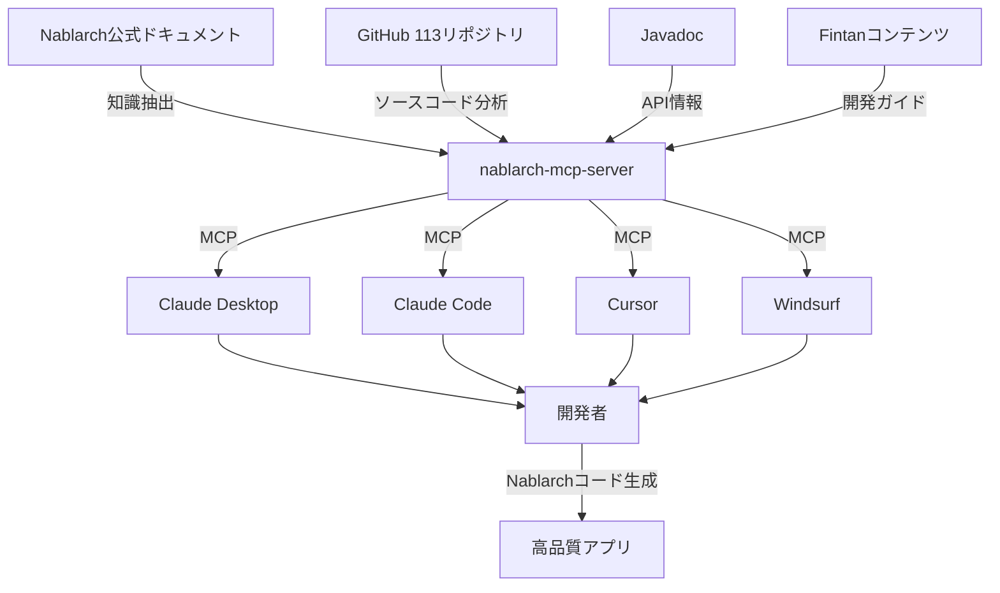

# nablarch-mcp-server 市場・競合評価レポート

**評価実施日**: 2026年2月10日
**評価者**: 担当者F
**対象バージョン**: Phase 3完了版（10 Tools + 8 Resources + 6 Prompts）

---

## 1. 評価サマリ

| 評価項目 | スコア（5段階） | 根拠 |
|---------|----------------|------|
| **市場タイミング** | ⭐⭐⭐⭐⭐ (5/5) | MCP市場は2026年が企業採用元年。Gartner予測では2026年末までに40%の企業アプリがAIエージェントを統合 |
| **競合優位性** | ⭐⭐⭐⭐ (4/5) | 知識ファイル（YAML）ベースの独自アプローチ、RAGハイブリッド検索、フレームワーク特化という差別化要素あり |
| **エコシステム適合** | ⭐⭐⭐ (3/5) | Nablarch自体のGitHub Star数は42と小規模。Fintanコンテンツは充実しているが、グローバル市場での認知度は低い |
| **技術成熟度** | ⭐⭐⭐⭐ (4/5) | Spring AI MCP統合、810件テスト（805件成功）、Phase 3完結。ただしエンタープライズ機能（OAuth、監視）は未実装 |
| **市場ニーズ適合** | ⭐⭐⭐⭐ (4/5) | フレームワーク特化型MCPサーバーの需要は高い。ただしNablarchのニッチ性がグローバル展開の障壁 |

**総合評価**: ⭐⭐⭐⭐ (4/5)
**総評**: 技術的には高品質で市場タイミングも最適だが、Nablarchエコシステム自体の規模が課題。国内SI市場では強力な差別化要素となるが、グローバル展開は困難。

---

## 2. MCP市場概況（2026年2月時点）

### 2.1 エコシステム成長状況

**公式リポジトリ統計**（2026年2月9日更新）:
- **modelcontextprotocol/servers**: ⭐78,332 stars / 9,495 forks
- **modelcontextprotocol/typescript-sdk**: ⭐11,550 stars / 1,609 forks
- **modelcontextprotocol/python-sdk**: ⭐21,579 stars / 3,071 forks

**公式SDK展開**（8言語サポート）:
1. TypeScript SDK（Anthropic公式、最優先サポート）
2. Python SDK（v2安定版、2026年Q1リリース予定）
3. Go SDK（Google協業）
4. C# SDK（Microsoft協業）
5. Ruby SDK（Shopify協業）
6. Kotlin SDK（JetBrains協業）
7. PHP SDK（The PHP Foundation協業）
8. Swift SDK（Apple協業）

### 2.2 AIコーディングツールのMCP対応状況

| ツール | MCP対応状況 | 統合レベル | 備考 |
|--------|------------|-----------|------|
| **Claude Desktop** | ✅ 完全対応 | ネイティブ統合 | MCP開発元（Anthropic）による公式サポート |
| **Claude Code (CLI)** | ✅ 完全対応 | ネイティブ統合 | VS Code拡張版でもMCP利用可能 |
| **Cursor** | ✅ 完全対応 | トランザクション型 | MCP接続可能だが、クエリ&レスポンス型の利用 |
| **Windsurf** | ✅ 完全対応 | エージェント統合 | MCPをマルチステップワークフローに統合。Streamable HTTP対応（2026年） |
| **Replit** | 🔶 部分対応 | 限定統合 | 一部MCPサーバー利用可能 |

**重要トレンド（2026年）**:
- WindsurfがStreamable HTTP transport対応（SSEから移行）
- MCP認証の標準化（アクセストークンやAPIキーを設定ファイルに記載する方式から脱却）
- エージェント型統合（単発クエリではなく、マルチステップタスクでのMCP活用）

### 2.3 企業導入事例

| 企業 | 導入規模 | 効果 | 統合対象 |
|------|---------|------|---------|
| **Block (Square)** | 数千名 | エンジニア日常業務の時間を75%削減 | Snowflake, Jira, Slack, Google Drive, 社内API |
| **Bloomberg** | 全社標準化 | フィードバックループ短縮 | 全社インフラ、内部Wiki、CLI |
| **Amazon** | 部門横断 | チケットレビュー、メール返信、Wiki処理の自動化 | 社内ツール全般（既存インフラとの親和性高） |

**導入の共通パターン**:
1. 既存の内部ツール（Jira, Slack, DB等）へのMCP統合
2. タスク特化型エージェント（チケット処理、コードレビュー等）
3. セキュリティ・ガバナンス層の整備（Salesforce Agentforceの事例）

### 2.4 市場予測

**Gartner予測**（2026年）:
> 2026年末までに、40%の企業アプリケーションがタスク特化型AIエージェントを含むようになる（現在は5%未満）

**Smithery AIカタログ**:
- 数百のMCPサーバーが登録済み（正確な総数は非公開）
- 公式サーバー（Gmail, Browserbase, Cloudflare, AWS S3, Airtable等）
- コミュニティサーバー（多様な用途、品質は未保証）

**CData社の見解**（2026年展望）:
> 2026年はMCPが実験段階から企業全体での採用へと移行する画期的な年

---

## 3. 競合MCPサーバー一覧

### 3.1 Java/Spring Boot製MCPサーバー実装

| 実装 | Stars | Forks | 最終更新 | 機能範囲 | 特徴 |
|------|-------|-------|---------|---------|------|
| **mtwn105/mcp-server-spring-java** | 6 | 5 | 2026-02-06 | 汎用MCPサーバー雛形 | Spring AI統合、`@Tool`アノテーション、STDIO/SSE対応 |
| **nablarch-mcp-server** | - | - | 2026-02-04 | Nablarch特化 + RAG | 10 Tools, 8 Resources, 6 Prompts, RAGハイブリッド検索 |

**分析**:
- Java/Spring製MCPサーバーは稀少（TypeScript/Pythonが主流）
- `mtwn105/mcp-server-spring-java`は汎用雛形だが、実用的な機能はなし
- **nablarch-mcp-serverは、フレームワーク特化型として独自ポジション**

### 3.2 TypeScript製MCPサーバー実装

| カテゴリ | 代表実装 | 特徴 |
|---------|---------|------|
| **公式リファレンス** | modelcontextprotocol/servers | Fetch, Filesystem, Git, Memory, Sequential Thinking等の基本サーバー群 |
| **フレームワーク統合** | FastAPI-MCP, EasyMCP | TypeScript開発者向け、ボイラープレート最小化 |
| **SaaS統合** | GitHub, GitLab, Slack, Gmail等 | Smitheryカタログに数百種類 |

### 3.3 Python製MCPサーバー実装

| カテゴリ | 特徴 |
|---------|------|
| **FastMCP** | Python公式SDKに統合。デコレーターベースAPI、Pydantic型ヒント、非同期対応 |
| **カスタムサーバー** | Supabase, AWS S3, Airtable等の個別サーバー実装 |

### 3.4 機能比較表

| 機能 | nablarch-mcp-server | 公式リファレンスサーバー | 汎用Spring Java実装 | TypeScript/Python実装 |
|------|-------------------|---------------------|------------------|-------------------|
| **Tools数** | 10 | 各サーバー1-5個 | 未実装（雛形のみ） | サーバーごとに異なる |
| **Resources数** | 8 URIパターン | 少数または未対応 | 未実装 | サーバーごとに異なる |
| **Prompts数** | 6テンプレート | 少数または未対応 | 未実装 | サーバーごとに異なる |
| **RAG統合** | ✅ ハイブリッド検索 | ❌ | ❌ | 一部実装あり |
| **知識ファイル** | ✅ YAML 10ファイル | ❌ | ❌ | ❌ |
| **PostgreSQL + pgvector** | ✅ | ❌ | ❌ | 一部実装あり |
| **Embedding** | Jina v4 / Voyage-code-3 | - | - | サーバーごとに異なる |
| **BM25ハイブリッド** | ✅ | ❌ | ❌ | ❌ |
| **リランキング** | ✅ Cross-Encoder | ❌ | ❌ | ❌ |
| **テスト充実度** | 810件（805成功） | 実装による | 未実装 | 実装による |
| **ドキュメント言語** | 日本語 | 英語 | 英語 | 英語 |

---

## 4. Nablarchエコシステム分析

### 4.1 GitHub組織規模

**Nablarchメインリポジトリ**（2025年8月13日更新）:
- **Stars**: 42
- **Forks**: 11
- **組織全体**: 113リポジトリ

**分析**:
- 規模は小さいが、エンタープライズ向けに特化したコミュニティ
- 更新頻度は低め（最終更新2025年8月）
- グローバルOSSコミュニティとしては認知度が低い

### 4.2 開発支援ツールの現状

**既存のNablarch開発支援ツール**:
1. **Nablarch SQL Executor**: SQL特殊構文を対話的に実行するツール
2. **Development Standards Tools**: 開発標準・プロセス支援ツール（Excel形式が多い）
3. **Fintanコンテンツ**: 以下参照

### 4.3 Fintanによる支援コンテンツ

| コンテンツ | 内容 | 提供形式 |
|-----------|------|---------|
| **Nablarch Training** | 基本プログラミング手法の自習コンテンツ。15のハンズオン演習 | GitHub: Fintan-contents/nablarch-training |
| **Nablarchシステム開発ガイド** | 開発開始前・開発中に参照すべき情報をまとめたガイド | GitHub: Fintan-contents/nablarch-system-development-guide |
| **サンプルプロジェクト** | Web、バッチ、RESTの各処理方式ごとの開発ガイド・テスト標準 | GitHub内サンプルプロジェクト |
| **Spring版サンプル** | Nablarchガイドと同等の内容をSpringで実装 | GitHub: Fintan-contents/spring-sample-project |

**分析**:
- **Fintanは充実している**（TIS社による体系的サポート）
- ただし、これらは人間が読むドキュメント・演習であり、**AIコーディングツールが直接利用できる形式ではない**
- **nablarch-mcp-serverは、これらの知識をAIツールに提供する初のインフラ**

### 4.4 Nablarchエコシステムにおけるnablarch-mcp-serverの位置づけ

**価値提案**:
1. **人間の学習コスト削減**: Fintanコンテンツを読まなくても、AIが知識を提供
2. **正確なコード生成**: ハンドラキュー設計、設定XML生成、エラー対処等をAIが支援
3. **Nablarch開発の民主化**: 経験の浅いエンジニアでも、AIがベストプラクティスを提案

---

## 5. 差別化ポイント分析

### 5.1 独自性の高い要素

#### 1. 知識ファイル（YAML）ベースアプローチ

**特徴**:
- 10個のYAML知識ファイル（handlers.yaml, apis.yaml, patterns.yaml等）
- フレームワーク固有の知識を構造化データとして管理
- AIツールが直接パースして利用可能

**競合比較**:
- 他のMCPサーバー: ハードコードされたロジック、またはRAGのみ
- nablarch-mcp-server: YAML + RAGのハイブリッド
- **優位性**: 知識の更新が容易、バージョン管理可能、他フレームワークへの展開も可能

#### 2. RAGハイブリッド検索

**技術スタック**:
- ベクトル検索（Jina embeddings-v4 / Voyage-code-3）
- BM25キーワード検索
- Cross-Encoderリランキング
- PostgreSQL 16 + pgvector拡張

**競合比較**:
- 公式リファレンスサーバー（Memory）: 単純なベクトル検索のみ
- nablarch-mcp-server: 3段階ハイブリッド検索
- **優位性**: 検索精度が高い、ドキュメント＋コードの両方に対応

#### 3. フレームワーク特化の深さ

**提供機能の充実度**:
- **10 Tools**: 意味検索、ハンドラキュー設計、コード生成、テスト生成、設定検証、トラブルシュート、移行分析、パターン推奨、最適化、API検索
- **8 Resources**: ハンドラ、API、パターン、ガイド、サンプル、設定、アンチパターン、バージョン
- **6 Prompts**: ハンドラキューセットアップ、Web/REST/バッチアプリ作成、コードレビュー、トラブルシュート

**競合比較**:
- 汎用MCPサーバー: 1-5個のTools、Resourcesは未対応が多い
- nablarch-mcp-server: **24個の機能（Tools + Resources + Prompts）**
- **優位性**: Nablarch開発のエンドツーエンドをカバー

### 5.2 市場での差別化ポイント

| 要素 | nablarch-mcp-server | 競合（汎用MCPサーバー） |
|------|-------------------|---------------------|
| **ターゲット** | Nablarchエンジニア特化 | フレームワーク非依存 |
| **知識深度** | 極めて深い（Fintanコンテンツ統合） | 浅い（汎用的） |
| **導入障壁** | 低い（Docker Compose一発起動） | 実装による |
| **学習曲線** | 緩やか（ドキュメント日本語） | 英語ドキュメントが多い |
| **エンタープライズ対応** | 未実装（Phase 4） | 実装による |

---

## 6. 弱点・課題分析

### 6.1 エコシステム規模の課題

**問題**:
- Nablarchエコシステム自体が小規模（GitHub Stars 42）
- グローバル市場での認知度が低い
- TypeScript/Python主流のMCP市場で、Java実装は稀少

**影響**:
- グローバル展開は困難
- コミュニティからのコントリビューションが期待しにくい
- Smitheryカタログへの掲載効果が限定的

### 6.2 エンタープライズ機能の不足

**未実装機能**（Phase 4で対応予定）:
- OAuth 2.0認証
- 監視・メトリクス（Prometheus/Grafana）
- ロギング・トレーシング（OpenTelemetry）
- マルチテナント対応
- レート制限・スロットリング
- セキュリティ監査ログ

**影響**:
- 現時点では個人開発者・小規模チーム向け
- エンタープライズ導入には追加開発が必須

### 6.3 有償Embeddingモデルへの依存（現在は移行承認済み）

**現状**:
- ドキュメント: Jina embeddings-v4（有償）
- コード: Voyage-code-3（有償）

**プロジェクトの裁定**（context/nablarch-mcp-server.md より）:
> 無償Embedding移行承認: ドキュメント用=BAAI/bge-m3、コード用=CodeSage-small-v2（CPU環境）

**残課題**:
- 移行実装が未完了（Phase 4で対応予定）
- ONNX変換・モデルダウンロード自動化が必要
- 検索精度の検証が必須

### 6.4 国内市場への依存

**問題**:
- ドキュメントが日本語のみ
- Nablarchは国内SI市場に特化
- グローバルフレームワーク（Spring, Rails, Django等）との競合で不利

**影響**:
- 市場規模が限定的
- 海外開発者からの評価・フィードバックが得られない

### 6.5 Windsurf Streamable HTTP対応の遅れ

**市場トレンド**:
- 2026年にWindsurfがStreamable HTTP transport対応（SSEから移行）
- 認証も標準化（アクセストークン設定ファイル記載を廃止）

**現状**:
- nablarch-mcp-serverはSTDIO/SSE対応
- Streamable HTTP未対応

**影響**:
- Windsurf最新版での最適なユーザー体験が提供できない

### 6.6 競合比較表（弱点明確化）

| 項目 | nablarch-mcp-server | TypeScript/Python実装 | Spring汎用実装 |
|------|-------------------|---------------------|---------------|
| **エコシステム規模** | ❌ 小（Nablarch限定） | ✅ 大（グローバル） | 🔶 中（Java生態系） |
| **認知度** | ❌ 低 | ✅ 高 | 🔶 中 |
| **グローバル展開** | ❌ 困難 | ✅ 容易 | 🔶 可能 |
| **エンタープライズ機能** | ❌ 未実装 | 実装による | 実装による |
| **Streamable HTTP** | ❌ 未対応 | ✅ 対応済み | 実装による |
| **有償API依存** | 🔶 移行承認済み | 実装による | 実装による |

---

## 7. 改善提案（優先度付き）

### 🚨 最優先（P0）: Phase 4の早期着手

**提案内容**:
1. エンタープライズ機能の実装
   - OAuth 2.0認証（GitHub/Google/SAML）
   - レート制限・スロットリング
   - セキュリティ監査ログ
2. Streamable HTTP transport対応
3. 無償Embeddingモデル移行完了

**根拠**:
- 企業導入の前提条件
- 2026年が企業採用元年であり、タイミングを逃すと市場機会を失う
- Windsurf最新版への対応は必須

**期待効果**:
- エンタープライズ導入可能性が向上
- セキュリティ懸念の払拭
- 運用コスト削減（無償Embedding）

---

### 優先度高（P1）: 国内SI市場への浸透策

**提案内容**:
1. **Smitheryカタログへの登録**
   - カテゴリ: "Framework-Specific Servers" / "Enterprise Development"
   - 説明: 日本語＋英語の両方で記載
2. **Fintanとの連携強化**
   - Fintanコンテンツ内でnablarch-mcp-serverを紹介
   - TIS社への公式採用提案
3. **国内SI大手への導入提案**
   - NTTデータ、日立、富士通等のNablarch採用企業へアプローチ
   - PoC実施・導入効果測定

**根拠**:
- グローバル展開は困難だが、国内市場では強力な差別化要素
- Fintanは既にNablarchの公式支援サイトとして機能
- SI大手の採用実績があれば、信頼性が飛躍的に向上

**期待効果**:
- 国内SI市場での認知度向上
- 導入実績の獲得
- コミュニティ形成の基盤

---

### 優先度中（P2）: 技術的拡張性の確保

**提案内容**:
1. **知識ファイル（YAML）アーキテクチャの汎用化**
   - Spring, Rails, Django等の他フレームワーク対応
   - 知識ファイルのプラグイン機構
2. **マルチフレームワーク対応MCPサーバーへの進化**
   - `mcp-server-java-frameworks`（仮称）
   - Nablarch, Spring, Quarkus等を単一サーバーで提供
3. **RAGエンジンの独立化**
   - RAG部分をSpring Boot Starterとして切り出し
   - 他のMCPサーバー実装でも利用可能に

**根拠**:
- Nablarchのみでは市場規模が限定的
- 技術的優位性（YAML知識、RAGハイブリッド）は他フレームワークにも適用可能
- Spring対応により、Java MCP市場全体をカバー可能

**期待効果**:
- 市場規模の拡大（Nablarch → Java全般）
- グローバル展開の可能性
- コミュニティからのコントリビューション増加

---

### 優先度低（P3）: 長期的なエコシステム戦略

**提案内容**:
1. **英語ドキュメントの充実**
   - README、API仕様、セットアップガイドを英訳
   - グローバル開発者への訴求
2. **TypeScript/Python SDKとの比較ベンチマーク**
   - パフォーマンス、メモリ使用量、起動時間等を計測・公開
   - Java実装の優位性（型安全性、エンタープライズ実績）をアピール
3. **MCPサーバーカタログサイトへの積極的な掲載**
   - Smithery以外のカタログ（LobeHub等）にも登録
   - ブログ記事・技術記事の執筆・公開

**根拠**:
- 長期的には国内市場だけでは限界がある
- グローバル市場での認知度向上は時間がかかるため、早めの着手が有利

**期待効果**:
- グローバル認知度の向上
- コミュニティ形成
- 他言語実装との競合力強化

---

## 8. 結論

### 8.1 市場機会の評価

**nablarch-mcp-serverは、以下の条件が揃った「最適なタイミング」でリリースされている**:
1. ✅ MCP市場が2026年に企業採用元年を迎える
2. ✅ AIコーディングツール（Claude, Cursor, Windsurf等）のMCP対応が成熟
3. ✅ フレームワーク特化型MCPサーバーの需要が高まっている
4. ✅ Java/Spring製MCPサーバーが稀少で、競合が少ない

### 8.2 強み・弱みのバランス

**強み**:
- 技術的品質が高い（810件テスト、RAGハイブリッド、知識YAML）
- Nablarch開発のエンドツーエンドをカバー（24機能）
- 国内SI市場での差別化要素が明確

**弱み**:
- エコシステム規模が小さい（Nablarch自体の認知度が低い）
- エンタープライズ機能が未実装（Phase 4で対応予定）
- グローバル展開は困難

### 8.3 推奨戦略

**短期（3-6ヶ月）**:
1. Phase 4の早期着手・完了（OAuth, Streamable HTTP, 無償Embedding）
2. Smitheryカタログ登録
3. Fintanとの連携強化

**中期（6-12ヶ月）**:
1. 国内SI大手への導入提案・PoC実施
2. Spring対応の検討開始（マルチフレームワーク化）
3. 導入事例の獲得・公開

**長期（12ヶ月以降）**:
1. 英語ドキュメント整備
2. グローバルMCPカタログへの展開
3. コミュニティ形成・コントリビューター獲得

---

## Sources（情報源）

1. [GitHub - modelcontextprotocol/servers](https://github.com/modelcontextprotocol/servers)
2. [GitHub - modelcontextprotocol/typescript-sdk](https://github.com/modelcontextprotocol/typescript-sdk)
3. [GitHub - modelcontextprotocol/python-sdk](https://github.com/modelcontextprotocol/python-sdk)
4. [Spring AI MCP Boot Starter](https://docs.spring.io/spring-ai/reference/api/mcp/mcp-server-boot-starter-docs.html)
5. [GitHub - mtwn105/mcp-server-spring-java](https://github.com/mtwn105/mcp-server-spring-java)
6. [Smithery AI Platform](https://smithery.ai/)
7. [2026: The Year for Enterprise-Ready MCP Adoption](https://www.cdata.com/blog/2026-year-enterprise-ready-mcp-adoption)
8. [Model Context Protocol Enterprise Case Studies](https://www.pento.ai/blog/a-year-of-mcp-2025-review)
9. [Fintan - Nablarch Training](https://github.com/Fintan-contents/nablarch-training)
10. [Fintan - Nablarch System Development Guide](https://github.com/Fintan-contents/nablarch-system-development-guide)
11. [Windsurf MCP Integration](https://www.braingrid.ai/blog/windsurf-mcp)
12. [Claude Code MCP Support](https://code.claude.com/docs/en/vs-code)
13. [MCP SDK Comparison: Python vs TypeScript vs Go](https://www.stainless.com/mcp/mcp-sdk-comparison-python-vs-typescript-vs-go-implementations)

---

**レポート作成**: 担当者F
**評価日**: 2026年2月10日
**次回評価推奨**: Phase 4完了後（エンタープライズ機能実装後）
