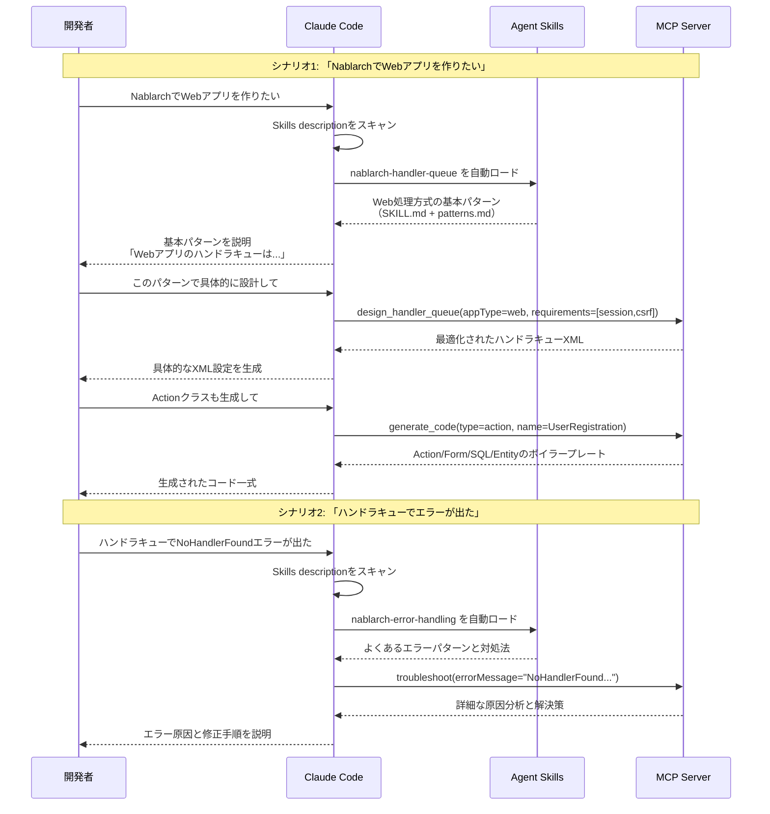
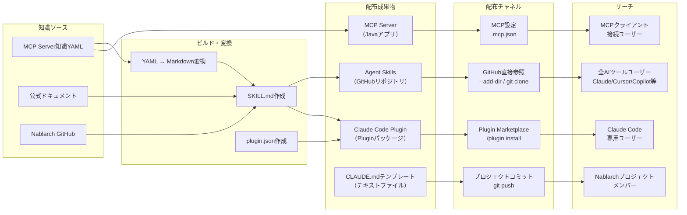

# Nablarch知識配布戦略レポート

**タスクID**: inline_076b_nablarch_delivery_strategy
**作成日**: 2026-02-10
**入力情報**: プラグイン調査レポート、知識提供方式分析レポート、nablarch-mcp-server現状、Claude Code公式ドキュメント

---

## 1. エグゼクティブサマリ（結論を先に）

### 結論: 3層構成が最適。MCPサーバ単体では不十分

| 構成要素 | 必要性 | 根拠 |
|----------|--------|------|
| **MCP Server**（現行） | **必要** | 動的ツール（コード生成・検証・検索・設計）の提供基盤。代替不可 |
| **Agent Skills** | **必要** | 静的知識（設計パターン・規約・テンプレート）の配布。クロスプラットフォーム標準。MCPでは過剰 |
| **Claude Code Plugin** | **あると良い** | Skills + MCP Serverを1パッケージに統合。ワンクリックインストール |
| **CLAUDE.md テンプレート** | **あると良い** | Nablarchプロジェクト向け核心ルールのクイックアクセス層。配布コストほぼゼロ |

### 推奨アクション（1行）

**Agent Skills（6〜8スキル）を新規作成し、既存MCP Serverと統合してClaude Code Pluginとしてパッケージ配布する。**

### 方向転換の要否

**方向転換は不要。** 現行nablarch-mcp-serverのアーキテクチャと方向性は妥当。ただし、**MCP Serverの守備範囲を明確化**し、静的知識をAgent Skillsに分離することで、両者の長所を最大化すべき。

---

## 2. Q1回答: ベストな構成は何か？

### 2.1 MCPサーバ単体では不十分な理由

nablarch-mcp-serverは10 Tools + 8 Resources + 6 Promptsを提供する高機能なMCPサーバだが、以下の構造的限界がある。

| 限界 | 説明 | Skills/Pluginで解決可能か |
|------|------|--------------------------|
| **起動コスト** | Javaプロセス起動が必要。PostgreSQL + pgvectorも前提（RAG機能） | Skills: サーバー不要 |
| **トークン消費** | 10 Toolsの定義だけでコンテキストを消費（Tool定義1つあたり約200〜500トークン） | Skills: Progressive Disclosure（メタデータ100トークン） |
| **静的知識の過剰な動的提供** | 「Webアプリの基本ハンドラキューパターン」のような定型知識をMCP Toolで返すのは過剰 | Skills: SKILL.mdにパターンを直接記述 |
| **クロスプラットフォーム** | MCP自体は標準だが、Tool/Resource/Promptの設計はサーバー依存 | Skills: agentskills.io準拠でツール横断 |
| **配布の簡便さ** | ユーザーがMCP設定（.mcp.json）を手動で書く必要がある | Plugin: `/plugin install`でワンクリック |

### 2.2 各構成要素の役割分担

```
┌─────────────────────────────────────────────────────────────────┐
│                 Nablarch知識の種類と最適な提供手段                  │
├─────────────────────────────────────┬───────────────────────────┤
│          静的知識（定型的）            │    動的知識（計算が必要）     │
│                                     │                           │
│  ・設計パターン・規約                 │  ・ハンドラキュー動的設計     │
│  ・FQCN一覧・APIリファレンス          │  ・コード生成（Action/Form） │
│  ・ハンドラキュー基本パターン          │  ・XML設定バリデーション     │
│  ・コーディングテンプレート            │  ・トラブルシューティング     │
│  ・マイグレーションチェックリスト       │  ・セマンティック検索        │
│  ・ベストプラクティス・アンチパターン   │  ・パターン推奨（スコアリング）│
│                                     │  ・マイグレーション分析       │
│           ▼                         │           ▼               │
│     Agent Skills                    │      MCP Server           │
│  （ファイルベース・軽量）              │   （サーバー・高機能）       │
│  サーバー不要 / 100トークンで発見     │  Java+Spring Boot起動      │
│  agentskills.io準拠                 │  JSON-RPC 2.0通信          │
└─────────────────────────────────────┴───────────────────────────┘
```

### 2.3 構成要素ごとの判定

#### MCP Server: **必要**（現行継続）

**根拠**: 以下の機能はMCP Toolでしか実現できない。

- `design_handler_queue`: アプリケーション種別・要件から動的にハンドラキュー構成を設計。パラメータの組み合わせによる計算が必要
- `generate_code`: Action/Form/Entity/SQLのボイラープレート生成。引数に基づく動的テンプレート展開
- `validate_config`: XML設定のバリデーション。構文解析+制約チェックが必要
- `troubleshoot`: エラーメッセージ→原因→対処の推論チェーン
- `semantic_search`: ハイブリッド検索（BM25 + ベクトル）によるナレッジ検索
- `analyze_migration`: バージョン間差異のコード分析

これらは「入力を受け取って計算し結果を返す」ため、静的ファイルでは代替不可能。

#### Agent Skills: **必要**（新規作成）

**根拠**: 以下の知識はSKILL.mdファイルで十分かつ最適。

- ハンドラキューの基本3パターン（Web/REST/バッチ）→ パターンは固定。毎回MCP Toolを呼ぶ必要なし
- API設計規約（RESTful設計、リクエスト/レスポンス形式）→ 定型的なガイドライン
- コンポーネント定義XML設計ガイド → XMLの書き方の決まりごと
- エラーハンドリングパターン → 定型的な処理パターン
- コーディング規約・テンプレート → コピー&カスタマイズ型

**Agent Skills公式ドキュメント（2026-02-10確認）による裏付け**:

1. **Progressive Disclosure**: description（約100トークン）のみコンテキストにロード。フル内容は呼び出し時のみ。MCP Toolの定義（常時200〜500トークン/Tool）より効率的
2. **クロスプラットフォーム**: agentskills.io準拠でClaude Code, Cursor, GitHub Copilot, Windsurf, Gemini CLI等で動作
3. **サーバー不要**: SKILL.mdファイルだけで動作。Javaプロセスもデータベースも不要
4. **段階的拡張**: サポートファイル（examples/, reference.md等）で詳細情報を必要時のみロード

#### Claude Code Plugin: **あると良い**（配布の利便性向上）

**根拠**: Skills + MCP Serverを1パッケージに統合できる。

```
nablarch-plugin/
├── .claude-plugin/
│   └── plugin.json        # プラグインメタデータ
├── .mcp.json               # MCP Server設定（nablarch-mcp-server接続）
├── skills/                 # Agent Skills（6〜8スキル）
│   ├── handler-queue-patterns/
│   ├── api-design/
│   └── ...
└── hooks/                  # 品質チェックhooks（将来）
    └── hooks.json
```

**メリット**: ユーザーは `/plugin install nablarch` 一発で、Skills + MCP Server接続設定 + Hooksが全て揃う。手動の`.mcp.json`編集が不要になる。

**注意**: Plugin化は「あると良い」止まり。理由は、Pluginマーケットプレイスがまだ成長途上であり、GitHubリポジトリからの`--plugin-dir`指定でも十分に機能するため。

#### CLAUDE.md テンプレート: **あると良い**（即効性が高い）

**根拠**: NablarchプロジェクトのCLAUDE.mdに「最低限これだけは知っておくべき」核心ルールを記載するテンプレート。

```markdown
# Nablarch Core Rules（CLAUDE.md用テンプレート）

## 重要なFQCN
- HttpRequest: nablarch.fw.web.HttpRequest（NOT nablarch.common.web.HttpRequest）
- ExecutionContext: nablarch.fw.ExecutionContext
- ...

## ハンドラキュー基本原則
- GlobalErrorHandlerは常に先頭
- DbConnectionManagementHandler → TransactionManagementHandlerの順序は厳守
- ...
```

**メリット**: セッション開始時にコンテキストに自動ロード。レイテンシゼロ。Skills/MCPの前に即座に参照される。**即日配布可能**。

---

## 3. Q2回答: nablarch-mcp-serverの方向性

### 3.1 方向性評価: **このまま進めてよい**

現行アーキテクチャの核心的判断は全て妥当。

| 判断 | 評価 | 理由 |
|------|------|------|
| Spring Boot + MCP Java SDK | **妥当** | Java/Nablarchエコシステムとの整合性。MCP Java SDKは公式SDK |
| YAML知識ベース方式 | **妥当** | 構造化データの正確な提供。FQCN・ハンドラ順序の厳密性を担保 |
| 10 Tools / 8 Resources / 6 Prompts | **妥当** | フレームワーク特化MCPサーバーとして必要十分な機能セット |
| RAG強化型（ハイブリッド検索） | **妥当** | 将来の知識量拡大に対応。ただしPhase 4（PostgreSQL + pgvector）は保留中で問題なし |
| STDIOモード | **妥当** | ローカル実行でセキュリティリスクゼロ。Streamable HTTP対応済みで将来のリモート展開も可能 |

### 3.2 方向転換が必要な点: **なし（ただし改善提案あり）**

方向転換は不要だが、以下の改善を提案する。

#### 改善1: MCP ServerとSkillsの責任分界の明確化

現在のMCP Serverは「動的ツール」と「静的知識のResource提供」を兼務している。この兼務自体は問題ないが、Agent Skills導入後は以下のように整理すべき。

| 提供内容 | 現在の提供手段 | 推奨する提供手段 |
|----------|---------------|-----------------|
| ハンドラキュー**動的設計** | MCP Tool（design_handler_queue） | **MCP Tool（維持）** |
| ハンドラキュー**基本パターン** | MCP Resource（handler/{app_type}） | **Agent Skill + MCP Resource（併用）** |
| コード生成 | MCP Tool（generate_code） | **MCP Tool（維持）** |
| API設計規約 | MCP Resource（pattern/{name}） | **Agent Skill（移管）+ MCP Resource（維持）** |
| エラーカタログ参照 | MCP Resource（guide/{topic}） | **Agent Skill（移管）+ MCP Resource（維持）** |
| トラブルシューティング | MCP Tool（troubleshoot） | **MCP Tool（維持）** |

**ポイント**: MCP Resourceは削除しない。SkillsとResourceは併存する。Skillsは「サーバーなしでも使える軽量版」、Resourcesは「MCPサーバー接続時の高精度版」という位置づけ。

#### 改善2: 知識データの品質向上（品質評価での指摘事項）

品質評価で指摘されたFQCN誤り5件・version-info誤り8件は、手段の問題ではなく**データの問題**。Skills化してもMCP Server化しても、元データが間違っていれば出力も間違う。

**優先度P0**: 知識YAML（handler-catalog.yaml, version-info.yaml等）の正確性検証と修正。

#### 改善3: Plugin化に備えた.mcp.json設定テンプレートの整備

Plugin化した際に`.mcp.json`に含める設定を事前に整備しておく。

```json
{
  "mcpServers": {
    "nablarch": {
      "command": "java",
      "args": ["-jar", "nablarch-mcp-server.jar"],
      "env": {
        "SPRING_PROFILES_ACTIVE": "stdio"
      }
    }
  }
}
```

---

## 4. Q3回答: Agent Skills化の具体的な成果物リスト

### 4.1 作成すべきSkills一覧（6スキル + 2オプション）

以下の成果物を作成する。各スキルはSKILL.md + サポートファイルで構成。

#### 必須スキル（6件）

| # | スキル名 | SKILL.md概要 | サポートファイル | 配置先 |
|---|----------|-------------|-----------------|--------|
| 1 | `nablarch-handler-queue` | Nablarchハンドラキューの設計ガイド。Web/REST/バッチの基本パターン、ハンドラ選択フロー | `patterns.md`（3パターン詳細）, `handler-catalog.md`（ハンドラ一覧）, `constraints.md`（順序制約） | `skills/nablarch-handler-queue/` |
| 2 | `nablarch-api-design` | NablarchのRESTful API設計規約。Action/Form/Entity設計パターン | `templates/`（Action/Form/Entity雛形）, `examples/`（実装例） | `skills/nablarch-api-design/` |
| 3 | `nablarch-component-xml` | コンポーネント定義XML設計ガイド。DIコンテナ設定の書き方 | `reference.md`（設定項目リファレンス）, `examples/`（設定例） | `skills/nablarch-component-xml/` |
| 4 | `nablarch-error-handling` | Nablarchのエラーハンドリングパターン。業務エラー/システムエラーの処理 | `error-catalog.md`（エラーカタログ）, `patterns.md`（処理パターン） | `skills/nablarch-error-handling/` |
| 5 | `nablarch-testing` | Nablarchテスティングフレームワーク使用ガイド。JUnit5 + Excelテストデータ | `patterns.md`（テストパターン）, `templates/`（テスト雛形） | `skills/nablarch-testing/` |
| 6 | `nablarch-migration` | Nablarch 5→6マイグレーションガイド。非推奨API・Breaking Changes一覧 | `checklist.md`（移行チェックリスト）, `api-changes.md`（API変更一覧） | `skills/nablarch-migration/` |

#### オプションスキル（2件）

| # | スキル名 | SKILL.md概要 | 必要性 |
|---|----------|-------------|--------|
| 7 | `nablarch-batch-design` | バッチアプリケーション設計パターン。都度起動バッチ/常駐バッチ/DB to DB | MCP Toolのgenerate_codeと補完関係 |
| 8 | `nablarch-messaging` | メッセージングアプリケーション設計パターン。MOM/HTTPメッセージング | 利用頻度に応じて追加判断 |

### 4.2 各スキルのSKILL.mdフロントマター設計

全スキル共通:

```yaml
---
name: nablarch-handler-queue        # スキル名
description: |
  Nablarchフレームワークのハンドラキュー設計ガイド。
  Web/REST/バッチアプリケーションの基本パターン、
  ハンドラの選択基準、順序制約を提供する。
  Nablarchでアプリケーションを設計する際に使用。
user-invocable: true                 # /nablarch-handler-queue で手動呼出可
disable-model-invocation: false      # Claudeが自動判断で使用可
---
```

**設計方針**:
- `disable-model-invocation: false`: Nablarchに関する質問で自動的にスキルが起動されるようにする
- `user-invocable: true`: ユーザーが明示的に `/nablarch-handler-queue` で呼び出すことも可能
- description は十分に具体的に（Claudeの自動判断精度に影響）
- SKILL.md本体は500行以内（公式推奨）。詳細はサポートファイルに分離

### 4.3 Plugin統合時の成果物

Plugin化する場合の追加成果物:

```
nablarch-plugin/
├── .claude-plugin/
│   └── plugin.json                  # [新規] プラグインメタデータ
├── .mcp.json                        # [新規] MCP Server接続設定
├── skills/                          # [新規] Agent Skills（6〜8スキル）
│   ├── nablarch-handler-queue/
│   │   ├── SKILL.md
│   │   ├── patterns.md
│   │   ├── handler-catalog.md
│   │   └── constraints.md
│   ├── nablarch-api-design/
│   │   ├── SKILL.md
│   │   ├── templates/
│   │   └── examples/
│   ├── nablarch-component-xml/
│   │   ├── SKILL.md
│   │   ├── reference.md
│   │   └── examples/
│   ├── nablarch-error-handling/
│   │   ├── SKILL.md
│   │   ├── error-catalog.md
│   │   └── patterns.md
│   ├── nablarch-testing/
│   │   ├── SKILL.md
│   │   ├── patterns.md
│   │   └── templates/
│   └── nablarch-migration/
│       ├── SKILL.md
│       ├── checklist.md
│       └── api-changes.md
├── CLAUDE.md                        # [新規] Nablarch核心ルール（プロジェクト向けテンプレート）
└── README.md                        # [新規] インストール・使用方法
```

### 4.4 plugin.json 仕様

```json
{
  "name": "nablarch",
  "description": "Nablarchフレームワーク知識をAIコーディングツールに提供するプラグイン。設計パターン、ハンドラキュー構成、API規約、コード生成ツールを統合。",
  "version": "1.0.0",
  "author": {
    "name": "kumagoro1202"
  },
  "repository": "https://github.com/kumagoro1202/nablarch-plugin",
  "license": "Apache-2.0",
  "keywords": ["nablarch", "java", "framework", "mcp"]
}
```

### 4.5 知識ソースの流れ

```
既存MCP Server知識YAML                新規作成
───────────────────                 ───────────
handler-catalog.yaml ──────┐
handler-constraints.yaml ──┤
                           ├──→ skills/nablarch-handler-queue/
                           │      SKILL.md（サマリ）
                           │      patterns.md（詳細パターン）
                           │      handler-catalog.md（一覧表）
                           │
api-patterns.yaml ─────────┼──→ skills/nablarch-api-design/
design-patterns.yaml ──────┤      SKILL.md + templates/ + examples/
                           │
config-templates.yaml ─────┼──→ skills/nablarch-component-xml/
                           │      SKILL.md + reference.md + examples/
                           │
error-catalog.yaml ────────┼──→ skills/nablarch-error-handling/
                           │      SKILL.md + error-catalog.md + patterns.md
                           │
version-info.yaml ─────────┼──→ skills/nablarch-migration/
                           │      SKILL.md + checklist.md + api-changes.md
                           │
（新規調査必要）──────────────┴──→ skills/nablarch-testing/
                                  SKILL.md + patterns.md + templates/
```

**重要**: MCP Server側の知識YAMLは削除しない。Skills側は「人間が読みやすいMarkdown形式」、MCP Server側は「プログラムが処理しやすいYAML形式」として併存する。同じ知識の異なるビュー。

---

## 5. Q4回答: 構成全体像（Mermaid図）

### 5.1 全体アーキテクチャ

```mermaid
graph TB
    subgraph User["ユーザー（Nablarch開発者）"]
        Dev["開発者"]
    end

    subgraph AI_Tools["AIコーディングツール"]
        CC["Claude Code"]
        Cursor["Cursor"]
        Copilot["GitHub Copilot"]
        Windsurf["Windsurf"]
        GeminiCLI["Gemini CLI"]
    end

    subgraph Distribution["配布レイヤー"]
        Plugin["Claude Code Plugin<br/>nablarch-plugin/<br/>（P2: あると良い）"]
        SkillsRepo["Agent Skills リポジトリ<br/>GitHub公開<br/>（agentskills.io準拠）"]
        MCPRegistry["MCPレジストリ<br/>Smithery / Glama.ai<br/>（P3: 将来）"]
    end

    subgraph Knowledge_Layer["知識提供レイヤー"]
        subgraph Skills_Layer["Agent Skills（静的知識）"]
            S1["handler-queue<br/>ハンドラキュー設計ガイド"]
            S2["api-design<br/>API設計規約"]
            S3["component-xml<br/>XML設定ガイド"]
            S4["error-handling<br/>エラー処理パターン"]
            S5["testing<br/>テストガイド"]
            S6["migration<br/>移行ガイド"]
        end

        subgraph MCP_Layer["MCP Server（動的ツール）"]
            T1["design_handler_queue<br/>動的設計"]
            T2["generate_code<br/>コード生成"]
            T3["validate_config<br/>XML検証"]
            T4["troubleshoot<br/>障害診断"]
            T5["semantic_search<br/>知識検索"]
            T6["generate_test<br/>テスト生成"]
        end

        CLAUDE["CLAUDE.md テンプレート<br/>核心ルール<br/>（即時アクセス層）"]
    end

    subgraph Data["知識データ"]
        YAML["YAML知識ファイル<br/>10ファイル"]
        MD["Markdownサポートファイル<br/>パターン・テンプレート"]
        RAG["RAGインデックス<br/>公式ドキュメント<br/>（Phase 4以降）"]
    end

    Dev --> AI_Tools

    CC -->|"/plugin install"| Plugin
    CC -->|"--add-dir"| SkillsRepo
    Cursor -->|"agentskills.io"| SkillsRepo
    Copilot -->|"agentskills.io"| SkillsRepo
    Windsurf -->|"agentskills.io"| SkillsRepo
    GeminiCLI -->|"agentskills.io"| SkillsRepo

    Plugin --> Skills_Layer
    Plugin -->|".mcp.json"| MCP_Layer
    SkillsRepo --> Skills_Layer

    CC -->|"MCP Protocol"| MCP_Layer

    Skills_Layer --> MD
    MCP_Layer --> YAML
    MCP_Layer --> RAG
    CLAUDE --> Dev

    style Skills_Layer fill:#2d5a27,stroke:#4a9e3f
    style MCP_Layer fill:#1a3a5c,stroke:#3a7abd
    style CLAUDE fill:#5c3a1a,stroke:#bd7a3a
    style Plugin fill:#3a1a5c,stroke:#7a3abd
```



### 5.2 ユーザー体験フロー



### 5.3 配布チャネル全体像



---

## 6. 根拠・参考情報

### 6.1 公式ドキュメント（2026-02-10確認）

| 情報源 | 確認内容 | 結論への影響 |
|--------|---------|-------------|
| [Claude Code Skills公式](https://code.claude.com/docs/en/skills) | Progressive Disclosure（100トークンでメタデータ、フル読み込みは呼出時のみ）、agentskills.io準拠、サポートファイル構造 | Skills推奨の根拠 |
| [Claude Code Plugins公式](https://code.claude.com/docs/en/plugins) | Plugin構造（.claude-plugin/ + skills/ + .mcp.json + hooks/）、/plugin installによる配布 | Plugin統合の根拠 |
| [agentskills.io](https://agentskills.io) | クロスプラットフォーム標準。Claude Code, Cursor, Copilot, Windsurf, Gemini CLI等で動作 | クロスプラットフォーム到達の根拠 |

### 6.2 内部レポート

| レポート | 主要知見 | 本レポートへの反映 |
|----------|---------|-------------------|
| プラグイン調査レポート（担当者A） | Agent Skillsが最も有望な配布手段。Plugin化で統合配布可能 | Q1の構成推奨に反映 |
| 知識提供方式分析レポート（担当者B） | MCP Server方式は妥当。Boris氏のAgentic SearchはNablarchに不向き。三層ハイブリッド推奨 | Q2の方向性評価に反映 |
| 品質評価レポート | 情報精度3.0/5.0。FQCN誤り5件、version-info誤り8件 | 知識データ品質改善の根拠 |

### 6.3 定量的根拠

| 指標 | 数値 | 出典 |
|------|------|------|
| Skills Progressive Disclosure | メタデータ: 約100トークン / フル: 5Kトークン未満推奨 | Claude Code公式ドキュメント |
| MCP Tool定義のトークン消費 | 約200〜500トークン/Tool（10 Tools = 2,000〜5,000トークン常時消費） | MCP仕様・実測 |
| Skills コンテキスト予算 | コンテキストウィンドウの2%（フォールバック: 16,000文字） | Claude Code公式ドキュメント |
| nablarch-mcp-server現状 | 10 Tools + 8 Resources + 6 Prompts / テスト810件 | プロジェクト実績 |
| Nablarch知識YAML | 10ファイル（handler-catalog, api-patterns, design-patterns等） | ソースコード確認 |

### 6.4 リスクと軽減策

| リスク | 影響度 | 軽減策 |
|--------|--------|--------|
| Skills標準が変更される | 中 | agentskills.ioはAnthropicと主要ツールベンダーが共同策定。安定性は高い |
| Plugin Marketplaceの普及遅れ | 低 | GitHubリポジトリ直接参照（--add-dir）でSkills単体利用可能。Pluginは補助的手段 |
| Skills知識とMCP Server知識の二重管理 | 中 | 知識ソースはYAMLを一元管理。ビルドスクリプトでMarkdownに変換する自動化を検討 |
| Skills内容の陳腐化 | 中 | MCP Server知識YAMLの更新時にSkills側も同時更新するプロセスを確立 |

---

## 7. 実装ロードマップ（推奨）

| フェーズ | 成果物 | 工数 | 優先度 |
|----------|--------|------|--------|
| **Phase A: Skills作成** | 6 Agent Skills（SKILL.md + サポートファイル） | 中（2〜3日） | **最優先** |
| **Phase B: CLAUDE.mdテンプレート** | Nablarch核心ルールテンプレート | 小（半日） | 高 |
| **Phase C: Plugin統合** | plugin.json + .mcp.json + Skills統合 | 小（1日） | 中 |
| **Phase D: 配布・登録** | GitHub公開 + コミュニティレジストリ登録 | 小（半日） | 中 |
| **Phase E: MCP Server品質改善** | FQCN修正・version-info更新・登録漏れ修正 | 中（既存計画） | 高 |

**Phase AとPhase Eは並行実施可能。**

---

