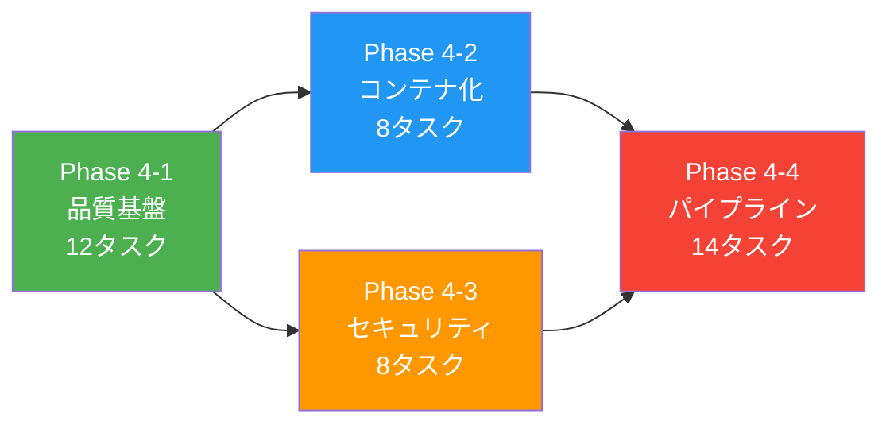
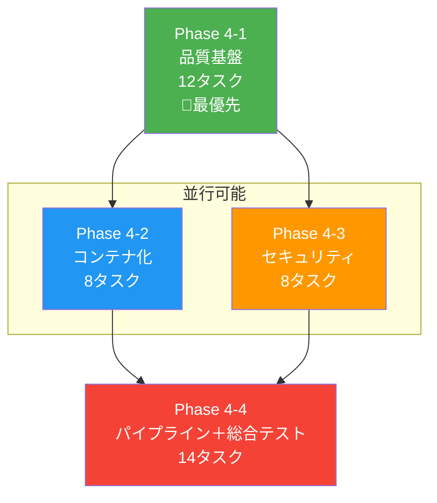
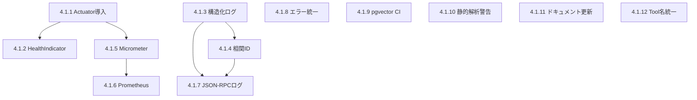

# nablarch-mcp-server Phase 4 実装計画書（ブラッシュアップ版）

**作成日**: 2026-02-10
**対象**: nablarch-mcp-server Phase 4
**ステータス**: 🚨レビュー待ち

---

## 1. エグゼクティブサマリ

### 背景

nablarch-mcp-serverはPhase 1-3を完了し、10 Tools + 8 Resources + 6 Promptsの機能を実装済み。P0/P1改善タスクで改善（15件）を実施し、テスト941件全成功（0失敗、14スキップ=DB統合テスト）の状態。

Phase 4は**本番デプロイ・エンタープライズ対応**フェーズであり、以下のプロジェクト方針を反映して計画を再構築した。

### プロジェクト方針の反映

| 裁定 | 出典 | 影響 |
|------|------|------|
| **MCP Server方式確定** | 知識提供方式分析 | ONNX Embedding移行・Agentic Search・Fine-tuning関連タスクを全て除外 |
| **Phase 4着手保留解除** | Phase 4計画 | 本計画により着手可能 |

### Phase 4計画サマリ

| 指標 | 値 |
|------|-----|
| 総タスク数 | **42件**（旧計画28件 → 除外5件 + 新規19件） |
| サブフェーズ数 | 4（4-1 〜 4-4） |
| 除外した項目数 | **5件**（既完了3件 + 不要化2件） |
| 新規追加した項目数 | **19件**（オブザーバビリティ14件 + 品質改善5件） |

---

## 2. 既存Phase 4計画の棚卸し

### 2.1 除外した項目（5件）

#### 既に完了済み（3件）— P0/P1改善で対応済み

| 旧WBS | 項目 | 対応 | 完了根拠 |
|-------|------|------|---------|
| 4.2.10 | Origin検証実装 | P0-3改善 | コミット `41e7685`、McpServerConfig.java修正済み |
| (P1-4) | CI/CD導入 | P1-4改善 | `.github/workflows/ci.yml` コミット `8e1616d` |
| (P1-1) | isError:true対応 | P1-1+P1-8改善 | 全Toolクラス修正済み、コミット `2422d39` |

#### 不要化（2件）— プロジェクト方針により

| 項目 | 除外理由 |
|------|---------|
| ONNX Embedding移行（ドキュメント用bge-m3、コード用CodeSage） | 方針決定: MCP Server方式確定、ONNX不要 |
| Agentic Search / Fine-tuning検討 | 方針決定: 代替案は採用しない |

### 2.2 継続する項目（25件）

既存Phase 4 WBS（28件）から除外3件を引いた25件を継続。ただし内容を一部更新。

### 2.3 新規追加する項目（19件）

| 出典 | 件数 | 内容 |
|------|:----:|------|
| オブザーバビリティ設計 | 14件 | Actuator、ヘルスチェック、構造化ログ、Micrometer、Prometheus等 |
| P2残課題 + P0/P1改善残課題 | 5件 | FQCN実在検証CI、SpotBugs対応、ドキュメント更新等 |

---

## 3. Phase 4 サブフェーズ構成

```
Phase 4-1: 品質基盤・オブザーバビリティ基盤  ← 最優先（他の全サブフェーズの前提）
Phase 4-2: コンテナ化・デプロイ基盤
Phase 4-3: セキュリティ・認証
Phase 4-4: データパイプライン拡充・総合テスト
```



---

## 4. Phase 4-1: 品質基盤・オブザーバビリティ基盤（12タスク）

> **目的**: Phase 4の全サブフェーズの前提条件を整備。オブザーバビリティの基盤を構築し、以降の開発で品質を継続的に担保する。
> **優先度**: 🔴 最優先（P0相当）

### 4-1 WBSテーブル

| WBS | タスク名 | 成果物 | 依存 | 完了条件 |
|-----|---------|--------|------|---------|
| **4.1.1** | **Spring Boot Actuator導入** | pom.xml + application-http.yaml更新 | なし | `/actuator/health`, `/actuator/info`, `/actuator/metrics`エンドポイントが応答すること |
| **4.1.2** | **カスタムHealthIndicator実装（3件）** | DatabaseHealthIndicator, KnowledgeBaseHealthIndicator, EmbeddingModelHealthIndicator | 4.1.1 | `/actuator/health`でDB接続・知識ベース・Embeddingモデルの状態が確認できること |
| **4.1.3** | **構造化ログ（JSON）導入** | logback-spring.xml新規作成 | なし | HTTPプロファイルでJSON形式ログ出力、STDIOでプレーンテキスト出力 |
| **4.1.4** | **リクエスト相関ID導入** | MDCフィルタ + logback-spring.xml更新 | 4.1.3 | 全ログに`requestId`フィールドが含まれること |
| **4.1.5** | **Micrometer導入 + MCP固有メトリクス** | pom.xml + MetricsInterceptor新規 | 4.1.1 | Tool呼び出し数(Counter)、レスポンス時間(Timer)、エラー率が`/actuator/metrics`で取得可能 |
| **4.1.6** | **Prometheus連携** | micrometer-registry-prometheus + application-http.yaml | 4.1.5 | `/actuator/prometheus`でメトリクスがScrape可能 |
| **4.1.7** | **MCP JSON-RPCリクエスト/レスポンスログ** | LoggingInterceptor新規 | 4.1.3, 4.1.4 | Tool呼び出し名・パラメータ（サニタイズ済み）・レスポンスサイズ・処理時間が記録されること |
| **4.1.8** | **エラーハンドリング統一** | ErrorResponseBuilder新規 + 全Toolクラス更新 | なし | 全Toolで統一されたエラーレスポンスフォーマット。エラーコード体系の定義 |
| **4.1.9** | **pgvector統合テストCI対応** | .github/workflows/ci.yml更新 | なし | GitHub ActionsにPostgreSQLサービスコンテナ追加、スキップ14件が実行可能に |
| **4.1.10** | **SpotBugs/Checkstyle警告対応** | 該当Javaファイル | なし | SpotBugs Medium 4件 + Checkstyle NeedBraces 8件を修正 |
| **4.1.11** | **ドキュメント一括更新** | README.md, docs/guides/02-user-guide.md, docs/guides/01-setup.md, docs/INDEX.md | なし | Phase 3完了・P0/P1改善改善・Phase 4計画が全て反映 |
| **4.1.12** | **Tool名snake_case統一** | 全Toolクラス（@Tool name属性追加） | なし | MCPクライアントから見えるTool名がドキュメント記載と一致 |

### 4-1 完了条件チェックリスト

- [ ] Actuator `/health`, `/info`, `/metrics` が動作
- [ ] 3カスタムHealthIndicatorが正常応答
- [ ] HTTPモードでJSON構造化ログ出力
- [ ] 全ログにrequestId付与
- [ ] `/actuator/prometheus`でメトリクスScrape可能
- [ ] Tool呼び出しメトリクス（Counter + Timer）が計測される
- [ ] JSON-RPCリクエスト/レスポンスがログに記録される
- [ ] 全Toolのエラーレスポンスが統一フォーマット
- [ ] CIでpgvector統合テスト実行（スキップ0件）
- [ ] SpotBugs/Checkstyle警告ゼロ
- [ ] ドキュメントが最新状態に更新
- [ ] Tool名がsnake_caseで統一
- [ ] `mvn clean test` 全成功

---

## 5. Phase 4-2: コンテナ化・デプロイ基盤（8タスク）

> **目的**: Docker Composeによるワンコマンドデプロイを実現し、監視ダッシュボードを整備する。
> **優先度**: 🟡 高（Phase 4-1完了後）

### 4-2 WBSテーブル

| WBS | タスク名 | 成果物 | 依存 | 完了条件 |
|-----|---------|--------|------|---------|
| **4.2.1** | **Docker Composeデプロイ設計** | デプロイメントアーキテクチャ設計書 | Phase 4-1完了 | コンテナ構成・ネットワーク・ボリュームが定義されていること |
| **4.2.2** | **Dockerfile作成** | Dockerfile（マルチステージビルド） | 4.2.1 | `docker build`でイメージ作成可能。JVM設定・セキュリティ考慮済み |
| **4.2.3** | **Docker Compose構築** | docker-compose.yml更新（nablarch-mcp + pgvector + Prometheus + Grafana） | 4.2.2 | `docker compose up`でアプリ+DB+監視が全て起動 |
| **4.2.4** | **Grafanaダッシュボード作成** | dashboards/mcp-server.json | 4.2.3 | Tool呼び出し頻度・レスポンス時間分布・エラー率・JVMメトリクスが可視化 |
| **4.2.5** | **.env.example作成** | .env.example | 4.2.3 | 必要な全環境変数がドキュメント化（DB接続、APIキー、JVM設定等） |
| **4.2.6** | **Docker Composeデプロイテスト** | テスト結果ドキュメント | 4.2.3 | コンテナ起動・停止・ヘルスチェック全て正常 |
| **4.2.7** | **デプロイメントガイド** | docs/guides/04-deployment.md | 4.2.6 | Docker Compose手順・環境変数一覧・スケーリング手順を記述 |
| **4.2.8** | **運用マニュアル** | docs/guides/05-operations.md | 4.2.4, 4.2.6 | モニタリング・ログ確認・トラブルシューティング・バックアップ手順 |

### 4-2 完了条件チェックリスト

- [ ] `docker compose up -d`で全サービスが正常起動
- [ ] アプリコンテナのヘルスチェックがhealthy
- [ ] Grafanaダッシュボードでメトリクスが可視化
- [ ] .env.exampleで環境変数が網羅
- [ ] デプロイメントガイドでゼロからセットアップ可能
- [ ] 運用マニュアルで日常運用が可能

---

## 6. Phase 4-3: セキュリティ・認証（8タスク）

> **目的**: HTTPトランスポートモードでのセキュア運用を実現する。
> **優先度**: 🟡 高（Phase 4-1完了後、4-2と並行可能）

### 4-3 WBSテーブル

| WBS | タスク名 | 成果物 | 依存 | 完了条件 |
|-----|---------|--------|------|---------|
| **4.3.1** | **OAuth 2.0認証設計** | 認証・認可設計書 | Phase 4-1完了 | OAuth 2.0フロー・APIキー管理・セッション管理の設計が確定 |
| **4.3.2** | **OAuth 2.0認証実装** | SecurityConfig.java, AuthFilter.java | 4.3.1 | トークン検証・APIキー認証・不正アクセス拒否が動作 |
| **4.3.3** | **APIキー管理実装** | ApiKeyService.java, api_keysテーブル | 4.3.2 | キー発行・失効・ローテーションが動作 |
| **4.3.4** | **レート制限実装** | RateLimitFilter.java | 4.3.2 | セッション単位のレート制限。閾値超過時に429レスポンス |
| **4.3.5** | **認証・認可テスト** | テストクラス群 | 4.3.2, 4.3.3 | 正常認証・不正トークン拒否・APIキー認証のテスト全成功 |
| **4.3.6** | **レート制限テスト** | テストクラス | 4.3.4 | 閾値超過時の429レスポンス確認 |
| **4.3.7** | **セキュリティガイド** | docs/guides/06-security.md | 4.3.5 | OAuth 2.0設定・APIキー管理・TLS設定手順を記述 |
| **4.3.8** | **application-prod.yaml作成** | application-prod.yaml | 4.3.2 | 本番環境用設定（セキュリティ強化、ログレベル調整、DB接続プール設定） |

### 4-3 完了条件チェックリスト

- [ ] OAuth 2.0認証フローが動作
- [ ] APIキーの発行・認証・失効が動作
- [ ] レート制限が正常動作（429レスポンス）
- [ ] 不正アクセスが拒否されること
- [ ] セキュリティガイドで設定手順が明確
- [ ] application-prod.yamlで本番設定が分離

---

## 7. Phase 4-4: データパイプライン拡充・総合テスト（14タスク）

> **目的**: RAG検索のデータソースを拡充し、全体品質を保証する。
> **優先度**: Phase 4-2, 4-3完了後

### 4-4 WBSテーブル

| WBS | タスク名 | 成果物 | 依存 | 完了条件 |
|-----|---------|--------|------|---------|
| **4.4.1** | **GitHub取込パイプライン設計** | 設計書（113リポジトリのクローリング戦略、増分更新） | Phase 4-2, 4-3完了 | クローリング対象・戦略・コスト見積もりが確定 |
| **4.4.2** | **Javadoc取込パイプライン設計** | 設計書（全モジュールJavadocパース・Embedding戦略） | 4.4.1 | パイプライン構成が確定 |
| **4.4.3** | **GitHub取込パイプライン実装** | GitHubIngester.java | 4.4.1 | 代表リポジトリの取込→Embedding→code_chunks格納が動作 |
| **4.4.4** | **Javadoc取込パイプライン実装** | JavadocIngester.java | 4.4.2 | Javadoc取込→Embedding→document_chunks格納が動作 |
| **4.4.5** | **GitHub Webhook連携（増分更新）** | WebhookController.java | 4.4.3 | pushイベント受信→差分検出→増分取込が動作 |
| **4.4.6** | **取込パイプラインテスト（GitHub）** | テスト結果 | 4.4.3 | 代表リポジトリのE2Eテスト成功 |
| **4.4.7** | **取込パイプラインテスト（Javadoc）** | テスト結果 | 4.4.4 | Javadoc取込E2Eテスト成功 |
| **4.4.8** | **Webhook増分更新テスト** | テスト結果 | 4.4.5 | Webhookイベント→増分取込→インデックス更新確認 |
| **4.4.9** | **知識ベース精度向上** | handler-catalog.yaml等の更新 | なし | ハンドラ情報をNablarch最新ドキュメントと照合・修正 |
| **4.4.10** | **handler-constraints.yaml拡充** | handler-constraints.yaml | なし | messaging/http-messaging向け順序制約を追加 |
| **4.4.11** | **CHANGELOG.md作成** | CHANGELOG.md | なし | Phase 1-4の主要変更を記録 |
| **4.4.12** | **全体E2Eテスト（Docker環境）** | テスト結果ドキュメント | 4.2.3, 4.3.5, 4.4.6, 4.4.7 | Docker環境で全機能（10 Tool、8 Resource、6 Prompt、認証）が動作 |
| **4.4.13** | **パフォーマンステスト** | パフォーマンスレポート | 4.4.12 | RAG検索100-300ms、Tool応答500ms以下、同時接続10以上 |
| **4.4.14** | **ユーザーガイド最終版** | docs/guides/02-user-guide.md最終更新 | 4.4.12 | 全機能の使用方法・FAQ・トラブルシューティング |

### 4-4 完了条件チェックリスト

- [ ] GitHub 113リポジトリの取込パイプラインが動作
- [ ] Javadoc取込パイプラインが動作
- [ ] Webhook増分更新が動作
- [ ] 知識ベースの精度が向上（最新ドキュメント照合済み）
- [ ] Docker環境で全体E2Eテスト成功
- [ ] パフォーマンス要件達成（RAG 100-300ms、Tool 500ms以下）
- [ ] ユーザーガイドが全機能をカバー
- [ ] CHANGELOG.mdが最新

---

## 8. Phase 4 全体WBS一覧（42タスク）

### タスク数集計

| サブフェーズ | 設計 | 実装 | テスト | ドキュメント | 合計 |
|------------|:----:|:----:|:------:|:----------:|:----:|
| Phase 4-1（品質基盤） | 0 | 9 | 1 | 2 | **12** |
| Phase 4-2（コンテナ化） | 1 | 4 | 1 | 2 | **8** |
| Phase 4-3（セキュリティ） | 1 | 4 | 2 | 1 | **8** |
| Phase 4-4（パイプライン） | 2 | 5 | 5 | 2 | **14** |
| **合計** | **4** | **22** | **9** | **7** | **42** |

### 旧計画との差分

| 指標 | 旧計画 | 新計画 | 差分 |
|------|:------:|:------:|:----:|
| 総タスク数 | 28 | 42 | +14 |
| 設計タスク | 5 | 4 | -1 |
| 実装タスク | 10 | 22 | +12 |
| テストタスク | 9 | 9 | ±0 |
| ドキュメントタスク | 4 | 7 | +3 |
| 除外項目 | - | 5 | -5 |
| 新規項目 | - | 19 | +19 |

---

## 9. 依存関係図

### サブフェーズ間依存



### Phase 4-1 内部依存



### クリティカルパス

```
4.1.1 Actuator → 4.1.5 Micrometer → 4.1.6 Prometheus → 4.2.3 Docker Compose → 4.2.4 Grafana → 4.4.12 全体E2E → 4.4.13 性能テスト
```

---

## 10. 品質基準

### テスト基準

| 基準 | 値 |
|------|-----|
| テスト成功率 | 100%（スキップ0件） |
| ユニットテストカバレッジ | 80%以上（ビジネスロジック部分） |
| 統合テスト | 全10 Tool + 8 Resource + 6 Prompt + 認証 |
| E2Eテスト | Docker環境で全機能動作確認 |

### パフォーマンス基準

| メトリクス | 基準 |
|-----------|------|
| RAG検索レイテンシ | 100-300ms |
| Tool応答時間（静的） | 50ms以下 |
| Tool応答時間（RAG込み） | 500ms以下 |
| 同時接続数（HTTP） | 10以上 |

### セキュリティ基準

| 基準 | 対応サブフェーズ |
|------|---------------|
| DB認証情報の環境変数化 | ✅完了（P0/P1改善） |
| Origin検証有効化 | ✅完了（P0/P1改善） |
| OAuth 2.0認証 | Phase 4-3 |
| TLS設定 | Phase 4-3 |
| レート制限 | Phase 4-3 |

### オブザーバビリティ基準（オブザーバビリティ設計由来）

| 項目 | Phase 4-1完了後の目標スコア |
|------|:------------------------:|
| ログ | 4/5（構造化ログ + 相関ID + JSON-RPCログ） |
| メトリクス | 4/5（Actuator + Micrometer + Prometheus） |
| ヘルスチェック | 4/5（3カスタムHealthIndicator） |
| デバッグ・診断 | 4/5（エラー統一 + 相関ID） |
| 総合スコア | **3.5/5以上**（現状1.6/5からの改善） |

---

## 11. リスクと対策

| # | リスク | 影響度 | 発生確率 | 対策 |
|---|--------|:------:|:--------:|------|
| R1 | MCP Java SDK 0.x系の破壊的変更 | 高 | 中 | SDK APIの薄いラッパーレイヤーで影響局所化 |
| R2 | Embedding API（Jina/Voyage）の費用増大 | 中 | 中 | 113リポジトリ取込のコスト事前見積もり。増分更新でフルリビルド最小化 |
| R3 | OAuth 2.0導入に伴うテスト複雑化 | 中 | 高 | テストプロファイルで認証スキップ可能に。MockMvcでの認証テストパターン確立 |
| R4 | Docker Compose構成の複雑化 | 低 | 中 | サービス最小構成（app + DB + Prometheus + Grafana）を維持。段階的追加 |
| R5 | パフォーマンス基準未達 | 中 | 低 | Phase 4-1でメトリクス基盤を先に構築し、ボトルネック特定可能な状態でPhase 4-4に進む |

---

## 12. 実行順序の推奨

### 担当者アサインメント案

Phase 4-1のタスクは以下の並行実行グループに分割可能。

**並行グループA（オブザーバビリティ）**: 4.1.1 → 4.1.2, 4.1.5 → 4.1.6
**並行グループB（ログ基盤）**: 4.1.3 → 4.1.4 → 4.1.7
**並行グループC（品質改善・独立）**: 4.1.8, 4.1.9, 4.1.10, 4.1.11, 4.1.12

担当者2名でPhase 4-1を並行実行すれば効率的。

### Phase 4-2/4-3の並行実行

Phase 4-2（コンテナ化）と4-3（セキュリティ）は独立しているため、別々の担当者に同時アサイン可能。Phase 4-4は両方の完了を待ってから着手。

---

## 13. 旧WBSとの対応表

| 旧WBS | 旧タスク名 | 新WBS | ステータス |
|-------|-----------|-------|-----------|
| 4.1.1 | Docker Compose設計 | 4.2.1 | 継続（4-2に移動） |
| 4.1.2 | OAuth 2.0認証設計 | 4.3.1 | 継続（4-3に移動） |
| 4.1.3 | GitHub取込パイプライン設計 | 4.4.1 | 継続（4-4に移動） |
| 4.1.4 | Javadoc取込パイプライン設計 | 4.4.2 | 継続（4-4に移動） |
| 4.1.5 | モニタリング設計 | 4.1.1〜4.1.7 | 分割・拡充（オブザーバビリティ設計統合） |
| 4.2.1 | Docker Compose構築 | 4.2.3 | 継続（Dockerfile分離） |
| 4.2.2 | OAuth 2.0実装 | 4.3.2 | 継続 |
| 4.2.3 | APIキー管理実装 | 4.3.3 | 継続 |
| 4.2.4 | レート制限実装 | 4.3.4 | 継続 |
| 4.2.5 | GitHub取込実装 | 4.4.3 | 継続 |
| 4.2.6 | Javadoc取込実装 | 4.4.4 | 継続 |
| 4.2.7 | Webhook連携 | 4.4.5 | 継続 |
| 4.2.8 | モニタリング実装 | 4.1.5, 4.1.6 | 分割・拡充（オブザーバビリティ設計統合） |
| 4.2.9 | ヘルスチェック・ロギング | 4.1.2, 4.1.3 | 分割・拡充（オブザーバビリティ設計統合） |
| 4.2.10 | Origin検証実装 | — | **除外**（P0/P1改善完了済み） |
| 4.3.1 | Dockerデプロイテスト | 4.2.6 | 継続 |
| 4.3.2 | 認証テスト | 4.3.5 | 継続 |
| 4.3.3 | レート制限テスト | 4.3.6 | 継続 |
| 4.3.4 | GitHub取込テスト | 4.4.6 | 継続 |
| 4.3.5 | Javadoc取込テスト | 4.4.7 | 継続 |
| 4.3.6 | Webhook更新テスト | 4.4.8 | 継続 |
| 4.3.7 | モニタリングテスト | 4.2.6に統合 | Docker環境テストに統合 |
| 4.3.8 | 全体E2E | 4.4.12 | 継続 |
| 4.3.9 | パフォーマンステスト | 4.4.13 | 継続 |
| 4.4.1 | デプロイメントガイド | 4.2.7 | 継続 |
| 4.4.2 | 運用マニュアル | 4.2.8 | 継続 |
| 4.4.3 | セキュリティガイド | 4.3.7 | 継続 |
| 4.4.4 | ユーザーガイド最終版 | 4.4.14 | 継続 |

---

## 14. 期待される効果

### Phase 4完了後の総合スコア予測（品質評価基準）

| 視点 | Phase 3完了時 | P0/P1改善後 | Phase 4目標 |
|------|:-----------:|:---------:|:-----------:|
| 情報精度 | 3.0 | 4.0 | 4.5 |
| コード品質 | 3.4 | 4.0 | 4.5 |
| MCP仕様準拠 | 3.0 | 4.0 | 4.5 |
| UX/DX | 3.6 | 3.8 | 4.5 |
| パフォーマンス・運用 | 3.0 | 3.2 | 4.5 |
| 市場・競合 | 4.0 | 4.0 | 4.5 |
| **総合（加重平均）** | **3.31** | **3.88** | **4.50** |

### オブザーバビリティスコア予測（オブザーバビリティ設計基準）

| 項目 | 現状 | Phase 4-1後 | Phase 4全体後 |
|------|:----:|:----------:|:------------:|
| ログ | 3/5 | 5/5 | 5/5 |
| メトリクス | 1/5 | 4/5 | 5/5 |
| トレーシング | 1/5 | 1/5 | 2/5（P3で5/5） |
| ヘルスチェック | 1/5 | 4/5 | 5/5 |
| デバッグ・診断 | 2/5 | 4/5 | 4/5 |
| 運用監視 | 1/5 | 3/5 | 5/5 |
| **総合** | **1.6/5** | **3.5/5** | **4.3/5** |

---

## 15. Phase 4範囲外（Phase 5以降に先送り）

以下の項目はPhase 4のスコープ外とし、Phase 5以降で対応する。

| 項目 | 理由 |
|------|------|
| 分散トレーシング（OpenTelemetry） | Phase 4ではメトリクス基盤構築が優先。トレーシングはP3として次フェーズ |
| SLO/SLI定義 | メトリクス蓄積後に定義が適切 |
| Smitheryカタログ登録 | Phase 4完了後のリリースアクション |
| 英語ドキュメント整備 | 国内SI向け優先。グローバル展開はPhase 5 |
| マルチフレームワーク対応（Spring, Quarkus） | Nablarch単体の完成が先決 |
| Resource Template対応（URIテンプレート） | MCP仕様の成熟を待ってから |
| Spring Cache + Caffeine導入 | メトリクスでボトルネック特定後に判断 |
| OpenTelemetry Collector統合 | Phase 4ではPrometheus直接連携で十分 |

---

*計画書作成完了: 2026-02-10*
*入力: オブザーバビリティ設計, 多角的評価, P0/P1改善（P0/P1改善）, 知識提供方式分析（MCP Server確定裁定）*
*全データはソースから正確に引用。推測による補完なし。*
