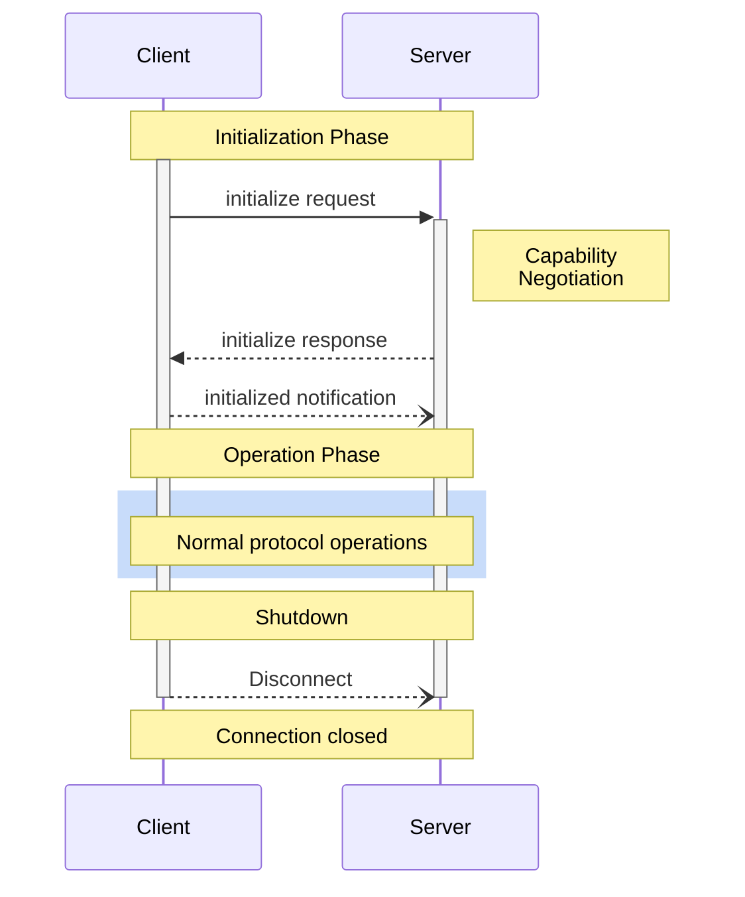
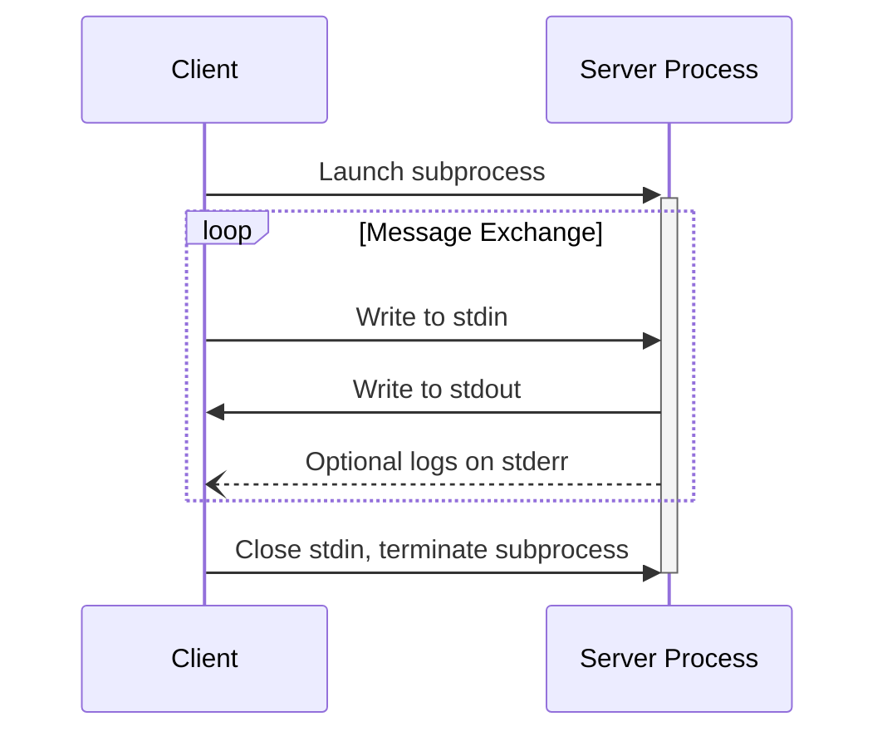
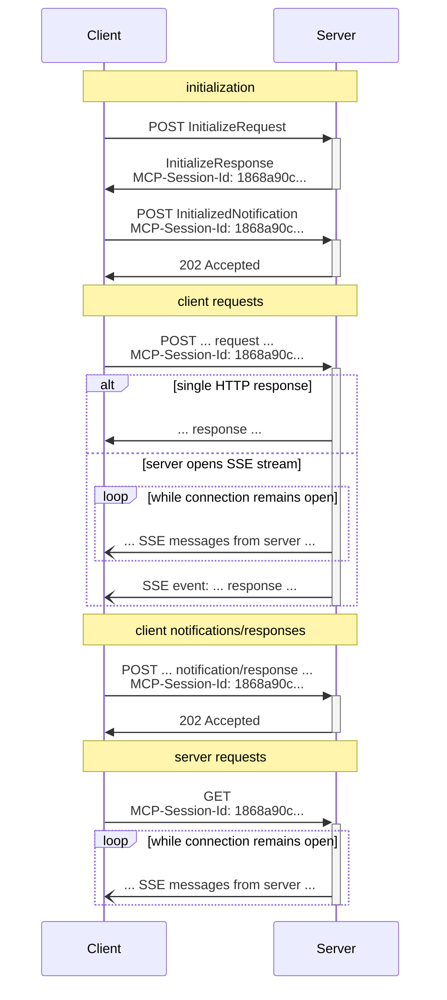
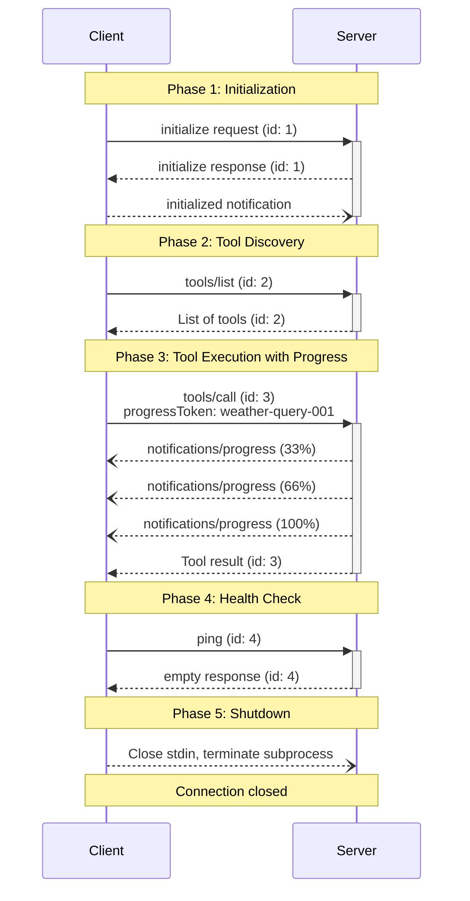

# MCPにおけるJSON-RPC 2.0 技術解説レポート

> **作成日**: 2026-02-07
> **対象読者**: MCPプロトコルの実装者・運用者・技術調査担当者
> **レポート目的**: JSON-RPC 2.0の基本仕様とMCPでの活用方法を包括的に解説

---

## はじめに

本レポートの目的は、**Model Context Protocol (MCP)** におけるJSON-RPC 2.0の役割と使われ方を体系的に解説することです。

**対象読者**:
- MCPサーバー・クライアントの実装者
- MCPプロトコルの運用・管理者
- AI統合システムの技術調査担当者

**本レポートで学べること**:
- JSON-RPC 2.0の基本仕様（リクエスト、レスポンス、通知、エラー、バッチ）
- MCPプロトコルの全体像と3者関係（Host / Client / Server）
- MCP初期化ハンドシェイクとCapabilityネゴシエーション
- MCP固有メソッド（Tools, Resources, Prompts, Logging, Progress等）の詳細
- トランスポート層（stdio, HTTP/SSE）との関係
- MCP固有の拡張（`_meta`, Annotations, ページネーション等）
- 実践例：接続確立からツール実行までの完全フロー

### JSON-RPC 2.0とMCPの関係（概説）

**JSON-RPC 2.0** は、軽量なリモートプロシージャコール（RPC）プロトコルであり、"**It is designed to be simple!**" という設計思想のもと、シンプルさを最優先しています。**トランスポート非依存**で、プロセス内通信・HTTP・WebSocket・ソケット等で利用可能です。

**MCP (Model Context Protocol)** は、AI アプリケーション（Claude, ChatGPT等）を外部システム（データソース、ツール、ワークフロー）に接続するための**オープンソース標準プロトコル**です。MCPは、その基盤プロトコルとして**JSON-RPC 2.0を採用**しています。

MCPがJSON-RPC 2.0を採用した理由：
- **軽量**: シンプルなRPCプロトコル
- **構造化**: 明確なリクエスト/レスポンス形式
- **検査可能**: JSON形式のため、デバッグが容易
- **標準化**: 既存のエコシステムとツールの活用が可能
- **双方向通信**: クライアント→サーバー、サーバー→クライアントの両方向でリクエスト/通知が可能

本レポートでは、JSON-RPC 2.0の基本仕様を理解したうえで、MCPがどのようにこのプロトコルを活用しているかを詳しく解説します。

---

## 1. JSON-RPC 2.0の基本仕様

### 1.1. プロトコルの目的・設計思想

JSON-RPCは**ステートレスで軽量なリモートプロシージャコール(RPC)プロトコル**です。公式仕様では、"**It is designed to be simple!**" と明記されており、**シンプルさを最優先**としています。

**主な特徴：**
- **トランスポート非依存**: プロセス内通信、ソケット、HTTP、WebSocket等で利用可能
- **JSONをデータフォーマット**として採用（軽量で読みやすい）
- **データ構造と処理ルール**を定義する仕様（実装は自由）

### 1.2. バージョン履歴（1.0 → 2.0 の変更点）

JSON-RPC 2.0と1.0の最も重要な区別は、**`"jsonrpc": "2.0"` メンバーの有無**です。

| 項目 | JSON-RPC 1.0 | JSON-RPC 2.0 |
|------|-------------|-------------|
| バージョン識別 | なし | `"jsonrpc": "2.0"` 必須 |
| 通知 | 仕様不明瞭 | `id`なしリクエストで明確化 |
| エラーコード | 未標準化 | 予約済みコード定義 |
| バッチリクエスト | 未定義 | 配列での複数リクエスト対応 |

JSON-RPC 2.0では、**互換性のために`jsonrpc`メンバーを必須**としており、このメンバーがない場合はJSON-RPC 1.0として扱うべきとされています。

### 1.3. リクエストオブジェクト

リクエストオブジェクトは以下のメンバーで構成されます。

| メンバー名 | 型 | 必須 | 説明 |
|-----------|-----|-----|------|
| `jsonrpc` | String | ✓ | プロトコルバージョン（**"2.0"で固定**） |
| `method` | String | ✓ | 呼び出すメソッド名 |
| `params` | Structured | × | パラメータ値（配列またはオブジェクト） |
| `id` | String/Number/Null | × | リクエスト識別子 |

**重要な規則：**
- `method`名は**大文字小文字を区別**
- `rpc.`で始まるメソッド名は**システム拡張予約**（アプリケーションで使用禁止）
- `id`を**省略すると通知（Notification）**となる

#### paramsの型（配列 / オブジェクト）

`params`メンバーは以下の2つの形式を取れます：

1. **配列（位置指定パラメータ）**: `[value1, value2, ...]`
2. **オブジェクト（名前指定パラメータ）**: `{"param_name": value, ...}`

#### idの型と用途（リクエストとレスポンスの対応付け）

`id`メンバーは以下の型を取れます：

- **String**: `"1"`, `"request-123"` 等
- **Number**: `1`, `42` 等
- **Null**: `null`（ただし通知では省略が推奨）

**用途：**
- **リクエストとレスポンスの対応付け**（クライアントが複数リクエストを並行送信する際に識別）
- **レスポンスのid値は必ずリクエストのid値と一致**する

#### リクエストのJSONメッセージ例

**例1: 位置指定パラメータ（配列）**

```json
{
  "jsonrpc": "2.0",
  "method": "subtract",
  "params": [42, 23],
  "id": 1
}
```

**例2: 名前指定パラメータ（オブジェクト）**

```json
{
  "jsonrpc": "2.0",
  "method": "subtract",
  "params": {
    "subtrahend": 23,
    "minuend": 42
  },
  "id": 3
}
```

**例3: パラメータなし**

```json
{
  "jsonrpc": "2.0",
  "method": "get_data",
  "id": 9
}
```

### 1.4. レスポンスオブジェクト

#### 成功時: jsonrpc, result, id

成功時のレスポンスは以下の構造を持ちます：

| メンバー名 | 型 | 必須 | 説明 |
|-----------|-----|-----|------|
| `jsonrpc` | String | ✓ | プロトコルバージョン（"2.0"） |
| `result` | Any | ✓ | メソッドの戻り値（任意の型） |
| `id` | String/Number/Null | ✓ | リクエストと同じID値 |

**例（成功レスポンス）：**

```json
{
  "jsonrpc": "2.0",
  "result": 19,
  "id": 1
}
```

```json
{
  "jsonrpc": "2.0",
  "result": ["hello", 5],
  "id": 9
}
```

#### エラー時: jsonrpc, error, id

エラー時のレスポンスは以下の構造を持ちます：

| メンバー名 | 型 | 必須 | 説明 |
|-----------|-----|-----|------|
| `jsonrpc` | String | ✓ | プロトコルバージョン（"2.0"） |
| `error` | Object | ✓ | エラーオブジェクト（後述） |
| `id` | String/Number/Null | ✓ | リクエストと同じID値（パースエラー時は`null`） |

**例（エラーレスポンス）：**

```json
{
  "jsonrpc": "2.0",
  "error": {
    "code": -32601,
    "message": "Method not found"
  },
  "id": "1"
}
```

#### resultとerrorは排他的であること

**重要な規則：**
- **`result`と`error`の両方が存在してはいけない**
- **どちらか一方のみが存在**する
- 成功時は`result`のみ、エラー時は`error`のみ

この排他性により、レスポンスの解釈が明確になります。

### 1.5. 通知（Notification）

#### リクエストとの違い（idフィールドなし）

通知（Notification）は**`id`メンバーを含まないリクエスト**です。

| 項目 | リクエスト | 通知 |
|------|-----------|------|
| `id`メンバー | 必須 | なし（省略） |
| レスポンス | 返る | **返らない** |
| エラー確認 | 可能 | **不可能** |

#### レスポンスが返らないこと

通知に対してサーバーは**レスポンスを返してはいけません**。これはプロトコルの規則です。

**理由：**
- **Fire-and-forget型の通知**（送りっぱなし）
- **非同期処理**でレスポンス不要な場合
- **パフォーマンス向上**（レスポンス待ちなし）

#### 使い所（Fire-and-forget型の通知）

通知は以下のような用途で使用されます：

- **ログ送信**: サーバーへのログ記録（応答不要）
- **状態更新**: クライアント状態の通知（応答不要）
- **イベント送信**: 非同期イベントの発火（応答不要）

#### 通知のJSONメッセージ例

**例1: パラメータあり通知**

```json
{
  "jsonrpc": "2.0",
  "method": "update",
  "params": [1, 2, 3, 4, 5]
}
```

**例2: パラメータなし通知**

```json
{
  "jsonrpc": "2.0",
  "method": "foobar"
}
```

**例3: 名前指定パラメータの通知**

```json
{
  "jsonrpc": "2.0",
  "method": "notify_hello",
  "params": {
    "message": "Hello, World!"
  }
}
```

### 1.6. エラーオブジェクト

#### 構造: code, message, data

エラーオブジェクトは以下のメンバーで構成されます：

| メンバー | 型 | 必須 | 説明 |
|---------|-----|-----|------|
| `code` | Number | ✓ | エラー型を示す整数 |
| `message` | String | ✓ | 簡潔な説明文 |
| `data` | Primitive/Structured | × | 詳細情報（サーバー定義） |

#### 予約済みエラーコード

JSON-RPC 2.0では以下のエラーコードが予約されています：

| コード | メッセージ | 意味 | 発生条件 |
|-------|----------|------|---------|
| `-32700` | Parse error | 無効なJSON受信 | JSONパース失敗 |
| `-32600` | Invalid Request | 無効なリクエストオブジェクト | リクエスト構造不正 |
| `-32601` | Method not found | メソッド不存在 | 指定メソッドがサーバーに存在しない |
| `-32602` | Invalid params | 無効なパラメータ | パラメータの型や数が不正 |
| `-32603` | Internal error | 内部エラー | サーバー内部エラー |
| `-32000`〜`-32099` | Server error | 実装定義のサーバーエラー | サーバー固有エラー |

#### 各エラーコードの意味と発生条件

**-32700: Parse error**

発生条件: JSONとして正しくパースできないデータを受信した場合

```json
{
  "jsonrpc": "2.0",
  "error": {
    "code": -32700,
    "message": "Parse error"
  },
  "id": null
}
```

**-32600: Invalid Request**

発生条件: リクエストオブジェクトが仕様に準拠していない場合（`jsonrpc`や`method`メンバーがない等）

```json
{
  "jsonrpc": "2.0",
  "error": {
    "code": -32600,
    "message": "Invalid Request"
  },
  "id": null
}
```

**-32601: Method not found**

発生条件: 指定されたメソッド名がサーバーに存在しない場合

```json
{
  "jsonrpc": "2.0",
  "error": {
    "code": -32601,
    "message": "Method not found"
  },
  "id": "5"
}
```

**-32602: Invalid params**

発生条件: パラメータの型、数、構造が不正な場合

```json
{
  "jsonrpc": "2.0",
  "error": {
    "code": -32602,
    "message": "Invalid params",
    "data": "Expected integer parameter, got string"
  },
  "id": 42
}
```

**-32603: Internal error**

発生条件: サーバー内部で予期しないエラーが発生した場合

```json
{
  "jsonrpc": "2.0",
  "error": {
    "code": -32603,
    "message": "Internal error"
  },
  "id": 42
}
```

#### カスタムエラーコードの範囲

アプリケーション固有のエラーコードは以下の範囲で定義可能：

- **`-32000`〜`-32099`**: サーバー定義エラー（予約済み範囲）
- **上記以外の範囲**: アプリケーション独自エラー（推奨: `-32768`〜`-32000`や正の整数）

**例（カスタムエラー）：**

```json
{
  "jsonrpc": "2.0",
  "error": {
    "code": -32050,
    "message": "Database connection failed",
    "data": {
      "db_host": "localhost",
      "db_port": 5432
    }
  },
  "id": 99
}
```

### 1.7. バッチリクエスト

#### 複数リクエストの配列送信

バッチリクエストは**複数のリクエストを配列で送信**する機能です。

**構造：**
```json
[
  { リクエスト1 },
  { リクエスト2 },
  ...
]
```

サーバーは全リクエストを処理した後、**対応するレスポンスの配列**を返します。

#### レスポンスの順序保証（なし）

**重要な規則：**
- **レスポンスの順序は不問**（リクエストの順序と一致する保証なし）
- **クライアントは`id`でリクエストとレスポンスを対応付け**する必要がある

#### バッチ内の通知の扱い

バッチ内に通知（`id`なしリクエスト）が含まれる場合：

- **通知に対するレスポンスは返さない**
- **他のリクエストのレスポンスのみ返す**
- **全て通知の場合、レスポンスなし**

#### バッチメッセージの例

**例1: 混合バッチ（リクエスト + 通知）**

リクエスト：

```json
[
  {"jsonrpc": "2.0", "method": "sum", "params": [1, 2, 4], "id": "1"},
  {"jsonrpc": "2.0", "method": "notify_hello", "params": [7]},
  {"jsonrpc": "2.0", "method": "subtract", "params": [42, 23], "id": "2"},
  {"jsonrpc": "2.0", "method": "foo.get", "params": {"name": "myself"}, "id": "5"},
  {"jsonrpc": "2.0", "method": "get_data", "id": "9"}
]
```

レスポンス：

```json
[
  {"jsonrpc": "2.0", "result": 7, "id": "1"},
  {"jsonrpc": "2.0", "result": 19, "id": "2"},
  {"jsonrpc": "2.0", "error": {"code": -32601, "message": "Method not found"}, "id": "5"},
  {"jsonrpc": "2.0", "result": ["hello", 5], "id": "9"}
]
```

**注目点：**
- 2番目の`notify_hello`（通知）に対するレスポンスはない
- レスポンスの順序はリクエストと異なる可能性がある
- `id: "5"`のリクエストはエラーレスポンスを返している

---

## 2. MCPプロトコル概要

### 2.1. MCPの目的と位置づけ

**MCP (Model Context Protocol)** は、AI アプリケーションを外部システムに接続するためのオープンソース標準プロトコルである。

MCPを使用することで、Claude や ChatGPT のような AI アプリケーションが以下に接続できる：

- **データソース**: ローカルファイル、データベース
- **ツール**: 検索エンジン、計算機
- **ワークフロー**: 特化したプロンプト

MCPは「AIアプリケーション向けのUSB-Cポート」のようなものである。USB-C が電子機器を接続する標準方法を提供するように、MCP は AI アプリケーションを外部システムに接続する標準方法を提供する。

### 2.2. Client / Server / Host の3者関係

MCP はクライアント・サーバーアーキテクチャに従う。

```
┌─────────────────────────────────────┐
│   MCP Host（AIアプリケーション）      │
│   例: Claude Code, Claude Desktop   │
│                                     │
│  ┌────────┐  ┌────────┐  ┌────────┐│
│  │ Client1│  │ Client2│  │ Client3││
│  └───┬────┘  └───┬────┘  └───┬────┘│
└──────┼───────────┼───────────┼──────┘
       │           │           │
       ▼           ▼           ▼
  ┌────────┐  ┌────────┐  ┌────────┐
  │Server A│  │Server B│  │Server C│
  └────────┘  └────────┘  └────────┘
   (Local)     (Local)     (Remote)
```

**3者の役割**:

1. **MCP Host**: 複数のMCP Clientを調整・管理するAIアプリケーション
2. **MCP Client**: MCP Serverへの接続を維持し、Hostのためにコンテキストを取得するコンポーネント
3. **MCP Server**: MCP Clientにコンテキストを提供するプログラム（ローカル/リモート問わず）

**重要な点**:

- ローカルサーバー（stdioトランスポート）は通常1つのクライアントに対応
- リモートサーバー（Streamable HTTPトランスポート）は複数のクライアントに対応可能

### 2.3. JSON-RPC 2.0を採用した理由

MCP は **[JSON-RPC 2.0](https://www.jsonrpc.org/)** を基盤プロトコルとして採用している。

**採用理由**:

1. **軽量**: シンプルなリモートプロシージャコール（RPC）プロトコル
2. **構造化**: 明確なリクエスト/レスポンス形式
3. **検査可能**: JSON形式のため、デバッグが容易
4. **標準化**: 既存のエコシステムとツールの活用が可能
5. **双方向通信**: クライアント→サーバー、サーバー→クライアントの両方向でリクエスト/通知が可能

---

## 3. MCP初期化ハンドシェイク

MCP は厳格なライフサイクルを定義しており、接続確立時に3ステップの初期化ハンドシェイクを実行する。

### 3.1. 初期化フェーズの目的

1. **プロトコルバージョンの互換性確認**
2. **Capabilityのネゴシエーション**（どの機能を使えるか）
3. **実装情報の交換**

### 3.2. Step 1: initialize リクエスト（Client → Server）

クライアントが接続を開始し、サポートする機能を宣言する。

**リクエスト例**:

```json
{
  "jsonrpc": "2.0",
  "id": 1,
  "method": "initialize",
  "params": {
    "protocolVersion": "2025-11-25",
    "capabilities": {
      "roots": {
        "listChanged": true
      },
      "sampling": {},
      "elicitation": {
        "form": {},
        "url": {}
      }
    },
    "clientInfo": {
      "name": "ExampleClient",
      "title": "Example Client Display Name",
      "version": "1.0.0",
      "description": "An example MCP client application",
      "icons": [
        {
          "src": "https://example.com/icon.png",
          "mimeType": "image/png",
          "sizes": ["48x48"]
        }
      ],
      "websiteUrl": "https://example.com"
    }
  }
}
```

**フィールド説明**:

- `protocolVersion`: サポートするMCPプロトコルバージョン（クライアントがサポートする最新版を指定すべき）
- `capabilities`: クライアントがサポートする機能
  - `roots`: ファイルシステムルートを提供可能
  - `sampling`: LLMサンプリングリクエストをサポート
  - `elicitation`: サーバーからのユーザー入力要求をサポート
- `clientInfo`: クライアントの識別情報

### 3.3. Step 2: initialize レスポンス（Server → Client）

サーバーが自身のCapabilityと情報を返す。

**レスポンス例**:

```json
{
  "jsonrpc": "2.0",
  "id": 1,
  "result": {
    "protocolVersion": "2025-11-25",
    "capabilities": {
      "logging": {},
      "prompts": {
        "listChanged": true
      },
      "resources": {
        "subscribe": true,
        "listChanged": true
      },
      "tools": {
        "listChanged": true
      }
    },
    "serverInfo": {
      "name": "ExampleServer",
      "title": "Example Server Display Name",
      "version": "1.0.0",
      "description": "An example MCP server providing tools and resources",
      "icons": [
        {
          "src": "https://example.com/server-icon.svg",
          "mimeType": "image/svg+xml",
          "sizes": ["any"]
        }
      ],
      "websiteUrl": "https://example.com/server"
    },
    "instructions": "Optional instructions for the client"
  }
}
```

**フィールド説明**:

- `protocolVersion`: サーバーがサポートするプロトコルバージョン
  - クライアントのバージョンをサポートする場合は同じバージョンを返す
  - サポートしない場合は別のバージョン（サーバーがサポートする最新版）を返す
- `capabilities`: サーバーがサポートする機能
  - `logging`: ログメッセージを送信可能
  - `prompts`: プロンプトテンプレートを提供（`listChanged` はリスト変更通知をサポート）
  - `resources`: リソースを提供（`subscribe` は個別リソースの変更監視、`listChanged` はリスト変更通知）
  - `tools`: ツールを公開（`listChanged` はツールリスト変更通知）
- `instructions`: クライアント向けのオプション指示

### 3.4. Step 3: initialized 通知（Client → Server）

初期化成功を通知し、通常の操作フェーズに移行する準備完了を示す。

**通知例**:

```json
{
  "jsonrpc": "2.0",
  "method": "notifications/initialized"
}
```

**重要な点**:

- `id` フィールドがない → JSON-RPC 2.0の「通知（notification）」形式
- 通知はレスポンスを期待しない（fire-and-forget）
- この通知を送信後、クライアントは通常のリクエストを開始できる

### 3.5. capabilities ネゴシエーションの仕組み

**主要なCapability一覧**:

| カテゴリ | Capability | 説明 |
|---------|-----------|------|
| Client | `roots` | ファイルシステムルートの提供 |
| Client | `sampling` | LLMサンプリングリクエストのサポート |
| Client | `elicitation` | サーバーからのユーザー入力要求サポート |
| Server | `prompts` | プロンプトテンプレートの提供 |
| Server | `resources` | リソースの提供 |
| Server | `tools` | ツールの公開 |
| Server | `logging` | ログメッセージの送信 |
| Server | `completions` | 引数のオートコンプリート |

**サブCapability**:

- `listChanged`: リスト変更通知のサポート（`prompts`, `resources`, `tools`）
- `subscribe`: 個別アイテムの変更監視のサポート（`resources` のみ）

### 3.6. 初期化フローのMermaid図



---

## 4. MCP固有メソッド詳解

以下、MCPが定義するJSON-RPCメソッドを、機能カテゴリごとに整理する。

### 4.1. Tools（ツール）

ツールは、AIアプリケーションが実行可能な関数を表す。

#### tools/list: ツール一覧取得

**リクエスト**:

```json
{
  "jsonrpc": "2.0",
  "id": 2,
  "method": "tools/list"
}
```

**レスポンス**:

```json
{
  "jsonrpc": "2.0",
  "id": 2,
  "result": {
    "tools": [
      {
        "name": "calculator_arithmetic",
        "title": "Calculator",
        "description": "Perform mathematical calculations including basic arithmetic, trigonometric functions, and algebraic operations",
        "inputSchema": {
          "type": "object",
          "properties": {
            "expression": {
              "type": "string",
              "description": "Mathematical expression to evaluate (e.g., '2 + 3 * 4', 'sin(30)', 'sqrt(16)')"
            }
          },
          "required": ["expression"]
        }
      },
      {
        "name": "weather_current",
        "title": "Weather Information",
        "description": "Get current weather information for any location worldwide",
        "inputSchema": {
          "type": "object",
          "properties": {
            "location": {
              "type": "string",
              "description": "City name, address, or coordinates (latitude,longitude)"
            },
            "units": {
              "type": "string",
              "enum": ["metric", "imperial", "kelvin"],
              "description": "Temperature units to use in response",
              "default": "metric"
            }
          },
          "required": ["location"]
        }
      }
    ]
  }
}
```

**フィールド説明**:

- `name`: ツールの一意な識別子（ツール実行時に使用）
- `title`: 人間可読なツール名（UI表示用）
- `description`: ツールの詳細説明
- `inputSchema`: [JSON Schema](https://json-schema.org/) によるパラメータ定義

#### tools/call: ツール実行

**リクエスト**:

```json
{
  "jsonrpc": "2.0",
  "id": 3,
  "method": "tools/call",
  "params": {
    "name": "weather_current",
    "arguments": {
      "location": "San Francisco",
      "units": "imperial"
    }
  }
}
```

**レスポンス**:

```json
{
  "jsonrpc": "2.0",
  "id": 3,
  "result": {
    "content": [
      {
        "type": "text",
        "text": "Current weather in San Francisco: 68°F, partly cloudy with light winds from the west at 8 mph. Humidity: 65%"
      }
    ]
  }
}
```

**フィールド説明**:

- `name`: `tools/list` で取得したツール名
- `arguments`: `inputSchema` で定義されたパラメータ
- `content`: レスポンスコンテンツの配列（text, image, resource等の複数タイプ可能）

#### notifications/tools/list_changed: ツールリスト変更通知

サーバーのツールリストが変更された際に送信される通知。

**通知例**:

```json
{
  "jsonrpc": "2.0",
  "method": "notifications/tools/list_changed"
}
```

クライアントはこの通知を受け取ると、`tools/list` を再度実行してリストを更新する。

### 4.2. Resources（リソース）

リソースは、コンテキスト情報を提供するデータソース（ファイル、DB、API等）を表す。

#### resources/list: リソース一覧取得

**リクエスト**:

```json
{
  "jsonrpc": "2.0",
  "id": 1,
  "method": "resources/list",
  "params": {
    "cursor": "optional-cursor-value"
  }
}
```

**レスポンス**:

```json
{
  "jsonrpc": "2.0",
  "id": 1,
  "result": {
    "resources": [
      {
        "uri": "file:///project/src/main.rs",
        "name": "main.rs",
        "title": "Rust Software Application Main File",
        "description": "Primary application entry point",
        "mimeType": "text/x-rust",
        "icons": [
          {
            "src": "https://example.com/rust-file-icon.png",
            "mimeType": "image/png",
            "sizes": ["48x48"]
          }
        ]
      }
    ],
    "nextCursor": "next-page-cursor"
  }
}
```

**フィールド説明**:

- `uri`: リソースの一意な識別子（[RFC 3986](https://datatracker.ietf.org/doc/html/rfc3986) に準拠）
- `name`: リソース名
- `title`: 人間可読な表示名
- `mimeType`: MIMEタイプ
- `cursor` / `nextCursor`: ページネーションサポート

#### resources/read: リソース読み取り

**リクエスト**:

```json
{
  "jsonrpc": "2.0",
  "id": 2,
  "method": "resources/read",
  "params": {
    "uri": "file:///project/src/main.rs"
  }
}
```

**レスポンス**:

```json
{
  "jsonrpc": "2.0",
  "id": 2,
  "result": {
    "contents": [
      {
        "uri": "file:///project/src/main.rs",
        "mimeType": "text/x-rust",
        "text": "fn main() {\n    println!(\"Hello world!\");\n}"
      }
    ]
  }
}
```

**コンテンツ形式**:

- **テキスト**: `{ "type": "text", "text": "..." }`
- **バイナリ**: `{ "type": "blob", "data": "base64-encoded-data", "mimeType": "..." }`

#### resources/subscribe: リソース変更監視

**リクエスト**:

```json
{
  "jsonrpc": "2.0",
  "id": 4,
  "method": "resources/subscribe",
  "params": {
    "uri": "file:///project/src/main.rs"
  }
}
```

#### notifications/resources/updated: リソース更新通知

```json
{
  "jsonrpc": "2.0",
  "method": "notifications/resources/updated",
  "params": {
    "uri": "file:///project/src/main.rs"
  }
}
```

### 4.3. Prompts（プロンプト）

プロンプトは、言語モデルとのインタラクションを構造化する再利用可能なテンプレートを表す。

#### prompts/list: プロンプト一覧取得

**リクエスト**:

```json
{
  "jsonrpc": "2.0",
  "id": 1,
  "method": "prompts/list",
  "params": {
    "cursor": "optional-cursor-value"
  }
}
```

**レスポンス**:

```json
{
  "jsonrpc": "2.0",
  "id": 1,
  "result": {
    "prompts": [
      {
        "name": "code_review",
        "title": "Request Code Review",
        "description": "Asks the LLM to analyze code quality and suggest improvements",
        "arguments": [
          {
            "name": "code",
            "description": "The code to review",
            "required": true
          }
        ],
        "icons": [
          {
            "src": "https://example.com/review-icon.svg",
            "mimeType": "image/svg+xml",
            "sizes": ["any"]
          }
        ]
      }
    ],
    "nextCursor": "next-page-cursor"
  }
}
```

**フィールド説明**:

- `arguments`: プロンプトをカスタマイズするための引数リスト
  - `name`: 引数名
  - `description`: 引数の説明
  - `required`: 必須かどうか

#### prompts/get: プロンプト取得

**リクエスト**:

```json
{
  "jsonrpc": "2.0",
  "id": 2,
  "method": "prompts/get",
  "params": {
    "name": "code_review",
    "arguments": {
      "code": "def hello():\n    print('world')"
    }
  }
}
```

**レスポンス**:

```json
{
  "jsonrpc": "2.0",
  "id": 2,
  "result": {
    "description": "Code review prompt",
    "messages": [
      {
        "role": "user",
        "content": {
          "type": "text",
          "text": "Please review this Python code:\ndef hello():\n    print('world')"
        }
      }
    ]
  }
}
```

**メッセージコンテンツタイプ**:

- **text**: `{ "type": "text", "text": "..." }`
- **image**: `{ "type": "image", "data": "base64...", "mimeType": "image/png" }`
- **audio**: `{ "type": "audio", "data": "base64...", "mimeType": "audio/wav" }`
- **embedded resource**: `{ "type": "resource", "resource": {...} }`

### 4.4. Completion（オートコンプリート）

プロンプトやリソーステンプレートの引数入力を補完する機能。

#### completion/complete: 補完候補取得

**リクエスト**（プロンプト引数の補完）:

```json
{
  "jsonrpc": "2.0",
  "id": 1,
  "method": "completion/complete",
  "params": {
    "ref": {
      "type": "ref/prompt",
      "name": "code_review"
    },
    "argument": {
      "name": "language",
      "value": "py"
    }
  }
}
```

**レスポンス**:

```json
{
  "jsonrpc": "2.0",
  "id": 1,
  "result": {
    "completion": {
      "values": ["python", "pytorch", "pyside"],
      "total": 10,
      "hasMore": true
    }
  }
}
```

### 4.5. Sampling（LLMサンプリング）

サーバーがクライアントのLLMにアクセスし、生成を依頼する機能。

#### sampling/createMessage: メッセージ生成

**リクエスト**:

```json
{
  "jsonrpc": "2.0",
  "id": 1,
  "method": "sampling/createMessage",
  "params": {
    "messages": [
      {
        "role": "user",
        "content": {
          "type": "text",
          "text": "What is the capital of France?"
        }
      }
    ],
    "modelPreferences": {
      "hints": [
        {
          "name": "claude-3-sonnet"
        }
      ],
      "intelligencePriority": 0.8,
      "speedPriority": 0.5,
      "costPriority": 0.3
    },
    "systemPrompt": "You are a helpful assistant.",
    "maxTokens": 100
  }
}
```

**レスポンス**:

```json
{
  "jsonrpc": "2.0",
  "id": 1,
  "result": {
    "role": "assistant",
    "content": {
      "type": "text",
      "text": "The capital of France is Paris."
    },
    "model": "claude-3-sonnet-20240307",
    "stopReason": "endTurn"
  }
}
```

**モデルプリファレンス**:

- `hints`: 優先するモデルのヒント（サブストリング一致、複数指定可能）
- `costPriority`: コスト優先度（0-1）
- `speedPriority`: 速度優先度（0-1）
- `intelligencePriority`: 高度な能力の優先度（0-1）

### 4.6. Logging（ログ送信）

サーバーがクライアントにログメッセージを送信する機能。

#### logging/setLevel: ログレベル設定

**リクエスト**:

```json
{
  "jsonrpc": "2.0",
  "id": 1,
  "method": "logging/setLevel",
  "params": {
    "level": "info"
  }
}
```

**レスポンス**:

```json
{
  "jsonrpc": "2.0",
  "id": 1,
  "result": {}
}
```

**ログレベル** ([RFC 5424](https://datatracker.ietf.org/doc/html/rfc5424#section-6.2.1) Syslog準拠):

| レベル | 説明 | 用途例 |
|-------|------|--------|
| `debug` | 詳細なデバッグ情報 | 関数の出入口 |
| `info` | 一般的な情報メッセージ | 操作進捗の更新 |
| `notice` | 通常だが重要なイベント | 設定変更 |
| `warning` | 警告条件 | 非推奨機能の使用 |
| `error` | エラー条件 | 操作失敗 |
| `critical` | 重大な状態 | システムコンポーネントの障害 |
| `alert` | 即座に対処が必要 | データ破損検出 |
| `emergency` | システムが使用不可能 | システム全体の障害 |

#### notifications/message: ログメッセージ通知

```json
{
  "jsonrpc": "2.0",
  "method": "notifications/message",
  "params": {
    "level": "error",
    "logger": "database",
    "data": {
      "error": "Connection failed",
      "details": {
        "host": "localhost",
        "port": 5432
      }
    }
  }
}
```

### 4.7. Progress（進捗通知）

長時間実行される操作の進捗をリアルタイムで通知する機能。

#### プログレストークンの使い方

リクエスト側が `_meta.progressToken` を含めると、進捗通知を受け取れる。

**リクエスト例**:

```json
{
  "jsonrpc": "2.0",
  "id": 1,
  "method": "some_method",
  "params": {
    "_meta": {
      "progressToken": "abc123"
    }
  }
}
```

#### notifications/progress: 進捗通知

```json
{
  "jsonrpc": "2.0",
  "method": "notifications/progress",
  "params": {
    "progressToken": "abc123",
    "progress": 50,
    "total": 100,
    "message": "Reticulating splines..."
  }
}
```

**フィールド説明**:

- `progressToken`: リクエストで指定されたトークン
- `progress`: 現在の進捗値（増加する必要がある）
- `total`: 総作業量（不明な場合は省略可能）
- `message`: 人間可読な進捗メッセージ

### 4.8. Cancellation（キャンセル通知）

実行中のリクエストをキャンセルする機能。

#### notifications/cancelled: キャンセル通知

```json
{
  "jsonrpc": "2.0",
  "method": "notifications/cancelled",
  "params": {
    "requestId": "123",
    "reason": "User requested cancellation"
  }
}
```

**動作**:

- 送信側がリクエストをキャンセルしたい場合に送信
- 受信側は処理を停止し、リソースを解放すべき
- レースコンディションを考慮し、受信側は既に完了している場合は無視してよい
- キャンセル通知を受けたリクエストにはレスポンスを返さない

### 4.9. Ping（死活確認）

接続が生きているか確認する機能。

#### ping: Pingリクエスト

**リクエスト**:

```json
{
  "jsonrpc": "2.0",
  "id": "123",
  "method": "ping"
}
```

**レスポンス**:

```json
{
  "jsonrpc": "2.0",
  "id": "123",
  "result": {}
}
```

**用途**:

- 定期的にPingを送信して接続の健全性を確認
- タイムアウトした場合は接続が切れたとみなし、再接続を試みる

---

## 5. トランスポート層との関係

MCPは2つの標準トランスポートを定義している。JSON-RPCメッセージはトランスポート層で運ばれるが、メッセージ形式はトランスポートに依存しない。

### 5.1. stdio トランスポート

**概要**:

- クライアントがサーバーをサブプロセスとして起動
- 標準入力（stdin）でJSON-RPCメッセージを送信
- 標準出力（stdout）でJSON-RPCメッセージを受信
- 標準エラー出力（stderr）はログ用途

**メッセージフォーマット**:

- **改行区切り**: 各メッセージは改行で区切られる
- **埋め込み改行禁止**: メッセージ内に改行を含めてはならない
- **UTF-8エンコード**: 全てのメッセージはUTF-8

**フロー図**:



**特徴**:

- **ローカル通信専用**: 同一マシン上のプロセス間通信
- **ネットワークオーバーヘッドなし**: 高速・低レイテンシ
- **1対1接続**: 1つのサーバープロセスが1つのクライアントに対応

**シャットダウン手順**:

1. クライアントがサーバーのstdinをクローズ
2. サーバーが終了するのを待つ
3. 終了しない場合はSIGTERMを送信
4. それでも終了しない場合はSIGKILLを送信

### 5.2. Streamable HTTP トランスポート

**概要**:

- サーバーが独立したプロセスとして動作し、複数のクライアントに対応
- HTTP POSTとGETリクエストを使用
- オプションで[Server-Sent Events (SSE)](https://en.wikipedia.org/wiki/Server-sent_events) によるストリーミングをサポート

**エンドポイント**:

- サーバーは単一の「MCPエンドポイント」を提供（例: `https://example.com/mcp`）
- POSTとGETの両方をサポート

**セキュリティ警告**:

1. **DNSリバインディング攻撃対策**: `Origin` ヘッダーの検証必須
2. **ローカルサーバー**: `127.0.0.1` にバインドし、全インターフェース（`0.0.0.0`）にバインドしない
3. **認証**: 全ての接続に適切な認証を実装すべき

#### クライアント→サーバー（HTTP POST）

**リクエスト**:

- HTTP POSTでJSON-RPCメッセージを送信
- `Accept` ヘッダーに `application/json` と `text/event-stream` を含める
- ボディは単一のJSON-RPCリクエスト/通知/レスポンス

**レスポンス**:

- **通知・レスポンスの場合**: HTTP 202 Accepted（ボディなし）
- **リクエストの場合**:
  - `Content-Type: application/json` → 単一のJSONオブジェクト
  - `Content-Type: text/event-stream` → SSEストリーム開始

#### サーバー→クライアント（Server-Sent Events）

**概要**:

- クライアントがHTTP GETでMCPエンドポイントに接続
- サーバーがSSEストリームを返す
- サーバーからのリクエスト・通知がSSEイベントとして送信される

**SSEストリームの特徴**:

- **ポーリング**: サーバーは接続を閉じ、クライアントが再接続（`Last-Event-ID` ヘッダー付き）
- **resume可能**: イベントIDを使って、切断後に再開可能
- **retry フィールド**: サーバーが推奨する再接続待機時間を指定

#### セッション管理

**セッションID**:

- サーバーは初期化レスポンスで `MCP-Session-Id` ヘッダーを返す
- クライアントは以降の全てのリクエストにこのヘッダーを含める
- セッションIDは暗号学的に安全で一意な値（UUID, JWT, ハッシュ等）

**セッション終了**:

- サーバーは任意のタイミングでセッションを終了可能
- 終了後のリクエストには HTTP 404 Not Found を返す
- クライアントは404を受け取ると新しいセッションを開始

#### プロトコルバージョンヘッダー

全てのHTTPリクエストに `MCP-Protocol-Version` ヘッダーを含める必要がある。

```
MCP-Protocol-Version: 2025-11-25
```

- 初期化時にネゴシエーションされたバージョンを使用
- ヘッダーがない場合はデフォルトで `2025-03-26` とみなされる
- 無効なバージョンの場合は HTTP 400 Bad Request

#### HTTP/SSEフロー図



### 5.3. トランスポート比較

| 項目 | stdio | Streamable HTTP |
|------|-------|-----------------|
| **用途** | ローカルプロセス間通信 | リモート通信、複数クライアント対応 |
| **メッセージ区切り** | 改行 | HTTPリクエスト単位 |
| **双方向通信** | stdin/stdout | HTTP POST + SSE |
| **認証** | 不要（同一マシン） | 必須（Bearer token, API key等） |
| **セッション管理** | なし | `MCP-Session-Id` ヘッダー |
| **resume可能性** | なし | SSEイベントIDで可能 |
| **接続数** | 1対1 | 1対多 |

### 5.4. 各トランスポートでJSON-RPCがどう流れるか

#### stdio トランスポートの場合

1. クライアントがサーバープロセスを起動
2. クライアントがJSON-RPCリクエストをstdinに書き込み（改行で終端）
3. サーバーがstdinから1行読み取り、JSONとしてパース
4. サーバーがJSON-RPCレスポンスをstdoutに書き込み（改行で終端）
5. クライアントがstdoutから1行読み取り、JSONとしてパース

#### HTTP トランスポートの場合

1. クライアントがHTTP POSTでJSON-RPCリクエストを送信
   - ボディ: JSON-RPCメッセージ（改行不要）
   - Content-Type: `application/json`
2. サーバーがHTTPボディをパース
3. サーバーがHTTPレスポンスでJSON-RPCレスポンスを返す
   - ボディ: JSON-RPCメッセージ
   - Content-Type: `application/json` または `text/event-stream`
4. クライアントがHTTPボディをパース

---

## 6. MCP固有の拡張

### 6.1. JSON-RPC 2.0標準との差分

MCP は JSON-RPC 2.0 を厳密に遵守しているが、以下の追加仕様がある。

#### _metaフィールド（progressToken等）

リクエストの `params` 内に `_meta` フィールドを追加可能。

**用途**:

- `progressToken`: 進捗通知を受け取るためのトークン

**例**:

```json
{
  "jsonrpc": "2.0",
  "id": 1,
  "method": "some_method",
  "params": {
    "_meta": {
      "progressToken": "abc123"
    },
    "arg1": "value1"
  }
}
```

#### 通知の使用パターン

JSON-RPC 2.0の通知（`id` フィールドなし）を積極的に活用：

- `notifications/initialized`
- `notifications/tools/list_changed`
- `notifications/resources/list_changed`
- `notifications/resources/updated`
- `notifications/prompts/list_changed`
- `notifications/message`
- `notifications/progress`
- `notifications/cancelled`

#### HTTP使用時の追加要件

- `MCP-Protocol-Version` ヘッダー必須
- `MCP-Session-Id` ヘッダー（セッション管理時）
- `Origin` ヘッダーの検証（セキュリティ）

### 6.2. annotations（audience, priority等）

Resources, Resource templates, Content blocksに対して、オプションのアノテーションを付与可能。

**アノテーション種類**:

- `audience`: 対象読者（`["user"]`, `["assistant"]`, `["user", "assistant"]`）
- `priority`: 重要度（0.0〜1.0、1.0が最重要）
- `lastModified`: 最終更新日時（ISO 8601形式、例: `"2025-01-12T15:00:58Z"`）

**例**:

```json
{
  "uri": "file:///project/README.md",
  "name": "README.md",
  "title": "Project Documentation",
  "mimeType": "text/markdown",
  "annotations": {
    "audience": ["user"],
    "priority": 0.8,
    "lastModified": "2025-01-12T15:00:58Z"
  }
}
```

**用途**:

- クライアントは `audience` でリソースをフィルタ可能
- `priority` でコンテキストに含めるリソースの優先順位を決定
- `lastModified` で更新日時を表示・ソート

### 6.3. MCP固有エラーコード

MCP は JSON-RPC 2.0 標準のエラーコード（-32768 〜 -32000）を継承し、以下を定義している：

#### 標準JSON-RPCエラーコード

| コード | 名称 | 説明 |
|--------|------|------|
| `-32700` | Parse error | 無効なJSON |
| `-32600` | Invalid Request | JSON-RPCリクエストオブジェクトとして無効 |
| `-32601` | Method not found | メソッドが存在しない/利用不可 |
| `-32602` | Invalid params | 無効なパラメータ |
| `-32603` | Internal error | 内部JSON-RPCエラー |

#### MCP固有エラーコード

| コード | 名称 | 説明 |
|--------|------|------|
| `-32000` 〜 `-32099` | Server errors | 実装定義のサーバーエラー |
| `-32800` | Request cancelled | リクエストがキャンセルされた |
| `-32801` | Content too large | コンテンツが大きすぎる |
| `-32002` | Resource not found | リソースが見つからない（resources/read） |

#### エラーレスポンス形式

```json
{
  "jsonrpc": "2.0",
  "id": 1,
  "error": {
    "code": -32602,
    "message": "Unsupported protocol version",
    "data": {
      "supported": ["2024-11-05"],
      "requested": "1.0.0"
    }
  }
}
```

### 6.4. ページネーション

`tools/list`, `resources/list`, `prompts/list` はページネーションをサポートする。

**仕組み**:

- リクエストに `cursor` パラメータを含めることで、次のページを取得
- レスポンスに `nextCursor` が含まれる場合、さらにページが存在する

**例**:

```json
{
  "jsonrpc": "2.0",
  "id": 1,
  "method": "resources/list",
  "params": {
    "cursor": "page2-cursor"
  }
}
```

```json
{
  "jsonrpc": "2.0",
  "id": 1,
  "result": {
    "resources": [...],
    "nextCursor": "page3-cursor"
  }
}
```

---

## 7. 実践例：ツール呼び出しの完全フロー

本章では、MCP接続の確立からツール実行までの**一連のJSON-RPCメッセージを時系列で全て**記載する。

### 7.1. シナリオ

- クライアント（Claude Code）がローカルMCPサーバー（天気情報サーバー）に接続
- 天気ツールを呼び出して、サンフランシスコの天気を取得
- 進捗通知を受け取りながらツールを実行

### 7.2. メッセージシーケンス

#### Step 1: クライアントがサーバープロセスを起動（stdioトランスポート）

```bash
$ /path/to/weather-mcp-server
```

#### Step 2: 初期化リクエスト（Client → Server）

```json
{
  "jsonrpc": "2.0",
  "id": 1,
  "method": "initialize",
  "params": {
    "protocolVersion": "2025-11-25",
    "capabilities": {
      "sampling": {}
    },
    "clientInfo": {
      "name": "ClaudeCode",
      "version": "1.0.0"
    }
  }
}
```

#### Step 3: 初期化レスポンス（Server → Client）

```json
{
  "jsonrpc": "2.0",
  "id": 1,
  "result": {
    "protocolVersion": "2025-11-25",
    "capabilities": {
      "tools": {
        "listChanged": true
      }
    },
    "serverInfo": {
      "name": "WeatherMCPServer",
      "version": "1.0.0"
    }
  }
}
```

#### Step 4: 初期化完了通知（Client → Server）

```json
{
  "jsonrpc": "2.0",
  "method": "notifications/initialized"
}
```

#### Step 5: ツール一覧取得リクエスト（Client → Server）

```json
{
  "jsonrpc": "2.0",
  "id": 2,
  "method": "tools/list"
}
```

#### Step 6: ツール一覧レスポンス（Server → Client）

```json
{
  "jsonrpc": "2.0",
  "id": 2,
  "result": {
    "tools": [
      {
        "name": "get_weather",
        "description": "Get current weather for a location",
        "inputSchema": {
          "type": "object",
          "properties": {
            "location": {
              "type": "string",
              "description": "City name or coordinates"
            },
            "units": {
              "type": "string",
              "enum": ["celsius", "fahrenheit"],
              "default": "celsius"
            }
          },
          "required": ["location"]
        }
      }
    ]
  }
}
```

#### Step 7: ツール実行リクエスト（Client → Server）

```json
{
  "jsonrpc": "2.0",
  "id": 3,
  "method": "tools/call",
  "params": {
    "name": "get_weather",
    "arguments": {
      "location": "San Francisco",
      "units": "fahrenheit"
    },
    "_meta": {
      "progressToken": "weather-query-001"
    }
  }
}
```

#### Step 8: 進捗通知1（Server → Client）

```json
{
  "jsonrpc": "2.0",
  "method": "notifications/progress",
  "params": {
    "progressToken": "weather-query-001",
    "progress": 33,
    "total": 100,
    "message": "Connecting to weather API..."
  }
}
```

#### Step 9: 進捗通知2（Server → Client）

```json
{
  "jsonrpc": "2.0",
  "method": "notifications/progress",
  "params": {
    "progressToken": "weather-query-001",
    "progress": 66,
    "total": 100,
    "message": "Fetching weather data..."
  }
}
```

#### Step 10: 進捗通知3（Server → Client）

```json
{
  "jsonrpc": "2.0",
  "method": "notifications/progress",
  "params": {
    "progressToken": "weather-query-001",
    "progress": 100,
    "total": 100,
    "message": "Processing results..."
  }
}
```

#### Step 11: ツール実行レスポンス（Server → Client）

```json
{
  "jsonrpc": "2.0",
  "id": 3,
  "result": {
    "content": [
      {
        "type": "text",
        "text": "Current weather in San Francisco:\n- Temperature: 68°F\n- Conditions: Partly cloudy\n- Wind: 8 mph from west\n- Humidity: 65%"
      }
    ]
  }
}
```

#### Step 12: Pingリクエスト（Client → Server）

```json
{
  "jsonrpc": "2.0",
  "id": 4,
  "method": "ping"
}
```

#### Step 13: Pingレスポンス（Server → Client）

```json
{
  "jsonrpc": "2.0",
  "id": 4,
  "result": {}
}
```

#### Step 14: シャットダウン（Client）

クライアントがサーバーのstdinをクローズし、サーバープロセスを終了させる。

### 7.3. 完全フローのMermaid図



### 7.4. フローの解説

1. **初期化フェーズ**: クライアントとサーバーがプロトコルバージョンとCapabilityを確認
2. **ツール発見**: クライアントが利用可能なツールを取得
3. **ツール実行**: クライアントがツールを実行し、進捗通知を受け取りながら結果を取得
4. **ヘルスチェック**: Pingで接続の健全性を確認
5. **シャットダウン**: クライアントが接続を閉じる

このフローは、MCPにおけるJSON-RPC 2.0の典型的な使用例であり、以下の特徴を示している：

- **リクエスト/レスポンス**: `id`フィールドによる対応付け
- **通知**: `notifications/progress` は `id` なしで送信され、レスポンス不要
- **メタデータ**: `_meta.progressToken` でMCP固有の拡張を活用
- **双方向通信**: クライアントとサーバーの両方がリクエスト/通知を送信可能

---

## まとめ

### JSON-RPC 2.0がMCPにもたらす利点

JSON-RPC 2.0は、MCPプロトコルの全てのメッセージ交換の基盤として、以下の利点をもたらしている：

1. **シンプルさ**: 4つのメンバー（`jsonrpc`, `method`, `params`, `id`）のみで構成されるシンプルな構造
2. **柔軟性**: トランスポート非依存で、stdio/HTTP/SSE等で同一メッセージ形式を使用可能
3. **拡張性**: MCP固有の機能（`_meta`, Annotations, エラーコード等）を追加しつつ、JSON-RPC 2.0仕様に準拠
4. **検査可能性**: JSON形式のため、ログ・デバッグが容易
5. **標準化**: JSON-RPC 2.0のツール・ライブラリが活用可能

### MCPの技術的特徴

MCPは、JSON-RPC 2.0を基盤として、以下の独自機能を実現している：

- **Capability Negotiation**: 初期化時に機能を相互に確認し、互換性を保証
- **3つのプリミティブ**: Tools, Resources, Prompts という主要な抽象化
- **リアルタイム更新**: `list_changed`, `updated` 等の通知による動的な同期
- **Progress & Cancellation**: 長時間実行される操作の制御
- **Transport Layer**: stdio（ローカル）とStreamable HTTP（リモート）の2つの標準トランスポート

### 今後の展望

MCPとJSON-RPC 2.0の組み合わせは、以下のような発展が期待される：

1. **エコシステムの拡大**: 様々なMCPサーバー（データソース、ツール、API等）の増加
2. **複数トランスポートのサポート**: WebSocket、gRPC等の新しいトランスポート層の追加
3. **セキュリティ強化**: 認証・認可メカニズムの標準化
4. **パフォーマンス最適化**: バッチリクエスト、キャッシング等の活用
5. **AI統合の深化**: より高度なContext管理とLLMサンプリングパターンの確立

MCPは「AIアプリケーション向けのUSB-Cポート」として、AI統合の標準プロトコルとなる可能性を秘めており、JSON-RPC 2.0の軽量性・柔軟性がその実現を支えている。

---

**レポート終わり**
