# RAGとMCPの関連性分析 — Nablarchユースケース分析レポート

> **作成日**: 2026-02-01
> **タスクID**: subtask_028 (parent: cmd_013)
> **作成者**: ashigaru8（戦略アナリスト / ソリューションアーキテクト ペルソナ）
> **プロジェクト**: nablarch_strategy
> **ステータス**: 完了

---

## 目次

1. [エグゼクティブサマリ](#1-エグゼクティブサマリ)
2. [RAGとMCPの基礎概念と関係性](#2-ragとmcpの基礎概念と関係性)
3. [3パターン比較](#3-3パターン比較)
4. [Nablarchユースケース分析](#4-nablarchユースケース分析)
5. [推奨アーキテクチャ](#5-推奨アーキテクチャ)
6. [参考情報](#6-参考情報)

---

## 1. エグゼクティブサマリ

### 結論

**RAGとMCPは代替関係ではなく、補完関係にある。** Nablarch開発支援においては、両者を統合した「RAG-enhanced MCP」アーキテクチャが最大の効果を発揮する。

| 技術 | 役割 | Nablarchでの位置づけ |
|------|------|---------------------|
| **RAG** | AIが「知る」ための仕組み | Nablarchの知識（ドキュメント・コード・パターン）を検索可能にする |
| **MCP** | AIが「使う」ための仕組み | Nablarchの知識・ツールをAIクライアントに標準インターフェースで公開する |
| **RAG+MCP** | AIが「知って使う」仕組み | MCPサーバー内部でRAGを活用し、高品質なコンテキストを提供する |

### 要点

1. **RAG単体**: 知識は提供できるが、AIツール（Claude Code等）との標準的な統合手段がない
2. **MCP単体**: ツール/リソース公開はできるが、大量の知識を効率的に検索・提供する仕組みが弱い
3. **RAG+MCP統合**: MCPサーバーが「外殻」、RAGが「頭脳」として機能し、最も効果的
4. 学術研究（RAG-MCP論文, arXiv:2505.03275）でも、RAGによるMCPツール選択でプロンプトトークン75%削減・精度3倍向上が実証済み

---

## 2. RAGとMCPの基礎概念と関係性

### 2.1 RAG（Retrieval-Augmented Generation）とは

事前にインデックス化した外部知識をベクトル検索で取得し、LLMのコンテキストに注入する技術。

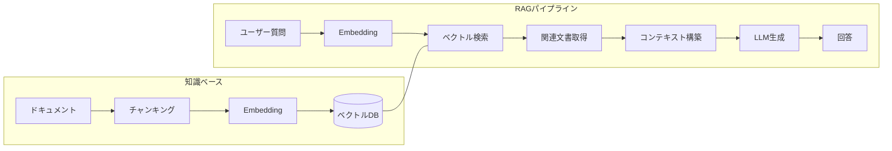

**特徴**:
- 情報フロー: **バッチ取得型**（質問時に関連文書を一括取得）
- データ: 事前インデックス化された静的知識
- 強み: 大量のドキュメントから関連情報を高精度に検索
- 弱み: リアルタイムデータへのアクセス不可、ツール実行不可

### 2.2 MCP（Model Context Protocol）とは

AIアプリケーションと外部ツール/データを接続するための標準プロトコル（JSON-RPC 2.0ベース）。

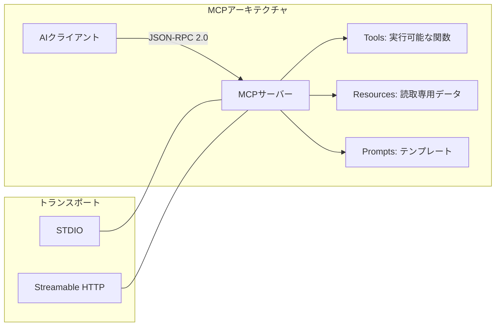

**特徴**:
- 情報フロー: **オンデマンド型**（AIが必要に応じて反復的にリクエスト）
- データ: リアルタイムアクセス（動的データ対応）
- 強み: ツール実行、標準プロトコルによる相互運用性、セキュリティ制御
- 弱み: 大量知識の効率的検索メカニズムが組み込まれていない

### 2.3 両者の関係性 — 「図書館」のアナロジー

```
┌─────────────────────────────────────────────────────────────┐
│                    AI開発支援システム                          │
│                                                              │
│   ┌───────────────┐              ┌───────────────┐          │
│   │     RAG       │              │     MCP       │          │
│   │               │              │               │          │
│   │  📚 蔵書検索   │              │  🚪 窓口サービス│          │
│   │  (知識の検索)  │              │  (機能の提供)  │          │
│   │               │              │               │          │
│   │ • ベクトル検索  │              │ • Tools       │          │
│   │ • ハイブリッド  │              │ • Resources   │          │
│   │   検索         │              │ • Prompts     │          │
│   │ • リランキング  │              │               │          │
│   └───────┬───────┘              └───────┬───────┘          │
│           │                              │                   │
│           │   ┌───────────────────┐      │                   │
│           └──▶│   統合レイヤー     │◀─────┘                   │
│               │                   │                          │
│               │ RAGで知識を検索し、│                          │
│               │ MCPで公開する     │                          │
│               └─────────┬─────────┘                          │
│                         │                                    │
│                    ┌────▼────┐                               │
│                    │  LLM   │                                │
│                    └────────┘                                │
└─────────────────────────────────────────────────────────────┘
```

### 2.4 技術的な位置づけの比較

| 観点 | RAG | MCP |
|------|-----|-----|
| **役割** | 知識の検索・提供 | ツール・リソースの公開 |
| **データアクセス** | 事前インデックス（静的） | リアルタイム（動的） |
| **情報フロー** | バッチ取得（質問→検索→一括取得） | オンデマンド（反復的リクエスト） |
| **標準化** | なし（実装依存） | あり（JSON-RPC 2.0ベース） |
| **AI連携** | プロンプトに直接注入 | クライアント-サーバープロトコル |
| **ツール実行** | ✗ 不可 | ✓ 可能 |
| **大量知識検索** | ✓ 得意 | ✗ 組込み機構なし |
| **セキュリティ** | 読取専用 | OAuth 2.0、権限制御対応 |
| **エコシステム** | LlamaIndex, LangChain等 | Claude, Copilot, Cursor等 |
| **関係性** | → MCPサーバーの「頭脳」として機能 | → RAGの「窓口」として機能 |

### 2.5 3つの統合パターン概要

```
┌──────────────────────────────────────────────────────────────────┐
│                                                                   │
│  パターン1: RAG inside MCP                                        │
│  ─────────────────────────                                        │
│  MCPサーバーの内部でRAGパイプラインを稼働させ、                     │
│  検索結果をTools/Resourcesとして公開する                            │
│                                                                   │
│  ┌─────────────────────────────────────┐                         │
│  │         MCPサーバー                   │                         │
│  │  ┌─────────────────────────┐        │                         │
│  │  │   RAGパイプライン        │        │     ← 最も一般的        │
│  │  │  (検索エンジン内蔵)      │        │                         │
│  │  └─────────────────────────┘        │                         │
│  └─────────────────────────────────────┘                         │
│                                                                   │
│  パターン2: RAG for MCP（RAG-MCP論文）                             │
│  ──────────────────────────────────────                            │
│  RAGでMCPツールのメタデータを検索し、                               │
│  関連ツールのみをLLMに提示する（ツール選択の最適化）                 │
│                                                                   │
│  ┌──────────┐    ┌───────────────┐    ┌──────────────┐          │
│  │ RAG Index │───▶│ ツール選択     │───▶│ 選択されたMCP │          │
│  │(MCPメタ)  │    │ (Semantic)    │    │ のみをLLMへ  │          │
│  └──────────┘    └───────────────┘    └──────────────┘          │
│                                                                   │
│  パターン3: RAG + MCP 並列利用                                     │
│  ──────────────────────────────                                    │
│  RAGとMCPを独立して運用し、LLM側で統合する                          │
│                                                                   │
│  ┌──────────┐                                                    │
│  │   RAG    │──────┐                                             │
│  └──────────┘      ├───▶ LLM                                    │
│  ┌──────────┐      │                                             │
│  │   MCP    │──────┘                                             │
│  └──────────┘                                                    │
│                                                                   │
└──────────────────────────────────────────────────────────────────┘
```

---

## 3. 3パターン比較

### 3.1 パターンA: RAG単体

Nablarchのドキュメント・コード・設定をベクトル化し、ユーザーの質問に対してセマンティック検索で関連情報を取得してLLMに渡す。

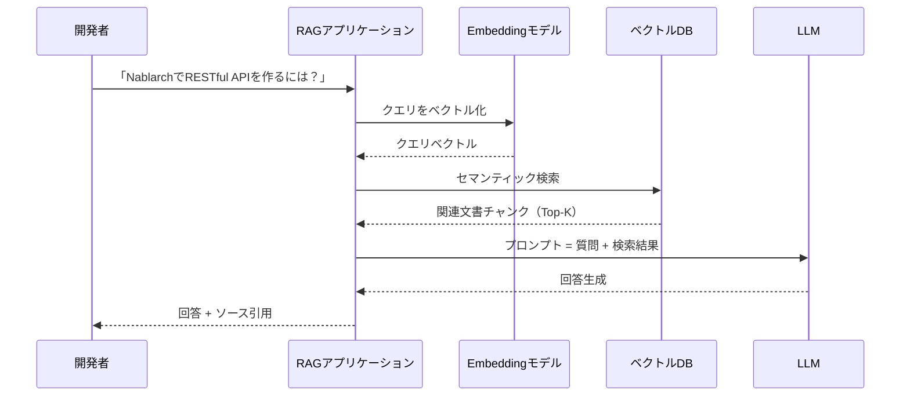

**アーキテクチャ図**:

```
┌─────────────────────────────────────────────────────────┐
│                   RAG単体アーキテクチャ                    │
│                                                          │
│  ┌──────────┐                                            │
│  │ 開発者    │                                            │
│  └─────┬────┘                                            │
│        │ 質問                                             │
│        ▼                                                  │
│  ┌─────────────────────────────────────────────┐         │
│  │          RAGアプリケーション                    │         │
│  │                                               │         │
│  │  ┌────────────┐  ┌─────────────┐             │         │
│  │  │ Query      │  │ Retrieval   │             │         │
│  │  │ Processor  │──│ Engine      │             │         │
│  │  └────────────┘  └──────┬──────┘             │         │
│  │                         │                     │         │
│  │  ┌──────────────────────▼───────────────┐    │         │
│  │  │     PostgreSQL + pgvector            │    │         │
│  │  │  ┌────────┐ ┌──────┐ ┌───────────┐  │    │         │
│  │  │  │Nablarch│ │Code  │ │Handler    │  │    │         │
│  │  │  │Docs    │ │Sample│ │Config XML │  │    │         │
│  │  │  └────────┘ └──────┘ └───────────┘  │    │         │
│  │  └──────────────────────────────────────┘    │         │
│  │                         │                     │         │
│  │  ┌──────────────────────▼───────────────┐    │         │
│  │  │  LLM (Claude / GPT)                  │    │         │
│  │  │  プロンプト = 質問 + 検索結果          │    │         │
│  │  └──────────────────────────────────────┘    │         │
│  └─────────────────────────────────────────────┘         │
└─────────────────────────────────────────────────────────┘
```

### 3.2 パターンB: MCP単体

MCPサーバーがNablarchの情報をTools/Resources/Promptsとして公開。AIクライアント（Claude Code等）がJSON-RPC 2.0で情報を取得する。

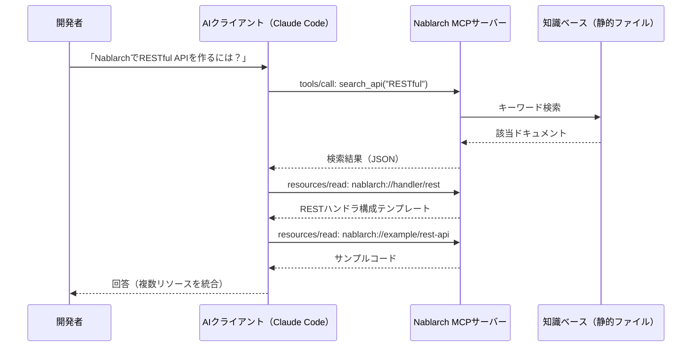

**アーキテクチャ図**:

```
┌─────────────────────────────────────────────────────────┐
│                  MCP単体アーキテクチャ                     │
│                                                          │
│  ┌──────────┐                                            │
│  │ 開発者    │                                            │
│  └─────┬────┘                                            │
│        │ 自然言語                                         │
│        ▼                                                  │
│  ┌──────────────┐     JSON-RPC 2.0     ┌──────────────┐ │
│  │ AIクライアント │◄──────────────────────│ Nablarch     │ │
│  │ (Claude Code) │ Tools/Resources/     │ MCPサーバー   │ │
│  │               │ Prompts              │              │ │
│  └──────────────┘                      │ ┌──────────┐ │ │
│                                         │ │search_api│ │ │
│                                         │ │gen_code  │ │ │
│                                         │ │validate  │ │ │
│                                         │ └──────────┘ │ │
│                                         │              │ │
│                                         │ ┌──────────┐ │ │
│                                         │ │nablarch:/│ │ │
│                                         │ │/handler/ │ │ │
│                                         │ │/pattern/ │ │ │
│                                         │ └──────────┘ │ │
│                                         │              │ │
│                                         │ ┌──────────┐ │ │
│                                         │ │静的ファイル│ │ │
│                                         │ │(MD/JSON) │ │ │
│                                         │ └──────────┘ │ │
│                                         └──────────────┘ │
└─────────────────────────────────────────────────────────┘
```

### 3.3 パターンC: RAG+MCP統合

MCPサーバーの内部にRAGパイプラインを組み込み、セマンティック検索の結果をMCPプロトコルで公開する。

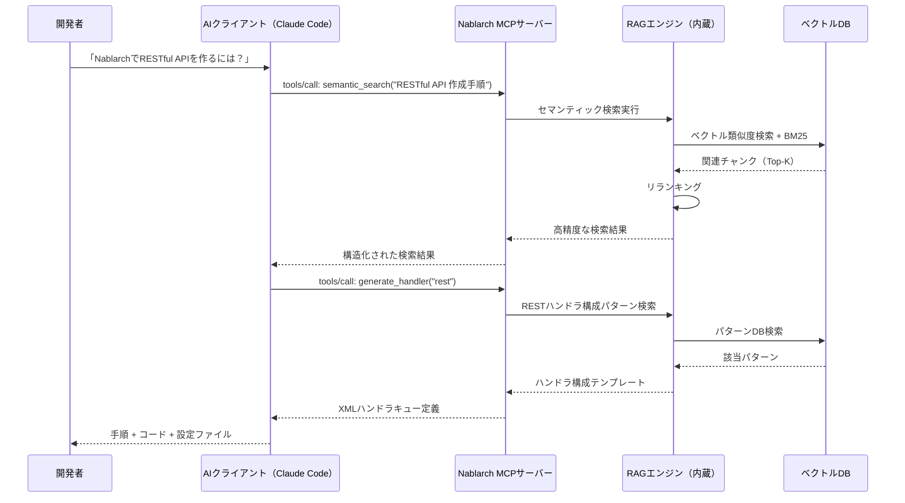

**アーキテクチャ図**:

```
┌──────────────────────────────────────────────────────────────┐
│                 RAG+MCP統合アーキテクチャ                       │
│                                                               │
│  ┌──────────┐                                                 │
│  │ 開発者    │                                                 │
│  └─────┬────┘                                                 │
│        │ 自然言語                                              │
│        ▼                                                       │
│  ┌──────────────┐                                             │
│  │ AIクライアント │                                             │
│  │ (Claude Code / Cursor / Copilot)                           │
│  └───────┬──────┘                                             │
│          │ JSON-RPC 2.0 (STDIO / HTTP)                        │
│          ▼                                                     │
│  ┌────────────────────────────────────────────────────────┐   │
│  │              Nablarch MCPサーバー（統合型）               │   │
│  │                                                         │   │
│  │  ┌─────────────────────────────────────────────────┐   │   │
│  │  │              MCP Protocol Layer                  │   │   │
│  │  │  Tools │ Resources │ Prompts │ Notifications    │   │   │
│  │  └────────────────────┬────────────────────────────┘   │   │
│  │                       │                                 │   │
│  │  ┌────────────────────▼────────────────────────────┐   │   │
│  │  │              RAGエンジン（内蔵）                   │   │   │
│  │  │                                                  │   │   │
│  │  │  ┌──────────┐ ┌───────────┐ ┌──────────────┐   │   │   │
│  │  │  │ Embedding │ │ Hybrid    │ │ Re-ranking   │   │   │   │
│  │  │  │ (Jina v4) │ │ Search   │ │ (Cross-Enc.) │   │   │   │
│  │  │  └──────────┘ └───────────┘ └──────────────┘   │   │   │
│  │  └────────────────────┬────────────────────────────┘   │   │
│  │                       │                                 │   │
│  │  ┌────────────────────▼────────────────────────────┐   │   │
│  │  │          PostgreSQL + pgvector                   │   │   │
│  │  │  ┌────────┐ ┌──────┐ ┌───────┐ ┌───────────┐  │   │   │
│  │  │  │Docs    │ │Code  │ │Javadoc│ │Config XML │  │   │   │
│  │  │  │Index   │ │Index │ │Index  │ │Index      │  │   │   │
│  │  │  └────────┘ └──────┘ └───────┘ └───────────┘  │   │   │
│  │  └─────────────────────────────────────────────────┘   │   │
│  └────────────────────────────────────────────────────────┘   │
└──────────────────────────────────────────────────────────────┘
```

### 3.4 3パターン比較表

| 評価観点 | RAG単体 | MCP単体 | RAG+MCP統合 |
|---------|---------|---------|------------|
| **検索精度** | ◎ セマンティック検索 | △ キーワード/静的 | ◎ セマンティック検索 |
| **AIツール統合** | △ 独自API必要 | ◎ 標準プロトコル | ◎ 標準プロトコル |
| **ツール実行** | ✗ 不可 | ◎ 可能 | ◎ 可能 |
| **リアルタイム性** | △ インデックス更新遅延 | ◎ 動的アクセス | ○ インデックス+動的 |
| **大量知識対応** | ◎ ベクトルDBでスケール | △ 静的ファイルに依存 | ◎ ベクトルDBでスケール |
| **セキュリティ** | △ 読取専用 | ◎ OAuth 2.0対応 | ◎ OAuth 2.0対応 |
| **開発コスト** | 中（RAGパイプライン構築） | 低〜中（MCPサーバー構築） | 高（両方の構築） |
| **保守性** | 中（インデックス更新） | 低〜中（ドキュメント更新） | 中（インデックス+SDK更新） |
| **エコシステム** | LlamaIndex, LangChain | Claude, Cursor, Copilot | 両方のエコシステム活用 |
| **Nablarch適性** | ○ 知識提供に強い | ○ ツール提供に強い | **◎ 知識+ツールの統合** |

### 3.5 適用場面の整理

```
              検索精度を重視
                  │
                  │
    ┌─────────────┼─────────────┐
    │             │             │
    │   RAG単体    │  RAG+MCP    │
    │             │  統合        │
    │ PoC/MVP    │  本格運用     │
    │ 独自アプリ   │  AIツール統合  │
ツール ────────────┼──────────── ツール
不要              │             必要
    │             │             │
    │   静的知識   │  MCP単体     │
    │   ベース     │             │
    │             │  軽量運用     │
    │             │  AIツール統合  │
    └─────────────┼─────────────┘
                  │
              即座の導入を重視
```

---

## 4. Nablarchユースケース分析

### 4.1 ユースケース1: ハンドラキュー構成の自動設計

Nablarchの最も特徴的な機能であるハンドラキューの構成を、AIが自動的に設計する。

#### RAGの担当

- ハンドラキュー構成のベストプラクティス検索
- 各ハンドラの順序制約・依存関係の知識提供
- 過去の設計パターン（Web/REST/Batch/Messaging）の検索

#### MCPの担当

- `validate_handler_queue` ツール: 生成された構成の妥当性チェック
- `nablarch://handler/{type}` リソース: ハンドラ仕様の公開
- `setup-handler-queue` プロンプト: 設計ガイドテンプレート

#### RAG+MCP連携フロー

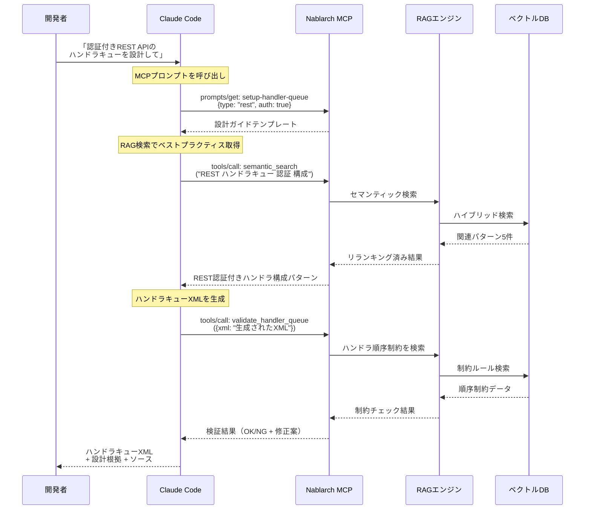

#### 各技術の貢献度

```
┌────────────────────────────────────────────────────────┐
│           ハンドラキュー自動設計の処理フロー               │
│                                                         │
│  ┌──────────┐   ┌──────────┐   ┌──────────┐           │
│  │ 要件理解  │──▶│ パターン │──▶│ XML生成  │           │
│  │          │   │ 検索     │   │          │           │
│  │ [MCP]    │   │ [RAG]    │   │ [AI]     │           │
│  │ Prompt   │   │ ベクトル  │   │ LLM生成  │           │
│  └──────────┘   │ 検索     │   └──────────┘           │
│                  └──────────┘        │                  │
│                                      ▼                  │
│                  ┌──────────┐   ┌──────────┐           │
│                  │ 制約検索  │──▶│ 妥当性   │           │
│                  │          │   │ 検証     │           │
│                  │ [RAG]    │   │ [MCP]    │           │
│                  │ 順序制約  │   │ Tool     │           │
│                  └──────────┘   └──────────┘           │
│                                      │                  │
│  RAG: パターン検索 + 制約知識          ▼                  │
│  MCP: ガイドテンプレート + 検証ツール  検証済みXML         │
└────────────────────────────────────────────────────────┘
```

---

### 4.2 ユースケース2: Nablarchコード生成

Nablarchの規約に準拠したアクションクラス、フォームBean、SQL定義等のコードを自動生成する。

#### RAGの担当

- Nablarchのコーディング規約・開発標準の検索
- 類似する既存コードパターンの検索
- パッケージ構造のルール取得

#### MCPの担当

- `generate_action` ツール: アクションクラスの生成
- `generate_form` ツール: フォームBeanの生成
- `generate_sql` ツール: SQL定義ファイルの生成
- `nablarch://example/{type}` リソース: サンプルコード参照

#### RAG+MCP連携フロー

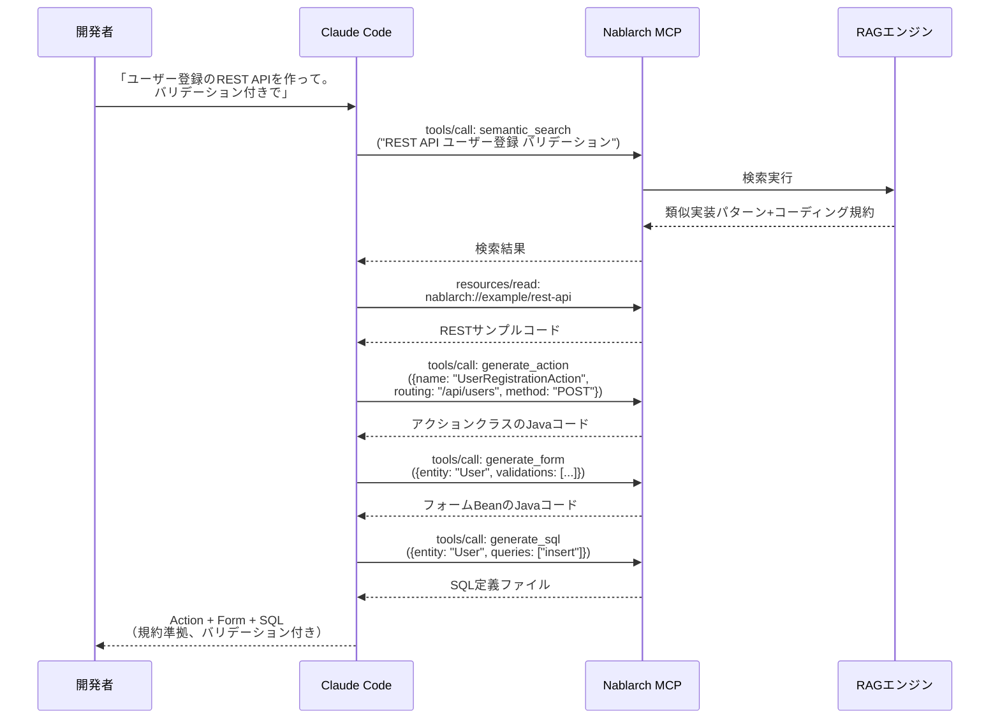

#### 3パターン比較（コード生成）

| 要素 | RAG単体 | MCP単体 | RAG+MCP統合 |
|------|---------|---------|------------|
| コーディング規約の適用 | ◎ 検索で取得 | △ 静的リソースのみ | ◎ 検索で動的取得 |
| テンプレート生成 | △ LLM任せ | ◎ ツールで生成 | ◎ 規約+テンプレート統合 |
| 類似コードの参照 | ◎ ベクトル検索 | △ 固定サンプルのみ | ◎ ベクトル検索で類似コード |
| バリデーション | ✗ なし | ○ ツールで検証 | ◎ 規約検索+ツール検証 |
| 生成品質 | ○ | ○ | **◎** |

---

### 4.3 ユースケース3: トラブルシューティング

Nablarchアプリケーションのエラーメッセージから原因を特定し、解決策を提示する。

#### RAGの担当

- エラーメッセージのパターンマッチング
- 過去の障害事例・解決策の検索
- ハンドラキューのデバッグ手順の検索

#### MCPの担当

- `troubleshoot` プロンプト: トラブルシューティングガイド
- `search_api` ツール: 関連API/ハンドラの検索
- `nablarch://antipattern/{name}` リソース: アンチパターン情報

#### RAG+MCP連携フロー

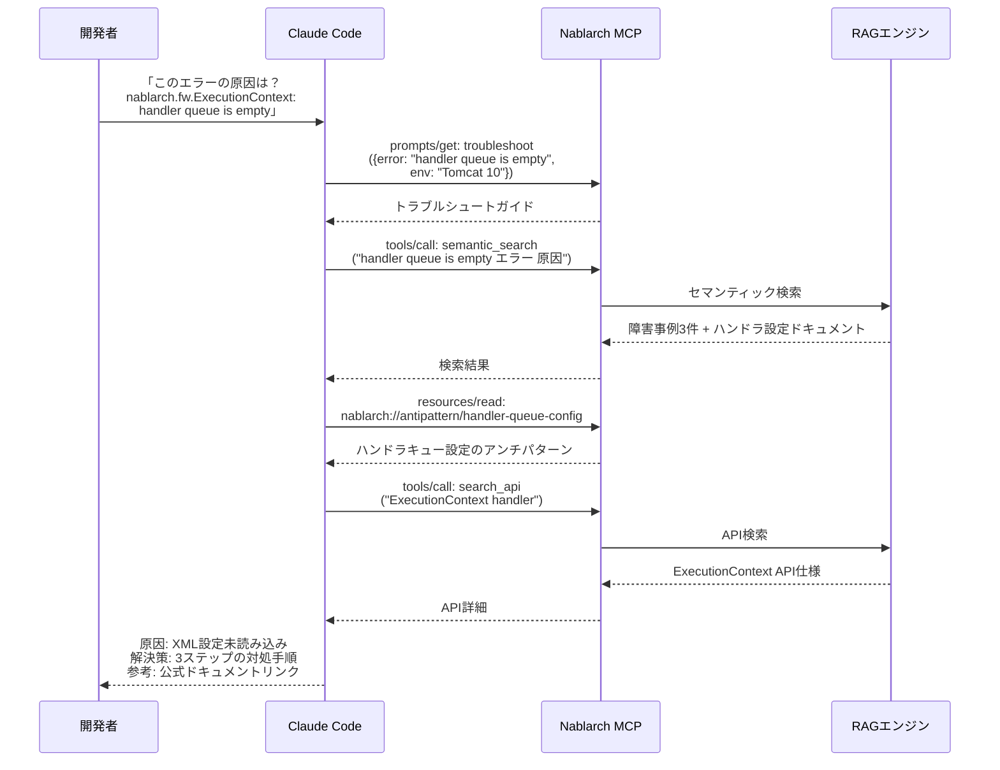

#### トラブルシューティングの情報フロー

```
┌────────────────────────────────────────────────────────────┐
│              トラブルシューティング フローチャート              │
│                                                             │
│  エラーメッセージ入力                                         │
│        │                                                     │
│        ▼                                                     │
│  ┌─────────────┐    RAGで障害事例を     ┌──────────────┐    │
│  │ エラー解析   │───────────────────────▶│ 障害事例DB   │    │
│  │ (MCP Prompt) │    セマンティック検索   │ (ベクトルDB) │    │
│  └──────┬──────┘                        └──────┬───────┘    │
│         │                                       │            │
│         ▼                                       ▼            │
│  ┌─────────────┐                        ┌──────────────┐    │
│  │ 原因候補     │◀───────────────────────│ 類似事例     │    │
│  │ の特定       │                        │ 3〜5件       │    │
│  └──────┬──────┘                        └──────────────┘    │
│         │                                                    │
│         ▼                                                    │
│  ┌─────────────┐    MCPで関連APIを      ┌──────────────┐    │
│  │ API/ハンドラ │───────────────────────▶│ API検索      │    │
│  │ 確認         │    ツール呼び出し       │ (MCP Tool)   │    │
│  └──────┬──────┘                        └──────────────┘    │
│         │                                                    │
│         ▼                                                    │
│  ┌─────────────┐    RAGでアンチパターン  ┌──────────────┐    │
│  │ 解決策       │───────────────────────▶│ パターンDB   │    │
│  │ 提示         │    を検索              │ (ベクトルDB) │    │
│  └──────┬──────┘                        └──────────────┘    │
│         │                                                    │
│         ▼                                                    │
│  ┌─────────────┐                                            │
│  │ 回答出力     │  原因 + 解決手順 + 参考リンク              │
│  └─────────────┘                                            │
└────────────────────────────────────────────────────────────┘
```

---

### 4.4 ユースケース4: Nablarch初学者向け学習支援

Nablarchを初めて使う開発者に対し、段階的な学習ガイドを提供する。

#### RAGの担当

- 学習者のレベルに合わせたドキュメントの段階的検索
- 公式チュートリアル・Fintanコンテンツの関連箇所の検索
- 概念説明文の取得（ハンドラキュー、SystemRepository等）

#### MCPの担当

- `create-web-app` / `create-rest-api` / `create-batch` プロンプト: チュートリアルガイド
- `nablarch://guide/{topic}` リソース: 学習トピック別ガイド
- `search_api` ツール: API解説の検索

#### RAG+MCP連携フロー

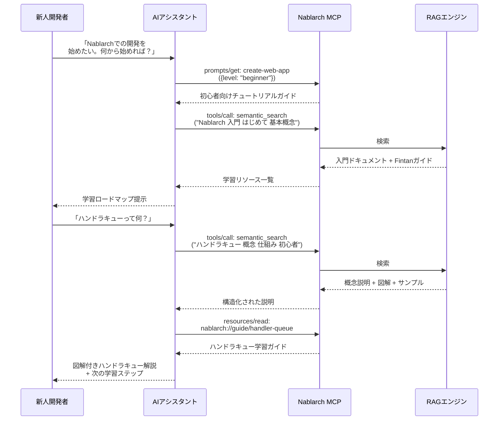

#### 学習パスの制御フロー

```
┌─────────────────────────────────────────────────────────────┐
│                    学習支援フロー                              │
│                                                              │
│  ┌──────────────────────────────────────────────────┐       │
│  │                学習者のレベル判定                    │       │
│  │  [MCP Prompt: 初心者ガイド呼び出し]                 │       │
│  └──────────────────────┬───────────────────────────┘       │
│                         │                                    │
│         ┌───────────────┼───────────────┐                    │
│         ▼               ▼               ▼                    │
│  ┌────────────┐  ┌────────────┐  ┌────────────┐            │
│  │  初級       │  │  中級       │  │  上級       │            │
│  │  概念理解   │  │  実装演習   │  │  設計判断   │            │
│  └──────┬─────┘  └──────┬─────┘  └──────┬─────┘            │
│         │               │               │                    │
│         ▼               ▼               ▼                    │
│  ┌────────────┐  ┌────────────┐  ┌────────────┐            │
│  │ RAG検索:   │  │ RAG検索:   │  │ RAG検索:   │            │
│  │ 入門記事   │  │ 実装例     │  │ 設計パターン│            │
│  │ Fintanガイド│  │ サンプルコード│  │ ベストプラ  │            │
│  │ 基本概念   │  │ 設定テンプレ│  │ クティス   │            │
│  └──────┬─────┘  └──────┬─────┘  └──────┬─────┘            │
│         │               │               │                    │
│         ▼               ▼               ▼                    │
│  ┌────────────┐  ┌────────────┐  ┌────────────┐            │
│  │ MCP提供:   │  │ MCP提供:   │  │ MCP提供:   │            │
│  │ 学習ガイド  │  │ コード生成  │  │ 構成検証   │            │
│  │ API解説    │  │ 設定生成   │  │ パターン比較│            │
│  └────────────┘  └────────────┘  └────────────┘            │
│                                                              │
│  RAG: レベルに応じた知識の段階的提供                            │
│  MCP: インタラクティブなツール・ガイドの提供                     │
└─────────────────────────────────────────────────────────────┘
```

---

### 4.5 ユースケース5: コードレビュー（Nablarch規約準拠チェック）

開発者が書いたNablarchコードが規約・パターンに準拠しているかをAIがレビューする。

#### RAGの担当

- Nablarchのコーディング規約の検索
- アンチパターンの検索
- TIS開発標準のスタイルガイドの取得

#### MCPの担当

- `review-code` プロンプト: レビューガイドテンプレート
- `validate_handler_queue` ツール: 構成の検証
- `nablarch://pattern/{name}` / `nablarch://antipattern/{name}` リソース

#### RAG+MCP連携フロー

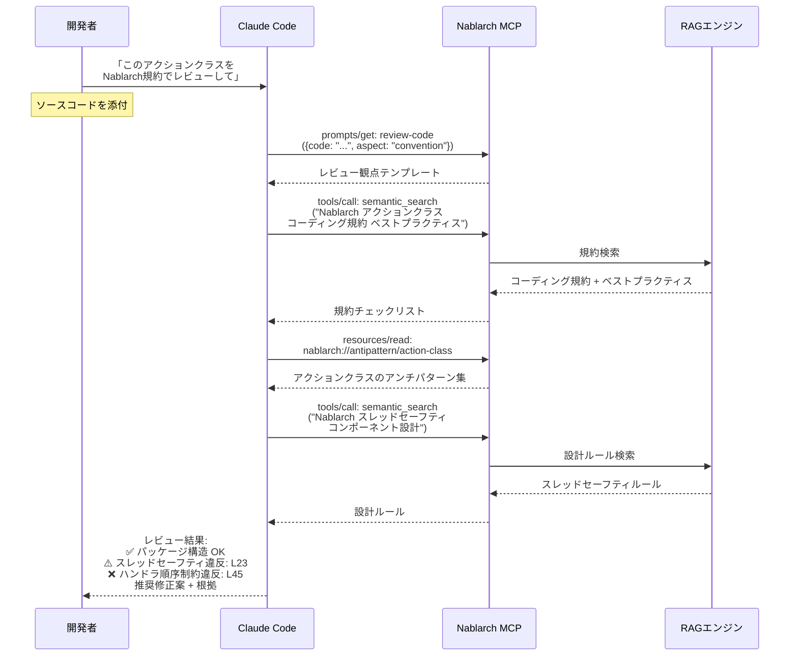

#### レビュー判定フロー

```
┌──────────────────────────────────────────────────────────────┐
│                  コードレビュー判定フロー                       │
│                                                               │
│  入力: ソースコード                                            │
│     │                                                         │
│     ▼                                                         │
│  ┌──────────────┐                                             │
│  │ レビュー観点   │  [MCP] review-code プロンプト               │
│  │ の決定         │                                             │
│  └───────┬──────┘                                             │
│          │                                                     │
│     ┌────┴────────┬──────────────┬──────────────┐             │
│     ▼             ▼              ▼              ▼             │
│  ┌────────┐ ┌──────────┐ ┌──────────┐ ┌──────────┐          │
│  │命名規約 │ │設計パターン│ │セキュリティ│ │パフォー   │          │
│  │チェック │ │準拠チェック│ │チェック   │ │マンス    │          │
│  └───┬────┘ └────┬─────┘ └────┬─────┘ └────┬─────┘          │
│      │           │            │            │                  │
│      ▼           ▼            ▼            ▼                  │
│  ┌──────────────────────────────────────────────────┐        │
│  │ [RAG] 各観点の規約・パターン・アンチパターンを検索  │        │
│  │  • コーディング規約 (Fintan)                       │        │
│  │  • スレッドセーフティルール                          │        │
│  │  • ハンドラキュー制約                               │        │
│  │  • OWASP対応チェックリスト                          │        │
│  └──────────────────────┬───────────────────────────┘        │
│                         │                                     │
│                         ▼                                     │
│  ┌──────────────────────────────────────────────────┐        │
│  │ [MCP] validate ツールで自動検証                     │        │
│  │  • ハンドラキュー構成の妥当性                        │        │
│  │  • API使用方法の正当性                               │        │
│  └──────────────────────┬───────────────────────────┘        │
│                         │                                     │
│                         ▼                                     │
│  ┌──────────────────────────────────────────────────┐        │
│  │ レビュー結果出力                                    │        │
│  │  ✅ OK / ⚠️ Warning / ❌ NG                        │        │
│  │  + 修正案 + 規約の根拠引用                           │        │
│  └──────────────────────────────────────────────────┘        │
└──────────────────────────────────────────────────────────────┘
```

---

### 4.6 ユースケース6: Nablarch 5→6マイグレーション支援

Nablarch 5から6への移行において、変更点の把握・影響分析・コード修正を支援する。

#### RAGの担当

- Nablarch 5→6の変更点ドキュメントの検索
- Jakarta EE 10への移行ガイドの検索
- 非推奨API・削除されたAPIの検索

#### MCPの担当

- `search_api` ツール: APIの変更状況確認
- `nablarch://guide/migration-5to6` リソース: マイグレーションガイド
- `nablarch://version` リソース: バージョン情報

#### RAG+MCP連携フロー

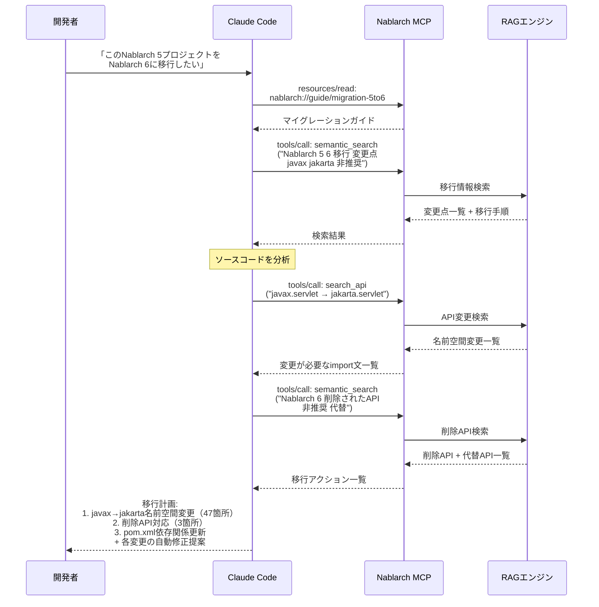

#### マイグレーション分析フロー

```
┌──────────────────────────────────────────────────────────────┐
│                 マイグレーション分析フロー                       │
│                                                               │
│  入力: Nablarch 5 プロジェクト                                 │
│     │                                                         │
│     ▼                                                         │
│  ┌──────────────────────────────────────────────────┐        │
│  │ Step 1: 変更点の把握                               │        │
│  │ [MCP] migration-5to6 ガイド取得                    │        │
│  │ [RAG] 変更点ドキュメント検索                        │        │
│  └──────────────────────┬───────────────────────────┘        │
│                         │                                     │
│                         ▼                                     │
│  ┌──────────────────────────────────────────────────┐        │
│  │ Step 2: 影響分析                                   │        │
│  │ [AI]  ソースコードスキャン                           │        │
│  │ [RAG] 非推奨/削除API検索                            │        │
│  │ [MCP] search_api で変更状況確認                     │        │
│  └──────────────────────┬───────────────────────────┘        │
│                         │                                     │
│                         ▼                                     │
│  ┌──────────────────────────────────────────────────┐        │
│  │ Step 3: 移行計画の生成                              │        │
│  │                                                    │        │
│  │  ┌──────────────────────────────────────────┐     │        │
│  │  │ 変更カテゴリ  │ 影響範囲    │ 自動修正可否 │     │        │
│  │  ├──────────────┼────────────┼─────────────┤     │        │
│  │  │ 名前空間変更  │ 47箇所     │ ✓ 自動       │     │        │
│  │  │ API置換      │  3箇所     │ △ 半自動     │     │        │
│  │  │ 設定変更     │  5箇所     │ ✓ 自動       │     │        │
│  │  │ テスト修正   │ 12箇所     │ △ 半自動     │     │        │
│  │  └──────────────┴────────────┴─────────────┘     │        │
│  └──────────────────────┬───────────────────────────┘        │
│                         │                                     │
│                         ▼                                     │
│  ┌──────────────────────────────────────────────────┐        │
│  │ Step 4: コード修正の実行                            │        │
│  │ [AI]  自動修正 + 手動修正ガイド                      │        │
│  │ [MCP] validate で修正結果を検証                      │        │
│  └──────────────────────────────────────────────────┘        │
└──────────────────────────────────────────────────────────────┘
```

---

### 4.7 ユースケース7: テスト生成（Excelテスト仕様書連携）

Nablarch独自のExcelベーステスティングフレームワークと連携し、テストコード・テストデータを生成する。

#### RAGの担当

- Nablarchテスティングフレームワークの仕様検索
- Excelテスト仕様書のフォーマット・記述ルールの検索
- テスト観点カタログ（Fintanコンテンツ）の検索

#### MCPの担当

- `generate_test` ツール: JUnitテストコード生成
- `nablarch://guide/testing` リソース: テストガイド
- `review-code` プロンプト: テスト品質レビュー

#### RAG+MCP連携シーケンス図

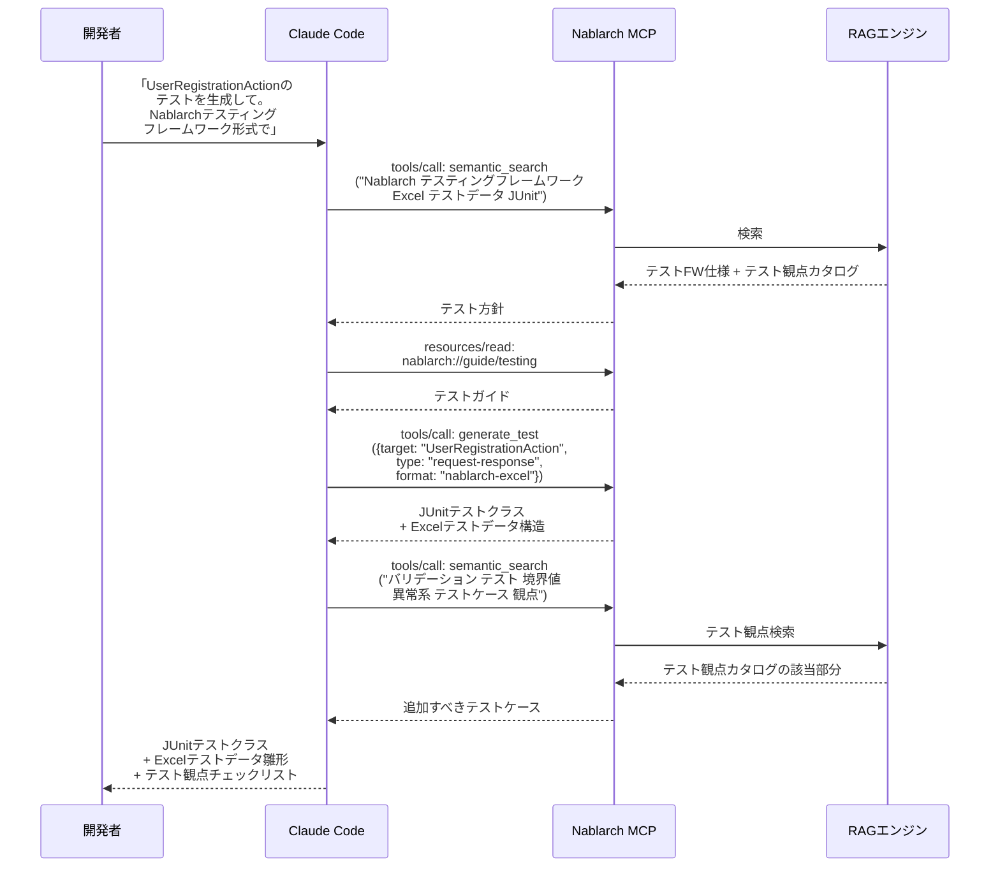

---

### 4.8 ユースケース横断 — RAG/MCPの貢献度マトリクス

| ユースケース | RAGの貢献度 | MCPの貢献度 | 統合効果 |
|-------------|:----------:|:----------:|:-------:|
| ハンドラキュー自動設計 | ★★★★★ | ★★★★☆ | **極高** |
| コード生成 | ★★★★☆ | ★★★★★ | **極高** |
| トラブルシューティング | ★★★★★ | ★★★☆☆ | **高** |
| 学習支援 | ★★★★★ | ★★★☆☆ | **高** |
| コードレビュー | ★★★★☆ | ★★★★☆ | **極高** |
| マイグレーション支援 | ★★★★★ | ★★★☆☆ | **高** |
| テスト生成 | ★★★★☆ | ★★★★★ | **極高** |

**分析**: RAGはすべてのユースケースで「知識提供」として不可欠。MCPは「ツール実行」が求められるユースケース（コード生成、テスト生成、バリデーション）で特に貢献度が高い。両者を統合することで、すべてのユースケースで単体を上回る効果が得られる。

---

## 5. 推奨アーキテクチャ

### 5.1 推奨: RAG-enhanced Nablarch MCPサーバー

前章の分析結果に基づき、**MCPサーバーの内部にRAGエンジンを組み込む「RAG-enhanced MCP」**を推奨する。

```
┌──────────────────────────────────────────────────────────────┐
│           RAG-enhanced Nablarch MCPサーバー                    │
│                                                               │
│  ┌──────────────────────────────────────────────────────┐    │
│  │                 AIクライアント層                        │    │
│  │  Claude Code / Cursor / Copilot / VS Code            │    │
│  └───────────────────────┬──────────────────────────────┘    │
│                          │ JSON-RPC 2.0                       │
│                          │ STDIO（ローカル）                    │
│                          │ Streamable HTTP（リモート）          │
│                          ▼                                    │
│  ┌──────────────────────────────────────────────────────┐    │
│  │             MCP Protocol Layer                        │    │
│  │                                                       │    │
│  │  ┌─────────────────────────────────────────────┐     │    │
│  │  │                  Tools                       │     │    │
│  │  │  semantic_search │ generate_handler          │     │    │
│  │  │  generate_action │ generate_form             │     │    │
│  │  │  generate_sql    │ generate_test             │     │    │
│  │  │  validate_handler_queue │ search_api         │     │    │
│  │  └─────────────────────────────────────────────┘     │    │
│  │  ┌─────────────────────────────────────────────┐     │    │
│  │  │                Resources                     │     │    │
│  │  │  nablarch://handler/* │ nablarch://pattern/* │     │    │
│  │  │  nablarch://api/*     │ nablarch://guide/*   │     │    │
│  │  │  nablarch://example/* │ nablarch://config/*  │     │    │
│  │  │  nablarch://antipattern/* │ nablarch://version│    │    │
│  │  └─────────────────────────────────────────────┘     │    │
│  │  ┌─────────────────────────────────────────────┐     │    │
│  │  │                Prompts                       │     │    │
│  │  │  setup-handler-queue │ create-web-app        │     │    │
│  │  │  create-rest-api     │ create-batch          │     │    │
│  │  │  review-code         │ troubleshoot          │     │    │
│  │  └─────────────────────────────────────────────┘     │    │
│  └───────────────────────┬──────────────────────────────┘    │
│                          │                                    │
│  ┌───────────────────────▼──────────────────────────────┐    │
│  │              RAGエンジン（内蔵）                        │    │
│  │                                                       │    │
│  │  ┌───────────┐ ┌────────────┐ ┌────────────────┐    │    │
│  │  │ Query     │ │ Hybrid     │ │ Re-ranking     │    │    │
│  │  │ Processor │→│ Search     │→│ (Cross-Encoder)│    │    │
│  │  │           │ │ BM25+Vector│ │                │    │    │
│  │  └───────────┘ └────────────┘ └────────────────┘    │    │
│  │                                                       │    │
│  │  ┌───────────┐ ┌────────────┐                        │    │
│  │  │ Doc       │ │ Code       │  Embeddingモデル       │    │
│  │  │ Embedder  │ │ Embedder   │                        │    │
│  │  │ (Jina v4) │ │(Voyage-c3) │                        │    │
│  │  └───────────┘ └────────────┘                        │    │
│  └───────────────────────┬──────────────────────────────┘    │
│                          │                                    │
│  ┌───────────────────────▼──────────────────────────────┐    │
│  │          PostgreSQL + pgvector                        │    │
│  │                                                       │    │
│  │  ┌─────────┐ ┌─────────┐ ┌─────────┐ ┌──────────┐  │    │
│  │  │ Docs    │ │ Code    │ │ Javadoc │ │ Config   │  │    │
│  │  │ Index   │ │ Index   │ │ Index   │ │ Index    │  │    │
│  │  │(公式Docs│ │(114 repo│ │(全API)  │ │(XML設定) │  │    │
│  │  │ Fintan) │ │ サンプル)│ │         │ │          │  │    │
│  │  └─────────┘ └─────────┘ └─────────┘ └──────────┘  │    │
│  └──────────────────────────────────────────────────────┘    │
│                                                               │
│  ┌──────────────────────────────────────────────────────┐    │
│  │          Servlet Container (Tomcat / Jetty)           │    │
│  │  ┌───────────────────┐  ┌──────────────────────┐    │    │
│  │  │ MCP Servlet        │  │ Nablarch App         │    │    │
│  │  │ (SDK Transport)    │  │ (業務ロジック連携)     │    │    │
│  │  │ /mcp/*             │  │ /api/*               │    │    │
│  │  └───────────────────┘  └──────────────────────┘    │    │
│  └──────────────────────────────────────────────────────┘    │
└──────────────────────────────────────────────────────────────┘
```

### 5.2 段階的構築ロードマップ

```
Phase 1: MCP基盤 + 静的知識
├── MCPサーバー構築（STDIO）
├── 静的Resources（ドキュメント、パターン）
├── 基本Tools（search_api, validate_handler_queue）
└── Claude Code / Claude Desktopでの動作確認

    │
    ▼

Phase 2: RAGエンジン統合
├── pgvector + Embeddingパイプライン構築
├── Nablarchドキュメントのインデックス化
├── semantic_search ツールの実装
├── ハイブリッド検索 + リランキングの導入
└── 検索精度の評価・チューニング

    │
    ▼

Phase 3: コード生成・ツール拡充
├── generate_* ツール群の実装
├── コードEmbedding（GitHub 114リポジトリ）
├── Promptsの実装
├── テスト生成機能
└── Streamable HTTPトランスポート追加

    │
    ▼

Phase 4: 高度化・エンタープライズ対応
├── Fintanコンテンツ統合
├── 自動更新パイプライン
├── OAuth 2.0認証
├── コンテナ化・CI/CD
└── nablarch-tools-for-ai 統合検討
```

### 5.3 技術スタック推奨

| レイヤー | 技術 | 根拠 |
|---------|------|------|
| **MCPサーバー基盤** | MCP Java SDK (mcp-core) | Spring不要、Jakarta Servletベース（O-022調査結果） |
| **トランスポート** | STDIO + Servlet SSE | ローカル＋リモート両対応（推測: Phase 1はSTDIO優先） |
| **RAGパイプライン** | Python (LlamaIndex) or Java | LlamaIndexはRAGエコシステム最大（O-002調査結果） |
| **Embedding（ドキュメント）** | Jina embeddings-v4 | 日本語89言語対応、OSS、32Kコンテキスト |
| **Embedding（コード）** | Voyage-code-3 | CoIRベンチマーク最高水準、Java対応 |
| **ベクトルDB** | PostgreSQL + pgvector | Nablarch（RDBMS中心）との親和性、コスト効率 |
| **LLM** | Claude (Anthropic) | 日本語品質、コード理解力 |
| **サーブレットコンテナ** | Tomcat / Jetty | Nablarch標準稼動環境との整合性 |

### 5.4 RAG+MCP統合の技術的考慮事項

| 考慮事項 | 詳細 | 対応方針 |
|---------|------|---------|
| **言語混在** | MCPサーバー=Java、RAGエコシステム=Python中心 | 選択肢A: MCPサーバーからPython RAGをHTTPで呼び出し / 選択肢B: Java版RAG（Lucene+pgvector直接）で統一 |
| **レイテンシ** | RAG検索はベクトル検索+リランキングで100-300ms | MCPのレスポンスタイムアウトに注意。キャッシュ戦略を導入 |
| **インデックス更新** | ドキュメント変更時の再インデックス化 | GitHub Webhookでの増分更新パイプライン |
| **コンテキストウィンドウ** | RAG検索結果が大きすぎるとMCPレスポンスが膨大に | Top-K制限 + サマリ生成で制御 |

---

## 6. 参考情報

### RAG+MCP統合に関する学術・技術文献

| リソース | URL | 概要 |
|---------|-----|------|
| RAG-MCP論文 (arXiv) | https://arxiv.org/abs/2505.03275 | RAGによるMCPツール選択最適化。トークン75%削減、精度3倍向上 |
| RAG vs MCP比較 (Speakeasy) | https://www.speakeasy.com/blog/rag-vs-mcp | RAGとMCPの技術的比較と使い分けガイド |
| RAG vs MCP比較 (TrueFoundry) | https://www.truefoundry.com/blog/mcp-vs-rag | RAG/MCPの違いと統合パターンの解説 |
| Agentic RAG + MCP (Omar Santos) | https://becomingahacker.org/integrating-agentic-rag-with-mcp-servers-technical-implementation-guide-1aba8fd4e442 | MCPサーバーへのAgentic RAG統合の実装ガイド |
| RAG vs MCP (Merge.dev) | https://www.merge.dev/blog/rag-vs-mcp | 両者の重複と差異の分析 |
| MCP Design Patterns (Stainless) | https://www.stainlessapi.com/blog/4-design-patterns-for-building-better-mcp-servers | MCPサーバー設計の4パターン（Semantic Search含む） |

### CodeRAG / MCP+RAG実装事例

| リソース | URL | 概要 |
|---------|-----|------|
| CodeRAG MCP Server | https://github.com/JonnoC/CodeRAG | Neo4jグラフベースのコード分析MCPサーバー |
| Code-Graph-RAG | https://github.com/vitali87/code-graph-rag | ナレッジグラフ+RAGによるコードベース理解 |
| Smart-Coding-MCP | https://github.com/omar-haris/smart-coding-mcp | ローカルAIモデルによるセマンティックコード検索MCP |
| Qdrant RAG MCP Server | https://glama.ai/mcp/servers/@ancoleman/qdrant-rag-mcp | QdrantベクトルDBを使ったRAG MCPサーバー |
| RAG-MCP実装 (fintools-ai) | https://github.com/fintools-ai/rag-mcp | RAG原則によるMCPツール選択の実装 |
| Crawl4AI RAG MCP | https://github.com/coleam00/mcp-crawl4ai-rag | Webクローリング+RAGのMCPサーバー |

### Nablarch関連（本プロジェクト既存資料）

| リソース | パス | 概要 |
|---------|------|------|
| MCP実装可能性調査 | output/O-022_nablarch_mcp_feasibility_study.md | Nablarch上でのMCPサーバー実装可能性（ashigaru8作成） |
| MCPサーバー構築計画 | output/O-001_nablarch_mcp_server_plan.md | Spring Boot + MCP Java SDKによる構築計画 |
| RAGシステム構築計画 | output/O-002_nablarch_rag_system_plan.md | Nablarch知識ベースのRAGシステム詳細設計 |
| Nablarch公式ドキュメント情報 | output/O-005_nablarch_kb_official_docs.md | ドキュメント体系の分析 |
| Nablarchアーキテクチャ | output/O-006_nablarch_kb_architecture.md | ハンドラキュー等のアーキテクチャ詳細 |

### MCP仕様・SDK

| リソース | URL |
|---------|-----|
| MCP公式仕様（2025-03-26） | https://modelcontextprotocol.io/specification/2025-03-26 |
| MCP Java SDK | https://github.com/modelcontextprotocol/java-sdk |
| MCP Java Server Guide | https://modelcontextprotocol.io/sdk/java/mcp-server |

---

*本レポートは、既存ナレッジベース（O-001, O-002, O-005, O-006, O-022）、MCP公式仕様、RAG-MCP論文（arXiv:2505.03275）、およびWeb上の最新技術情報を一次情報源として作成した。推測と事実は本文中で明確に区別している（推測には「推測」と明記）。Xenlon関連の情報は含まない。*
