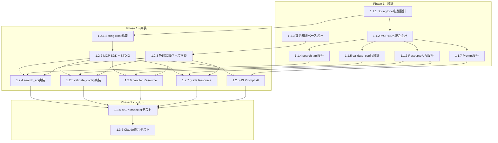
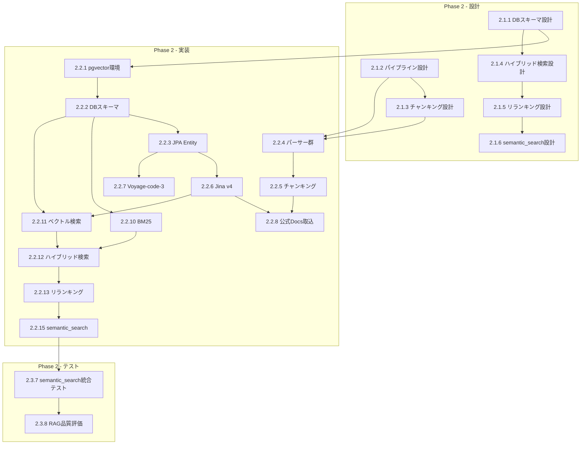
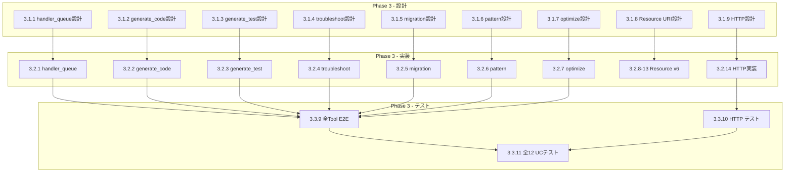
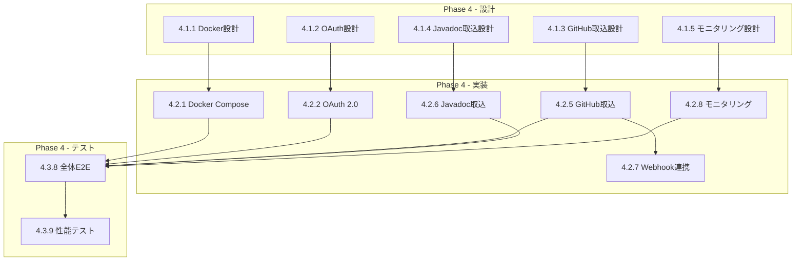

# Nablarch MCP Server — WBS（Work Breakdown Structure）

> **作成日**: 2026-02-02
> **作成者**: ashigaru8（subtask_037 / cmd_023 Part3）
> **ステータス**: 計画段階
> **根拠文書**: architecture.md, use-cases.md, overview.md, ADR-001

---

## 目次

1. [WBS概要](#1-wbs概要)
2. [Phase 1: 基盤構築（MVP）](#2-phase-1-基盤構築mvp)
3. [Phase 2: RAGエンジン統合](#3-phase-2-ragエンジン統合)
4. [Phase 3: ツール拡充・コード生成](#4-phase-3-ツール拡充コード生成)
5. [Phase 4: 本番デプロイ・エンタープライズ対応](#5-phase-4-本番デプロイエンタープライズ対応)
6. [依存関係図](#6-依存関係図)
7. [クリティカルパス](#7-クリティカルパス)
8. [技術的前提条件・制約事項](#8-技術的前提条件制約事項)
9. [リスクと対策](#9-リスクと対策)
10. [品質基準](#10-品質基準)

---

## 1. WBS概要

### 1.1 WBS構造

3レベルの階層で整理する。

| レベル | 名称 | 番号体系 | 例 |
|--------|------|----------|-----|
| **大項目** | Phase | `X` | `1` = Phase 1 |
| **中項目** | カテゴリ | `X.Y` | `1.1` = Phase 1 > 設計 |
| **小項目** | 個別タスク | `X.Y.Z` | `1.1.1` = Phase 1 > 設計 > API設計 |

### 1.2 カテゴリ定義

各Phaseは以下4カテゴリに分類される。

| カテゴリ番号 | カテゴリ名 | 内容 |
|-------------|-----------|------|
| `X.1` | 設計 | API設計、DB設計、コンポーネント設計 |
| `X.2` | 実装 | コーディング、統合 |
| `X.3` | テスト | ユニットテスト、統合テスト、品質テスト |
| `X.4` | ドキュメント | 仕様書、ガイド、マニュアル |

### 1.3 凡例

| 記号 | 意味 |
|------|------|
| `→` | 依存（この後でないとできない） |
| `‖` | 並列実行可能 |
| **太字** | クリティカルパス上のタスク |

---

## 2. Phase 1: 基盤構築（MVP）

> MCPサーバーの最小構成を構築し、基本的な動作を検証する。
> **技術**: Spring Boot 3.4.x + MCP Java SDK 0.17.x + 静的YAML/JSON知識ファイル

### Phase 1 WBSテーブル

| WBS番号 | タスク名 | 成果物 | 依存タスク | 並列可否 |
|---------|---------|--------|-----------|---------|
| **1.1** | **設計** | | | |
| **1.1.1** | **Spring Boot基盤設計** | プロジェクト構成設計書（パッケージ構成、レイヤー定義） | なし | — |
| 1.1.2 | MCP SDK統合設計 | MCPサーバー設定仕様（トランスポート、ハンドラマッピング） | 1.1.1 | — |
| 1.1.3 | 静的知識ベース設計 | 知識ファイルフォーマット定義（YAML/JSON構造） | なし | ‖ 1.1.1 |
| 1.1.4 | Tool API設計（search_api） | search_api 入出力スキーマ（JSON Schema） | 1.1.2 | — |
| 1.1.5 | Tool API設計（validate_config） | validate_config 入出力スキーマ（JSON Schema） | 1.1.2 | ‖ 1.1.4 |
| 1.1.6 | Resource URI設計（handler, guide） | リソースURIスキーマ定義（nablarch://handler/*, nablarch://guide/*） | 1.1.2 | ‖ 1.1.4 |
| 1.1.7 | Prompt テンプレート設計（全6種） | 6 Prompt定義書（引数、テンプレート構造） | 1.1.2 | ‖ 1.1.4 |
| **1.2** | **実装** | | | |
| **1.2.1** | **Spring Boot プロジェクト構築** | `build.gradle.kts`, `Application.java`, `application.yml`, パッケージ構造 | **1.1.1** | — |
| **1.2.2** | **MCP SDK統合・STDIOトランスポート** | MCP Server Bean設定、STDIOトランスポート設定、JSON-RPC 2.0ハンドラ | **1.2.1**, 1.1.2 | — |
| 1.2.3 | 静的知識ベース構築 | `knowledge/` ディレクトリ配下のYAML/JSONファイル群（ハンドラ一覧、API仕様、パターン集等） | 1.1.3 | ‖ 1.2.2 |
| 1.2.4 | Tool実装: search_api | `SearchApiTool.java`（静的知識ファイルからのキーワード検索） | 1.2.2, 1.1.4, 1.2.3 | — |
| 1.2.5 | Tool実装: validate_config | `ValidateConfigTool.java`（XMLパース・ハンドラ順序検証ロジック） | 1.2.2, 1.1.5, 1.2.3 | ‖ 1.2.4 |
| 1.2.6 | Resource実装: handler/{app_type} | `HandlerResourceProvider.java`（6アプリタイプのハンドラキュー仕様提供） | 1.2.2, 1.1.6, 1.2.3 | ‖ 1.2.4 |
| 1.2.7 | Resource実装: guide/{topic} | `GuideResourceProvider.java`（学習ガイド提供） | 1.2.2, 1.1.6, 1.2.3 | ‖ 1.2.6 |
| 1.2.8 | Prompt実装: setup-handler-queue | `SetupHandlerQueuePrompt.java`（ハンドラキュー設計ガイドテンプレート） | 1.2.2, 1.1.7 | ‖ 1.2.4 |
| 1.2.9 | Prompt実装: create-web-app | `CreateWebAppPrompt.java`（Webアプリ作成ガイドテンプレート） | 1.2.2, 1.1.7 | ‖ 1.2.8 |
| 1.2.10 | Prompt実装: create-rest-api | `CreateRestApiPrompt.java`（REST API作成ガイドテンプレート） | 1.2.2, 1.1.7 | ‖ 1.2.8 |
| 1.2.11 | Prompt実装: create-batch | `CreateBatchPrompt.java`（バッチ作成ガイドテンプレート） | 1.2.2, 1.1.7 | ‖ 1.2.8 |
| 1.2.12 | Prompt実装: review-code | `ReviewCodePrompt.java`（コードレビューテンプレート） | 1.2.2, 1.1.7 | ‖ 1.2.8 |
| 1.2.13 | Prompt実装: troubleshoot | `TroubleshootPrompt.java`（トラブルシューティングテンプレート） | 1.2.2, 1.1.7 | ‖ 1.2.8 |
| **1.3** | **テスト** | | | |
| 1.3.1 | ユニットテスト: search_api | `SearchApiToolTest.java` | 1.2.4 | — |
| 1.3.2 | ユニットテスト: validate_config | `ValidateConfigToolTest.java` | 1.2.5 | ‖ 1.3.1 |
| 1.3.3 | ユニットテスト: Resources | `HandlerResourceProviderTest.java`, `GuideResourceProviderTest.java` | 1.2.6, 1.2.7 | ‖ 1.3.1 |
| 1.3.4 | ユニットテスト: Prompts | 6 Prompt テストクラス | 1.2.8〜1.2.13 | ‖ 1.3.1 |
| **1.3.5** | **MCP Inspector テスト** | MCP Inspector実行ログ・スクリーンショット（Tool呼び出し、Resource読み取り、Prompt取得の動作確認） | 1.2.4, 1.2.5, 1.2.6, 1.2.7, 1.2.8〜1.2.13 | — |
| **1.3.6** | **Claude Code / Claude Desktop 統合テスト** | 統合テスト実行ログ（実際のAIクライアントからの動作確認） | 1.3.5 | — |
| **1.4** | **ドキュメント** | | | |
| 1.4.1 | セットアップガイド更新 | `docs/user-guide.md` 更新（Phase 1ビルド・実行手順） | 1.3.6 | — |
| 1.4.2 | Tool/Resource/Prompt仕様書 | `docs/api-spec.md`（Phase 1対応分のAPI仕様） | 1.2.4, 1.2.5, 1.2.6, 1.2.7 | ‖ 1.3.5 |

---

## 3. Phase 2: RAGエンジン統合

> セマンティック検索によるNablarch知識の高精度検索を実現する。
> **技術**: + PostgreSQL 16 + pgvector + Jina embeddings-v4 + Voyage-code-3 + Cross-Encoder

### Phase 2 WBSテーブル

| WBS番号 | タスク名 | 成果物 | 依存タスク | 並列可否 |
|---------|---------|--------|-----------|---------|
| **2.1** | **設計** | | | |
| **2.1.1** | **ベクトルDBスキーマ設計** | DDLスクリプト（`document_chunks`, `code_chunks` テーブル、インデックス定義） | Phase 1完了 | — |
| 2.1.2 | Embeddingパイプライン設計 | パイプラインアーキテクチャ図（データソース→パーサー→チャンキング→Embedding→格納） | 2.1.1 | — |
| 2.1.3 | チャンキング戦略設計 | チャンキングルール定義書（6コンテンツタイプ別のチャンクサイズ・オーバーラップ・メタデータ） | 2.1.2 | — |
| 2.1.4 | ハイブリッド検索設計 | 検索アルゴリズム設計書（BM25 + ベクトル検索 + Reciprocal Rank Fusion） | 2.1.1 | ‖ 2.1.2 |
| 2.1.5 | リランキング設計 | Cross-Encoder統合設計書（リランキングパイプライン、Top-K制御） | 2.1.4 | — |
| 2.1.6 | semantic_search Tool設計 | semantic_search 詳細設計書（入出力スキーマ、RAGパイプライン呼び出しフロー） | 2.1.4, 2.1.5 | — |
| 2.1.7 | 検索品質評価設計 | 評価メトリクス定義（MRR, Recall@K, NDCG）、評価データセット仕様 | 2.1.6 | — |
| **2.2** | **実装** | | | |
| **2.2.1** | **pgvector環境構築** | Docker Compose設定（`pgvector/pgvector:pg16`）、初期化スクリプト | **2.1.1** | — |
| **2.2.2** | **ベクトルDBスキーマ実装** | Flywayマイグレーション（`document_chunks`, `code_chunks`, ivfflatインデックス, FTSインデックス） | **2.2.1** | — |
| 2.2.3 | Spring Data JPA エンティティ・リポジトリ | `DocumentChunk.java`, `CodeChunk.java`, JPA Repository + ネイティブクエリ | 2.2.2 | — |
| **2.2.4** | **ドキュメントパーサー実装** | 4パーサー: HTMLパーサー（公式Docs）、Markdownパーサー（Fintan）、Javaソースパーサー（GitHub）、XMLパーサー（設定ファイル） | 2.1.2, 2.1.3 | ‖ 2.2.3 |
| **2.2.5** | **チャンキングエンジン実装** | `ChunkingService.java`（6コンテンツタイプ対応: HTML/Markdown/Javadoc/Java/XML/テキスト） | 2.2.4, 2.1.3 | — |
| **2.2.6** | **Embedding統合: Jina v4（ドキュメント用）** | `JinaEmbeddingClient.java`（HTTP API呼び出し、1024次元ベクトル生成） | 2.2.3 | ‖ 2.2.5 |
| **2.2.7** | **Embedding統合: Voyage-code-3（コード用）** | `VoyageEmbeddingClient.java`（HTTP API呼び出し、1024次元ベクトル生成） | 2.2.3 | ‖ 2.2.6 |
| **2.2.8** | **ドキュメント取り込みパイプライン（公式Docs）** | `OfficialDocsIngester.java`（Nablarch公式ドキュメントのクローリング→パース→チャンキング→Embedding→格納） | 2.2.5, 2.2.6 | — |
| 2.2.9 | ドキュメント取り込みパイプライン（Fintan） | `FintanIngester.java`（Fintanコンテンツの取り込み） | 2.2.5, 2.2.6 | ‖ 2.2.8 |
| 2.2.10 | BM25検索実装 | `BM25SearchService.java`（PostgreSQL FTSベースのキーワード検索） | 2.2.2 | ‖ 2.2.8 |
| **2.2.11** | **ベクトル検索実装** | `VectorSearchService.java`（pgvectorコサイン類似度検索） | 2.2.2, 2.2.6 | ‖ 2.2.10 |
| **2.2.12** | **ハイブリッド検索実装** | `HybridSearchService.java`（BM25 + ベクトル検索 + Reciprocal Rank Fusion） | 2.2.10, 2.2.11, 2.1.4 | — |
| **2.2.13** | **Cross-Encoder リランキング実装** | `CrossEncoderReranker.java`（検索結果のリランキング、Top-K制御） | 2.2.12, 2.1.5 | — |
| 2.2.14 | クエリ解析・拡張エンジン | `QueryAnalyzer.java`（言語検出、エンティティ抽出、クエリリフォーミュレーション） | 2.2.12 | ‖ 2.2.13 |
| **2.2.15** | **semantic_search Tool実装** | `SemanticSearchTool.java`（RAGパイプライン統合、MCP Tool登録） | **2.2.13**, 2.2.14, 2.1.6 | — |
| 2.2.16 | メタデータフィルタリング | フィルタリングサービス（app_type, module, source, version条件） | 2.2.12 | ‖ 2.2.14 |
| **2.3** | **テスト** | | | |
| 2.3.1 | ユニットテスト: パーサー群 | 4パーサーのユニットテスト | 2.2.4 | — |
| 2.3.2 | ユニットテスト: チャンキングエンジン | チャンキングサービステスト（6コンテンツタイプ） | 2.2.5 | ‖ 2.3.1 |
| 2.3.3 | ユニットテスト: Embeddingクライアント | Jina v4 / Voyage-code-3 クライアントテスト（モック含む） | 2.2.6, 2.2.7 | ‖ 2.3.1 |
| 2.3.4 | 統合テスト: 取り込みパイプライン | パイプラインE2Eテスト（テストデータ→pgvector格納確認） | 2.2.8, 2.2.9 | — |
| 2.3.5 | 統合テスト: ハイブリッド検索 | ハイブリッド検索精度テスト（テストクエリセット） | 2.2.12 | ‖ 2.3.4 |
| 2.3.6 | 統合テスト: リランキング | リランキング精度テスト（Cross-Encoder効果検証） | 2.2.13 | ‖ 2.3.5 |
| **2.3.7** | **semantic_search 統合テスト** | semantic_search ToolのE2Eテスト（MCP Inspector経由） | 2.2.15 | — |
| **2.3.8** | **RAG検索品質評価** | 品質評価レポート（MRR, Recall@5, NDCG指標、評価データセット50件以上） | 2.3.7, 2.1.7 | — |
| **2.4** | **ドキュメント** | | | |
| 2.4.1 | RAGパイプライン技術仕様書 | `docs/rag-pipeline-spec.md`（取り込み・検索・リランキングの詳細仕様） | 2.2.15 | — |
| 2.4.2 | ベクトルDBスキーマドキュメント | `docs/database-schema.md`（テーブル定義、インデックス、クエリ例） | 2.2.2 | ‖ 2.3.7 |
| 2.4.3 | 検索品質評価レポート | `docs/search-quality-report.md`（評価結果、チューニング結果） | 2.3.8 | — |

---

## 4. Phase 3: ツール拡充・コード生成

> AIによるNablarchコード生成の精度を向上。全12ユースケースに対応する。
> **技術**: + ツール固有のビジネスロジック + Streamable HTTPトランスポート

### Phase 3 WBSテーブル

| WBS番号 | タスク名 | 成果物 | 依存タスク | 並列可否 |
|---------|---------|--------|-----------|---------|
| **3.1** | **設計** | | | |
| 3.1.1 | design_handler_queue Tool設計 | 詳細設計書（RAG連携フロー、ハンドラ順序制約ロジック、XML生成） | Phase 2完了 | — |
| 3.1.2 | generate_code Tool設計 | 詳細設計書（コード生成テンプレート: action/form/sql/entity/handler/interceptor） | Phase 2完了 | ‖ 3.1.1 |
| 3.1.3 | generate_test Tool設計 | 詳細設計書（Nablarchテストフレームワーク対応: JUnit5 + Excelテストデータ） | Phase 2完了 | ‖ 3.1.1 |
| 3.1.4 | troubleshoot Tool設計 | 詳細設計書（エラーメッセージ解析、RAGからの解決策検索フロー） | Phase 2完了 | ‖ 3.1.1 |
| 3.1.5 | analyze_migration Tool設計 | 詳細設計書（Nablarch 5→6移行パターンDB、コード解析ロジック） | Phase 2完了 | ‖ 3.1.1 |
| 3.1.6 | recommend_pattern Tool設計 | 詳細設計書（パターンマッチングロジック、RAG検索+スコアリング） | Phase 2完了 | ‖ 3.1.1 |
| 3.1.7 | optimize_handler_queue Tool設計 | 詳細設計書（XML解析、パフォーマンス/セキュリティ/正確性観点の最適化ルール） | Phase 2完了 | ‖ 3.1.1 |
| 3.1.8 | 追加Resource URI設計（6種） | 6 Resource URI詳細設計（api/*, pattern/*, example/*, config/*, antipattern/*, version） | Phase 2完了 | ‖ 3.1.1 |
| 3.1.9 | Streamable HTTPトランスポート設計 | Streamable HTTP設計書（エンドポイント `/mcp`、セッション管理、JSON-RPCマッピング） | Phase 2完了 | ‖ 3.1.1 |
| **3.2** | **実装** | | | |
| **3.2.1** | **design_handler_queue Tool実装** | `DesignHandlerQueueTool.java`（RAG検索→ハンドラ順序制約適用→XML生成→制約検証）　UC1対応 | 3.1.1 | — |
| **3.2.2** | **generate_code Tool実装** | `GenerateCodeTool.java`（RAG検索→テンプレート選択→コード生成: action/form/sql/entity/handler/interceptor）　UC3, UC12対応 | 3.1.2 | ‖ 3.2.1 |
| 3.2.3 | generate_test Tool実装 | `GenerateTestTool.java`（RAG検索→テスト生成: JUnit5/Nablarch-Excel）　UC7対応 | 3.1.3 | ‖ 3.2.1 |
| 3.2.4 | troubleshoot Tool実装 | `TroubleshootTool.java`（エラー解析→RAG検索→解決策提示）　UC5対応 | 3.1.4 | ‖ 3.2.1 |
| 3.2.5 | analyze_migration Tool実装 | `AnalyzeMigrationTool.java`（コード解析→5→6差分検出→修正提案）　UC9対応 | 3.1.5 | ‖ 3.2.1 |
| 3.2.6 | recommend_pattern Tool実装 | `RecommendPatternTool.java`（要件解析→RAG検索→パターンスコアリング→推薦）　UC8対応 | 3.1.6 | ‖ 3.2.1 |
| 3.2.7 | optimize_handler_queue Tool実装 | `OptimizeHandlerQueueTool.java`（XML解析→問題検出→最適化提案）　UC10対応 | 3.1.7 | ‖ 3.2.1 |
| 3.2.8 | Resource実装: api/{module}/{class} | `ApiResourceProvider.java`（Javadoc構造化データ提供）　UC2対応 | 3.1.8, 2.2.8 | ‖ 3.2.1 |
| 3.2.9 | Resource実装: pattern/{name} | `PatternResourceProvider.java`（デザインパターンカタログ提供）　UC8対応 | 3.1.8 | ‖ 3.2.8 |
| 3.2.10 | Resource実装: example/{type} | `ExampleResourceProvider.java`（サンプルコード提供: rest-api/web-crud/batch-db/messaging-mom）　UC11, UC12対応 | 3.1.8 | ‖ 3.2.8 |
| 3.2.11 | Resource実装: config/{name} | `ConfigResourceProvider.java`（XML設定テンプレート提供: web/rest/batch-component）　UC4対応 | 3.1.8 | ‖ 3.2.8 |
| 3.2.12 | Resource実装: antipattern/{name} | `AntipatternResourceProvider.java`（アンチパターンと修正方法提供）　UC6対応 | 3.1.8 | ‖ 3.2.8 |
| 3.2.13 | Resource実装: version | `VersionResourceProvider.java`（バージョン情報、対応プラットフォーム、モジュール一覧）　UC9対応 | 3.1.8 | ‖ 3.2.8 |
| **3.2.14** | **Streamable HTTPトランスポート実装** | `StreamableHttpTransportConfig.java`（`/mcp` エンドポイント、セッション管理、SSEストリーミング） | 3.1.9 | ‖ 3.2.1 |
| **3.3** | **テスト** | | | |
| 3.3.1 | ユニットテスト: design_handler_queue | `DesignHandlerQueueToolTest.java`（6アプリタイプ × 要件パターン） | 3.2.1 | — |
| 3.3.2 | ユニットテスト: generate_code | `GenerateCodeToolTest.java`（6コードタイプ × 3アプリタイプ） | 3.2.2 | ‖ 3.3.1 |
| 3.3.3 | ユニットテスト: generate_test | `GenerateTestToolTest.java`（4テストタイプ × 2フォーマット） | 3.2.3 | ‖ 3.3.1 |
| 3.3.4 | ユニットテスト: troubleshoot | `TroubleshootToolTest.java`（代表的なNablarchエラーパターン） | 3.2.4 | ‖ 3.3.1 |
| 3.3.5 | ユニットテスト: analyze_migration | `AnalyzeMigrationToolTest.java`（5→6移行パターン） | 3.2.5 | ‖ 3.3.1 |
| 3.3.6 | ユニットテスト: recommend_pattern | `RecommendPatternToolTest.java`（パターン推薦ロジック） | 3.2.6 | ‖ 3.3.1 |
| 3.3.7 | ユニットテスト: optimize_handler_queue | `OptimizeHandlerQueueToolTest.java`（3観点: performance/security/correctness） | 3.2.7 | ‖ 3.3.1 |
| 3.3.8 | ユニットテスト: 追加Resources（6種） | 6 ResourceProviderテストクラス | 3.2.8〜3.2.13 | ‖ 3.3.1 |
| **3.3.9** | **統合テスト: 全Tool E2E（MCP Inspector）** | 10 ToolのMCP Inspector経由E2Eテスト結果 | 3.2.1〜3.2.7, 3.3.1〜3.3.7 | — |
| 3.3.10 | 統合テスト: Streamable HTTP | Streamable HTTPトランスポートテスト（リモート接続確認） | 3.2.14 | ‖ 3.3.9 |
| **3.3.11** | **ユースケーステスト（全12 UC）** | 12ユースケースのシナリオテスト結果（use-cases.md記載のI/O例に基づく） | 3.3.9, 3.3.10 | — |
| **3.4** | **ドキュメント** | | | |
| 3.4.1 | Tool API仕様書（全10 Tool） | `docs/api-spec.md` 更新（全Tool入出力スキーマ、使用例） | 3.3.9 | — |
| 3.4.2 | Resource URI仕様書（全8 Resource） | `docs/api-spec.md` 更新（全Resource URIパターン、レスポンス例） | 3.2.8〜3.2.13 | ‖ 3.4.1 |
| 3.4.3 | Streamable HTTP設定ガイド | `docs/user-guide.md` 更新（リモートモード設定手順） | 3.3.10 | ‖ 3.4.1 |

---

## 5. Phase 4: 本番デプロイ・エンタープライズ対応

> チーム利用・エンタープライズ対応の機能を整備する。
> **技術**: + Docker + OAuth 2.0 + GitHub Webhook + モニタリング

### Phase 4 WBSテーブル

| WBS番号 | タスク名 | 成果物 | 依存タスク | 並列可否 |
|---------|---------|--------|-----------|---------|
| **4.1** | **設計** | | | |
| 4.1.1 | Docker Composeデプロイ設計 | デプロイメントアーキテクチャ設計書（コンテナ構成、ネットワーク、ボリューム） | Phase 3完了 | — |
| 4.1.2 | OAuth 2.0認証設計 | 認証・認可設計書（OAuth 2.0フロー、APIキー管理、セッション管理） | Phase 3完了 | ‖ 4.1.1 |
| 4.1.3 | GitHub取り込みパイプライン設計 | 設計書（113リポジトリのクローリング戦略、増分更新、Webhook連携） | Phase 3完了 | ‖ 4.1.1 |
| 4.1.4 | Javadoc取り込みパイプライン設計 | 設計書（全モジュールJavadocパース・チャンキング・Embedding戦略） | Phase 3完了 | ‖ 4.1.1 |
| 4.1.5 | モニタリング・ロギング設計 | 設計書（メトリクス定義、ログフォーマット、ヘルスチェック、アラート条件） | Phase 3完了 | ‖ 4.1.1 |
| **4.2** | **実装** | | | |
| **4.2.1** | **Docker Compose構築** | `Dockerfile`, `docker-compose.yml`（nablarch-mcp + pgvector/pg16、環境変数、ヘルスチェック） | 4.1.1 | — |
| 4.2.2 | OAuth 2.0認証実装 | `SecurityConfig.java`, `AuthFilter.java`（トークン検証、APIキー認証、セッション管理） | 4.1.2 | ‖ 4.2.1 |
| 4.2.3 | APIキー管理実装 | `ApiKeyService.java`, `api_keys` テーブル（キー発行・失効・ローテーション） | 4.2.2 | — |
| 4.2.4 | レート制限実装 | `RateLimitFilter.java`（セッション単位のレート制限） | 4.2.2 | ‖ 4.2.3 |
| **4.2.5** | **GitHub取り込みパイプライン実装** | `GitHubIngester.java`（113リポジトリのJava/XMLソースコード取り込み→Voyage-code-3 Embedding→code_chunks格納） | 4.1.3, 2.2.5, 2.2.7 | ‖ 4.2.1 |
| **4.2.6** | **Javadoc取り込みパイプライン実装** | `JavadocIngester.java`（全モジュールJavadoc取り込み→Jina v4 Embedding→document_chunks格納） | 4.1.4, 2.2.5, 2.2.6 | ‖ 4.2.5 |
| 4.2.7 | GitHub Webhook連携（増分更新） | `WebhookController.java`（pushイベント受信→差分検出→増分取り込み） | 4.2.5 | — |
| 4.2.8 | モニタリング・メトリクス実装 | `MetricsConfig.java`（Micrometer + Prometheus: リクエスト数、レイテンシ、RAG検索時間、ベクトルDB容量） | 4.1.5 | ‖ 4.2.1 |
| 4.2.9 | ヘルスチェック・ロギング実装 | `HealthCheckConfig.java`（pgvector接続確認、Embedding API疎通確認）、構造化ログ設定 | 4.2.8 | — |
| 4.2.10 | Origin ヘッダ検証実装 | `OriginValidationFilter.java`（Streamable HTTPのOriginヘッダバリデーション） | 4.2.2, 3.2.14 | ‖ 4.2.8 |
| **4.3** | **テスト** | | | |
| 4.3.1 | Docker Composeデプロイテスト | コンテナ起動・停止テスト、ヘルスチェック確認 | 4.2.1 | — |
| 4.3.2 | 認証・認可テスト | OAuth 2.0フロー、APIキー認証、不正アクセス拒否テスト | 4.2.2, 4.2.3 | ‖ 4.3.1 |
| 4.3.3 | レート制限テスト | レート制限動作確認（閾値超過時の429レスポンス） | 4.2.4 | ‖ 4.3.2 |
| 4.3.4 | 取り込みパイプラインテスト（GitHub） | 代表リポジトリの取り込みE2Eテスト（クローン→パース→Embedding→格納→検索確認） | 4.2.5 | — |
| 4.3.5 | 取り込みパイプラインテスト（Javadoc） | Javadoc取り込みE2Eテスト | 4.2.6 | ‖ 4.3.4 |
| 4.3.6 | Webhook増分更新テスト | Webhookイベント受信→増分取り込み→インデックス更新確認 | 4.2.7 | — |
| 4.3.7 | モニタリングテスト | Prometheusメトリクスエンドポイント確認、アラート条件テスト | 4.2.8, 4.2.9 | ‖ 4.3.4 |
| **4.3.8** | **全体E2Eテスト（Docker環境）** | Docker環境での全機能テスト（10 Tool、8 Resource、6 Prompt、認証、Streamable HTTP） | 4.3.1〜4.3.7 | — |
| 4.3.9 | パフォーマンステスト | レイテンシ計測（RAG検索100-300ms目標）、同時接続テスト | 4.3.8 | — |
| **4.4** | **ドキュメント** | | | |
| 4.4.1 | デプロイメントガイド | `docs/deployment-guide.md`（Docker Compose手順、環境変数一覧、スケーリング） | 4.3.8 | — |
| 4.4.2 | 運用マニュアル | `docs/operations-manual.md`（モニタリング、ログ確認、トラブルシューティング、バックアップ） | 4.2.8, 4.2.9, 4.3.8 | ‖ 4.4.1 |
| 4.4.3 | セキュリティガイド | `docs/security-guide.md`（OAuth 2.0設定、APIキー管理、TLS設定、Origin検証） | 4.2.2, 4.2.10 | ‖ 4.4.1 |
| 4.4.4 | ユーザーガイド最終版 | `docs/user-guide.md` 最終更新（全機能の使用方法、FAQ） | 4.3.8 | ‖ 4.4.1 |

---

## 6. 依存関係図

### 6.1 Phase間依存関係

### 6.2 Phase 1 内部依存関係

### 6.3 Phase 2 内部依存関係

### 6.4 Phase 3 内部依存関係

### 6.5 Phase 4 内部依存関係

---

## 7. クリティカルパス

プロジェクト全体のクリティカルパスは以下の通り。このパス上のタスクが遅延すると、プロジェクト全体の完了が遅れる。

### クリティカルパスの特徴

| 特性 | 内容 |
|------|------|
| **ボトルネック** | Phase 2のRAGパイプライン（2.2.1→2.2.15）が最長の連鎖を形成 |
| **並列化の余地** | Phase 3の7 Tool実装（3.2.1〜3.2.7）は全て並列実行可能 |
| **リスク集中点** | Embedding API統合（2.2.6, 2.2.7）は外部依存が大きい |
| **Phase 1最短化** | 静的知識ベース構築（1.2.3）はMCP SDK統合（1.2.2）と並列可能 |

---

## 8. 技術的前提条件・制約事項

### 8.1 技術的前提条件

| カテゴリ | 前提条件 | 根拠 |
|----------|---------|------|
| **言語** | Java 17以上 | Nablarchエコシステムとの一貫性（README.md） |
| **フレームワーク** | Spring Boot 3.4.x | MCP Boot Starter対応（architecture.md §7） |
| **MCP SDK** | MCP Java SDK 0.17.x | 公式SDK、Spring AI統合（architecture.md §7） |
| **ビルド** | Gradle 8.x（Kotlin DSL） | モダンビルドシステム（README.md） |
| **テスト** | JUnit 5 + Spring Test | 標準Javaテストスタック |
| **ベクトルDB** | PostgreSQL 16 + pgvector 0.8.x | コスト効率、SQL+ベクトル（architecture.md §4.5） |
| **ドキュメントEmbedding** | Jina embeddings-v4（1024次元） | 89言語対応、32Kコンテキスト、OSS（architecture.md §4.4） |
| **コードEmbedding** | Voyage-code-3（1024次元） | CoIRベンチマーク最高水準（architecture.md §4.4） |
| **リランキング** | Cross-Encoder | ハイブリッド検索精度向上（architecture.md §4.6） |
| **トランスポート** | STDIO（Phase 1）→ Streamable HTTP（Phase 3-4） | ローカル→リモート段階的移行（overview.md §6） |

### 8.2 外部依存

| 依存先 | 用途 | Phase | リスク |
|--------|------|-------|--------|
| **Jina API** | ドキュメントEmbedding生成 | Phase 2〜 | API可用性、料金変更 |
| **Voyage API** | コードEmbedding生成 | Phase 2〜 | API可用性、料金変更 |
| **Nablarch公式Docs** | 知識ベースソース | Phase 2〜 | サイト構造変更 |
| **GitHub nablarch org** | 113リポジトリソースコード | Phase 4 | リポジトリ構成変更 |
| **pgvector Docker Image** | ベクトルDB | Phase 2〜 | イメージバージョン互換性 |
| **MCP Java SDK** | MCPプロトコル実装 | Phase 1〜 | SDK破壊的変更（0.x系） |

### 8.3 制約事項

| 制約 | 詳細 | 影響範囲 |
|------|------|---------|
| **知識ベースは公開情報のみ** | Nablarch OSS（Apache 2.0）の公開ドキュメント・コードのみ格納 | Phase 2-4 |
| **読み取り専用Tool** | Toolはファイルシステム・DB書き込み操作を行わない | Phase 1-3 |
| **STDIOトランスポート優先** | Phase 1ではSTDIOのみ。Streamable HTTPはPhase 3以降 | Phase 1 |
| **MCP SDK 0.x系の不安定性** | 0.17.xはpre-1.0であり、破壊的変更の可能性あり | 全Phase |
| **Embedding API費用** | Jina v4 / Voyage-code-3 のAPI利用料が発生 | Phase 2〜 |

---

## 9. リスクと対策

| # | リスク | 影響度 | 発生確率 | 対策 |
|---|--------|--------|---------|------|
| R1 | MCP Java SDK 0.17.xの破壊的変更 | 高 | 中 | SDK APIの薄いラッパーレイヤーを設け、変更時の影響を局所化 |
| R2 | Embedding API（Jina/Voyage）の可用性低下・料金変更 | 高 | 低 | Embeddingクライアントをインターフェース化し、モデル差し替え可能に。ローカルモデルへのフォールバック検討 |
| R3 | Nablarch公式Docsのサイト構造変更によるクローラー故障 | 中 | 中 | パーサーをプラガブル設計に。構造変更検出アラートを設置 |
| R4 | RAG検索精度がユースケース要件を満たさない | 高 | 中 | Phase 2で品質評価を実施し、チャンキング戦略・Embeddingモデル・リランキングをチューニング |
| R5 | pgvectorのスケーラビリティ不足 | 低 | 低 | 想定規模（〜40Kチャンク）はpgvectorの能力範囲内。pgvectorscaleで拡張可能 |
| R6 | Streamable HTTPのセキュリティ脆弱性 | 高 | 低 | OAuth 2.0 + TLS + Originヘッダ検証 + レート制限の多層防御 |
| R7 | 113リポジトリの取り込みに要するEmbeddingコスト | 中 | 高 | 増分更新を基本とし、フルリビルドは最小限に。コスト見積もりを事前に実施 |

---

## 10. 品質基準

### 10.1 テストカバレッジ

| カテゴリ | 基準 |
|----------|------|
| ユニットテストカバレッジ | 80%以上（ビジネスロジック部分） |
| 統合テスト | 全10 Tool、全8 Resource、全6 Promptが動作すること |
| ユースケーステスト | use-cases.mdの12ユースケース全てが期待通り動作すること |
| MCP Inspectorテスト | 全MCPプリミティブがInspectorで正常動作確認済み |

### 10.2 パフォーマンス要件

| メトリクス | 基準 | 根拠 |
|-----------|------|------|
| RAG検索レイテンシ | 100-300ms | ADR-001に記載 |
| Tool応答時間（静的） | 50ms以下 | MCP体験品質 |
| Tool応答時間（RAG込み） | 500ms以下 | RAG検索 + ビジネスロジック |
| 同時接続数（Streamable HTTP） | 10以上 | チーム利用想定 |

### 10.3 検索品質要件

| メトリクス | 基準 | 備考 |
|-----------|------|------|
| MRR（Mean Reciprocal Rank） | 0.7以上 | Top-5での評価 |
| Recall@5 | 0.8以上 | 上位5件に正解が含まれる割合 |
| NDCG@5 | 0.7以上 | ランキング品質 |
| 評価データセット | 50件以上 | Nablarch固有のクエリセット |

### 10.4 セキュリティ要件

| 要件 | 対応Phase |
|------|----------|
| STDIO: プロセス分離 | Phase 1 |
| Streamable HTTP: TLS必須 | Phase 3 |
| OAuth 2.0認証 | Phase 4 |
| APIキー管理（発行・失効・ローテーション） | Phase 4 |
| Originヘッダ検証 | Phase 4 |
| レート制限 | Phase 4 |
| 知識ベースに非公開情報を含めない | 全Phase |

---

## WBSサマリ

### タスク数集計

| Phase | 設計 | 実装 | テスト | ドキュメント | 合計 |
|-------|------|------|--------|-------------|------|
| Phase 1 | 7 | 13 | 6 | 2 | **28** |
| Phase 2 | 7 | 16 | 8 | 3 | **34** |
| Phase 3 | 9 | 14 | 11 | 3 | **37** |
| Phase 4 | 5 | 10 | 9 | 4 | **28** |
| **合計** | **28** | **53** | **34** | **12** | **127** |

### MCPプリミティブ対応表

#### Tools（10個）

| Tool名 | 初期実装Phase | RAG対応Phase | WBS番号（実装） |
|---------|-------------|-------------|-----------------|
| `search_api` | Phase 1 | Phase 2で強化 | 1.2.4 |
| `validate_config` | Phase 1 | Phase 2で強化 | 1.2.5 |
| `semantic_search` | Phase 2 | Phase 2（RAGネイティブ） | 2.2.15 |
| `design_handler_queue` | Phase 3 | Phase 3（RAG-powered） | 3.2.1 |
| `generate_code` | Phase 3 | Phase 3（RAG-powered） | 3.2.2 |
| `generate_test` | Phase 3 | Phase 3（RAG-powered） | 3.2.3 |
| `troubleshoot` | Phase 3 | Phase 3（RAG-powered） | 3.2.4 |
| `analyze_migration` | Phase 3 | Phase 3（RAG-powered） | 3.2.5 |
| `recommend_pattern` | Phase 3 | Phase 3（RAG-powered） | 3.2.6 |
| `optimize_handler_queue` | Phase 3 | Phase 3（RAG-powered） | 3.2.7 |

#### Resources（8 URIパターン）

| Resource URI | 実装Phase | WBS番号（実装） |
|-------------|----------|-----------------|
| `nablarch://handler/{app_type}` | Phase 1 | 1.2.6 |
| `nablarch://guide/{topic}` | Phase 1 | 1.2.7 |
| `nablarch://api/{module}/{class}` | Phase 3 | 3.2.8 |
| `nablarch://pattern/{name}` | Phase 3 | 3.2.9 |
| `nablarch://example/{type}` | Phase 3 | 3.2.10 |
| `nablarch://config/{name}` | Phase 3 | 3.2.11 |
| `nablarch://antipattern/{name}` | Phase 3 | 3.2.12 |
| `nablarch://version` | Phase 3 | 3.2.13 |

#### Prompts（6テンプレート）

| Prompt名 | 実装Phase | WBS番号（実装） |
|----------|----------|-----------------|
| `setup-handler-queue` | Phase 1 | 1.2.8 |
| `create-web-app` | Phase 1 | 1.2.9 |
| `create-rest-api` | Phase 1 | 1.2.10 |
| `create-batch` | Phase 1 | 1.2.11 |
| `review-code` | Phase 1 | 1.2.12 |
| `troubleshoot` | Phase 1 | 1.2.13 |

---

*本WBSは計画文書であり、実装の進捗に伴い更新される可能性がある。*
*根拠文書: architecture.md, use-cases.md, overview.md, ADR-001_rag-enhanced-architecture.md*
