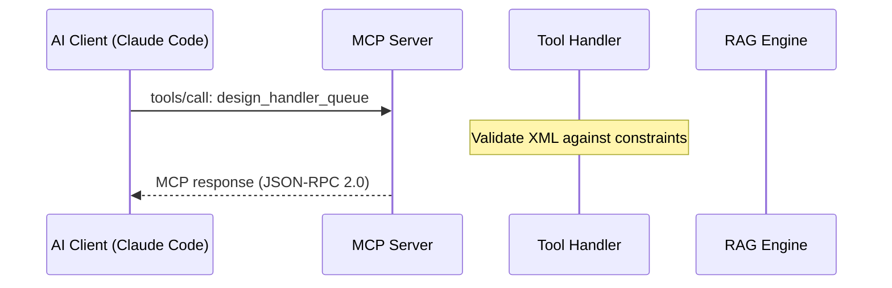
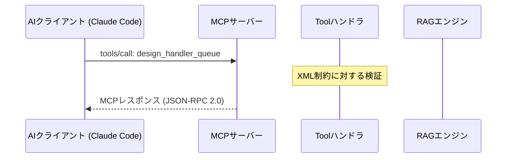

# Doc Translator JA — 英語技術文書 日本語全文翻訳

## Overview

英語で書かれた技術文書（Markdown形式）を、技術用語の正確性を維持したまま日本語に全文翻訳するスキル。Mermaid図、テーブル、コードブロック、ASCII図など、技術文書に特有の要素を正しく処理する。

**提案元の実績:**
- cmd_024: 8ファイル/3サブモジュールの並列翻訳（足軽7+6担当）
  - architecture.md（1126行）: RAG-enhanced MCPサーバーアーキテクチャ設計
  - use-cases.md（1125行）: 12ユースケース、シーケンス図、I/O例
  - overview.md（348行）: プロジェクト概要
  - user-guide.md（600行超）: セットアップ・設定ガイド
  - README.md × 3（nablarch-mcp-server, handler-queue-designer, quality-gate）

**主な用途:**
- プロジェクトドキュメントの日本語化
- OSSプロジェクトの多言語対応
- 技術仕様書の翻訳
- README の日本語版作成・スワップ
- docs/ 配下の一括翻訳

**このスキルの特徴:**
- 翻訳する要素/維持する要素の明確な判定ルール
- Mermaid図・ASCII図内の要素別翻訳制御
- 大規模ファイル（50KB超）への段階的翻訳戦略
- 複数ファイル並列翻訳時のRACE条件防止
- 行数ベースの省略・要約検出
- READMEスワップパターン（_ja → 本体への置換）

## When to Use

以下のいずれかに該当する場合にこのスキルを使用する：

- 「この英語ドキュメントを日本語に翻訳して」
- 「README.mdを日本語版にして」
- 「docs/配下の技術文書を日本語化して」
- 「architecture.mdを日本語に訳して」
- 「複数ファイルを並列で翻訳して」
- 「README_ja.mdを作成して」
- 「英語のMarkdownファイルを日本語化して」
- 「翻訳後にREADMEをスワップして」
- 英語で書かれたMarkdown形式の技術文書を日本語にする必要がある場合
- プロジェクトの国際化対応として日本語版ドキュメントを用意する場合

**トリガーキーワード**: 翻訳, 日本語化, translate, Japanese, 日本語版, README_ja, ドキュメント翻訳, 技術文書翻訳, ローカライズ

## Input Format

```yaml
# 必須パラメータ
source_path: "path/to/english-document.md"    # 翻訳元ファイルパス（Markdown）

# 任意パラメータ（デフォルト値あり）
output_mode: "overwrite"                       # "overwrite" | "suffix" | "custom"
                                               # overwrite: 同一ファイルに上書き
                                               # suffix: {name}_ja.md として保存
                                               # custom: output_path に保存
                                               # デフォルト: "overwrite"
output_path: null                              # output_mode=custom の場合のパス
                                               # デフォルト: null
readme_swap: false                             # READMEスワップを実行するか
                                               # true: _ja作成後に本体を上書きし_jaを削除
                                               # デフォルト: false
batch_mode: false                              # 複数ファイル一括翻訳モード
                                               # デフォルト: false
batch_files: []                                # batch_mode=true の場合のファイルリスト
                                               # デフォルト: []
preserve_front_matter: true                    # YAMLフロントマターを維持するか
                                               # デフォルト: true
```

## Output Format

入力と同じMarkdown形式の日本語翻訳済みファイル。以下を保証する:

- セクション構造（見出しレベル、目次）が元文書と完全一致
- Mermaid図のシンタックスが有効（レンダリング可能）
- コードブロックの内容が変更されていない
- テーブルのカラム数・構造が一致
- 行数が元文書の90%以上（大幅な省略がない）

## Instructions

### Phase 1: 翻訳前分析

翻訳対象ファイルの構造と特性を把握し、翻訳戦略を決定する。

#### Step 1.1: ファイル分析

```
【実行手順】

1. 対象ファイルをReadで読み込む

2. 以下の情報を抽出・記録:
   - 総行数
   - ファイルサイズ（バイト数）
   - セクション構成（見出し一覧）
   - 含まれる特殊要素の種類と数:
     □ Mermaid図（```mermaid ... ```）の数
     □ コードブロック（```java, ```xml 等）の数
     □ ASCII図の数
     □ テーブルの数
     □ YAMLフロントマターの有無
     □ HTMLタグの有無
     □ 画像参照の有無
   - 技術用語の出現頻度（FQCN、Tool名、API名等）

3. 翻訳戦略を決定:
   - 50KB未満: 通常翻訳（Phase 2へ）
   - 50KB以上: 大規模ファイル戦略（Phase 2A へ）
```

#### Step 1.2: 用語リストの事前作成

```
【実行手順】

翻訳前に、維持すべき技術用語のリストを作成する。
このリストは翻訳時の一貫性を保証するために使用する。

1. FQCN（完全修飾クラス名）の抽出:
   - パターン: [a-z]+(\.[a-z]+)+\.[A-Z][a-zA-Z]+
   - 例: nablarch.fw.Handler, org.springframework.boot.SpringApplication

2. Tool名・API名の抽出:
   - コードフォント（`backtick`）で囲まれた技術用語
   - 例: `semantic_search`, `design_handler_queue`, `pgvector`

3. ライブラリ・フレームワーク名の抽出:
   - 例: Spring Boot, MCP Java SDK, Cross-Encoder, Jina embeddings-v4

4. URL・ファイルパスの抽出:
   - http/https で始まるURL
   - ファイルパス（src/main/java/..., docs/...）

5. 維持リストとして整理:
   | 原語 | 種別 | 維持方法 |
   |------|------|---------|
   | nablarch.fw.Handler | FQCN | そのまま維持 |
   | `semantic_search` | Tool名 | そのまま維持 |
   | Spring Boot | FW名 | そのまま維持 |
   | Spring Boot 3.4.x | バージョン付きFW名 | そのまま維持 |
```

### Phase 2: 翻訳実行（通常モード: 50KB未満）

#### Step 2.1: 翻訳ルールの適用

以下の翻訳判定ルールに基づいて翻訳を実行する。

```
╔══════════════════════════════════════════════════════════════╗
║                   翻訳判定フローチャート                      ║
╠══════════════════════════════════════════════════════════════╣
║                                                              ║
║  要素を検出                                                  ║
║    │                                                         ║
║    ├─ コードブロック内？ ──── Yes ──→ 【維持】変更しない     ║
║    │    No                                                   ║
║    │                                                         ║
║    ├─ FQCN？ ──────────── Yes ──→ 【維持】そのまま          ║
║    │    No                                                   ║
║    │                                                         ║
║    ├─ Tool/API/FW名？ ──── Yes ──→ 【維持】そのまま         ║
║    │    No                                                   ║
║    │                                                         ║
║    ├─ URL/ファイルパス？ ── Yes ──→ 【維持】そのまま         ║
║    │    No                                                   ║
║    │                                                         ║
║    ├─ Mermaid図内？                                          ║
║    │    │                                                    ║
║    │    ├─ 技術用語ラベル？ ─ Yes ──→ 【維持】              ║
║    │    │    No                                              ║
║    │    └─ 説明的ラベル？ ── Yes ──→ 【翻訳】日本語に       ║
║    │                                                         ║
║    ├─ ASCII図内？                                            ║
║    │    │                                                    ║
║    │    ├─ 技術用語？ ───── Yes ──→ 【維持】               ║
║    │    │    No                                              ║
║    │    └─ 説明ラベル？ ── Yes ──→ 【翻訳】日本語に        ║
║    │                                                         ║
║    ├─ テーブル内？                                           ║
║    │    │                                                    ║
║    │    ├─ ヘッダー？ ──── Yes ──→ 【翻訳】日本語に        ║
║    │    │    No                                              ║
║    │    ├─ 説明文セル？ ── Yes ──→ 【翻訳】日本語に        ║
║    │    │    No                                              ║
║    │    └─ 技術値セル？ ── Yes ──→ 【維持】そのまま        ║
║    │                                                         ║
║    ├─ 見出し？ ──────────── Yes ──→ 【翻訳】日本語に       ║
║    │    No                                                   ║
║    │                                                         ║
║    ├─ 本文？ ──────────── Yes ──→ 【翻訳】日本語に        ║
║    │    No                                                   ║
║    │                                                         ║
║    └─ メタデータ？                                           ║
║         │                                                    ║
║         ├─ 日付/バージョン？ Yes ──→ 【維持】              ║
║         │    No                                              ║
║         └─ 説明テキスト？ ── Yes ──→ 【翻訳】日本語に      ║
║                                                              ║
╚══════════════════════════════════════════════════════════════╝
```

#### Step 2.2: 要素別翻訳ルール詳細

```
【翻訳する要素（Translation Target）】

1. セクション見出し（#, ##, ### 等）
   - 原語: "## Architecture Overview"
   - 翻訳: "## アーキテクチャ概要"
   - ルール: 技術用語は日本語に適切に訳す。ただし固有名詞はそのまま

2. 本文（パラグラフ）
   - 全文を自然な日本語に翻訳
   - 技術用語はそのまま維持し、周囲の文を日本語にする
   - 原語: "The MCP server uses Spring Boot 3.4.x as its framework."
   - 翻訳: "MCPサーバーはフレームワークとしてSpring Boot 3.4.xを使用する。"

3. 説明文・注記
   - blockquote (>) 内のテキスト
   - 注記（Note:, Warning: 等）の説明部分

4. テーブルヘッダー
   - 原語: | Component | Technology | Rationale |
   - 翻訳: | コンポーネント | 技術 | 選定理由 |
   - ルール: ヘッダーは翻訳。データセルは内容に応じて判定

5. テーブルの説明セル
   - 原語: | **Language** | Java 17+ | Nablarch ecosystem consistency |
   - 翻訳: | **言語** | Java 17+ | Nablarchエコシステムとの一貫性 |
   - ルール: 第1列（項目名）と第3列（説明）は翻訳。第2列（技術値）は維持

6. ユーザーストーリー
   - 原語: "As a Nablarch developer, I want to..."
   - 翻訳: "Nablarch開発者として、..."

7. Mermaid図内の説明的ラベル
   - 原語: Client["AI Coding Tools"]
   - 翻訳: Client["AIコーディングツール"]
   - 原語: Note over Tool: Validate XML
   - 翻訳: Note over Tool: XMLを検証

8. ASCII図内の説明ラベル
   - 原語: │  Semantic Search  |  Hybrid Search  |  Re-ranking  │
   - 翻訳: │  セマンティック検索  |  ハイブリッド検索  |  リランキング  │

【維持する要素（Preserve As-Is）】

1. コードブロック（```...```）の内容
   - Java, XML, SQL, YAML, JSON, Bash等のコード
   - 一切変更しない（コメント内の英語も維持）

2. FQCN（完全修飾クラス名）
   - nablarch.fw.handler.GlobalErrorHandler
   - org.springframework.boot.autoconfigure.SpringBootApplication

3. Tool名・API名・CLI名
   - `semantic_search`, `design_handler_queue`
   - `gh pr create`, `docker compose up`

4. ライブラリ・フレームワーク名
   - Spring Boot, MCP Java SDK, PostgreSQL, pgvector
   - Jina embeddings-v4, Voyage-code-3, Cross-Encoder

5. URL・ファイルパス
   - https://modelcontextprotocol.io/
   - src/main/java/com/example/Application.java
   - docs/architecture.md

6. バージョン番号
   - 3.4.x, 0.17.x, 16+, Java 17+

7. Mermaid図内の技術用語
   - participant VDB as pgvector（pgvectorは維持）
   - MCP->>Tool: dispatch to HandlerQueueDesignTool（クラス名は維持）

8. JSON Schemaのキー名・値
   - "type": "string", "enum": ["web", "rest", "batch"]

9. YAMLフロントマターのキー
   - name:, description: のキー名は維持、値は翻訳

10. 環境変数名
    - SPRING_PROFILES_ACTIVE, JINA_API_KEY
```

#### Step 2.3: セクション単位の翻訳実行

```
【実行手順】

1. ファイルをセクション単位に分割:
   - 見出し（#, ##, ###）を境界として分割
   - 各セクションを独立した翻訳単位とする

2. 各セクションを順番に翻訳:
   a. 見出しを翻訳
   b. 本文を翻訳（翻訳ルールを適用）
   c. テーブルを翻訳（ヘッダー・説明セルのみ）
   d. Mermaid図を処理（説明ラベルのみ翻訳、構文を維持）
   e. コードブロックをそのまま維持
   f. ASCII図を処理（説明ラベルのみ翻訳、レイアウトを維持）

3. セクション間の一貫性を確認:
   - 同じ用語の翻訳が統一されている
   - 参照先（「セクション3を参照」等）が正しい

【注意事項】
- 翻訳中に省略・要約をしないこと（全文翻訳が原則）
- 元文書にない情報を追加しないこと
- 箇条書きの項目数を変えないこと
- 番号付きリストの番号を変えないこと
```

### Phase 2A: 大規模ファイル翻訳（50KB超）

50KBを超えるファイルは、コンテキスト制限を考慮した段階的翻訳を行う。

#### Step 2A.1: ファイル分割戦略

```
【実行手順】

1. ファイルを論理的なチャンクに分割:
   - トップレベル見出し（##）を境界として分割
   - 各チャンクが20KB以下になるように調整
   - Mermaid図・テーブルがチャンク境界をまたがないように注意

2. 分割計画を作成:
   | チャンク# | 行範囲 | セクション | サイズ |
   |-----------|--------|----------|--------|
   | 1 | 1-200 | §1-§3 | 15KB |
   | 2 | 201-400 | §4-§6 | 18KB |
   | ... | ... | ... | ... |

3. 用語リスト（Phase 1.2で作成済み）をチャンク間で共有
```

#### Step 2A.2: チャンク単位の翻訳

```
【実行手順】

1. 各チャンクを順番に翻訳:
   - Readでチャンク範囲を読み込み（offset + limit指定）
   - Phase 2の翻訳ルールを適用
   - 翻訳結果を一時変数に保持

2. チャンク間の一貫性チェック:
   - 用語の翻訳が統一されている
   - セクション参照が正しい
   - 番号の連続性が保たれている

3. 全チャンクを結合して出力ファイルを生成

【重要】
- 各チャンクの翻訳後に前のチャンクとの整合性を確認
- チャンク境界でテーブルやリストが分断されていないか確認
- 50KB超のファイルでは特に省略・要約の誘惑に注意（行数で検証）
```

### Phase 3: 品質検証

#### Step 3.1: 構造一致チェック

```
【品質チェックリスト — 全項目確認必須】

□ 構造チェック
  □ セクション数が元文書と一致する
  □ 見出しレベル（#, ##, ###）が一致する
  □ 目次のリンクが正しい
  □ テーブルのカラム数が一致する
  □ 箇条書き・番号リストの項目数が一致する

□ 行数チェック（省略検出）
  □ 翻訳後の行数が元文書の90%以上である
  □ 行数が大幅に減少しているセクションがない
  □ テーブルの行数が一致する

  【行数確認コマンド】
  wc -l {source_path}       # 元文書の行数
  wc -l {output_path}       # 翻訳後の行数
  # 翻訳後/元文書 >= 0.90 であることを確認

□ Mermaidチェック
  □ Mermaidコードブロックの数が元文書と一致する
  □ Mermaidの構文キーワード（sequenceDiagram, graph, gantt等）が維持されている
  □ participant, Note, ->> 等のMermaid構文要素が壊れていない
  □ 日本語ラベルに含まれる特殊文字がエスケープされている

□ コードブロックチェック
  □ コードブロックの数が元文書と一致する
  □ コードブロックの内容が変更されていない
  □ 言語指定（```java, ```xml等）が維持されている

□ 技術用語チェック
  □ Phase 1.2の用語リストの全項目が翻訳後も維持されている
  □ FQCNが変更されていない
  □ URLが変更されていない
  □ ファイルパスが変更されていない
  □ バージョン番号が変更されていない
```

#### Step 3.2: 翻訳品質チェック

```
□ 翻訳品質チェック
  □ 文体が統一されている（「である」調 or 「です/ます」調）
  □ 同じ英語用語の翻訳が文書内で統一されている
  □ 日本語として自然な文章になっている
  □ 主語・述語の関係が明確である

□ 特殊要素チェック
  □ ASCII図のレイアウトが崩れていない（罫線の位置確認）
  □ テーブルのアライメントが正しい
  □ blockquote (>) の構造が維持されている
  □ リンク [テキスト](URL) のURL部分が維持されている
  □ 画像参照  が維持されている

□ YAMLフロントマターチェック（存在する場合）
  □ キー名が変更されていない
  □ YAML構文が有効である
```

### Phase 4: 出力とポスト処理

#### Step 4.1: ファイル書き込み

```
【実行手順】

1. output_mode に応じてファイルを出力:
   - "overwrite": source_path に上書き
   - "suffix": {name}_ja.md として保存
   - "custom": output_path に保存

2. 出力結果の確認:
   - ファイルが正常に書き込まれたか確認
   - 行数を再確認
```

#### Step 4.2: READMEスワップ（readme_swap=true の場合）

```
【READMEスワップパターン】

README_ja.md → README.md への置換手順:

1. まず翻訳結果を README_ja.md として保存（output_mode=suffix）
2. 翻訳品質を確認（Phase 3のチェック完了）
3. スワップ実行:
   cp README_ja.md README.md
   rm README_ja.md

4. 結果確認:
   - README.md が日本語版になっていること
   - README_ja.md が削除されていること
   - README.md のファイルサイズが翻訳前のREADME_ja.mdと一致すること

【注意事項】
- スワップはコミット前に実行
- git rm ではなく rm を使用（コミットは別の担当者が行う場合）
- スワップ後は元の英語版 README.md は失われる
  （必要に応じて README_en.md としてバックアップ）
```

#### Step 4.3: 結果報告

```
【報告内容】

翻訳結果を以下の形式で報告:

- 翻訳元ファイル: {source_path}
- 翻訳先ファイル: {output_path}
- 元文書行数: {lines_before}
- 翻訳後行数: {lines_after}
- 行数比率: {lines_after / lines_before * 100}%
- Mermaid図数: {mermaid_count}（維持確認済み）
- コードブロック数: {code_block_count}（変更なし確認済み）
- テーブル数: {table_count}（構造一致確認済み）
- 品質チェック: 全項目PASS
```

### Phase 5: 複数ファイル並列翻訳（batch_mode=true）

#### Step 5.1: ファイル分配と RACE条件防止

```
【並列翻訳の設計ルール】

複数足軽で並列翻訳する場合、以下のルールで RACE条件を防止する。

■ ファイル分配の原則
  - 1ファイル = 1足軽の排他的担当（同一ファイルを複数足軽が触らない）
  - 分配は家老が queue/tasks/ashigaruN.yaml で指定

■ ディレクトリレベルの排他制御
  - 同一ディレクトリ内のファイルは1足軽にまとめて割り当て推奨
  - 例: docs/ 配下全体を1足軽に割り当て

■ 分配例（cmd_024の実績パターン）

  足軽6: nablarch-mcp-server/docs/architecture.md
         nablarch-mcp-server/docs/use-cases.md
  足軽7: nablarch-mcp-server/docs/overview.md
         nablarch-mcp-server/docs/user-guide.md
  足軽8: nablarch-mcp-server/README.md
         nablarch-handler-queue-designer/README.md

■ 禁止事項
  - 他の足軽が担当するファイルに触れない
  - 共有ファイル（目次ファイル等）の同時編集
  - コミットは各足軽が行わず、家老がまとめて実行

■ 報告
  - 各足軽は自分の担当ファイルの翻訳完了を個別に報告
  - 全足軽の完了後、家老が一括コミット
```

#### Step 5.2: 用語統一の保証

```
【並列翻訳時の用語統一】

複数ファイルを並列翻訳する場合、翻訳用語の統一が課題となる。

■ 用語統一の方法

1. 事前用語リストの共有:
   - 翻訳開始前に、主要な技術用語の翻訳対照表を作成
   - 全足軽がこのリストを参照して翻訳

2. 用語対照表のフォーマット:
   | 英語 | 日本語訳 | 備考 |
   |------|---------|------|
   | Handler Queue | ハンドラキュー | カタカナ |
   | Architecture | アーキテクチャ | カタカナ |
   | Semantic Search | セマンティック検索 | カタカナ+漢語 |
   | Re-ranking | リランキング | カタカナ |
   | Knowledge Base | 知識ベース | 漢語+カタカナ |
   | Use Case | ユースケース | カタカナ |
   | Deliverable | 成果物 | 漢語 |

3. 判断に迷う用語は家老に確認:
   - 複数の訳語がありうる場合（例: "resource" → リソース/資源）
   - 固有名詞の扱い（例: "Fintan" → そのまま）
```

## Examples

### Example 1: 単一ファイル翻訳（上書きモード）

```yaml
# 入力
source_path: "nablarch-mcp-server/docs/architecture.md"
output_mode: "overwrite"
```

```
# 実行結果

翻訳元: nablarch-mcp-server/docs/architecture.md
翻訳先: nablarch-mcp-server/docs/architecture.md（上書き）
元文書行数: 1124
翻訳後行数: 1126（100.2%）
Mermaid図: 4個（全て構文維持確認済み）
コードブロック: 15個（全て変更なし確認済み）
品質チェック: 全項目PASS
```

### Example 2: README翻訳 + スワップ

```yaml
# 入力
source_path: "nablarch-mcp-server/README.md"
output_mode: "suffix"
readme_swap: true
```

```
# 実行フロー
1. README.md を読み込み
2. 翻訳して README_ja.md として保存
3. 品質チェック実施
4. スワップ: cp README_ja.md README.md && rm README_ja.md
5. 結果: README.md が日本語版に
```

### Example 3: 複数ファイル並列翻訳

```yaml
# 入力（家老がタスク分配）
batch_mode: true
batch_files:
  - "docs/architecture.md"
  - "docs/use-cases.md"
  - "docs/overview.md"
  - "docs/user-guide.md"
```

```
# 分配計画（家老が作成）
足軽A: docs/architecture.md, docs/use-cases.md  （大規模ファイル2件）
足軽B: docs/overview.md, docs/user-guide.md     （中規模ファイル2件）

# 各足軽は自分の担当ファイルのみ翻訳
# 全完了後、家老が一括コミット
```

### Example 4: Mermaid図の翻訳例

```
【翻訳前（英語）】


【翻訳後（日本語）】


【ポイント】
- participant の表示名: "AI Client" → "AIクライアント"（説明的→翻訳）
- "Claude Code": そのまま維持（固有名詞）
- "tools/call: design_handler_queue": そのまま維持（APIコール）
- "Validate XML against constraints" → "XML制約に対する検証"（説明文→翻訳）
- "JSON-RPC 2.0": そのまま維持（プロトコル名）
```

### Example 5: テーブルの翻訳例

```
【翻訳前】
| Layer | Technology | Version | Rationale |
|---|---|---|---|
| **Language** | Java | 17+ | Nablarch ecosystem consistency |
| **Framework** | Spring Boot | 3.x | MCP Boot Starter support |

【翻訳後】
| レイヤー | 技術 | バージョン | 選定理由 |
|---|---|---|---|
| **言語** | Java | 17+ | Nablarchエコシステムとの一貫性 |
| **フレームワーク** | Spring Boot | 3.x | MCP Boot Starterのサポート |

【ポイント】
- ヘッダー行: 全て翻訳
- 第1列（項目名）: 翻訳
- 第2列（技術名）: 維持（Java, Spring Boot）
- 第3列（バージョン）: 維持（17+, 3.x）
- 第4列（説明文）: 翻訳
```

## Anti-Patterns

### 避けるべきこと

1. **省略・要約翻訳**
   - 「長いので要約しました」は絶対に不可
   - 全文翻訳が原則。行数で省略を検出
   - 対策: Phase 3の行数チェック（90%以上）を必ず実施

2. **コードブロック内の翻訳**
   - コード内のコメントや文字列を翻訳してはならない
   - コンパイルエラーの原因になる
   - 対策: コードブロック（```...```）の内容は一切変更しない

3. **Mermaid構文の破壊**
   - 構文キーワード（sequenceDiagram, graph, participant等）の翻訳
   - 矢印（->>, -->>）や構文記号の変更
   - 日本語ラベル内の特殊文字（|, {, }）の未エスケープ
   - 対策: Mermaid図は要素単位で慎重に処理

4. **FQCNの翻訳**
   - nablarch.fw.Handler → ナブラーク.fw.ハンドラー（絶対不可）
   - 対策: Phase 1.2の用語リストで事前にFQCNを全て抽出・保護

5. **URLの改変**
   - URLの一部を翻訳してリンク切れを起こす
   - 対策: URL正規表現で全URLを事前に抽出し、維持リストに登録

6. **ASCII図のレイアウト崩れ**
   - 日本語は全角文字のため、ASCII図の幅が変わる
   - 罫線（│, ─, ┌, ┐等）の位置がずれる
   - 対策: 日本語置換後にASCII図の罫線位置を手動調整

7. **文体の混在**
   - 同一文書内で「です/ます」調と「である」調が混在
   - 対策: 文書全体で統一。技術文書では「である」調を推奨

8. **並列翻訳時のファイル競合**
   - 複数足軽が同一ファイルを同時編集
   - 対策: Phase 5.1のRACE条件防止ルールを厳守

9. **用語の不統一**
   - 同一文書内で "handler queue" を「ハンドラキュー」と「ハンドラーキュー」で混在
   - 対策: Phase 1.2の用語リストを翻訳全体で参照

10. **フロントマターの破壊**
    - YAMLフロントマターのキー名を翻訳してパースエラーを起こす
    - 対策: preserve_front_matter=true の場合、キー名は維持

## Appendix

### A. よく使う技術用語の翻訳対照表

| 英語 | 日本語訳 | 備考 |
|------|---------|------|
| Architecture | アーキテクチャ | カタカナ |
| Handler Queue | ハンドラキュー | 長音なし（Nablarch慣例） |
| Semantic Search | セマンティック検索 | カタカナ+漢語 |
| Hybrid Search | ハイブリッド検索 | カタカナ+漢語 |
| Re-ranking | リランキング | カタカナ |
| Embedding | 埋め込み / Embedding | 文脈による |
| Knowledge Base | 知識ベース | 漢語+カタカナ |
| Use Case | ユースケース | カタカナ |
| Deliverable | 成果物 | 漢語 |
| Sequence Diagram | シーケンス図 | カタカナ+漢語 |
| Component | コンポーネント | カタカナ |
| Transport | トランスポート | カタカナ |
| Pipeline | パイプライン | カタカナ |
| Middleware | ミドルウェア | カタカナ |
| Framework | フレームワーク | カタカナ |
| Deployment | デプロイメント / デプロイ | 文脈による |
| Authentication | 認証 | 漢語 |
| Authorization | 認可 | 漢語 |
| Configuration | 設定 | 漢語 |
| Specification | 仕様 | 漢語 |
| Repository | リポジトリ | カタカナ |
| Troubleshooting | トラブルシューティング | カタカナ |
| Migration | マイグレーション | カタカナ |
| Optimization | 最適化 | 漢語 |
| Validation | バリデーション | カタカナ |
| Scaffolding | スキャフォールディング | カタカナ |

### B. 翻訳しない技術用語の例

以下の用語は翻訳せずそのまま維持する:

- **固有名詞**: Spring Boot, Nablarch, PostgreSQL, pgvector, Docker, Claude Code, MCP
- **プロトコル**: JSON-RPC 2.0, HTTP, HTTPS, TLS, OAuth 2.0, SSE
- **フォーマット**: JSON, XML, YAML, CSV, Markdown
- **ツール名**: Gradle, Maven, npm, gh, MCP Inspector
- **SDK名**: MCP Java SDK, Spring AI MCP
- **モデル名**: Jina embeddings-v4, Voyage-code-3, Cross-Encoder
- **アルゴリズム**: BM25, Reciprocal Rank Fusion, ivfflat
- **拡張子**: .java, .xml, .yml, .md, .sql
- **環境変数**: SPRING_PROFILES_ACTIVE, JINA_API_KEY

### C. Mermaid構文で注意が必要なパターン

```
1. participant の表示名にコロンを含む場合:
   NG: participant Client as AI Client: Claude Code
   OK: participant Client as "AIクライアント: Claude Code"
       （引用符で囲む）

2. Noteの日本語テキスト:
   OK: Note over Tool: XMLを検証
   NG: Note over Tool: XML|を|検証
       （パイプは構文記号なので使用不可）

3. graph/flowchartの日本語ラベル:
   OK: A["セマンティック検索"]
   NG: A[セマンティック検索]
       （日本語は引用符で囲む方が安全）

4. subgraphの日本語名:
   OK: subgraph Phase1["Phase 1: 基盤構築"]
   NG: subgraph Phase 1: 基盤構築
       （スペースとコロンは引用符内に）
```

### D. 品質チェック用コマンド

```bash
# 行数比較
echo "元文書: $(wc -l < original.md) 行"
echo "翻訳後: $(wc -l < translated.md) 行"

# Mermaid図の数を比較
echo "元文書Mermaid: $(grep -c '```mermaid' original.md)"
echo "翻訳後Mermaid: $(grep -c '```mermaid' translated.md)"

# コードブロックの数を比較
echo "元文書コードブロック: $(grep -c '```' original.md)"
echo "翻訳後コードブロック: $(grep -c '```' translated.md)"

# URL抽出・比較
diff <(grep -oP 'https?://[^\s)]+' original.md | sort) \
     <(grep -oP 'https?://[^\s)]+' translated.md | sort)

# FQCN抽出・比較
diff <(grep -oP '[a-z]+(\.[a-z]+)+\.[A-Z][a-zA-Z]+' original.md | sort -u) \
     <(grep -oP '[a-z]+(\.[a-z]+)+\.[A-Z][a-zA-Z]+' translated.md | sort -u)

# テーブル行数の比較
echo "元文書テーブル行: $(grep -c '|.*|.*|' original.md)"
echo "翻訳後テーブル行: $(grep -c '|.*|.*|' translated.md)"
```
