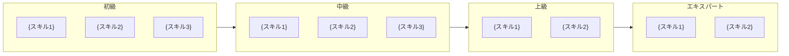
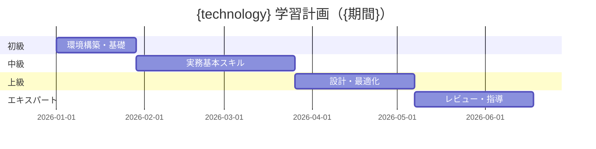
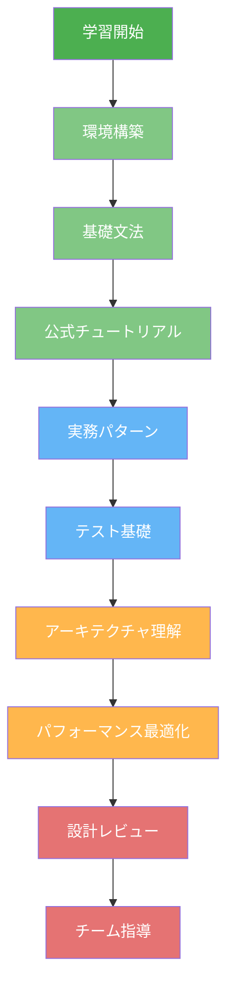
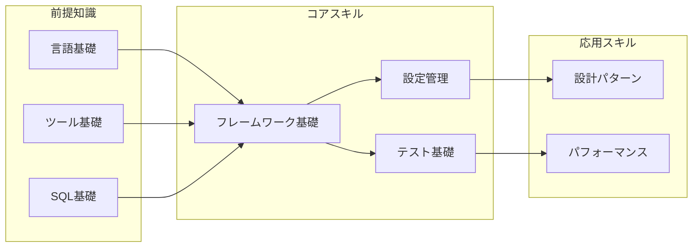
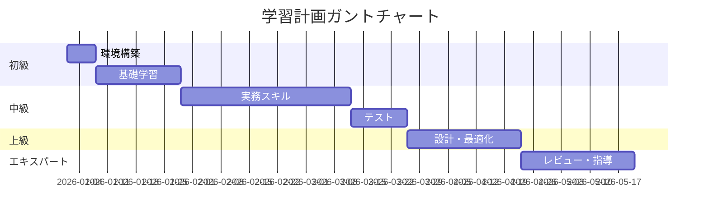

# Engineer Training Plan Generator — エンジニア育成学習計画 包括生成

## Overview

特定の技術・フレームワークについて、学習者のレベルと期間に応じた包括的な育成学習計画を自動生成するスキル。前提知識マップからハンズオン課題、評価基準まで、実務で即座に活用できる学習計画書を出力する。

**提案元の実績:**
- O-024 Nablarchバッチエンジニア育成学習計画（926行）: 初級→エキスパートの4段階ロードマップ、スキルマップ、学習コンテンツ、ハンドラキュー解説、テストFW解説を包括生成

**主な用途:**
- 新規技術導入時のチーム育成計画の策定
- 新人エンジニアのオンボーディングカリキュラム設計
- 技術研修の教材・課題セットの作成
- スキルアセスメントの基準定義
- 技術ロードマップの視覚化

**このスキルの特徴:**
- WebSearch + WebFetch による最新の教材・リソース収集（URL検証付き）
- 4段階レベル別（初級/中級/上級/エキスパート）のロードマップ生成
- Mermaid図による学習パス・スキルマップの視覚化
- FQCN・コード例の正確性を最優先する品質基準
- 出力テンプレートによる統一的なフォーマット

## When to Use

以下のいずれかに該当する場合にこのスキルを使用する：

- 「○○のエンジニア育成計画を作って」
- 「○○の学習ロードマップを生成して」
- 「○○を初級から上級まで学ぶカリキュラムを設計して」
- 「新人向けに○○の研修計画を作って」
- 「○○エンジニアのスキルマップを定義して」
- 「○○の学習教材とハンズオン課題をまとめて」
- 「○○の技術研修カリキュラムを包括的に作成して」
- 「○○の技術習得マイルストーンと評価基準を設計して」
- チームメンバーの技術レベル向上のための体系的な計画が必要な場合
- 技術選定後、チームへの展開計画を立てる必要がある場合

**トリガーキーワード**: 育成計画, 学習計画, ロードマップ, カリキュラム, 研修, トレーニング, スキルマップ, 学習パス, オンボーディング, 教材, ハンズオン, training plan, learning path

## Input Format

```yaml
# 必須パラメータ
technology: "対象技術/フレームワーク名"   # 例: "Nablarch バッチ", "Spring Boot", "React", "Kubernetes"

# 任意パラメータ（デフォルト値あり）
learner_level: "all"                      # "beginner" | "intermediate" | "advanced" | "expert" | "all"
                                          # デフォルト: "all"（全レベルを網羅）
learning_period: "6months"                # "1month" | "3months" | "6months" | "1year"
                                          # デフォルト: "6months"
language: "ja"                            # "ja" | "en" — 出力言語
                                          # デフォルト: "ja"
focus_area: null                          # 特定領域に絞る場合（例: "バッチ処理", "REST API", "認証"）
                                          # デフォルト: null（全領域）
output_path: null                         # 出力ファイルパス
                                          # デフォルト: "output/O-xxx_{technology}_training.md"
include_code_examples: true               # コード例を含めるか
                                          # デフォルト: true
include_hands_on: true                    # ハンズオン課題を含めるか
                                          # デフォルト: true
```

## Output Format

出力はMarkdown形式の学習計画書。以下のセクション構成:

```
# {technology} エンジニア育成 学習計画

> メタデータ（作成日、パラメータ等）

## 目次

## 1. スキルロードマップ
  ### 1.1 スキルロードマップ ビジュアル図（Mermaid or ASCII）
  ### 1.2 レベル別スキルマップ（テーブル形式）

## 2. 学習ステップ
  ### 2.1 初級（Beginner）
  ### 2.2 中級（Intermediate）
  ### 2.3 上級（Advanced）
  ### 2.4 エキスパート（Expert）

## 3. 学習コンテンツ・教材
  ### 3.1 公式ドキュメント
  ### 3.2 書籍
  ### 3.3 Webリソース
  ### 3.4 動画・コース

## 4. 解説書・リファレンス
  ### 4.1 アーキテクチャ解説
  ### 4.2 主要コンポーネント解説
  ### 4.3 設定・構成パターン

## 5. ハンズオン課題
  ### 5.1 初級課題
  ### 5.2 中級課題
  ### 5.3 上級課題

## 6. 評価基準・マイルストーン

## 7. FAQ / よくある躓きポイント

## 8. 学習計画テンプレート（週次/月次）
```

## Instructions

### Phase 1: 対象技術の調査・情報収集

対象技術の全体像を把握し、学習計画の基盤となる情報を収集する。

#### Step 1.1: パラメータ確認

```
【確認事項 — ユーザーから取得】

1. 対象技術/フレームワーク名（必須）
   - 例: "Nablarchバッチ", "Spring Boot 3.x", "React 19", "Kubernetes"
   - バージョンも指定がある場合は取得

2. 学習者の現在レベル（任意）
   - 初級/中級/上級/全レベル
   - 前提知識の有無（Java経験あり、等）

3. 学習期間（任意）
   - 1ヶ月/3ヶ月/6ヶ月/1年

4. 特定領域フォーカス（任意）
   - 全体を網羅 or 特定領域（バッチ処理、REST API等）に絞る

5. 出力ファイルパス（任意）
   - 指定がなければデフォルトパスを使用

【デフォルト値の適用】
- 指定がない項目はデフォルト値を使用
- ユーザーに過度な質問はしない（最低限 technology のみで開始可能）
```

#### Step 1.2: 技術概要の調査

```
【実行手順】

1. WebSearchで対象技術の公式サイト・ドキュメントを特定:
   - "{technology} official documentation"
   - "{technology} getting started guide"
   - "{technology} architecture overview"

2. WebFetchで公式ドキュメントの構造を確認:
   - トップページ → 目次構造の把握
   - アーキテクチャページ → 中核概念の特定
   - チュートリアル → 学習パスの参考

3. 以下の情報を収集:
   - 技術の中核概念（3-5個）
   - 主要コンポーネント/モジュール
   - バージョン情報（最新安定版）
   - 前提知識（必要なベース技術）
   - エコシステム（関連ツール・ライブラリ）
```

#### Step 1.3: 学習リソースの収集

```
【実行手順】

1. WebSearchで学習リソースを収集（各カテゴリ最低3件）:
   - "{technology} tutorial beginner"
   - "{technology} best practices"
   - "{technology} 入門 学習" （日本語リソース）
   - "{technology} online course"
   - "{technology} book recommendation"
   - "{technology} hands-on exercise"

2. 収集した各リソースについて以下を記録:
   - タイトル
   - URL
   - 種別（公式ドキュメント/書籍/Web記事/動画/コース）
   - 対象レベル（初級/中級/上級）
   - 言語（日本語/英語）

3. WebFetchでURL有効性を確認（404チェック）:
   - 各URLにアクセスして内容を確認
   - 無効なURLは除外し、代替リソースを検索
   - 最終更新日を確認（古すぎるリソースは注記）

【品質基準】
- 公式ドキュメントは必ず含めること
- 各レベルに最低3件のリソースを確保
- URLは全て有効性を検証済みであること
```

#### Step 1.4: コミュニティ情報の収集

```
【実行手順】

1. WebSearchでコミュニティ情報を収集:
   - "{technology} common mistakes"
   - "{technology} FAQ"
   - "{technology} troubleshooting"
   - "{technology} よくある間違い"
   - "{technology} つまずきポイント"

2. Stack Overflow / GitHub Issues / Qiita / Zenn等から:
   - よくある質問パターンを3-5件特定
   - 初学者が躓きやすいポイントを5件以上特定
   - ベストプラクティスとアンチパターンを収集

3. 収集した情報をFAQセクション用に整理
```

### Phase 2: スキルロードマップの設計

収集した情報を基に、レベル別のスキルロードマップを設計する。

#### Step 2.1: 前提知識マップの作成

```
【実行手順】

1. 対象技術の学習に必要な前提知識を洗い出す:
   - 言語レベルの前提（例: Java SE基礎, JavaScript ES6+）
   - ツールレベルの前提（例: Maven, npm, Docker）
   - 概念レベルの前提（例: HTTP, SQL, REST, OOP）

2. 前提知識を依存関係順に整理:
   - 必須の前提（これがないと学習不可能）
   - 推奨の前提（あると学習が加速する）
   - 関連知識（あると理解が深まる）

3. Mermaid図で前提知識マップを生成:

   ```mermaid
   graph TD
       A[言語基礎] --> B[フレームワーク基礎]
       C[ツール基礎] --> B
       B --> D[実践レベル]
       D --> E[応用レベル]
   ```
```

#### Step 2.2: レベル別スキルマップの定義

```
【各レベルの設計ルール】

■ 初級（Beginner） — 基礎理解・環境構築・Hello World
  - 前提知識の確認・補強
  - 開発環境のセットアップ
  - 公式チュートリアルの完走
  - 基本概念の理解（5-8スキル）
  - 学習期間目安: 全体の25%

■ 中級（Intermediate） — 実務の基本スキル
  - 中核概念の深い理解
  - 実務で使う基本パターンの習得
  - テスト基礎
  - 実務で頻出するタスクの独力実行（8-12スキル）
  - 学習期間目安: 全体の35%

■ 上級（Advanced） — 設計・最適化・トラブルシューティング
  - アーキテクチャレベルの理解
  - パフォーマンスチューニング
  - エラー設計・障害対応
  - テスト応用（8-10スキル）
  - 学習期間目安: 全体の25%

■ エキスパート（Expert） — 設計レビュー・チーム指導・FW拡張
  - アーキテクチャ設計・レビュー
  - フレームワーク拡張・カスタマイズ
  - チームメンバーの技術指導
  - コミュニティへの貢献（5-8スキル）
  - 学習期間目安: 全体の15%

【スキルマップテーブルの形式】

| # | スキル | 詳細 | 達成基準 |
|---|--------|------|----------|
| 1 | {スキル名} | {具体的な学習内容} | {観測可能な達成基準} |
```

#### Step 2.3: スキルロードマップ ビジュアル図の生成

```
【ASCII図テンプレート】

                    {technology} エンジニア スキルロードマップ

  ┌─────────────────────────────────────────────────────────────────────┐
  │                                                                     │
  │  ┌──────────┐   ┌──────────┐   ┌──────────┐   ┌────────────────┐   │
  │  │  初級    │──▶│  中級    │──▶│  上級    │──▶│ エキスパート   │   │
  │  │ Beginner │   │ Inter-   │   │ Advanced │   │    Expert      │   │
  │  │          │   │ mediate  │   │          │   │                │   │
  │  └──────────┘   └──────────┘   └──────────┘   └────────────────┘   │
  │       │              │              │                │              │
  │       ▼              ▼              ▼                ▼              │
  │  ┌──────────┐   ┌──────────┐   ┌──────────┐   ┌────────────────┐  │
  │  │{スキル1} │   │{スキル1} │   │{スキル1} │   │{スキル1}       │  │
  │  │{スキル2} │   │{スキル2} │   │{スキル2} │   │{スキル2}       │  │
  │  │{スキル3} │   │{スキル3} │   │{スキル3} │   │{スキル3}       │  │
  │  │{スキル4} │   │{スキル4} │   │{スキル4} │   │{スキル4}       │  │
  │  └──────────┘   └──────────┘   └──────────┘   └────────────────┘  │
  │                                                                     │
  │  目安期間:                                                          │
  │  ├── {期間1} ──┤├── {期間2} ──┤├── {期間3} ─┤├── {期間4} ────┤    │
  │                                                                     │
  └─────────────────────────────────────────────────────────────────────┘

【Mermaid図テンプレート（代替）】


```

### Phase 3: 学習ステップの詳細化

各レベルの学習ステップを具体的なカリキュラムとして記述する。

#### Step 3.1: 初級ステップの詳細化

```
【各学習ステップの記述ルール】

## 2.1 初級（Beginner）— {概要}

### 学習目標
- {目標1}
- {目標2}
- {目標3}

### ステップ一覧

| # | ステップ | 学習内容 | 教材 | 成果物 | 期間目安 |
|---|---------|---------|------|--------|---------|
| 1 | {ステップ名} | {具体的な内容} | {教材リンク} | {成果物} | {日数} |

### 詳細

#### ステップ X: {ステップ名}

**学習内容:**
- {箇条書きで具体的に}

**推奨教材:**
- {教材名} ({URL}) — {コメント}

**ハンズオン課題:**
```
課題: {課題タイトル}
目的: {何を学ぶか}
手順:
1. {手順1}
2. {手順2}
3. {手順3}
期待成果物: {何ができたらOKか}
```

**達成チェック:**
- [ ] {チェック項目1}
- [ ] {チェック項目2}
- [ ] {チェック項目3}
```

#### Step 3.2: 中級・上級・エキスパートステップの詳細化

```
【ルール】
- Step 3.1 と同じ形式で中級/上級/エキスパートを記述
- レベルが上がるごとに:
  - ハンズオン課題の複雑度を上げる
  - コード例にFQCN（完全修飾クラス名）を含める
  - アーキテクチャ・設計観点を追加
  - トラブルシューティングシナリオを含める

【FQCN精度のルール】
- コード例に登場するクラス名は必ずFQCNで記述
- WebFetchまたは公式Javadocで実在を確認すること
- 確認できないクラス名は「※要確認」を付記
- 例: nablarch.fw.batch.ee.listener.NablarchListenerExecutor（確認済み）
- 例: com.example.MyBatchAction（ユーザー実装の例示）

【コード例のルール】
- 実際にコンパイル・実行可能なコード例を優先
- インポート文を省略しない（FQCNでの確認を兼ねる）
- ビルドファイル（pom.xml, build.gradle等）の依存定義も含める
- バージョン番号は調査時点の最新安定版を記載
```

### Phase 4: 学習リソースの整理

#### Step 4.1: 公式ドキュメント一覧の作成

```
【形式】

### 3.1 公式ドキュメント

| # | ドキュメント | URL | 対象レベル | 内容 |
|---|-------------|-----|----------|------|
| 1 | {タイトル} | {URL} | {レベル} | {概要説明} |

【ルール】
- 全URLはWebFetchで有効性を確認済みであること
- 404のURLは代替URLを記載するか除外
- 最終確認日を注記
```

#### Step 4.2: 書籍・外部リソース一覧の作成

```
【形式】

### 3.2 書籍

| # | 教材 | 種別 | 対象 | 内容 |
|---|------|------|------|------|
| 1 | 「{書名}」（{出版社}） | 書籍 | {レベル} | {概要} |

### 3.3 Webリソース

| # | リソース | URL | 対象 | 内容 |
|---|---------|-----|------|------|
| 1 | {名称} | {URL} | {レベル} | {概要} |

### 3.4 動画・コース

| # | コース名 | プラットフォーム | 対象 | URL |
|---|---------|----------------|------|-----|
| 1 | {名称} | Udemy/YouTube等 | {レベル} | {URL} |

【ルール】
- 書籍は日本語/英語それぞれ最低2冊推奨
- Webリソースは各レベル3件以上
- 全URLの有効性確認必須
- 有料/無料を明記
```

### Phase 5: 解説書・リファレンスの作成

#### Step 5.1: アーキテクチャ解説の作成

```
【実行手順】

1. 対象技術の中核アーキテクチャを図示:
   - ASCII図またはMermaid図でコンポーネント関係を視覚化
   - 処理フローを順序図で表現
   - 設定ファイルの構造を例示

2. 主要コンポーネントの解説:
   - 各コンポーネントの役割と責務
   - FQCN（完全修飾クラス名）を明記
   - 典型的な使用パターン

3. 設定・構成パターンの解説:
   - 代表的な設定ファイル（XML/YAML/JSON）の例
   - 設定値の意味と推奨値
   - 環境別（開発/テスト/本番）の設定差分

【品質基準】
- FQCNは公式Javadocまたはソースコードで確認済みであること
- コード例は実行可能であること（依存関係の明示含む）
- 図はASCII図を基本とし、Mermaid図は補助として使用
```

#### Step 5.2: よくある躓きポイント（FAQ）の作成

```
【形式】

## 7. FAQ / よくある躓きポイント

### Q1: {質問}

**症状**: {どのような状態になるか}

**原因**: {なぜそうなるか}

**解決策**:
1. {解決手順1}
2. {解決手順2}

**参考**: {URL}

---

【ルール】
- 最低5件のFAQを作成
- Phase 1.4で収集したコミュニティ情報を活用
- 各FAQに解決策と参考URLを付与
- エラーメッセージは正確に記載（検索可能にする）
```

### Phase 6: ハンズオン課題・評価基準の設計

#### Step 6.1: ハンズオン課題の設計

```
【各レベルの課題設計ルール】

■ 初級課題（2-3題）
  - 公式チュートリアルの延長線上
  - 手順を詳細に記載（迷わず完了できるレベル）
  - 期待成果物を明確に定義

■ 中級課題（2-3題）
  - 実務に近いシナリオ
  - 複数の技術要素の組み合わせ
  - 手順のヒントはあるが詳細は自分で考える

■ 上級課題（1-2題）
  - 設計判断を含むシナリオ
  - パフォーマンス/セキュリティ要件を含む
  - テストの作成を含む

【課題テンプレート】

### 課題X: {課題タイトル}

**レベル**: {初級/中級/上級}
**想定時間**: {時間}
**前提**: {必要な事前準備}

**シナリオ**:
{具体的なシナリオの説明}

**要件**:
1. {要件1}
2. {要件2}
3. {要件3}

**ヒント**:
- {ヒント1}
- {ヒント2}

**評価基準**:
- [ ] {基準1}
- [ ] {基準2}
- [ ] {基準3}

**模範解答の方針**（指導者向け）:
- {方針概要}
```

#### Step 6.2: 評価基準・マイルストーンの定義

```
【形式】

## 6. 評価基準・マイルストーン

### レベル別マイルストーン

| マイルストーン | レベル | 達成基準 | 評価方法 |
|--------------|--------|---------|---------|
| M1: {名称} | 初級完了 | {基準} | {方法} |
| M2: {名称} | 中級完了 | {基準} | {方法} |
| M3: {名称} | 上級完了 | {基準} | {方法} |
| M4: {名称} | エキスパート | {基準} | {方法} |

### 評価方法

1. **知識テスト**: 概念理解の確認（各レベル10問程度のクイズ）
2. **コードレビュー**: ハンズオン課題の成果物レビュー
3. **設計レビュー**: 上級以上でアーキテクチャ設計のレビュー
4. **ペアプログラミング**: 実務タスクでのペアプログラミング評価
```

#### Step 6.3: 学習計画テンプレートの生成

```
【週次計画テンプレート】

## 8. 学習計画テンプレート

### {期間}版 学習計画

| 週 | フェーズ | 学習内容 | 達成目標 | 成果物 |
|----|---------|---------|---------|--------|
| 1 | 初級 | {内容} | {目標} | {成果物} |
| 2 | 初級 | {内容} | {目標} | {成果物} |
| ... | ... | ... | ... | ... |

【月次マイルストーン】


```

### Phase 7: 品質検証・出力

#### Step 7.1: 品質チェックの実行

```
【品質チェックリスト — 全項目確認必須】

□ 構造チェック
  □ 全セクション（1-8）が揃っている
  □ 各レベル（初級/中級/上級/エキスパート）のスキルマップがある
  □ 各レベルにハンズオン課題がある（include_hands_on=true の場合）
  □ 評価基準・マイルストーンが定義されている

□ リソースチェック
  □ 全URLをWebFetchで有効性確認済み（404なし）
  □ 各レベルに最低3件の学習リソースがある
  □ 公式ドキュメントが含まれている
  □ 日本語リソースが含まれている（language=ja の場合）
  □ リソースの最終更新日が1年以内（古いものは注記あり）

□ 技術正確性チェック
  □ FQCNが正確である（公式ドキュメント/ソースで確認済み）
  □ コード例がコンパイル可能である（依存関係の明示含む）
  □ バージョン番号が最新安定版を反映している
  □ 設定例が実際に動作する

□ 完全性チェック
  □ 500行以上の出力（十分な詳細度）
  □ Mermaid図/ASCII図が正しくレンダリングされる
  □ テーブルのフォーマットが崩れていない
  □ 目次のリンクが正しい

□ 教育効果チェック
  □ 各スキルの「達成基準」が観測可能（「理解している」ではなく「説明できる」「実装できる」）
  □ 学習ステップが前提知識に基づく順序になっている
  □ ハンズオン課題が段階的に難易度が上がっている
  □ FAQに最低5件のエントリがある
```

#### Step 7.2: 出力とファイル書き込み

```
【実行手順】

1. 全セクションを統合してMarkdownファイルを生成
2. 出力パスにファイルを書き込み
3. 行数を確認（wc -l で500行以上であること）
4. ファイルの先頭にメタデータを付与:

   > **作成日**: {日付}
   > **対象技術**: {technology}
   > **対象レベル**: {learner_level}
   > **学習期間**: {learning_period}
   > **作成者**: {agent_id}

5. 結果をユーザーに報告:
   - 出力ファイルパス
   - 総行数
   - レベル別スキル数
   - 収集リソース数
   - 品質チェック結果
```

## Examples

### Example 1: Nablarchバッチエンジニア育成計画

```yaml
# 入力
technology: "Nablarch バッチ"
learner_level: "all"
learning_period: "6months"
language: "ja"
focus_area: "バッチ処理"
```

```markdown
# 出力（抜粋）

## 1.2 レベル別スキルマップ

### 初級（Beginner）— Java基礎 + Nablarch入門

| # | スキル | 詳細 | 達成基準 |
|---|--------|------|----------|
| 1 | Java SE基礎 | Java 17構文、コレクション、ストリームAPI | FizzBuzzからCRUDアプリまで書ける |
| 2 | Maven基礎 | pom.xml、依存管理、ビルドライフサイクル | `mvn package -P prod` の意味を説明できる |
| 3 | Nablarchコンセプト | ハンドラキューアーキテクチャの概念理解 | パイプライン処理モデルを図で説明できる |
...

## 4.1 アーキテクチャ解説

### ハンドラキュー構成（都度起動バッチ）

  ┌─────────────────── メインスレッド ───────────────────┐
  │  [1] StatusCodeConvertHandler                        │
  │  [2] ThreadContextClearHandler                       │
  │  [3] GlobalErrorHandler                              │
  │  ...                                                 │
  └──────────────────────────────────────────────────────┘
```

### Example 2: Spring Boot入門

```yaml
# 入力
technology: "Spring Boot 3.x"
learner_level: "beginner"
learning_period: "3months"
language: "ja"
```

出力: Spring Boot 3.xの初級に特化した学習計画（中級以上は「次のステップ」として概要のみ）

### Example 3: React + TypeScript

```yaml
# 入力
technology: "React 19 + TypeScript"
learner_level: "intermediate"
learning_period: "1month"
language: "ja"
focus_area: null
```

出力: React + TypeScriptの中級に特化した学習計画（初級は前提知識チェックリストのみ）

## Anti-Patterns

### 避けるべきこと

1. **未検証URLの掲載**
   - 全URLはWebFetchで有効性を確認すること
   - 404になるURLは読者の信頼を損なう
   - 対策: Phase 4で全URL検証を必須化

2. **抽象的な達成基準**
   - NG: 「○○を理解している」（観測不可能）
   - OK: 「○○を図で説明できる」「○○を独力で実装できる」
   - 対策: 「できる」で終わる達成基準のみ使用

3. **不正確なFQCN・コード例**
   - 存在しないクラス名、コンパイルできないコード例
   - 対策: Phase 3で公式ドキュメント/Javadocで確認必須

4. **レベル間の断絶**
   - 初級→中級の間に大きな知識ギャップがある
   - 対策: 各レベルの最後に「次のレベルへの橋渡し」セクションを設ける

5. **リソースの偏り**
   - 英語リソースのみ、書籍のみ等の偏った教材一覧
   - 対策: 公式ドキュメント/書籍/Web/動画のバランスを確保

6. **ハンズオン課題のない計画**
   - 読むだけの計画は実践力が身につかない
   - 対策: 各レベルに最低1つのハンズオン課題を含める

7. **古い情報の放置**
   - 最新バージョンとの乖離がある教材・コード例
   - 対策: バージョン番号の明記、WebSearchで最新情報を確認

8. **Mermaid構文エラー**
   - Mermaid図がレンダリングできない
   - 対策: Mermaid構文の正確性を品質チェックで確認

9. **過大な学習計画**
   - 1ヶ月の計画なのに6ヶ月分の内容がある
   - 対策: learning_periodパラメータに応じて量を調整

10. **前提知識の無視**
    - 初級にいきなり高度な概念を含める
    - 対策: Phase 2.1の前提知識マップに基づいてレベル分け

## Appendix

### A. Mermaid図テンプレート集

#### A.1 学習パス図



#### A.2 スキル依存関係図



#### A.3 Ganttチャートテンプレート



### B. 品質チェック用コマンド

```bash
# 行数確認
wc -l output/O-xxx_training.md

# URL抽出・検証（手動確認用）
grep -oP 'https?://[^\s)]+' output/O-xxx_training.md | sort -u

# Mermaid構文チェック（mermaid-cliがある場合）
npx @mermaid-js/mermaid-cli -i output/O-xxx_training.md -o /tmp/mermaid-check.png

# FQCN抽出（手動確認用）
grep -oP '[a-z]+(\.[a-z]+)+\.[A-Z][a-zA-Z]+' output/O-xxx_training.md | sort -u
```
