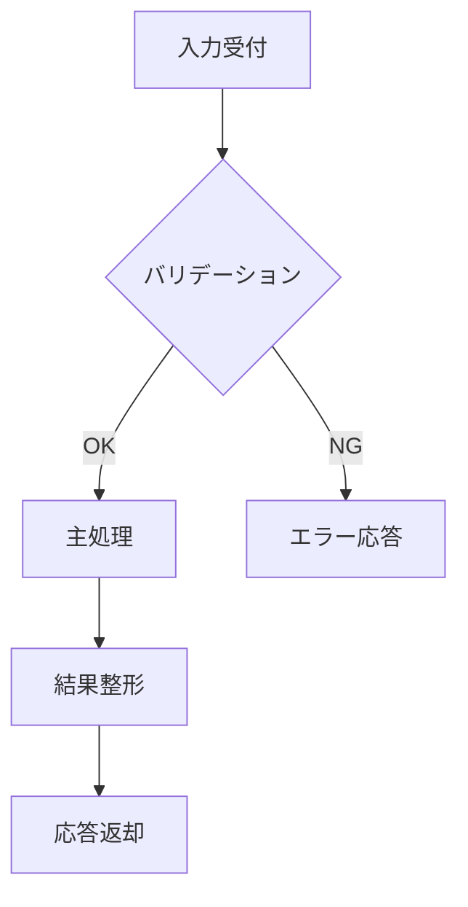
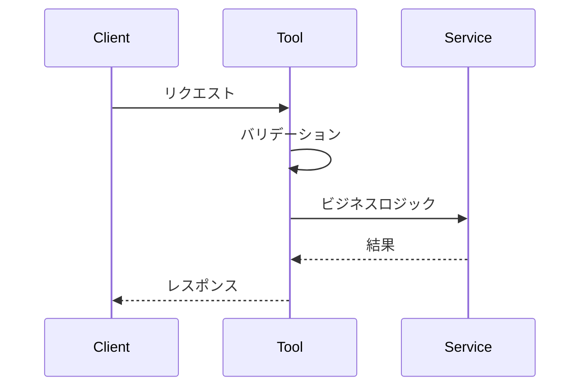
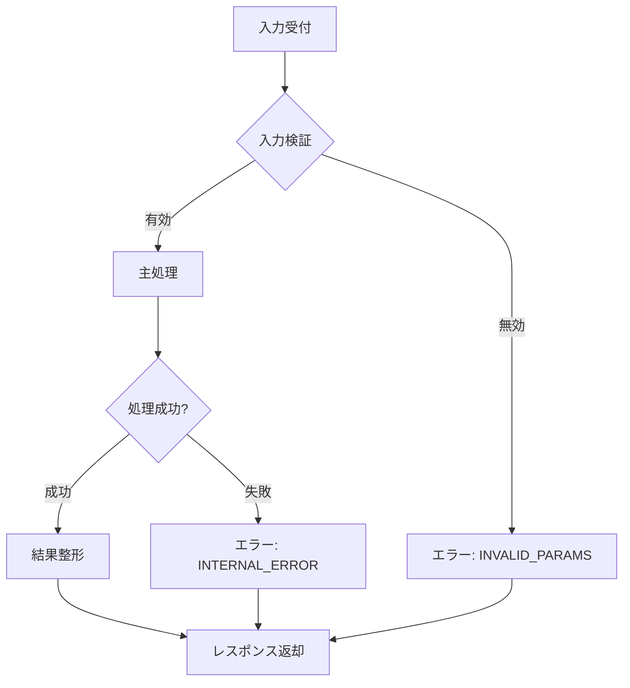
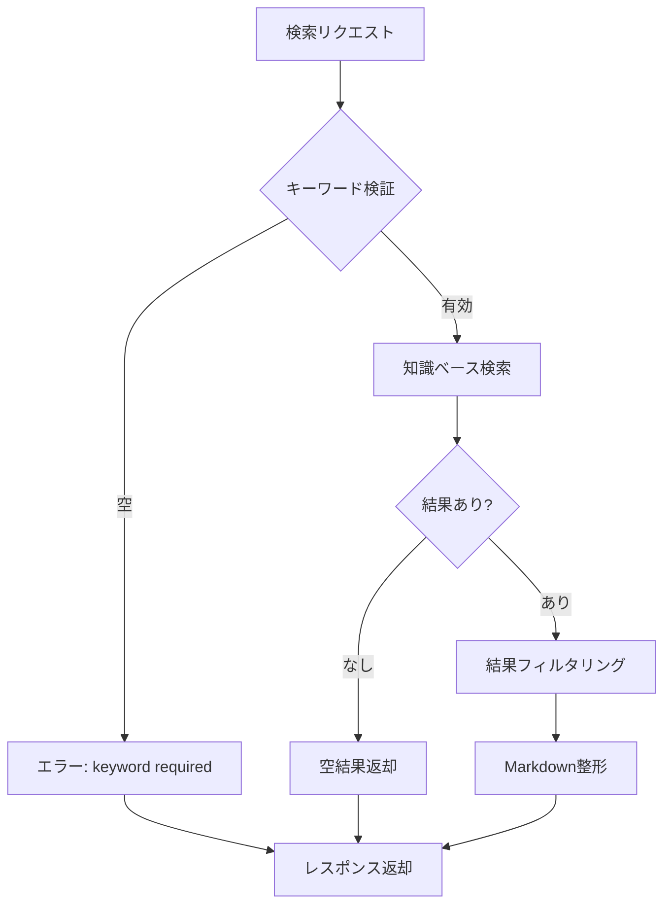
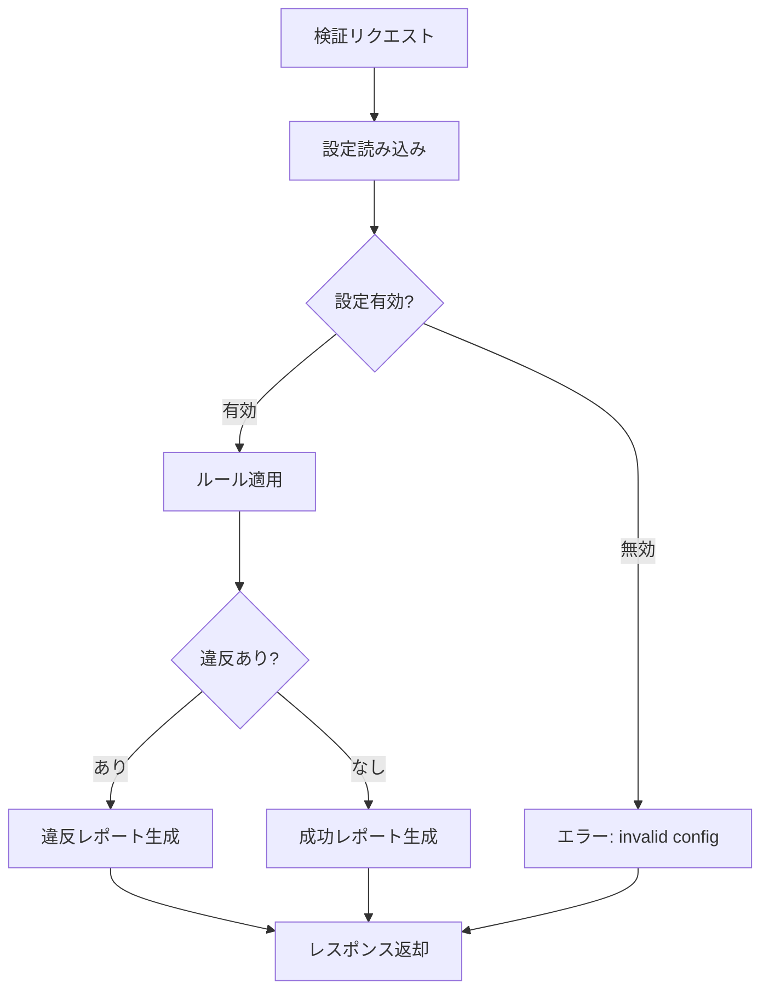
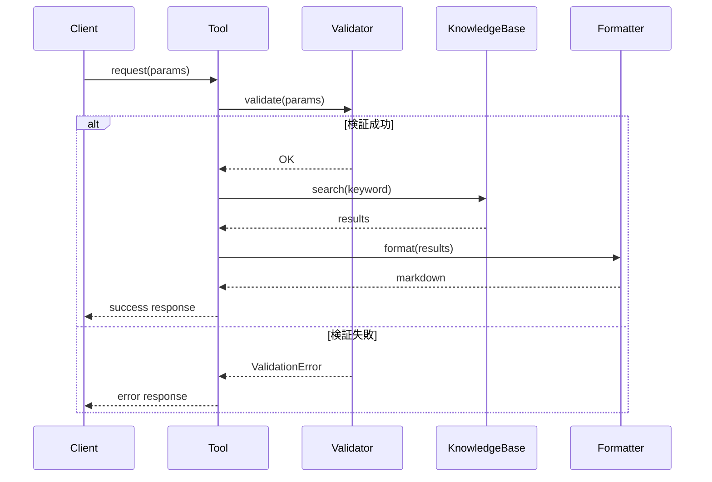

# MCP API Doc Generator — MCPサーバーAPI仕様書自動生成

## Overview

MCPサーバーのJavaソースコードを静的解析し、Tool・Resource・Promptの定義情報を抽出してAPI仕様書およびセットアップガイドをMarkdown形式で自動生成するスキル。さらに、生成されたドキュメントとソースコードの整合性を自動検証する機能を提供する。

**参考実装（実績）:**
- `api-specification.md`: 2 Tools, 12 Resources, 6 Promptsの完全仕様書
- `setup-guide.md`: MCPサーバーのビルド・実行・テスト・統合手順
- ソースコード:
  - `SearchApiTool.java` / `ValidateHandlerQueueTool.java`: @Toolアノテーション + @ToolParam
  - `McpServerConfig.java`: SyncResourceSpecification + SyncPromptSpecification の登録
  - `HandlerResourceProvider.java` / `GuideResourceProvider.java`: リソースプロバイダ

**主な用途:**
- MCPサーバーのAPI仕様書の自動生成・更新
- セットアップガイドの自動生成
- ソースコードとドキュメントの整合性検証
- 新しいTool/Resource/Prompt追加時のドキュメント自動更新
- CI/CDパイプラインでのドキュメント鮮度チェック
- **Tool設計書の自動生成**（個別Toolの詳細仕様書）
- **Tool詳細設計書の作成**（API仕様、入出力、エラーハンドリング、処理フロー）

**このスキルの特徴:**
- Javaソースの静的解析（@Tool, @ToolParam, SyncResourceSpecification, SyncPromptSpecification）
- ソースコードからパラメータ名・型・説明・必須フラグを自動抽出
- API仕様書テンプレートに基づくMarkdown自動生成
- ソースコード↔ドキュメント整合性の自動検証（diff検出）
- セットアップガイドの build.gradle.kts / application.yml からの自動生成
- **個別Tool設計書の自動生成**（@Toolアノテーションから詳細仕様を抽出）
- **詳細設計書機能**（エラーハンドリング、処理フロー、依存関係の文書化）

## When to Use

以下のいずれかに該当する場合にこのスキルを使用する：

- 「MCPサーバーのAPI仕様書を生成して」
- 「ソースコードからドキュメントを自動生成して」
- 「Tool/Resource/Promptの仕様を文書化して」
- 「MCPサーバーのセットアップガイドを作成して」
- 「ソースとドキュメントの整合性を検証して」
- 「新しいToolを追加したのでAPI仕様書を更新して」
- 「@Tool定義からMarkdownを生成して」
- MCPサーバーの機能追加後にドキュメントを最新化する必要がある場合
- ドキュメントの鮮度に不安がある場合（ソースとの乖離チェック）
- **「Tool設計書を生成して」**
- **「Toolの詳細設計書を作成して」**
- **「個別ToolのAPI仕様を詳細文書化して」**
- **「Toolのエラーハンドリングをドキュメントにまとめて」**
- **「Toolの処理フローを可視化して」**
- 個別Toolの詳細な仕様書が必要な場合
- Toolの入出力仕様やエラーケースを文書化したい場合

**トリガーキーワード**: API仕様書, ドキュメント自動生成, MCP仕様書, セットアップガイド, 整合性検証, @Tool, Resource定義, Prompt定義, Tool設計書, 詳細設計書, エラーハンドリング, 処理フロー

## Input Format

```yaml
# 必須パラメータ
source_root: "src/main/java"                    # Javaソースのルートディレクトリ
base_package: "com.tis.nablarch.mcp"            # ベースパッケージ

# 任意パラメータ
output_api_spec: "docs/api-specification.md"     # API仕様書の出力先
output_setup_guide: "docs/setup-guide.md"        # セットアップガイドの出力先
project_name: "Nablarch MCP Server"              # プロジェクト名
project_version: "0.1.0"                         # バージョン
transport: "STDIO"                               # トランスポート（STDIO / Streamable HTTP）
build_file: "build.gradle.kts"                   # ビルドファイル
config_file: "src/main/resources/application.yml" # 設定ファイル
verify_mode: false                               # 整合性検証のみモード（ドキュメント生成なし）

# Tool設計書生成パラメータ（オプション）
generate_tool_design_doc: false                  # Tool設計書を生成するか
output_tool_design_dir: "docs/tool-design/"      # Tool設計書の出力ディレクトリ
target_tools: []                                 # 対象Tool名リスト（空=全Tool）

# 詳細設計書パラメータ（オプション）
generate_detailed_spec: false                    # 詳細設計書を生成するか
output_detailed_spec: "docs/tool-detailed-spec.md" # 詳細設計書の出力先
include_error_handling: true                     # エラーハンドリングを含めるか
include_flow_diagram: true                       # 処理フロー図（Mermaid）を含めるか
include_dependencies: true                       # 依存関係を含めるか
```

## Output Format

```
生成ファイル:
├── {output_api_spec}                 # API仕様書（Markdown）
├── {output_setup_guide}              # セットアップガイド（Markdown）
├── {output_tool_design_dir}/         # Tool設計書ディレクトリ（generate_tool_design_doc=true）
│   ├── search_api.md                 # 個別Tool設計書
│   ├── validate_handler_queue.md
│   └── ...
├── {output_detailed_spec}            # Tool詳細設計書（generate_detailed_spec=true）
└── 整合性検証レポート（標準出力）      # verify_mode=true の場合
```

### API仕様書の構成

```markdown
# {project_name} API仕様書

## サーバー情報
| 項目 | 値 |
|------|-----|
| サーバー名 | ... |
| バージョン | ... |

## Tools仕様
### {tool_name}
- Tool定義（JSON Schema）
- 入力パラメータ（テーブル）
- 出力形式
- 使用例

## Resources仕様
### {resource_uri}
- URI パターン
- 説明
- レスポンス形式

## Prompts仕様
### {prompt_name}
- 引数定義（テーブル）
- 説明
- レスポンスの構成
```

### Tool設計書の構成（個別Tool用）

```markdown
# {tool_name} Tool設計書

## 概要
| 項目 | 値 |
|------|-----|
| Tool名 | {tool_name} |
| クラス名 | {class_name} |
| パッケージ | {package_name} |
| 説明 | {description} |

## API仕様

### 入力パラメータ
| パラメータ | 型 | 必須 | 説明 | 制約 |
|-----------|-----|------|------|------|
| {param_name} | {type} | {required} | {description} | {constraints} |

### 出力形式
- Content-Type: {content_type}
- 形式: {output_format_description}

### JSON Schema
```json
{json_schema}
```

## 処理詳細

### 処理フロー


### エラーハンドリング
| エラーコード | 条件 | メッセージ |
|-------------|------|----------|
| INVALID_PARAM | パラメータ不正 | {error_message} |

## 依存関係
- {dependency_list}

## 使用例
```json
// リクエスト例
{request_example}

// レスポンス例
{response_example}
```
```

### Tool詳細設計書の構成（全Tool統合）

```markdown
# MCP Tool詳細設計書

## 1. 概要
本書は{project_name}のMCP Toolの詳細設計を記述する。

## 2. Tool一覧
| # | Tool名 | 説明 | 重要度 |
|---|--------|------|--------|
| 1 | {tool_name} | {description} | {priority} |

## 3. 共通仕様

### 3.1 エラーハンドリング共通規約
- バリデーションエラー: 400系レスポンス
- 内部エラー: 500系レスポンス
- エラーメッセージフォーマット: {format}

### 3.2 ログ出力規約
- 処理開始/終了ログ
- パラメータログ（機密情報マスク）
- エラーログ（スタックトレース付き）

## 4. 個別Tool詳細

### 4.1 {tool_name}

#### 4.1.1 概要
{description}

#### 4.1.2 入出力仕様
（詳細なパラメータ定義）

#### 4.1.3 処理フロー


#### 4.1.4 エラーケース
| # | 条件 | エラーコード | 対処 |
|---|------|-------------|------|

#### 4.1.5 依存コンポーネント
- {component_list}

## 5. 非機能要件
- パフォーマンス目標
- セキュリティ考慮事項
```

## Instructions

### Phase 1: ソースコード解析

#### Step 1.1: プロジェクト構造の把握

```
【実行手順】

1. ソースディレクトリのスキャン:
   Glob: {source_root}/{base_package_path}/**/*.java

   期待される構造:
   com/tis/nablarch/mcp/
   ├── tools/          ← @Tool アノテーション付きクラス
   ├── resources/      ← ResourceProvider クラス
   ├── prompts/        ← Prompt クラス
   └── config/         ← McpServerConfig

2. 各ディレクトリ内のJavaファイルを一覧化:
   | ディレクトリ | ファイル | 種別 |
   |-------------|---------|------|
   | tools/ | SearchApiTool.java | Tool |
   | resources/ | HandlerResourceProvider.java | Resource |
   | prompts/ | SetupHandlerQueuePrompt.java | Prompt |
   | config/ | McpServerConfig.java | Config |

3. build.gradle.kts と application.yml も読み込む
```

#### Step 1.2: Tool定義の抽出

```
【実行手順】

tools/ ディレクトリ内の各Javaファイルから以下を抽出する。

1. @Tool アノテーションの検出:
   パターン: @Tool(description = "...")
   抽出: Tool名（メソッド名）、description

2. @ToolParam アノテーションの検出:
   パターン: @ToolParam(description = "...") String paramName
   抽出: パラメータ名、型、description、必須/任意

3. 戻り値の型:
   パターン: public String methodName(...)
   抽出: 戻り値の型

4. 抽出結果のデータ構造:
   {
     "tool_name": "search_api",
     "method_name": "searchApi",
     "description": "Search the Nablarch API documentation...",
     "parameters": [
       {
         "name": "keyword",
         "type": "String",
         "description": "Search keyword...",
         "required": true
       }
     ],
     "return_type": "String"
   }

【Grep パターン】

@Tool アノテーション:
  pattern: '@Tool\(description\s*=\s*"([^"]+)"'

@ToolParam アノテーション:
  pattern: '@ToolParam\(description\s*=\s*"([^"]+)"\)\s+(\w+)\s+(\w+)'

メソッドシグネチャ:
  pattern: 'public\s+(\w+)\s+(\w+)\s*\('
```

#### Step 1.3: Resource定義の抽出

```
【実行手順】

McpServerConfig.java から SyncResourceSpecification の登録を抽出する。

1. SyncResourceSpecification の検出:
   パターン: new McpSchema.Resource(uri, name, description, mimeType, null)
   抽出: URI, name, description, mimeType

2. ヘルパーメソッドの解析:
   createHandlerResourceSpec(type, name, description, provider)
   → URI = "nablarch://handler/" + type

   createGuideResourceSpec(topic, name, description, provider)
   → URI = "nablarch://guide/" + topic

3. ResourceProviderのメソッドシグネチャ:
   パターン: public String getHandlerMarkdown(String appType)
   → 引数: appType（リソースキー）

4. VALID_APP_TYPES / VALID_TOPICS の抽出:
   パターン: Set.of("web", "rest", "batch", ...)
   → 有効なキー値一覧

5. 抽出結果:
   {
     "uri_pattern": "nablarch://handler/{app_type}",
     "name": "Nablarch Web Handler Catalog",
     "description": "Web application handler specifications...",
     "mime_type": "text/markdown",
     "provider_class": "HandlerResourceProvider",
     "valid_keys": ["web", "rest", "batch", "messaging", ...]
   }
```

#### Step 1.4: Prompt定義の抽出

```
【実行手順】

McpServerConfig.java から SyncPromptSpecification の登録を抽出する。

1. promptSpec() 呼び出しの検出:
   パターン: promptSpec("name", "description", List.of(...), handler::execute)
   抽出: Prompt名, description, arguments, ハンドラクラス

2. arg() 呼び出しの検出:
   パターン: arg("name", "description", required)
   抽出: 引数名, description, required

3. Promptクラスの解析（各Promptクラス）:
   - execute() メソッドの引数バリデーションから有効値を抽出
   - VALID_* 定数から有効値リストを抽出
   - Markdown出力のセクション構造を解析

4. 抽出結果:
   {
     "prompt_name": "setup-handler-queue",
     "description": "Set up a Nablarch handler queue configuration",
     "arguments": [
       {
         "name": "app_type",
         "description": "Application type: web, rest, batch, messaging",
         "required": true
       }
     ],
     "handler_class": "SetupHandlerQueuePrompt"
   }
```

### Phase 2: API仕様書の生成

#### Step 2.1: サーバー情報セクション

```
【テンプレート】

# {project_name} API仕様書

## サーバー情報

| 項目 | 値 |
|------|-----|
| サーバー名 | `{project_name のkebab-case}` |
| バージョン | `{project_version}` |
| プロトコル | MCP (Model Context Protocol) over JSON-RPC 2.0 |
| トランスポート | {transport} |
| サーバータイプ | SYNC |

### Capabilities

```json
{
  "tools": { "listChanged": false },
  "resources": { "listChanged": false },
  "prompts": { "listChanged": false }
}
```

【データソース】
- project_name, project_version: 入力パラメータ
- transport: 入力パラメータ
- Capabilities: McpServerConfig の構成から推定
```

#### Step 2.2: Tools仕様セクション

```
【各Toolのテンプレート】

### {tool_name}

{description}

#### Tool定義

```json
{
  "name": "{tool_name}",
  "description": "{description}",
  "inputSchema": {
    "type": "object",
    "properties": {
      {parameters ごとのJSON Schema}
    },
    "required": [{required=true のパラメータ名}]
  }
}
```

#### 入力パラメータ

| パラメータ | 型 | 必須 | 説明 |
|-----------|-----|------|------|
{parameters ごとの行}

#### 出力形式

{戻り値の説明。ソースコードのreturn文やフォーマット処理から推定}

---

【生成ルール】
- JSON Schema はソースの@ToolParam定義から構築
- "required" 配列は required=true のパラメータのみ含める
- 入力パラメータのテーブルは全パラメータを含める
- 出力形式はソースコードのreturn文を解析して記述
```

#### Step 2.3: Resources仕様セクション

```
【各Resourceのテンプレート】

### {uri_pattern}

| 項目 | 値 |
|------|-----|
| URI | `{uri_pattern}` |
| 名前 | {name} |
| 説明 | {description} |
| Content-Type | `{mime_type}` |

#### 有効なキー値

{valid_keys のテーブル}

#### レスポンス形式

{content_type に応じた形式説明}
```

#### Step 2.4: Prompts仕様セクション

```
【各Promptのテンプレート】

### {prompt_name}

{description}

#### 引数

| 引数 | 説明 | 必須 |
|------|------|------|
{arguments ごとの行}

#### 実行結果

{Promptの応答構造の説明。Promptクラスのexecute()の出力内容から推定}
```

### Phase 3: セットアップガイドの生成

#### Step 3.1: ビルド・実行手順の生成

```
【テンプレート】

# {project_name} セットアップガイド

## 前提条件

| 項目 | バージョン |
|------|----------|
{build.gradle.kts から抽出したJavaバージョン、依存ライブラリ}

## ビルド

```bash
./gradlew build
```

## 実行

```bash
./gradlew bootRun
```

## AIツール統合設定

### Claude Code / Claude Desktop

`.claude/mcp.json` に追加:

```json
{
  "mcpServers": {
    "nablarch": {
      "command": "java",
      "args": ["-jar", "build/libs/{jarファイル名}"]
    }
  }
}
```

## テスト

```bash
./gradlew test
```

## MCP Inspector でのテスト

{MCP Inspectorの使用手順}

【データソース】
- build.gradle.kts: 依存ライブラリ、Javaバージョン、JARファイル名
- application.yml: サーバー設定
- プロジェクトのREADME.md: 既存の手順情報
```

### Phase 4: 整合性検証

#### Step 4.1: ソース↔ドキュメント整合性チェック

```
【検証項目】

1. Tool整合性:
   □ ソースの@Tool定義の数 = ドキュメントのTool数
   □ 各ToolのパラメータがドキュメントのJSON Schemaと一致
   □ description がソースとドキュメントで一致

2. Resource整合性:
   □ McpServerConfigのResource登録数 = ドキュメントのResource数
   □ 各ResourceのURIパターンが一致
   □ 各Resourceの説明が一致

3. Prompt整合性:
   □ McpServerConfigのPrompt登録数 = ドキュメントのPrompt数
   □ 各Promptの引数定義が一致
   □ 各Promptの説明が一致

4. バージョン整合性:
   □ build.gradle.kts のバージョン = ドキュメントのバージョン

【検証結果フォーマット】

整合性検証レポート
=================

✅ Tools: 2/2 一致
  ✅ search_api: パラメータ2/2、description一致
  ✅ validate_handler_queue: パラメータ2/2、description一致

✅ Resources: 12/12 一致
  ✅ nablarch://handler/web: 一致
  ...

⚠️ Prompts: 5/6 一致
  ✅ setup-handler-queue: 引数1/1、description一致
  ❌ best-practices: 引数descriptionが不一致
     ソース: "Topic: handler-queue, action, validation, database, testing"
     ドキュメント: "Topic: handler-queue, action, validation, database"
     → ドキュメントの更新が必要

検証結果: WARN（1件の不一致）
```

#### Step 4.2: 差分レポートの生成

```
【差分がある場合の出力】

## 不一致箇所

| # | 種別 | 項目 | ソース | ドキュメント | 推奨アクション |
|---|------|------|--------|-------------|-------------|
| 1 | Prompt | best-practices.topic description | "...testing" | "...database" | ドキュメント更新 |
| 2 | Tool | new_tool | 存在する | 存在しない | ドキュメント追加 |

## 自動修正案

{不一致箇所のドキュメント修正テキスト}
```

### Phase 5: 品質検証

```
□ API仕様書チェック
  □ 全Toolが文書化されている
  □ 全Resourceが文書化されている
  □ 全Promptが文書化されている
  □ JSON Schemaの構文が正しい
  □ テーブルのフォーマットが正しい
  □ コードブロックの言語指定が正しい

□ セットアップガイドチェック
  □ ビルドコマンドが正しい
  □ 実行コマンドが正しい
  □ MCP設定JSONが正しい
  □ バージョン番号が最新

□ 整合性検証チェック
  □ 全Tool/Resource/Promptの数が一致
  □ 全パラメータ定義が一致
  □ 全descriptionが一致
  □ バージョン番号が一致
```

### Phase 6: Tool設計書の生成（generate_tool_design_doc=true の場合）

#### Step 6.1: 個別Tool設計書の生成

```
【実行手順】

generate_tool_design_doc=true の場合に実行する。

1. 対象Toolの特定:
   - target_tools が空の場合: Phase 1で抽出した全Toolが対象
   - target_tools が指定されている場合: 指定されたToolのみ対象

2. 各Toolについて以下を抽出:
   - @Tool アノテーションからの基本情報
   - @ToolParam からの詳細パラメータ情報
   - メソッド内の処理ロジック（主要な条件分岐、ループ）
   - 呼び出している外部サービス/コンポーネント
   - 例外ハンドリングパターン

3. 設計書テンプレートに基づくMarkdown生成:
   - 概要セクション: Tool名、クラス名、パッケージ、説明
   - API仕様セクション: パラメータ、出力形式、JSON Schema
   - 処理詳細セクション: 処理フロー（Mermaid図）、エラーハンドリング
   - 依存関係セクション: 外部コンポーネント一覧
   - 使用例セクション: リクエスト/レスポンス例

4. 出力:
   - 出力先: {output_tool_design_dir}/{tool_name}.md
   - 1 Tool = 1 ファイル

【Grep パターン（追加）】

例外ハンドリング:
  pattern: 'throw\s+new\s+(\w+Exception)\s*\(\s*"([^"]+)"'

依存コンポーネント:
  pattern: '@Autowired|@Inject|private\s+final\s+(\w+)\s+(\w+)'

条件分岐:
  pattern: 'if\s*\(\s*([^)]+)\s*\)'
```

#### Step 6.2: 処理フロー図の生成

```
【実行手順】

1. Toolメソッドの制御フローを解析:
   - if/else 分岐
   - try/catch ブロック
   - メソッド呼び出しシーケンス

2. Mermaid flowchart 形式で図を生成:
   ```mermaid
   flowchart TD
       A[入力パラメータ受付] --> B{パラメータ検証}
       B -->|有効| C[主処理実行]
       B -->|無効| D[エラー応答: INVALID_PARAM]
       C --> E{処理結果判定}
       E -->|成功| F[結果整形]
       E -->|失敗| G[エラー応答: PROCESSING_ERROR]
       F --> H[JSON応答返却]
   ```

3. 図の配置:
   - 処理詳細セクション内に埋め込み
```

### Phase 7: Tool詳細設計書の生成（generate_detailed_spec=true の場合）

#### Step 7.1: 統合詳細設計書の生成

```
【実行手順】

generate_detailed_spec=true の場合に実行する。

1. 全Toolの情報を統合:
   - Phase 1で抽出したTool情報
   - Phase 6で解析した詳細情報（実行済みの場合）

2. 共通仕様の抽出:
   - エラーハンドリング共通規約
   - ログ出力規約
   - 命名規則
   - セキュリティ考慮事項

3. 各Tool詳細の記述:
   - 概要
   - 入出力仕様（詳細版）
   - 処理フロー（Mermaid シーケンス図）
   - エラーケース一覧
   - 依存コンポーネント

4. 非機能要件の記述:
   - パフォーマンス目標（ソースコード内のコメントから抽出可能な場合）
   - セキュリティ考慮事項

5. 出力:
   - 出力先: {output_detailed_spec}
   - 全Toolを1ファイルに統合
```

#### Step 7.2: シーケンス図の生成

```
【実行手順】

include_flow_diagram=true の場合に実行する。

1. 各Toolの処理シーケンスを解析:
   - メソッド呼び出しの順序
   - 外部サービスとの通信
   - 条件による分岐

2. Mermaid sequenceDiagram 形式で図を生成:
   ```mermaid
   sequenceDiagram
       participant C as Client
       participant T as Tool
       participant V as Validator
       participant S as Service
       participant R as Repository

       C->>T: リクエスト(params)
       T->>V: validate(params)
       V-->>T: ValidationResult
       alt バリデーション成功
           T->>S: execute(params)
           S->>R: query(key)
           R-->>S: Data
           S-->>T: Result
           T-->>C: 成功レスポンス
       else バリデーション失敗
           T-->>C: エラーレスポンス
       end
   ```

3. 図の配置:
   - 各Tool詳細セクション内に埋め込み
```

#### Step 7.3: エラーケース一覧の生成

```
【実行手順】

include_error_handling=true の場合に実行する。

1. ソースコードから例外スローを抽出:
   - throw new XxxException(...)
   - catch ブロック内の処理

2. バリデーションエラーの抽出:
   - パラメータ検証ロジック
   - 業務エラー条件

3. エラーケース一覧の生成:
   | # | 条件 | エラーコード | HTTPステータス | メッセージ | 対処方法 |
   |---|------|-------------|---------------|----------|---------|
   | 1 | keyword が空 | INVALID_PARAM | 400 | "keyword is required" | 必須パラメータを指定 |
   | 2 | 検索結果なし | NOT_FOUND | 404 | "No results found" | 検索キーワードを変更 |
   | 3 | 内部エラー | INTERNAL_ERROR | 500 | "Internal server error" | 管理者に連絡 |

4. 配置:
   - 各Tool詳細セクション内
```

#### Step 7.4: 依存関係分析

```
【実行手順】

include_dependencies=true の場合に実行する。

1. Toolクラスの依存を抽出:
   - @Autowired / @Inject フィールド
   - コンストラクタ引数
   - メソッド内での new / static 呼び出し

2. 依存関係図の生成:
   ```mermaid
   graph TD
       SearchApiTool --> YamlKnowledgeLoader
       SearchApiTool --> MarkdownFormatter
       YamlKnowledgeLoader --> ObjectMapper
       ValidateHandlerQueueTool --> HandlerQueueValidator
       ValidateHandlerQueueTool --> YamlKnowledgeLoader
   ```

3. 依存一覧テーブルの生成:
   | Tool | 依存コンポーネント | 種類 | 説明 |
   |------|------------------|------|------|
   | SearchApiTool | YamlKnowledgeLoader | @Autowired | YAML知識読み込み |

4. 配置:
   - 統合詳細設計書の依存関係セクション
```

### Phase 8: 設計書品質検証

```
□ Tool設計書チェック（generate_tool_design_doc=true の場合）
  □ 全対象Toolの設計書が生成されている
  □ 各設計書に必須セクションが含まれている
  □ JSON Schemaが正しい構文である
  □ Mermaid図がレンダリング可能である
  □ エラーケースが網羅されている

□ 詳細設計書チェック（generate_detailed_spec=true の場合）
  □ 全Toolが含まれている
  □ 共通仕様セクションが記述されている
  □ シーケンス図が正しい構文である
  □ エラーケース一覧が完全である
  □ 依存関係図が正確である
```

## Examples

### Example 1: Nablarch MCP Server のAPI仕様書生成

```yaml
source_root: "src/main/java"
base_package: "com.tis.nablarch.mcp"
output_api_spec: "docs/api-specification.md"
project_name: "Nablarch MCP Server"
project_version: "0.1.0"
transport: "STDIO"
```

```
# 実行結果

解析結果:
- Tools: 2件（search_api, validate_handler_queue）
- Resources: 12件（handler×6, guide×6）
- Prompts: 6件

生成ファイル:
- docs/api-specification.md（約400行）

整合性検証: PASS（全項目一致）
```

### Example 2: 整合性検証のみ

```yaml
source_root: "src/main/java"
base_package: "com.tis.nablarch.mcp"
output_api_spec: "docs/api-specification.md"
verify_mode: true
```

```
# 実行結果（整合性検証のみ、ドキュメント生成なし）

整合性検証レポート
=================
✅ Tools: 2/2 一致
✅ Resources: 12/12 一致
✅ Prompts: 6/6 一致
✅ Version: 一致

検証結果: PASS
```

### Example 3: Tool追加後のドキュメント更新

```
# シナリオ
1. 開発者が SemanticSearchTool.java を追加
2. verify_mode=true で整合性チェック → FAIL（Toolが1件不足）
3. verify_mode=false で再実行 → ドキュメント自動更新

# 差分レポート
❌ Tools: 2/3 — 新規Tool "semantic_search" がドキュメントに未記載
推奨: ドキュメント再生成を実行

# 再生成後
✅ Tools: 3/3 一致（semantic_search を追加）
```

### Example 4: 個別Tool設計書の生成

```yaml
source_root: "src/main/java"
base_package: "com.tis.nablarch.mcp"
generate_tool_design_doc: true
output_tool_design_dir: "docs/tool-design/"
target_tools: ["search_api"]  # 特定Toolのみ
```

```
# 実行結果

解析結果:
- 対象Tool: search_api
- パラメータ: 2件（keyword, category）
- 依存コンポーネント: 3件

生成ファイル:
- docs/tool-design/search_api.md（約150行）

内容:
- 概要: Tool名、クラス名、説明
- API仕様: JSON Schema、パラメータテーブル
- 処理フロー: Mermaid flowchart
- エラーケース: 3件（INVALID_PARAM, NOT_FOUND, INTERNAL_ERROR）
- 依存関係: YamlKnowledgeLoader, MarkdownFormatter, ObjectMapper
- 使用例: リクエスト/レスポンスJSON
```

### Example 5: 全Tool詳細設計書の生成

```yaml
source_root: "src/main/java"
base_package: "com.tis.nablarch.mcp"
generate_detailed_spec: true
output_detailed_spec: "docs/tool-detailed-spec.md"
include_error_handling: true
include_flow_diagram: true
include_dependencies: true
```

```
# 実行結果

解析結果:
- Tools: 2件（search_api, validate_handler_queue）
- 共通エラーパターン: 5種類
- 依存コンポーネント（全体）: 8件

生成ファイル:
- docs/tool-detailed-spec.md（約500行）

内容:
## 1. 概要
## 2. Tool一覧（2件）
## 3. 共通仕様
   - エラーハンドリング規約
   - ログ出力規約
## 4. 個別Tool詳細
   ### 4.1 search_api
   - シーケンス図（Mermaid）
   - エラーケース一覧
   - 依存コンポーネント
   ### 4.2 validate_handler_queue
   - シーケンス図（Mermaid）
   - エラーケース一覧
   - 依存コンポーネント
## 5. 非機能要件
## 6. 依存関係図（Mermaid graph）
```

### Example 6: 統合生成（全ドキュメント一括）

```yaml
source_root: "src/main/java"
base_package: "com.tis.nablarch.mcp"
output_api_spec: "docs/api-specification.md"
output_setup_guide: "docs/setup-guide.md"
generate_tool_design_doc: true
output_tool_design_dir: "docs/tool-design/"
generate_detailed_spec: true
output_detailed_spec: "docs/tool-detailed-spec.md"
include_error_handling: true
include_flow_diagram: true
include_dependencies: true
project_name: "Nablarch MCP Server"
project_version: "0.2.0"
```

```
# 実行結果（統合生成）

生成ファイル:
├── docs/api-specification.md      # API仕様書（400行）
├── docs/setup-guide.md            # セットアップガイド（200行）
├── docs/tool-design/              # Tool設計書
│   ├── search_api.md              # （150行）
│   └── validate_handler_queue.md  # （140行）
└── docs/tool-detailed-spec.md     # 詳細設計書（500行）

整合性検証: PASS（全ドキュメント一致）
```

## Anti-Patterns

1. **正規表現のみに依存したソース解析**
   - @Toolアノテーションが複数行にまたがる場合に検出漏れ
   - 対策: 行結合してからパターンマッチ、またはAST解析ライブラリ使用

2. **ハードコードされたパッケージパス**
   - `com.tis.nablarch.mcp` 以外のパッケージに対応できない
   - 対策: base_package パラメータで動的に指定

3. **既存ドキュメントの完全上書き**
   - 手動で追加した補足情報が消える
   - 対策: 自動生成セクションとカスタムセクションを分離（マーカーコメント使用）

4. **整合性検証の false positive**
   - 軽微な文言差異（空白、改行）で不一致判定
   - 対策: 比較前に正規化（trim、連続空白の圧縮）

5. **非公開クラスの文書化**
   - package-private クラスや内部APIを文書化してしまう
   - 対策: @Tool / SyncResourceSpecification に登録されたもののみ文書化

6. **JSON Schemaの型推定ミス**
   - Java String → JSON "string" は明確だが、List等の変換は注意
   - 対策: @ToolParam の型情報を正確にJSON Schemaに変換するマッピング表を使用

7. **ドキュメント生成時のソース変更**
   - 生成中にソースが変更されると整合性が崩れる
   - 対策: 生成前にソースのスナップショットを取得（git stashまたはコミット確認）

8. **セットアップガイドの環境依存**
   - OS固有のパス表記やコマンドがハードコード
   - 対策: OS非依存の表記を使用し、OS固有の注記はセクション分離

9. **Tool設計書の過剰な詳細化**
   - 実装詳細をすべて文書化してしまい、メンテナンスコストが増大
   - 対策: 公開APIとして重要な情報のみを記載、内部実装詳細はソースコードのコメントに委譲

10. **Mermaid図の複雑化**
    - 処理フローが複雑すぎてレンダリングできない、または可読性が低下
    - 対策: 主要な処理フローのみを図示、詳細は別途テキストで記述

11. **エラーケースの網羅性不足**
    - ソースコードの例外スローのみを拾い、暗黙的なエラー条件を見落とす
    - 対策: バリデーションロジック、if文の条件、nullチェックも解析対象に含める

12. **依存関係の過剰な深掘り**
    - 間接依存まで全て列挙して情報過多になる
    - 対策: 直接依存のみを記載、間接依存は必要に応じて別セクションで補足

## Appendix

### A. ソースコード解析パターン集

```
# @Tool アノテーション抽出
pattern: '@Tool\(\s*description\s*=\s*"((?:[^"\\]|\\.)*)"\s*\)'

# @ToolParam 抽出
pattern: '@ToolParam\(\s*description\s*=\s*"((?:[^"\\]|\\.)*)"\s*\)\s+(\w+)\s+(\w+)'

# SyncResourceSpecification 内の Resource 構築
pattern: 'new McpSchema\.Resource\(\s*([^,]+),\s*"([^"]+)",\s*"([^"]+)",\s*"([^"]+)"'

# promptSpec 呼び出し
pattern: 'promptSpec\(\s*"([^"]+)",\s*\n?\s*"([^"]+)"'

# arg 呼び出し
pattern: 'arg\(\s*"([^"]+)",\s*"([^"]+)",\s*(true|false)\s*\)'

# VALID_* 定数
pattern: 'VALID_\w+\s*=\s*(?:Set|List)\.of\(\s*([^)]+)\s*\)'

# 例外スロー（Tool設計書用）
pattern: 'throw\s+new\s+(\w+(?:Exception|Error))\s*\(\s*"([^"]*)"'

# 依存注入フィールド（Tool設計書用）
pattern: '@(?:Autowired|Inject)\s+(?:private\s+)?(\w+)\s+(\w+)'

# コンストラクタ依存（Tool設計書用）
pattern: 'public\s+\w+\s*\(\s*(?:final\s+)?(\w+)\s+(\w+)'

# 条件分岐（処理フロー用）
pattern: 'if\s*\(\s*([^)]+)\s*\)\s*\{'

# nullチェック（エラーケース用）
pattern: 'if\s*\(\s*(\w+)\s*==\s*null\s*\)'

# 空チェック（エラーケース用）
pattern: '(?:isEmpty|isBlank)\s*\(\s*\)|\.isEmpty\(\)|\.isBlank\(\)'
```

### B. JSON Schema型マッピング

| Java型 | JSON Schema型 | 備考 |
|--------|--------------|------|
| String | "string" | 基本型 |
| int / Integer | "integer" | |
| long / Long | "integer" | |
| boolean / Boolean | "boolean" | |
| double / Double | "number" | |
| List<String> | "array" + items: "string" | |
| Map<String, Object> | "object" | additionalProperties |

### C. 整合性検証スクリプト例

```bash
#!/bin/bash
# MCPサーバーのソース↔ドキュメント整合性チェック

echo "=== Tool 整合性チェック ==="
# ソースの@Tool数
SRC_TOOLS=$(grep -r '@Tool(' src/main/java/ | grep -v Test | wc -l)
# ドキュメントのTool数
DOC_TOOLS=$(grep -c '### search_api\|### validate_handler_queue' docs/api-specification.md)
echo "ソース: ${SRC_TOOLS}件, ドキュメント: ${DOC_TOOLS}件"

echo "=== Resource 整合性チェック ==="
# McpServerConfigのResource登録数
SRC_RES=$(grep -c 'createHandlerResourceSpec\|createGuideResourceSpec' \
  src/main/java/com/tis/nablarch/mcp/config/McpServerConfig.java)
# ドキュメントのResource数
DOC_RES=$(grep -c 'nablarch://' docs/api-specification.md | head -1)
echo "ソース: ${SRC_RES}件, ドキュメント: ${DOC_RES}件"

echo "=== Prompt 整合性チェック ==="
# promptSpec呼び出し数
SRC_PROMPTS=$(grep -c 'promptSpec(' \
  src/main/java/com/tis/nablarch/mcp/config/McpServerConfig.java)
echo "ソース: ${SRC_PROMPTS}件"
```

### D. Tool設計書テンプレートファイル

```markdown
# {tool_name} Tool設計書

> 自動生成日時: {generated_at}
> ソースファイル: {source_file}

## 1. 概要

| 項目 | 値 |
|------|-----|
| Tool名 | `{tool_name}` |
| クラス名 | `{class_name}` |
| パッケージ | `{package_name}` |
| 説明 | {description} |
| バージョン | {version} |

## 2. API仕様

### 2.1 入力パラメータ

| パラメータ | 型 | 必須 | 説明 | 制約・有効値 |
|-----------|-----|------|------|-------------|
{parameter_rows}

### 2.2 出力形式

- **Content-Type**: `{content_type}`
- **形式**: {output_description}

### 2.3 JSON Schema

```json
{json_schema}
```

## 3. 処理詳細

### 3.1 処理フロー

```mermaid
{flowchart}
```

### 3.2 処理ステップ

{processing_steps}

## 4. エラーハンドリング

### 4.1 エラーケース一覧

| # | 条件 | エラーコード | メッセージ | 対処方法 |
|---|------|-------------|----------|---------|
{error_rows}

### 4.2 例外処理

{exception_handling}

## 5. 依存関係

### 5.1 依存コンポーネント

| コンポーネント | 種類 | 説明 |
|--------------|------|------|
{dependency_rows}

### 5.2 依存関係図

```mermaid
{dependency_graph}
```

## 6. 使用例

### 6.1 リクエスト例

```json
{request_example}
```

### 6.2 レスポンス例（成功時）

```json
{success_response_example}
```

### 6.3 レスポンス例（エラー時）

```json
{error_response_example}
```

## 7. 備考

{notes}
```

### E. エラーコードマッピング表

| Java例外/条件 | MCP エラーコード | HTTPステータス相当 | 説明 |
|--------------|-----------------|-------------------|------|
| IllegalArgumentException | INVALID_PARAMS | 400 | パラメータ不正 |
| NullPointerException（パラメータ） | INVALID_PARAMS | 400 | 必須パラメータ未指定 |
| NoSuchElementException | NOT_FOUND | 404 | リソース未発見 |
| IllegalStateException | INVALID_REQUEST | 400 | 不正な状態での呼び出し |
| UnsupportedOperationException | METHOD_NOT_FOUND | 501 | 未実装機能 |
| RuntimeException（その他） | INTERNAL_ERROR | 500 | 内部エラー |
| IOException | INTERNAL_ERROR | 500 | I/Oエラー |
| TimeoutException | INTERNAL_ERROR | 504 | タイムアウト |

### F. Mermaid図テンプレート集

#### F.1 基本処理フロー



#### F.2 検索Tool用フロー



#### F.3 バリデーションTool用フロー



#### F.4 シーケンス図テンプレート


