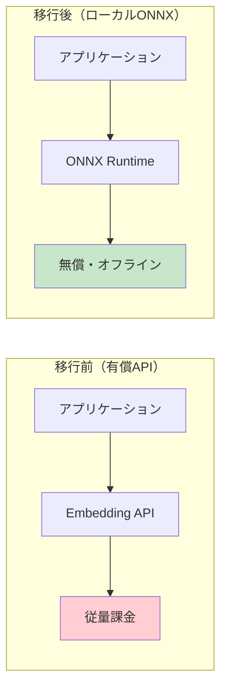

# ONNX Embedding Migrator

## Overview

有償のEmbedding API（Jina, Voyage, OpenAI等）からONNXローカルモデル（BGE-M3, CodeSage等）への移行を自動化するスキル。

**解決する課題:**
- Embedding API利用料金の削減（従量課金 → 無償ローカル推論）
- ネットワーク依存の解消（オフライン実行可能）
- レイテンシの改善（API往復時間の削減）
- プライバシー保護（テキストを外部送信しない）

**移行パターン:**



**対応フレームワーク:**
- Spring Boot 3.x + ONNX Runtime Java
- DJL HuggingFace Tokenizers

**実績:**
- nablarch-mcp-server PR #46: Jina/Voyage → BGE-M3/CodeSage 移行
- 完全後方互換（EmbeddingClientインターフェース維持）
- pgvectorスキーマ変更不要（1024次元維持）

## When to Use

以下のいずれかに該当する場合にこのスキルを使用する：

- 「EmbeddingをONNXモデルに移行したい」
- 「有償APIを無償ローカルモデルに置き換えたい」
- 「BGE-M3やCodeSageをJavaから使いたい」
- 「Embedding APIのコストを削減したい」
- 「HuggingFaceモデルをONNXに変換したい」
- 「ローカルでEmbedding推論を実行したい」
- 「オフラインでベクトル検索したい」
- 「Embedding推論のレイテンシを改善したい」
- 有償Embedding APIのコスト削減が必要な場合
- プライバシー要件でテキストを外部送信できない場合
- ネットワーク環境が不安定な場合

**トリガーキーワード**: Embedding, ONNX, BGE-M3, CodeSage, ローカルモデル, 無償化, コスト削減, HuggingFace, 移行, オフライン

## Instructions

### Phase 1: 現行Embedding実装の分析

対象プロジェクトの既存Embedding実装を調査する。

#### Step 1.1: 現行実装の調査

```
【現行実装調査チェックリスト】

1. Embedding APIプロバイダの特定
   Grep: "api.jina.ai" OR "api.voyageai.com" OR "api.openai.com" OR "EmbeddingClient"
   - 使用中のAPIプロバイダ
   - 現在のモデル名
   - 出力次元数

2. 呼び出し箇所の特定
   Grep: "embed(" OR "embedBatch(" OR "createEmbedding"
   - Embedding呼び出し数
   - バッチサイズ
   - 使用パターン（ドキュメント用/コード用/汎用）

3. ベクトルDB設定の確認
   Grep: "pgvector" OR "VECTOR(" OR "embedding"
   - 格納先テーブル
   - インデックス設定
   - 現在の次元数

4. 設定ファイルの確認
   Read: application.yaml, application.properties
   - API Key設定箇所
   - プロファイル切り替え設定の有無
```

#### Step 1.2: 移行影響範囲の特定

```
【影響範囲チェックリスト】

□ 変更が必要なファイル:
  □ pom.xml / build.gradle（依存関係追加）
  □ EmbeddingProperties.java（設定クラス拡張）
  □ 既存EmbeddingClient（@ConditionalOnProperty追加）
  □ application.yaml（プロファイル設定追加）

□ 新規作成が必要なファイル:
  □ AbstractOnnxEmbeddingClient.java（共通基盤）
  □ XxxOnnxEmbeddingClient.java（モデル別実装）
  □ テストクラス

□ 変更不要（後方互換）:
  □ EmbeddingClientインターフェース
  □ 呼び出し側コード
  □ ベクトルDBスキーマ（次元数が同じ場合）
```

### Phase 2: 移行先モデルの選定

用途に適したONNXモデルを選定する。

#### Step 2.1: 推奨モデル一覧

| 用途 | モデル | パラメータ | 次元数 | 言語 | ライセンス | MTEB Rank |
|------|--------|-----------|--------|------|-----------|-----------|
| ドキュメント用 | BAAI/bge-m3 | 568M | 1024 | 100+ | MIT | #3 |
| コード用 | codesage/codesage-small-v2 | 130M | 1024 | コード | OSS | - |
| 軽量汎用 | BAAI/bge-small-en-v1.5 | 33M | 384 | 英語 | MIT | - |
| 多言語 | intfloat/multilingual-e5-large | 560M | 1024 | 100+ | MIT | #5 |
| 日本語特化 | cl-nagoya/ruri-large | 337M | 1024 | 日本語 | Apache 2.0 | - |

#### Step 2.2: モデル選定基準

```
【モデル選定チェックリスト】

□ 次元数の互換性:
  - 現行API出力次元数: ____
  - 移行先モデル次元数: ____
  - 次元数が異なる場合: ベクトルDB再インデックスが必要

□ 言語対応:
  - 必要な言語: ____
  - モデルの対応言語: ____

□ リソース要件:
  - 利用可能メモリ: ____
  - モデルサイズ: ____
  - 推論時間要件: ____

□ ライセンス:
  - 商用利用可否: ____
  - 帰属表示要否: ____
```

#### Step 2.3: 複数モデル構成の検討

```
【複数モデル構成パターン】

パターン1: 単一モデル
- 全用途で同一モデルを使用
- シンプルな構成、メモリ効率良好
- 例: BGE-M3のみ

パターン2: 用途別モデル（推奨）
- ドキュメント用: BGE-M3（多言語対応）
- コード用: CodeSage（コード特化）
- メリット: 各用途で最適な精度
- デメリット: メモリ使用量増加

パターン3: フォールバック構成
- プライマリ: ローカルONNXモデル
- フォールバック: API（ローカルモデル障害時）
- メリット: 高可用性
- デメリット: 複雑性増加
```

### Phase 3: ONNX変換手順の生成

HuggingFaceモデルをONNX形式に変換する。

#### Step 3.1: 環境セットアップ

```bash
# Python環境のセットアップ
python -m venv onnx-env
source onnx-env/bin/activate  # Linux/Mac
# onnx-env\Scripts\activate  # Windows

# optimum-cliのインストール
pip install optimum[exporters] onnxruntime

# 確認
optimum-cli --version
```

#### Step 3.2: ONNX変換コマンド

```bash
# BGE-M3の変換
optimum-cli export onnx \
  --model BAAI/bge-m3 \
  --task feature-extraction \
  /opt/models/bge-m3

# CodeSage-small-v2の変換
optimum-cli export onnx \
  --model codesage/codesage-small-v2 \
  --task feature-extraction \
  /opt/models/codesage-small-v2

# E5-largeの変換（多言語）
optimum-cli export onnx \
  --model intfloat/multilingual-e5-large \
  --task feature-extraction \
  /opt/models/e5-large
```

#### Step 3.3: 変換結果の確認

```
【変換後ディレクトリ構造】

/opt/models/bge-m3/
├── model.onnx              # ONNXモデル本体（必須）
├── tokenizer.json          # トークナイザー（必須）
├── tokenizer_config.json   # トークナイザー設定
├── special_tokens_map.json # 特殊トークン
├── config.json             # モデル設定
└── vocab.txt               # 語彙（モデルによる）

【サイズ目安】
- BGE-M3: 約2.2GB
- CodeSage-small-v2: 約500MB
- BGE-small-en-v1.5: 約130MB
```

### Phase 4: Spring Boot設定生成

EmbeddingPropertiesクラスと設定ファイルを生成する。

#### Step 4.1: EmbeddingProperties拡張

```java
/**
 * Embedding設定プロパティ。
 *
 * <p>application.yamlの {@code {prefix}.embedding} 配下の設定を保持する。
 * API（Jina/Voyage等）とローカルONNXモデルの両方をサポートする。</p>
 */
@Component
@ConfigurationProperties(prefix = "{prefix}.embedding")
public class EmbeddingProperties {

    /**
     * 使用するプロバイダの種別。
     * local: ローカルONNXモデル（推奨・無償）
     * api: 外部API（従量課金）
     */
    private String provider = "local";

    private ProviderConfig jina = new ProviderConfig();
    private ProviderConfig voyage = new ProviderConfig();
    private LocalModelConfig local = new LocalModelConfig();

    // getters/setters...

    /**
     * 各Embeddingプロバイダ（API）の設定。
     */
    public static class ProviderConfig {
        private String apiKey = "";
        private String model = "";
        private int dimensions = 1024;
        private String baseUrl = "";
        private int timeoutSeconds = 30;
        private int maxRetries = 3;
        // getters/setters...
    }

    /**
     * ローカルONNXモデルの設定。
     */
    public static class LocalModelConfig {
        private OnnxModelConfig document = new OnnxModelConfig();
        private OnnxModelConfig code = new OnnxModelConfig();
        // getters/setters...
    }

    /**
     * 個別のONNXモデル設定。
     */
    public static class OnnxModelConfig {
        private String modelName = "";
        private String modelPath = "";
        private String tokenizerPath = "";
        private int dimensions = 1024;
        private int maxTokens = 512;
        private int batchSize = 32;
        // getters/setters...
    }
}
```

#### Step 4.2: application.yaml設定テンプレート

```yaml
{prefix}:
  embedding:
    # 使用するプロバイダ: local（推奨・無償）または api（従量課金）
    provider: local

    # ローカルONNXモデル設定（provider: local の場合に使用）
    local:
      document:
        model-name: BAAI/bge-m3
        model-path: ${EMBEDDING_MODEL_PATH:/opt/models/bge-m3}/model.onnx
        tokenizer-path: ${EMBEDDING_MODEL_PATH:/opt/models/bge-m3}
        dimensions: 1024
        max-tokens: 512
        batch-size: 32
      code:
        model-name: codesage/codesage-small-v2
        model-path: ${EMBEDDING_MODEL_PATH:/opt/models/codesage-small-v2}/model.onnx
        tokenizer-path: ${EMBEDDING_MODEL_PATH:/opt/models/codesage-small-v2}
        dimensions: 1024
        max-tokens: 512
        batch-size: 32

    # API設定（provider: api の場合に使用）
    jina:
      api-key: ${JINA_API_KEY:}
      model: jina-embeddings-v4
      dimensions: 1024
      base-url: https://api.jina.ai/v1/embeddings
      timeout-seconds: 30
      max-retries: 3
    voyage:
      api-key: ${VOYAGE_API_KEY:}
      model: voyage-code-3
      dimensions: 1024
      base-url: https://api.voyageai.com/v1/embeddings
      timeout-seconds: 30
      max-retries: 3
```

### Phase 5: EmbeddingClientクラス実装

ONNX Runtime + DJL Tokenizerを使用したEmbeddingClientを実装する。

#### Step 5.1: 依存関係追加（pom.xml）

```xml
<!-- Phase 2.5: Local ONNX Embedding Models -->
<dependency>
    <groupId>com.microsoft.onnxruntime</groupId>
    <artifactId>onnxruntime</artifactId>
    <version>1.20.0</version>
</dependency>
<dependency>
    <groupId>ai.djl.huggingface</groupId>
    <artifactId>tokenizers</artifactId>
    <version>0.31.1</version>
</dependency>
```

#### Step 5.2: 依存関係追加（build.gradle.kts）

```kotlin
// Phase 2.5: Local ONNX Embedding Models
implementation("com.microsoft.onnxruntime:onnxruntime:1.20.0")
implementation("ai.djl.huggingface:tokenizers:0.31.1")
```

#### Step 5.3: AbstractOnnxEmbeddingClientテンプレート

```java
/**
 * ONNX Runtimeを使用したローカルEmbeddingクライアントの抽象基底クラス。
 *
 * <p>BGE-M3、CodeSage等のONNX形式モデルでEmbeddingベクトルを生成する共通処理を提供する。
 * サブクラスで具体的なモデル設定を指定する。</p>
 */
public abstract class AbstractOnnxEmbeddingClient implements EmbeddingClient {

    private static final Logger logger = LoggerFactory.getLogger(AbstractOnnxEmbeddingClient.class);

    protected final OnnxModelConfig config;

    private OrtEnvironment environment;
    private OrtSession session;
    private HuggingFaceTokenizer tokenizer;

    /**
     * コンストラクタ。
     *
     * @param config ONNXモデル設定
     */
    protected AbstractOnnxEmbeddingClient(OnnxModelConfig config) {
        this.config = config;
    }

    /**
     * モデルとトークナイザーを初期化する。
     */
    @PostConstruct
    public void init() {
        try {
            logger.info("ONNXモデルをロード中: {}", config.getModelName());

            // ONNX Runtime環境の初期化
            this.environment = OrtEnvironment.getEnvironment();

            // モデルのロード
            OrtSession.SessionOptions options = new OrtSession.SessionOptions();
            options.setIntraOpNumThreads(Runtime.getRuntime().availableProcessors());
            this.session = environment.createSession(config.getModelPath(), options);

            // トークナイザーのロード
            this.tokenizer = HuggingFaceTokenizer.newInstance(Path.of(config.getTokenizerPath()));

            logger.info("ONNXモデルのロード完了: {} ({}次元)",
                config.getModelName(), config.getDimensions());

        } catch (OrtException | IOException e) {
            throw new EmbeddingException("ONNXモデルの初期化に失敗: " + config.getModelName(), e);
        }
    }

    /**
     * リソースを解放する。
     */
    @PreDestroy
    public void destroy() {
        try {
            if (session != null) {
                session.close();
            }
            if (tokenizer != null) {
                tokenizer.close();
            }
            logger.info("ONNXモデルをアンロード: {}", config.getModelName());
        } catch (Exception e) {
            logger.warn("ONNXモデルのクリーンアップ中にエラー: {}", e.getMessage());
        }
    }

    @Override
    public float[] embed(String text) {
        List<float[]> results = embedBatch(List.of(text));
        return results.get(0);
    }

    @Override
    public List<float[]> embedBatch(List<String> texts) {
        if (texts == null || texts.isEmpty()) {
            return new ArrayList<>();
        }

        try {
            List<float[]> results = new ArrayList<>();

            // バッチサイズで分割して処理
            for (int i = 0; i < texts.size(); i += config.getBatchSize()) {
                int end = Math.min(i + config.getBatchSize(), texts.size());
                List<String> batch = texts.subList(i, end);
                List<float[]> batchResults = processBatch(batch);
                results.addAll(batchResults);
            }

            logger.debug("{}: {}テキストのEmbedding生成完了",
                config.getModelName(), texts.size());
            return results;

        } catch (Exception e) {
            throw new EmbeddingException("Embedding生成に失敗: " + config.getModelName(), e);
        }
    }

    /**
     * バッチ単位でEmbedding推論を実行する。
     */
    private List<float[]> processBatch(List<String> texts) throws OrtException {
        int batchSize = texts.size();

        // トークナイズ
        long[][] inputIds = new long[batchSize][];
        long[][] attentionMask = new long[batchSize][];

        for (int i = 0; i < batchSize; i++) {
            var encoding = tokenizer.encode(texts.get(i), true, true);
            long[] ids = encoding.getIds();
            long[] mask = encoding.getAttentionMask();

            // 最大トークン長で切り詰め
            int length = Math.min(ids.length, config.getMaxTokens());
            inputIds[i] = new long[length];
            attentionMask[i] = new long[length];
            System.arraycopy(ids, 0, inputIds[i], 0, length);
            System.arraycopy(mask, 0, attentionMask[i], 0, length);
        }

        // パディング（最大長に揃える）
        int maxLength = 0;
        for (long[] ids : inputIds) {
            maxLength = Math.max(maxLength, ids.length);
        }

        long[][] paddedInputIds = new long[batchSize][maxLength];
        long[][] paddedAttentionMask = new long[batchSize][maxLength];

        for (int i = 0; i < batchSize; i++) {
            System.arraycopy(inputIds[i], 0, paddedInputIds[i], 0, inputIds[i].length);
            System.arraycopy(attentionMask[i], 0, paddedAttentionMask[i], 0, attentionMask[i].length);
        }

        // ONNX入力テンソルを作成
        Map<String, OnnxTensor> inputs = new HashMap<>();
        inputs.put("input_ids", OnnxTensor.createTensor(environment, paddedInputIds));
        inputs.put("attention_mask", OnnxTensor.createTensor(environment, paddedAttentionMask));

        // 推論実行
        try (OrtSession.Result result = session.run(inputs)) {
            return extractEmbeddings(result, batchSize, paddedAttentionMask);
        } finally {
            for (OnnxTensor tensor : inputs.values()) {
                tensor.close();
            }
        }
    }

    /**
     * 推論結果からEmbeddingベクトルを抽出する。
     */
    private List<float[]> extractEmbeddings(OrtSession.Result result, int batchSize,
            long[][] attentionMask) {
        float[][][] lastHiddenState = null;
        float[][] sentenceEmbedding = null;

        if (result.get("last_hidden_state").isPresent()) {
            lastHiddenState = (float[][][]) result.get("last_hidden_state").get().getValue();
        } else if (result.get("sentence_embedding").isPresent()) {
            sentenceEmbedding = (float[][]) result.get("sentence_embedding").get().getValue();
        } else if (result.get(0) != null) {
            Object value = result.get(0).getValue();
            if (value instanceof float[][][]) {
                lastHiddenState = (float[][][]) value;
            } else if (value instanceof float[][]) {
                sentenceEmbedding = (float[][]) value;
            }
        }

        List<float[]> embeddings = new ArrayList<>();

        if (sentenceEmbedding != null) {
            for (int i = 0; i < batchSize; i++) {
                embeddings.add(normalize(sentenceEmbedding[i]));
            }
        } else if (lastHiddenState != null) {
            for (int i = 0; i < batchSize; i++) {
                float[] embedding = meanPooling(lastHiddenState[i], attentionMask[i]);
                embeddings.add(normalize(embedding));
            }
        } else {
            throw new EmbeddingException("モデル出力からEmbeddingを抽出できません: "
                + config.getModelName());
        }

        return embeddings;
    }

    /**
     * Mean Poolingでシーケンス出力から文ベクトルを計算する。
     */
    private float[] meanPooling(float[][] hiddenState, long[] attentionMask) {
        int seqLen = hiddenState.length;
        int hiddenSize = hiddenState[0].length;

        float[] sum = new float[hiddenSize];
        float count = 0;

        for (int i = 0; i < seqLen; i++) {
            if (attentionMask[i] == 1) {
                for (int j = 0; j < hiddenSize; j++) {
                    sum[j] += hiddenState[i][j];
                }
                count++;
            }
        }

        if (count > 0) {
            for (int j = 0; j < hiddenSize; j++) {
                sum[j] /= count;
            }
        }

        return sum;
    }

    /**
     * ベクトルをL2正規化する。
     */
    private float[] normalize(float[] vector) {
        float norm = 0;
        for (float v : vector) {
            norm += v * v;
        }
        norm = (float) Math.sqrt(norm);

        if (norm > 0) {
            float[] normalized = new float[vector.length];
            for (int i = 0; i < vector.length; i++) {
                normalized[i] = vector[i] / norm;
            }
            return normalized;
        }
        return vector;
    }

    @Override
    public String getModelName() {
        return config.getModelName();
    }

    @Override
    public int getDimensions() {
        return config.getDimensions();
    }
}
```

#### Step 5.4: 具体的なモデルクライアント実装

```java
/**
 * BAAI/bge-m3 ONNXモデルによるEmbeddingクライアント。
 *
 * <p>ドキュメント用Embeddingモデル。568Mパラメータ、100+言語対応、8192トークン。
 * ONNX Runtimeでローカル推論を実行し、1024次元のベクトルを生成する。</p>
 *
 * <h3>有効化条件</h3>
 * <p>{@code {prefix}.embedding.provider=local} の場合に有効化される。</p>
 */
@Component
@Qualifier("document")
@ConditionalOnProperty(name = "{prefix}.embedding.provider", havingValue = "local", matchIfMissing = true)
public class BgeM3OnnxEmbeddingClient extends AbstractOnnxEmbeddingClient {

    /**
     * コンストラクタ。
     *
     * @param properties Embedding設定プロパティ
     */
    public BgeM3OnnxEmbeddingClient(EmbeddingProperties properties) {
        super(properties.getLocal().getDocument());
    }
}

/**
 * CodeSage-small-v2 ONNXモデルによるEmbeddingクライアント。
 *
 * <p>コード用Embeddingモデル。130Mパラメータ、Java/Python/JavaScript等対応。</p>
 *
 * <h3>有効化条件</h3>
 * <p>{@code {prefix}.embedding.provider=local} の場合に有効化される。</p>
 */
@Component
@Qualifier("code")
@ConditionalOnProperty(name = "{prefix}.embedding.provider", havingValue = "local", matchIfMissing = true)
public class CodeSageOnnxEmbeddingClient extends AbstractOnnxEmbeddingClient {

    /**
     * コンストラクタ。
     *
     * @param properties Embedding設定プロパティ
     */
    public CodeSageOnnxEmbeddingClient(EmbeddingProperties properties) {
        super(properties.getLocal().getCode());
    }
}
```

### Phase 6: テストコード生成

ONNXモデルクライアントのテストコードを生成する。

#### Step 6.1: 単体テストテンプレート

```java
/**
 * BgeM3OnnxEmbeddingClient の単体テスト。
 */
class BgeM3OnnxEmbeddingClientTest {

    private BgeM3OnnxEmbeddingClient client;

    @BeforeEach
    void setUp() {
        // テスト用の設定を作成
        EmbeddingProperties properties = new EmbeddingProperties();
        properties.setProvider("local");
        properties.getLocal().getDocument().setModelName("BAAI/bge-m3");
        properties.getLocal().getDocument().setModelPath("/opt/models/bge-m3/model.onnx");
        properties.getLocal().getDocument().setTokenizerPath("/opt/models/bge-m3");
        properties.getLocal().getDocument().setDimensions(1024);
        properties.getLocal().getDocument().setMaxTokens(512);
        properties.getLocal().getDocument().setBatchSize(32);

        client = new BgeM3OnnxEmbeddingClient(properties);
    }

    @Test
    @DisplayName("設定読み込み: モデル名が正しく設定される")
    void getModelName_正常系() {
        assertEquals("BAAI/bge-m3", client.getModelName());
    }

    @Test
    @DisplayName("設定読み込み: 次元数が正しく設定される")
    void getDimensions_正常系() {
        assertEquals(1024, client.getDimensions());
    }

    @Test
    @DisplayName("Embedding生成: モデルロード後に正しい次元のベクトルを返す")
    @EnabledIf("isModelAvailable")
    void embed_正常系_モデルあり() {
        client.init();
        try {
            float[] embedding = client.embed("テスト文章");
            assertEquals(1024, embedding.length);

            // L2正規化の検証
            float norm = 0;
            for (float v : embedding) {
                norm += v * v;
            }
            assertEquals(1.0f, (float) Math.sqrt(norm), 0.001f);
        } finally {
            client.destroy();
        }
    }

    @Test
    @DisplayName("バッチEmbedding: 複数テキストを一括処理できる")
    @EnabledIf("isModelAvailable")
    void embedBatch_正常系() {
        client.init();
        try {
            List<String> texts = List.of("文章1", "文章2", "文章3");
            List<float[]> embeddings = client.embedBatch(texts);

            assertEquals(3, embeddings.size());
            for (float[] embedding : embeddings) {
                assertEquals(1024, embedding.length);
            }
        } finally {
            client.destroy();
        }
    }

    @Test
    @DisplayName("空リスト: 空リストを渡すと空リストが返る")
    void embedBatch_異常系_空リスト() {
        List<float[]> results = client.embedBatch(List.of());
        assertTrue(results.isEmpty());
    }

    boolean isModelAvailable() {
        return Files.exists(Path.of("/opt/models/bge-m3/model.onnx"));
    }
}
```

#### Step 6.2: 統合テストテンプレート

```java
/**
 * ONNX Embedding統合テスト。
 */
@SpringBootTest
@ActiveProfiles("local")
@EnabledIf("isModelAvailable")
class OnnxEmbeddingIntegrationTest {

    @Autowired
    @Qualifier("document")
    private EmbeddingClient documentClient;

    @Autowired
    @Qualifier("code")
    private EmbeddingClient codeClient;

    @Test
    @DisplayName("ドキュメント用Embedding: BGE-M3が有効化される")
    void documentClient_正常系() {
        assertEquals("BAAI/bge-m3", documentClient.getModelName());

        float[] embedding = documentClient.embed("Nablarchのハンドラキュー");
        assertEquals(1024, embedding.length);
    }

    @Test
    @DisplayName("コード用Embedding: CodeSageが有効化される")
    void codeClient_正常系() {
        assertEquals("codesage/codesage-small-v2", codeClient.getModelName());

        float[] embedding = codeClient.embed("public class Sample {}");
        assertEquals(1024, embedding.length);
    }

    @Test
    @DisplayName("類似度計算: 関連テキストは高い類似度を示す")
    void similarity_正常系() {
        float[] emb1 = documentClient.embed("Nablarchのハンドラキュー");
        float[] emb2 = documentClient.embed("Nablarchのハンドラ設定");
        float[] emb3 = documentClient.embed("今日の天気は晴れ");

        float sim12 = cosineSimilarity(emb1, emb2);
        float sim13 = cosineSimilarity(emb1, emb3);

        assertTrue(sim12 > sim13, "関連テキストの類似度が高いこと");
    }

    private float cosineSimilarity(float[] a, float[] b) {
        float dot = 0, normA = 0, normB = 0;
        for (int i = 0; i < a.length; i++) {
            dot += a[i] * b[i];
            normA += a[i] * a[i];
            normB += b[i] * b[i];
        }
        return dot / ((float) Math.sqrt(normA) * (float) Math.sqrt(normB));
    }

    static boolean isModelAvailable() {
        return Files.exists(Path.of("/opt/models/bge-m3/model.onnx"));
    }
}
```

### Phase 7: プロファイル切り替え設定

既存APIクライアントに@ConditionalOnPropertyを追加し、プロファイル切り替えを実装する。

#### Step 7.1: 既存APIクライアントの修正

```java
/**
 * Jina Embedding APIクライアント。
 *
 * <p>{@code {prefix}.embedding.provider=api} の場合に有効化される。</p>
 */
@Component
@Qualifier("document")
@ConditionalOnProperty(name = "{prefix}.embedding.provider", havingValue = "api")
public class JinaEmbeddingClient implements EmbeddingClient {
    // 既存実装...
}

/**
 * Voyage Code Embedding APIクライアント。
 *
 * <p>{@code {prefix}.embedding.provider=api} の場合に有効化される。</p>
 */
@Component
@Qualifier("code")
@ConditionalOnProperty(name = "{prefix}.embedding.provider", havingValue = "api")
public class VoyageEmbeddingClient implements EmbeddingClient {
    // 既存実装...
}
```

#### Step 7.2: プロファイル切り替え検証

```
【プロファイル切り替え確認】

1. ローカルモデルで起動
   EMBEDDING_MODEL_PATH=/opt/models java -jar app.jar
   → BgeM3OnnxEmbeddingClient, CodeSageOnnxEmbeddingClient が有効化

2. APIモードで起動
   java -jar app.jar --{prefix}.embedding.provider=api
   → JinaEmbeddingClient, VoyageEmbeddingClient が有効化

3. 環境変数でAPI Key設定（APIモード時）
   JINA_API_KEY=xxx VOYAGE_API_KEY=yyy java -jar app.jar --{prefix}.embedding.provider=api
```

## Input Format

```yaml
# ONNX Embedding移行リクエスト
project_root: "/path/to/project"          # プロジェクトルートパス
base_package: "com.example.app"           # Javaベースパッケージ
config_prefix: "myapp"                    # 設定プレフィックス（application.yaml用）

# 現行Embedding設定
current_embedding:
  provider: "jina"                        # 現在のAPIプロバイダ
  dimensions: 1024                        # 現在の次元数
  usage:
    document: true                        # ドキュメント用使用
    code: true                            # コード用使用

# 移行先モデル設定
target_models:
  document:
    model: "BAAI/bge-m3"                  # ドキュメント用モデル
    dimensions: 1024
    max_tokens: 512
    batch_size: 32
  code:
    model: "codesage/codesage-small-v2"   # コード用モデル
    dimensions: 1024
    max_tokens: 512
    batch_size: 32

# モデル配置パス
model_path: "/opt/models"                  # ONNXモデルの配置先

# 生成オプション
options:
  generate_tests: true                    # テストコード生成
  profile_switching: true                 # プロファイル切り替え設定
  backward_compatible: true               # 既存API設定も残す
```

## Output Format

```
# 生成されるファイル一覧

{project_root}/
├── src/main/java/{base_package}/
│   └── embedding/
│       ├── config/
│       │   └── EmbeddingProperties.java    # 設定プロパティ（更新/新規）
│       └── local/
│           ├── AbstractOnnxEmbeddingClient.java  # ONNX共通基盤（新規）
│           ├── BgeM3OnnxEmbeddingClient.java     # BGE-M3実装（新規）
│           └── CodeSageOnnxEmbeddingClient.java  # CodeSage実装（新規）
├── src/main/resources/
│   └── application.yaml                  # 設定ファイル（更新）
├── src/test/java/{base_package}/
│   └── embedding/
│       └── local/
│           ├── BgeM3OnnxEmbeddingClientTest.java      # 単体テスト（新規）
│           ├── CodeSageOnnxEmbeddingClientTest.java   # 単体テスト（新規）
│           └── OnnxEmbeddingIntegrationTest.java      # 統合テスト（新規）
├── pom.xml                               # 依存関係（更新）
└── docs/
    └── embedding-migration-guide.md      # 移行ガイド（新規）

# ONNX変換スクリプト（別途出力）
scripts/
└── convert-to-onnx.sh                    # ONNX変換スクリプト
```

## Examples

### Example 1: nablarch-mcp-server移行（実績）

```
【入力】
project_root: "nablarch-mcp-server"
base_package: "com.tis.nablarch.mcp"
config_prefix: "nablarch.mcp"
current_embedding:
  provider: "jina"
  dimensions: 1024
  usage:
    document: true
    code: true
target_models:
  document:
    model: "BAAI/bge-m3"
    dimensions: 1024
  code:
    model: "codesage/codesage-small-v2"
    dimensions: 1024

【実行結果】
- PR #46としてマージ済み
- JinaEmbeddingClient, VoyageEmbeddingClient に @ConditionalOnProperty追加
- BgeM3OnnxEmbeddingClient, CodeSageOnnxEmbeddingClient 新規作成
- provider: local/api でプロファイル切り替え可能
- EmbeddingClientインターフェース変更なし（後方互換）
- pgvectorスキーマ変更なし（1024次元維持）
```

### Example 2: 単一モデル移行（シンプル構成）

```
【入力】
project_root: "simple-rag-app"
base_package: "com.example.rag"
config_prefix: "rag"
current_embedding:
  provider: "openai"
  dimensions: 1536
target_models:
  document:
    model: "BAAI/bge-m3"
    dimensions: 1024
options:
  profile_switching: false
  backward_compatible: false

【注意点】
- 次元数が異なる（1536 → 1024）
- ベクトルDBの再インデックスが必要
- 既存API設定を削除（後方互換なし）
```

### Example 3: 日本語特化モデル移行

```
【入力】
project_root: "japanese-qa-system"
base_package: "com.example.qa"
config_prefix: "qa"
current_embedding:
  provider: "voyage"
  dimensions: 1024
target_models:
  document:
    model: "cl-nagoya/ruri-large"
    dimensions: 1024

【実行フロー】
Phase 3: ONNX変換
  optimum-cli export onnx --model cl-nagoya/ruri-large --task feature-extraction /opt/models/ruri-large

Phase 5: クライアント実装
  RuriLargeOnnxEmbeddingClient.java を生成

【特徴】
- 日本語に特化したモデル（ruri-large）
- 次元数互換（1024 → 1024）
- スキーマ変更不要
```

## Guidelines

### 必須ルール

1. **次元数の互換性を確認すること**
   - 移行前後で次元数が異なる場合、ベクトルDBの再インデックスが必要
   - 次元数が同じ場合はスキーマ変更不要

2. **EmbeddingClientインターフェースを変更しないこと**
   - 呼び出し側コードの変更を最小化
   - embed(), embedBatch(), getModelName(), getDimensions()を実装

3. **@ConditionalOnPropertyでプロファイル切り替えを実装すること**
   - `havingValue = "local"` でローカルモデル有効化
   - `havingValue = "api"` で既存API有効化
   - `matchIfMissing = true` でデフォルト動作を制御

4. **L2正規化を適用すること**
   - 全Embeddingベクトルをノルム1に正規化
   - コサイン類似度計算を内積で代替可能に

5. **リソースを適切に解放すること**
   - @PreDestroyでOrtSession, HuggingFaceTokenizerをclose
   - メモリリークを防止

6. **バッチ処理を実装すること**
   - 大量テキストをバッチサイズで分割処理
   - OOMを防止

### 効率化のコツ

1. **optimum-cliで一括変換**
   - HuggingFace公式ツールでONNX変換
   - トークナイザーも同時に出力される

2. **環境変数でパス設定**
   - `EMBEDDING_MODEL_PATH` でモデルディレクトリを指定
   - CI/CD環境での柔軟な切り替え

3. **プロファイルでAPI/ローカル切り替え**
   - 開発環境: APIモード（モデルダウンロード不要）
   - 本番環境: ローカルモード（コスト削減）

### アンチパターン（避けるべきこと）

1. **次元数不一致を無視する**
   - 異なる次元数のベクトルを同じテーブルに格納
   - 類似度計算が正しく動作しない
   - 対策: 移行前に次元数を確認、不一致時は再インデックス

2. **トークナイザーパスの誤設定**
   - model.onnxと同じディレクトリにtokenizer.jsonがない
   - 対策: optimum-cliで変換すれば同一ディレクトリに出力される

3. **リソース未解放**
   - @PreDestroyを実装せずOrtSessionを放置
   - メモリリークの原因
   - 対策: 必ずdestroy()でclose()を呼ぶ

4. **バッチサイズの過大設定**
   - GPU/CPUメモリを超えるバッチサイズ
   - OOMエラーの原因
   - 対策: 適切なbatch_size設定（推奨: 32）

5. **@ConditionalOnPropertyの漏れ**
   - 既存APIクライアントにアノテーション追加を忘れる
   - 両方のBeanが生成されNoUniqueBeanDefinitionException
   - 対策: 既存クライアント全てに@ConditionalOnProperty追加

6. **Mean Poolingの誤実装**
   - Attention Maskを無視してパディングも平均に含める
   - ベクトル品質の低下
   - 対策: Attention Mask=1のトークンのみ平均化
