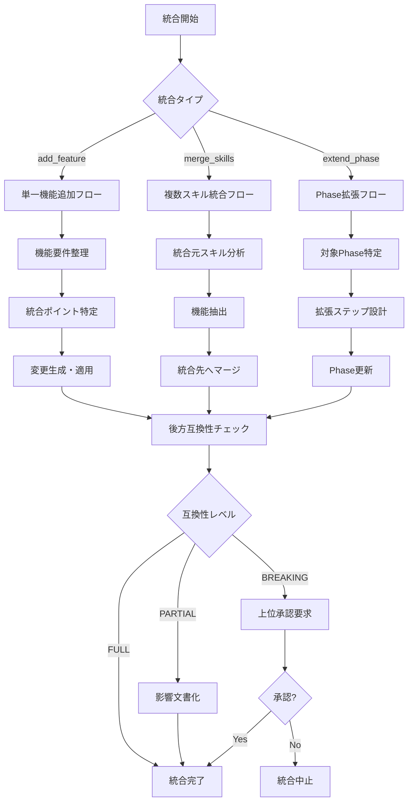

# Skill Feature Integrator — スキル機能統合支援

## Overview

既存のClaude Codeスキル（SKILL.md形式）に新機能を統合する際の標準的なワークフローとチェックリストを提供するスキル。スキル統合作業の品質を担保し、後方互換性を維持しながら機能拡張を実現する。

**主な用途:**
- 既存スキルへの新機能追加
- 複数の類似スキルの統合
- スキル拡張時の品質チェック
- 後方互換性の維持確認
- スキルセクションの整合性検証

**このスキルの特徴:**
- スキル構造の標準分析フレームワーク
- 統合ポイントの体系的な特定
- 後方互換性チェックリスト
- 統合後のレビューガイドライン
- 具体的な統合パターンと例

## When to Use

以下のいずれかに該当する場合にこのスキルを使用する：

- 「既存スキルに新機能を追加したい」
- 「スキルの機能を統合したい」
- 「スキル統合のチェックリストが欲しい」
- 「後方互換性を維持しながらスキルを拡張したい」
- 「複数の類似スキルを1つに統合したい」
- 「スキルのセクション整合性を確認したい」
- 「スキル更新時の影響範囲を確認したい」
- 既存スキルに関連機能を追加する必要がある場合
- 類似機能を持つ複数スキルを整理したい場合

**トリガーキーワード**: スキル統合, 機能追加, スキル拡張, 後方互換性, セクション整合性, スキルマージ, 機能統合

## Input Format

```yaml
# 必須パラメータ
target_skill_path: "skills/shogun-xxx/SKILL.md"    # 統合先スキルのパス
integration_type: "add_feature"                     # 統合タイプ（後述）

# 統合タイプ別パラメータ
# --- add_feature（機能追加）の場合 ---
new_feature:
  name: "tool-design-doc-generator"                 # 追加機能名
  description: "Tool設計書を自動生成する"           # 機能説明
  trigger_keywords:                                  # トリガーキーワード
    - "Tool設計書を生成して"
    - "詳細設計書を作成して"
  input_params:                                      # 追加パラメータ
    - name: "generate_tool_design"
      type: "boolean"
      default: false
      description: "Tool設計書を生成するか"
  phases:                                            # 追加Phase
    - phase_number: 6
      name: "Tool設計書生成"
      steps:
        - "ソースコード解析"
        - "テンプレート適用"
        - "Markdown生成"

# --- merge_skills（スキル統合）の場合 ---
source_skills:                                       # 統合元スキル群
  - path: "skills/skill-a/SKILL.md"
    features_to_merge:
      - "feature_x"
      - "feature_y"
  - path: "skills/skill-b/SKILL.md"
    features_to_merge:
      - "feature_z"

# 共通オプション
compatibility_level: "strict"                        # strict | relaxed
preserve_examples: true                              # 既存例を保持するか
generate_changelog: true                             # 変更ログを生成するか
```

### 統合タイプ

| タイプ | 説明 | 用途 |
|--------|------|------|
| `add_feature` | 既存スキルに新機能を追加 | 単一機能の追加 |
| `merge_skills` | 複数スキルを1つに統合 | 類似スキルの整理 |
| `extend_phase` | 既存Phaseの拡張 | 処理フローの強化 |
| `add_examples` | 使用例の追加 | ドキュメント充実 |

## Output Format

```
統合結果:
├── 変更されたSKILL.md
├── 統合レポート（標準出力）
│   ├── 変更セクション一覧
│   ├── 追加された要素
│   ├── 後方互換性チェック結果
│   └── レビューチェックリスト
└── 変更ログ（generate_changelog=true の場合）
```

### 統合レポートの構成

```markdown
# スキル統合レポート

## 変更サマリ
| セクション | 変更タイプ | 詳細 |
|-----------|----------|------|
| description | 追記 | 新トリガーキーワード追加 |
| When to Use | 追記 | 7項目追加 |
| Input Format | 追記 | 3パラメータ追加 |
| Instructions | 追加 | Phase 6, 7 追加 |
| Examples | 追加 | Example 4, 5 追加 |

## 後方互換性チェック
✅ 既存トリガーキーワード: 維持
✅ 既存パラメータ: 維持（デフォルト値変更なし）
✅ 既存Phase: 変更なし
✅ 既存Example: 動作継続

## レビューチェックリスト
□ description が既存機能を正確に含んでいる
□ 新トリガーキーワードが既存と重複していない
□ 新パラメータのデフォルト値が後方互換
□ 新Phaseが既存フローを壊していない
□ 新Exampleが正しく動作する
```

## Instructions

### Phase 1: 既存スキルの構造分析

```
【実行手順】

1. 対象スキルファイルの読み込み:
   Read: {target_skill_path}

2. YAML Front Matter の解析:
   - name: スキル名
   - description: 現在のトリガーキーワード一覧を抽出

3. 各セクションの構造把握:
   | セクション | 確認項目 |
   |-----------|---------|
   | Overview | 主な用途、特徴 |
   | When to Use | トリガーパターン、キーワード |
   | Input Format | 必須/任意パラメータ、デフォルト値 |
   | Output Format | 出力ファイル構成 |
   | Instructions | Phase数、各Phaseのステップ数 |
   | Examples | 例の数、カバー範囲 |
   | Anti-Patterns | 禁止パターン |
   | Appendix | 補足情報 |

4. 構造分析結果の記録:
   {
     "skill_name": "xxx",
     "current_triggers": [...],
     "param_count": { "required": N, "optional": M },
     "phase_count": N,
     "example_count": N,
     "has_appendix": true/false
   }
```

### Phase 2: 追加機能の要件整理

```
【実行手順】

1. 追加機能の明確化:
   - 機能名
   - 機能の目的
   - 想定ユーザー/ユースケース

2. 追加が必要な要素の洗い出し:
   | 要素 | 追加内容 | 既存との関係 |
   |------|---------|-------------|
   | トリガーキーワード | [...] | 重複なし確認 |
   | パラメータ | [...] | 既存に影響なし確認 |
   | Phase | [...] | 既存後に追加 |
   | Example | [...] | 新機能用 |

3. 依存関係の確認:
   - 新機能が既存機能に依存するか
   - 既存機能が新機能の影響を受けるか
   - 共通で使用するテンプレート/パターンがあるか

4. 要件整理結果:
   {
     "feature_name": "xxx",
     "new_triggers": [...],
     "new_params": [...],
     "new_phases": [...],
     "dependencies": {
       "uses_existing": [...],
       "affects_existing": [...]
     }
   }
```

### Phase 3: 統合ポイントの特定

```
【実行手順】

各セクションについて、統合ポイント（変更が必要な箇所）を特定する。

1. YAML Front Matter (description):
   □ 新しいトリガーキーワードを追記
   □ 既存の文言を維持
   □ 文字数制限に注意（推奨: 500文字以内）

   【統合パターン】
   既存: "...「Aを生成して」「Bを作成して」といった要望に対応する。"
   追加: "「Cを生成して」「Dを作成して」"
   結果: "...「Aを生成して」「Bを作成して」「Cを生成して」「Dを作成して」といった要望に対応する。"

2. Overview セクション:
   □ 「主な用途」に新用途を追記
   □ 「このスキルの特徴」に新特徴を追記
   □ 参考実装があれば追記

3. When to Use セクション:
   □ 新しいトリガーパターンを追記
   □ トリガーキーワードリストを更新
   □ 既存パターンとの重複を避ける

4. Input Format セクション:
   □ 新パラメータをYAMLブロックに追記
   □ 新パラメータ用のコメントを追加
   □ デフォルト値を設定（後方互換性のため）

5. Output Format セクション:
   □ 新しい出力ファイルを追記
   □ 新しいテンプレート構成を追記

6. Instructions セクション:
   □ 新Phaseを既存Phaseの後に追加
   □ Phase番号を連番で付与
   □ 既存Phaseへの参照があれば明記

7. Examples セクション:
   □ 新機能の使用例を追加
   □ Example番号を連番で付与
   □ 既存例との整合性を確認

8. Anti-Patterns / Guidelines セクション:
   □ 新機能に関連する禁止パターンを追加
   □ 既存パターンとの整合性を確認

9. Appendix セクション:
   □ 新しいテンプレート/パターン集を追加
   □ セクション番号を連番で付与
```

### Phase 4: 変更内容の生成

```
【実行手順】

Phase 3で特定した統合ポイントに基づき、変更内容を生成する。

1. 各セクションの変更テキストを生成:

   【description 変更】
   Edit: target_skill_path
   old_string: (既存のdescription末尾)
   new_string: (既存 + 新トリガーキーワード)

   【When to Use 変更】
   Edit: target_skill_path
   old_string: (既存のトリガーキーワードリスト)
   new_string: (既存 + 新トリガーキーワード)

   【Input Format 変更】
   Edit: target_skill_path
   old_string: (既存パラメータブロックの末尾)
   new_string: (既存 + 新パラメータ)

   ...以下同様

2. 変更の適用順序:
   1. YAML Front Matter (description)
   2. Overview
   3. When to Use
   4. Input Format
   5. Output Format
   6. Instructions（新Phase追加）
   7. Examples（新Example追加）
   8. Anti-Patterns
   9. Appendix

3. 各変更後の確認:
   - 変更が正しく適用されたか
   - Markdownの構文が正しいか
   - コードブロックが閉じているか
```

### Phase 5: 後方互換性チェック

```
【実行手順】

統合後のスキルが後方互換性を維持しているか確認する。

1. トリガーキーワードチェック:
   □ 既存のトリガーキーワードが全て維持されている
   □ 既存キーワードの意味が変わっていない
   □ 新キーワードが既存と競合していない

2. パラメータチェック:
   □ 既存の必須パラメータが変更されていない
   □ 既存パラメータのデフォルト値が変更されていない
   □ 新パラメータはオプション（デフォルト値あり）
   □ 新パラメータのデフォルト値が「既存動作を維持」する値

3. 処理フローチェック:
   □ 既存Phaseの番号が変更されていない
   □ 既存Phaseの処理内容が変更されていない
   □ 新Phaseは条件付き実行（新パラメータで制御）

4. 出力チェック:
   □ 既存の出力ファイルパスが変更されていない
   □ 既存の出力形式が変更されていない
   □ 新しい出力は追加のみ

5. 例の動作チェック:
   □ 既存のExampleが変更後も同じ動作をする
   □ 新Exampleは新機能のみを使用

【後方互換性チェックリスト】

| チェック項目 | 結果 | 備考 |
|-------------|------|------|
| 既存トリガー維持 | ✅/❌ | |
| 既存パラメータ維持 | ✅/❌ | |
| 既存Phase維持 | ✅/❌ | |
| 既存出力維持 | ✅/❌ | |
| 既存Example動作 | ✅/❌ | |

【互換性レベル判定】

- 全項目 ✅: FULL_COMPATIBLE（完全互換）
- 1-2項目 ❌: PARTIAL_COMPATIBLE（部分互換、要注意）
- 3項目以上 ❌: BREAKING_CHANGE（破壊的変更、要承認）
```

### Phase 6: 統合後のレビューチェックリスト

```
【実行手順】

統合完了後、以下のチェックリストで最終確認を行う。

□ 構造チェック
  □ YAML Front Matterが正しく閉じている
  □ 全セクションのMarkdown見出しレベルが正しい
  □ コードブロック（```）が全て閉じている
  □ テーブルの列数が一致している

□ 内容チェック
  □ descriptionが500文字以内
  □ トリガーキーワードに重複がない
  □ パラメータ名が既存と重複していない
  □ Phase番号が連番
  □ Example番号が連番

□ 品質チェック
  □ 日本語の文法が正しい
  □ 技術用語が正確
  □ 説明が十分に詳細
  □ 例が実用的

□ 整合性チェック
  □ descriptionとWhen to Useのキーワードが一致
  □ Input FormatとInstructionsのパラメータが一致
  □ Output FormatとInstructionsの出力が一致
  □ ExamplesがInput/Output Formatと整合

【最終確認】

統合後のスキルファイルを読み込み、以下を確認:
1. ファイル先頭から末尾まで通しで読む
2. 各セクションが正しく表示されるか
3. コードブロック内のサンプルが正しいか
```

## Examples

### Example 1: 単一機能の追加（mcp-api-doc-generatorへのTool設計書機能追加）

```yaml
target_skill_path: "skills/shogun-mcp-api-doc-generator/SKILL.md"
integration_type: "add_feature"
new_feature:
  name: "tool-design-doc-generator"
  description: "個別ToolのAPI仕様・処理フロー・エラーハンドリングを詳細文書化"
  trigger_keywords:
    - "Tool設計書を生成して"
    - "Toolの詳細設計書を作成して"
    - "個別ToolのAPI仕様を詳細文書化して"
  input_params:
    - name: "generate_tool_design_doc"
      type: "boolean"
      default: false
      description: "Tool設計書を生成するか"
    - name: "output_tool_design_dir"
      type: "string"
      default: "docs/tool-design/"
      description: "Tool設計書の出力ディレクトリ"
  phases:
    - phase_number: 6
      name: "Tool設計書生成"
      steps:
        - "対象Toolの特定"
        - "詳細情報の抽出（処理フロー、エラーハンドリング）"
        - "Mermaid図の生成"
        - "テンプレート適用・Markdown生成"
```

```
# 実行結果

統合レポート:
=============

変更セクション:
- description: 新トリガーキーワード4件追加
- When to Use: 7項目追加
- Input Format: 9パラメータ追加
- Output Format: 新テンプレート2件追加
- Instructions: Phase 6, 7, 8 追加
- Examples: Example 4, 5, 6 追加
- Anti-Patterns: 4パターン追加
- Appendix: セクション D, E, F 追加

後方互換性: FULL_COMPATIBLE
- 既存機能: 全て維持
- 新機能: オプションパラメータで制御

レビューチェック: 全項目 ✅
```

### Example 2: 複数スキルの統合

```yaml
target_skill_path: "skills/shogun-mcp-server-scaffold/SKILL.md"
integration_type: "merge_skills"
source_skills:
  - path: "skills/shogun-mcp-http-transport-designer/SKILL.md"
    features_to_merge:
      - "http_transport_design"
      - "sse_implementation"
  - path: "skills/shogun-mcp-tool-test-pattern/SKILL.md"
    features_to_merge:
      - "mockvc_test_pattern"
      - "wiremock_pattern"
compatibility_level: "strict"
preserve_examples: true
generate_changelog: true
```

```
# 実行結果

統合レポート:
=============

統合元スキル:
1. shogun-mcp-http-transport-designer
   - http_transport_design → Phase 7として統合
   - sse_implementation → Phase 8として統合

2. shogun-mcp-tool-test-pattern
   - mockvc_test_pattern → Phase 9として統合
   - wiremock_pattern → Phase 10として統合

変更セクション:
- description: 統合元スキルのキーワードを追記
- When to Use: 12項目追加
- Input Format: 8パラメータ追加
- Instructions: Phase 7-10 追加
- Examples: Example 5-8 追加

後方互換性: FULL_COMPATIBLE

変更ログ生成: docs/CHANGELOG.md
```

### Example 3: 既存Phaseの拡張

```yaml
target_skill_path: "skills/shogun-nablarch-doc-generator/SKILL.md"
integration_type: "extend_phase"
target_phase: 3
extension:
  name: "Mermaid図自動生成強化"
  additional_steps:
    - "アーキテクチャ図の自動生成"
    - "データフロー図の自動生成"
    - "シーケンス図の自動生成"
  new_params:
    - name: "diagram_types"
      type: "array"
      default: ["architecture", "dataflow"]
      description: "生成する図の種類"
```

```
# 実行結果

統合レポート:
=============

拡張対象: Phase 3（Mermaid図生成）

追加ステップ:
- Step 3.4: アーキテクチャ図の自動生成
- Step 3.5: データフロー図の自動生成
- Step 3.6: シーケンス図の自動生成

新パラメータ:
- diagram_types: 生成する図の種類（デフォルト: architecture, dataflow）

後方互換性: FULL_COMPATIBLE
- デフォルト値により既存動作を維持
```

## Guidelines

### 必須ルール

1. **後方互換性の維持**
   - 既存のトリガーキーワードを削除・変更しない
   - 既存の必須パラメータを変更しない
   - 新パラメータは必ずデフォルト値を設定
   - デフォルト値は「既存動作を維持」する値

2. **セクション整合性**
   - descriptionとWhen to Useのキーワードを一致させる
   - Input FormatとInstructionsのパラメータを一致させる
   - Output FormatとInstructionsの出力を一致させる

3. **番号の連番維持**
   - Phase番号は既存の続きから連番
   - Example番号は既存の続きから連番
   - Appendixセクション番号も連番

4. **変更の最小化**
   - 既存セクションは追記のみ（書き換え禁止）
   - 新機能はオプションとして追加
   - 条件付き実行で既存フローに影響させない

### アンチパターン

1. **既存機能の上書き**
   - ❌ 既存のトリガーキーワードを削除
   - ❌ 既存パラメータのデフォルト値を変更
   - ❌ 既存Phaseの処理内容を変更
   - ✅ 追記のみ、既存は維持

2. **非オプション機能の追加**
   - ❌ 新パラメータを必須にする
   - ❌ デフォルトで新機能を有効にする
   - ✅ デフォルトはfalse/null、明示的に有効化

3. **番号の飛び・重複**
   - ❌ Phase 1, 2, 3, 5（4が欠番）
   - ❌ Phase 1, 2, 3, 3（3が重複）
   - ✅ Phase 1, 2, 3, 4, 5（連番）

4. **セクション間の不整合**
   - ❌ descriptionにあるキーワードがWhen to Useにない
   - ❌ Input Formatにあるパラメータがinstructionsで使われていない
   - ✅ 全セクション間で整合性を保つ

5. **過剰な統合**
   - ❌ 無関係な機能を1つのスキルに詰め込む
   - ❌ スキルが肥大化して可読性が低下
   - ✅ 関連性の高い機能のみを統合

6. **テスト不足での統合**
   - ❌ 統合後のExampleを実行確認しない
   - ❌ 後方互換性チェックを省略
   - ✅ 全チェックリストを完了してから統合完了

## Appendix

### A. 統合チェックリストテンプレート

```markdown
# スキル統合チェックリスト

## 基本情報
- 対象スキル:
- 統合タイプ:
- 統合日時:
- 担当者:

## Phase 1: 既存スキル構造分析
- [ ] YAML Front Matter確認
- [ ] 全セクション構造把握
- [ ] 既存トリガーキーワード一覧化
- [ ] 既存パラメータ一覧化
- [ ] 既存Phase一覧化

## Phase 2: 追加機能要件整理
- [ ] 機能名・目的の明確化
- [ ] 追加要素の洗い出し
- [ ] 依存関係の確認

## Phase 3: 統合ポイント特定
- [ ] description変更箇所特定
- [ ] When to Use変更箇所特定
- [ ] Input Format変更箇所特定
- [ ] Output Format変更箇所特定
- [ ] Instructions変更箇所特定
- [ ] Examples変更箇所特定
- [ ] Anti-Patterns変更箇所特定
- [ ] Appendix変更箇所特定

## Phase 4: 変更内容生成
- [ ] 各セクション変更テキスト生成
- [ ] 変更適用順序確認
- [ ] 変更適用・確認

## Phase 5: 後方互換性チェック
- [ ] トリガーキーワード維持確認
- [ ] パラメータ維持確認
- [ ] Phase維持確認
- [ ] 出力維持確認
- [ ] Example動作確認

## Phase 6: 最終レビュー
- [ ] 構造チェック完了
- [ ] 内容チェック完了
- [ ] 品質チェック完了
- [ ] 整合性チェック完了

## 結果
- 互換性レベル: [ ] FULL / [ ] PARTIAL / [ ] BREAKING
- 統合ステータス: [ ] 完了 / [ ] 要修正 / [ ] 却下
```

### B. セクション別変更パターン集

#### B.1 description変更パターン

```
【追記パターン】
既存: "...「Aを生成して」といった要望に対応する。Xスキル。"
追加: "「Bを作成して」"
結果: "...「Aを生成して」「Bを作成して」といった要望に対応する。Xスキル。"

【機能追加パターン】
既存: "...の包括的スキル。"
追加: "Y機能を含む。"
結果: "...の包括的スキル。Y機能を含む。"
```

#### B.2 When to Use変更パターン

```
【トリガー追加パターン】
既存:
- 「Aを生成して」
- 「Bを作成して」

追加（既存の後に挿入）:
- **「Cを生成して」**
- **「Dを作成して」**

【キーワード追加パターン】
既存: **トリガーキーワード**: A, B, C
追加: D, E
結果: **トリガーキーワード**: A, B, C, D, E
```

#### B.3 Input Format変更パターン

```yaml
# 既存パラメータブロックの末尾に追加

# --- 既存パラメータ ---
param_a: "value_a"
param_b: "value_b"

# --- 新機能パラメータ（ここから追加） ---
new_feature_enabled: false        # 新機能を有効にするか（デフォルト: false）
new_feature_option: "default"     # 新機能のオプション
```

#### B.4 Instructions変更パターン

```markdown
### Phase N: 新機能名（new_feature_enabled=true の場合）

#### Step N.1: ステップ名

```
【実行手順】

new_feature_enabled=true の場合に実行する。

1. 手順1
2. 手順2
...
```
```

### C. 互換性レベル判定基準

| レベル | 条件 | 対応 |
|--------|------|------|
| FULL_COMPATIBLE | 全チェック項目 ✅ | そのまま統合完了 |
| PARTIAL_COMPATIBLE | 1-2項目 ❌ | 影響範囲を文書化して統合 |
| BREAKING_CHANGE | 3項目以上 ❌ | 上位承認が必要 |

### D. 統合タイプ別フローチャート



### E. よくある質問（FAQ）

**Q1: 既存スキルのPhase番号を変更したい場合は？**

A1: Phase番号の変更は破壊的変更となるため、原則禁止。新Phaseは既存の後に追加する。どうしても必要な場合はBREAKING_CHANGEとして上位承認を得る。

**Q2: 新機能をデフォルトで有効にしたい場合は？**

A2: 後方互換性のため、新機能のデフォルトは常にfalse/無効。有効化は明示的なパラメータ指定で行う。

**Q3: 統合元スキルを削除してよいか？**

A3: 統合完了後、十分なテスト期間（推奨: 1週間）を経てから削除。その間は両方のスキルを維持し、統合先への移行を促す。

**Q4: descriptionが長くなりすぎた場合は？**

A4: 500文字を超える場合は、代表的なトリガーキーワードのみを記載し、詳細はWhen to Useセクションに委譲する。
