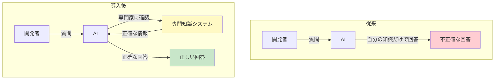
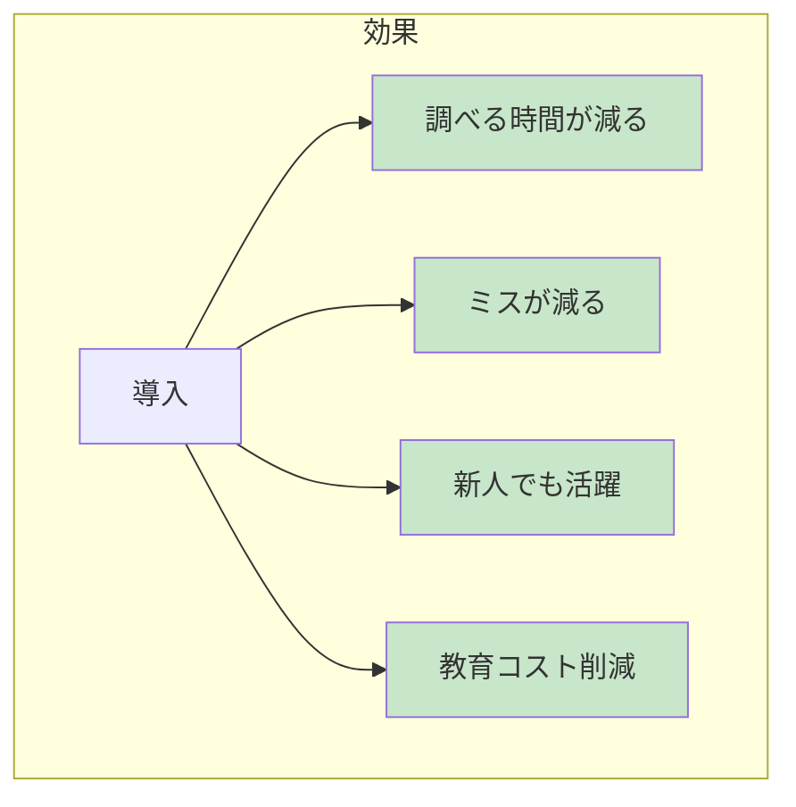
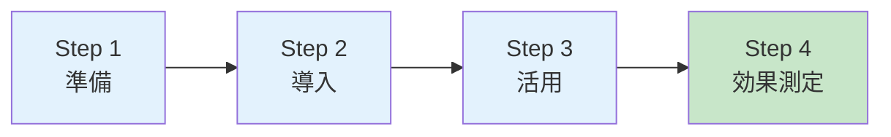
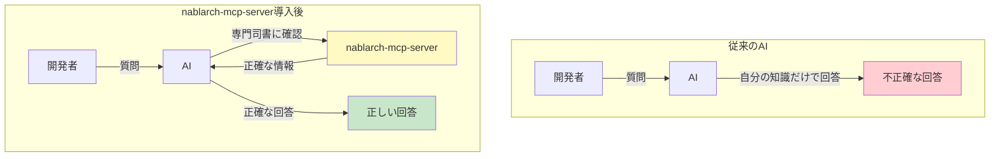
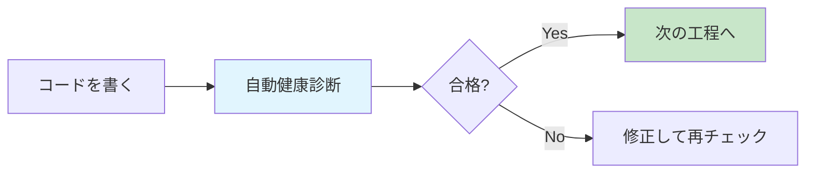

# Tech Article Simplifier — 技術ドキュメントの非エンジニア向け解説記事生成

## Overview

技術ドキュメント（設計書、README、アーキテクチャ文書等）を入力として受け取り、非エンジニア（経営層、営業、マーケティング、PMなど）が理解できる解説記事を生成するスキル。

**提案元の実績:**
- cmd_048: nablarch-mcp-server の非エンジニア向け記事作成（333行）
  - 技術記事を経営層・営業向けに変換
  - 「図書館の司書」という比喩でMCPサーバーの役割を説明
  - Mermaid概念図による視覚的説明
  - FAQ形式での疑問解消

**主な用途:**
- 技術プロジェクトの経営層向け説明資料作成
- 営業・マーケティング向け技術紹介資料
- 社内報・広報向けの技術解説記事
- 新規参画メンバー向けのオリエンテーション資料
- クライアント向け提案資料の技術説明部分

**このスキルの特徴:**
- 専門用語の自動検出と平易化
- 身近な例え話・比喩の自動生成
- 技術図ではなく「概念図」としてのMermaid図生成
- ビジネス価値・メリットの強調
- 想定質問（FAQ）の自動生成
- 対象読者ペルソナに合わせた文体調整

## When to Use

以下のいずれかに該当する場合にこのスキルを使用する：

- 「技術ドキュメントを経営層向けに説明して」
- 「非エンジニアにわかりやすい記事を作って」
- 「技術を営業向けに説明する資料が欲しい」
- 「専門用語を使わずに説明して」
- 「○○の概要を非技術者にもわかるようにまとめて」
- 「社長に説明できる資料にして」
- 「クライアント向けの技術説明を作って」
- 「この技術文書をプレゼン資料に使えるようにして」
- 技術プロジェクトの価値を非技術者に伝える必要がある場合
- 技術選定の理由を経営層に説明する必要がある場合

**トリガーキーワード**: 非エンジニア向け, 経営層向け, 営業向け, わかりやすく, 噛み砕いて, 平易化, 専門用語なし, 技術解説, 初心者向け, ビジネス向け, クライアント向け

## Input Format

```yaml
# 必須パラメータ
source_path: "path/to/technical-document.md"  # 元技術ドキュメントのパス
                                               # または直接テキストを渡す場合は source_text を使用
source_text: null                              # 元技術ドキュメントのテキスト（source_pathと排他）

# 任意パラメータ（デフォルト値あり）
target_audience: "executive"                   # 対象読者
                                               # "executive": 経営層（CxO、役員）
                                               # "sales": 営業・マーケティング
                                               # "pm": プロジェクトマネージャー
                                               # "general": 一般社員・新人
                                               # "client": クライアント・顧客
                                               # デフォルト: "executive"

output_path: null                              # 出力先パス（未指定の場合は標準出力）

article_style: "narrative"                     # 記事スタイル
                                               # "narrative": 物語調（読み物）
                                               # "qa": Q&A形式
                                               # "presentation": プレゼン用（箇条書き中心）
                                               # デフォルト: "narrative"

emphasis_points: []                            # 強調したいポイント（リスト）
                                               # 例: ["コスト削減", "開発効率", "品質向上"]
                                               # デフォルト: []（自動判定）

include_faq: true                              # FAQセクションを含めるか
                                               # デフォルト: true

include_mermaid: true                          # Mermaid概念図を含めるか
                                               # デフォルト: true

max_length: "standard"                         # 出力長
                                               # "brief": 簡潔版（1000字程度）
                                               # "standard": 標準版（2000-3000字）
                                               # "detailed": 詳細版（5000字以上）
                                               # デフォルト: "standard"
```

## Output Format

非エンジニア向け解説記事（Markdown形式）。以下の構成を標準とする：

```markdown
# [タイトル] — [サブタイトル（技術の価値を端的に表現）]

> この記事は、[対象読者]向けに、[技術名]が何をするものなのかを分かりやすく解説します。

---

## 目次
[自動生成される目次]

---

## 1. 背景 — なぜこの技術が必要なのか
[課題・ペインポイントを身近な例で説明]

## 2. 解決策 — [技術名]とは
[比喩・例え話を使った概念説明]
[Mermaid概念図]

## 3. メリット — 何が良くなるのか
[ビジネス価値の説明]
[具体的な効果の数値化（可能な場合）]

## 4. 具体例 — 実際にはどう使う？
[利用シーンの具体例]

## 5. まとめ
[要点の整理]

---

## よくある質問（FAQ）
[想定質問と回答]
```

## Instructions

### Phase 1: 元技術ドキュメントの読み込みと分析

#### Step 1.1: ドキュメント読み込み

```
【実行手順】

1. source_path または source_text から元ドキュメントを取得

2. 以下の情報を抽出・記録:
   - ドキュメントの種類（README, 設計書, 仕様書等）
   - 主題となる技術・システム・プロジェクト名
   - 総行数・サイズ
   - セクション構成
   - 含まれる技術要素:
     □ 使用技術・フレームワーク
     □ アーキテクチャパターン
     □ 機能・ユースケース
     □ 数値データ（性能、コスト等）
```

#### Step 1.2: 専門用語の抽出

```
【実行手順】

1. 元ドキュメントから専門用語を抽出:
   - プログラミング言語名（Java, Python等）
   - フレームワーク名（Spring Boot, Nablarch等）
   - アーキテクチャ用語（マイクロサービス, API等）
   - プロトコル名（HTTP, REST, JSON-RPC等）
   - ツール名（Docker, Git等）
   - 略語（CI/CD, MCP, RAG等）

2. 用語リストを作成:
   | 専門用語 | 分類 | 平易化方針 |
   |---------|------|----------|
   | API | 略語 | 「データのやり取り口」 |
   | Spring Boot | FW名 | 「プログラムの土台」 |
   | JSON | フォーマット | 「データの書式」 |

3. 元ドキュメントでの使用頻度を記録（頻出用語は丁寧に説明）
```

#### Step 1.3: キーメッセージの特定

```
【実行手順】

1. 元ドキュメントから核心的なメッセージを抽出:
   - この技術は何を解決するのか？（課題）
   - どうやって解決するのか？（手段）
   - 何が良くなるのか？（効果・価値）

2. emphasis_points が指定されている場合はそれを優先

3. キーメッセージを3-5個に絞り込む:
   例:
   - 「AIが正確なコードを書けるようになる」
   - 「開発者の調べる時間が減る」
   - 「新人でもベテランの知識を活用できる」
```

### Phase 2: 対象読者のペルソナ設定

#### Step 2.1: ペルソナ詳細化

```
【対象読者別ペルソナ】

■ executive（経営層）
  - 役職: CxO、役員、事業部長
  - 関心事: ROI、競争優位性、リスク、戦略的価値
  - 知識レベル: IT全般の基礎知識あり、技術詳細は不要
  - 期待する情報: 投資対効果、導入判断材料
  - 文体: 簡潔、結論先行、数字重視
  - 避けるべき: 技術詳細、コードサンプル、専門用語の羅列

■ sales（営業・マーケティング）
  - 役職: 営業担当、マーケター、プリセールス
  - 関心事: 顧客への説明方法、差別化ポイント、事例
  - 知識レベル: 技術の表面的理解、ユースケース重視
  - 期待する情報: 顧客メリット、競合比較、導入事例
  - 文体: 顧客視点、ストーリー重視
  - 避けるべき: 内部実装、技術的制約

■ pm（プロジェクトマネージャー）
  - 役職: PM、PL、プロダクトオーナー
  - 関心事: プロジェクトへの影響、スケジュール、リソース
  - 知識レベル: 技術概要の理解、詳細は開発者に委任
  - 期待する情報: 導入ステップ、必要リソース、リスク
  - 文体: 計画立案に使える具体性
  - 避けるべき: コード詳細、アルゴリズム

■ general（一般社員・新人）
  - 役職: 非IT部門社員、新入社員、インターン
  - 関心事: 自分の仕事との関連、会社の取り組み理解
  - 知識レベル: IT知識はほぼなし
  - 期待する情報: 基本的な仕組み、身近な例
  - 文体: 親しみやすい、例え話多め
  - 避けるべき: 前提知識を要する説明

■ client（クライアント・顧客）
  - 役職: 発注者側の担当者、決裁者
  - 関心事: 自社への価値、信頼性、コスト
  - 知識レベル: 業界・業務知識あり、IT知識は様々
  - 期待する情報: 導入効果、品質保証、サポート体制
  - 文体: 丁寧、信頼感、実績重視
  - 避けるべき: 内部事情、開発プロセス詳細
```

#### Step 2.2: 文体・トーンの決定

```
【文体設定】

target_audience に応じて文体を決定:

| 対象 | 一人称 | 文末 | トーン |
|-----|--------|------|-------|
| executive | 省略 | である調 | 簡潔・断定的 |
| sales | 私たち | です/ます調 | 顧客志向・提案的 |
| pm | 省略 | である調 | 客観的・計画的 |
| general | 省略 | です/ます調 | 親しみやすい・教育的 |
| client | 私ども | です/ます調 | 丁寧・信頼感 |

【トーン例】

executive向け:
「本技術の導入により、開発工数を30%削減できる可能性がある。」

general向け:
「この仕組みを使うと、開発者さんの『調べる時間』がぐっと減ります。
イメージとしては、図書館の司書さんがいつも隣にいてくれるような感じです。」
```

### Phase 3: 専門用語の抽出と平易化

#### Step 3.1: 用語の平易化変換

```
【平易化変換テーブル】

■ インフラ・環境系
| 専門用語 | 平易化 | 補足説明 |
|---------|--------|---------|
| サーバー | コンピュータ/システム | 「データを管理するコンピュータ」 |
| クラウド | インターネット上のシステム | 「自社で機器を持たずに使えるシステム」 |
| デプロイ | 公開/稼働開始 | 「システムを実際に使えるようにすること」 |
| コンテナ | 箱詰めされたプログラム | 「どこでも同じように動く仕組み」 |
| API | データの窓口 | 「システム同士がやり取りする入口」 |

■ 開発プロセス系
| 専門用語 | 平易化 | 補足説明 |
|---------|--------|---------|
| コード | プログラム | 「コンピュータへの指示書」 |
| バグ | 不具合/エラー | 「プログラムの間違い」 |
| テスト | 動作確認 | 「正しく動くか確かめること」 |
| CI/CD | 自動化の仕組み | 「人手を減らして品質を保つ仕組み」 |
| レビュー | チェック/確認作業 | 「他の人が内容を確認すること」 |

■ AI・データ系
| 専門用語 | 平易化 | 補足説明 |
|---------|--------|---------|
| AI/人工知能 | 賢いコンピュータ | 「人間のように考えるプログラム」 |
| 機械学習 | AIの学習方法 | 「データから自動的に学ぶ仕組み」 |
| LLM | AI言語モデル | 「言葉を理解して生成できるAI」 |
| RAG | 検索+AI | 「資料を調べてからAIが回答する仕組み」 |
| ベクトル検索 | 意味で探す検索 | 「言葉の意味を理解して探す検索」 |

■ アーキテクチャ系
| 専門用語 | 平易化 | 補足説明 |
|---------|--------|---------|
| フレームワーク | 開発の土台 | 「プログラムを作る時の基礎部品」 |
| ライブラリ | 便利な部品 | 「誰かが作った再利用できるプログラム」 |
| マイクロサービス | 小分け構成 | 「機能ごとに分けたシステム構成」 |
| モノリシック | 一体型構成 | 「全機能がひとまとまりのシステム」 |
| ミドルウェア | つなぎ役ソフト | 「基盤と応用をつなぐソフトウェア」 |
```

#### Step 3.2: 平易化のルール

```
【平易化の原則】

1. 初出時に説明を付ける:
   NG: 「MCPサーバーを導入する」
   OK: 「MCPサーバー（AIに専門知識を教える仕組み）を導入する」

2. 略語は可能な限り避ける:
   NG: 「CI/CDパイプラインでデプロイ」
   OK: 「自動化の仕組みで本番環境へ公開」

3. カタカナ語は身近な言葉に:
   NG: 「スケーラビリティを確保」
   OK: 「利用者が増えても対応できる」

4. 数字で具体化:
   NG: 「効率が向上する」
   OK: 「作業時間が30%減る」「1時間かかっていたことが10分で終わる」

5. 日常の例えに置き換える:
   NG: 「キャッシュにより応答速度が向上」
   OK: 「よく使う情報を手元に置いておくことで、すぐに答えられるようになる
        （図書館で、よく借りられる本を入口近くに置いておくのと同じ）」
```

### Phase 4: 比喩・例え話の生成

#### Step 4.1: 比喩パターンの選択

```
【比喩テンプレート集】

■ 図書館の司書パターン
  適用: 検索システム、ナレッジベース、AIアシスタント
  例: 「優秀な司書がいる図書館では、『こういう情報が欲しい』と伝えるだけで、
       適切な本を見つけてきてくれます。このシステムはまさにその『専門司書』です。」

■ 通訳者パターン
  適用: API連携、データ変換、プロトコル変換
  例: 「日本語しか話せない人と英語しか話せない人の間に通訳者がいれば、
       会話ができますよね。このシステムは、異なるシステム間の『通訳者』です。」

■ 料理のレシピパターン
  適用: フレームワーク、テンプレート、標準化
  例: 「レシピがあれば、料理初心者でも美味しい料理が作れます。
       フレームワークはプログラミングの『レシピ集』のようなものです。」

■ 交通整理パターン
  適用: キューイング、ロードバランサー、トランザクション
  例: 「交差点の信号機がなければ、車は衝突してしまいます。
       このシステムは、大量のリクエストを安全にさばく『交通整理係』です。」

■ 健康診断パターン
  適用: テスト、監視、品質管理
  例: 「人間も定期健康診断で問題を早期発見しますよね。
       このテストの仕組みは、システムの『定期健康診断』です。」

■ 金庫・鍵パターン
  適用: セキュリティ、認証、暗号化
  例: 「大事な書類は金庫に入れ、鍵をかけます。
       この認証システムは、デジタルの『金庫と鍵』です。」

■ 組み立て家具パターン
  適用: モジュール構成、プラグイン、拡張性
  例: 「IKEAの家具は、必要なパーツを組み合わせて好きな形が作れます。
       このシステムも同じように、必要な機能を組み合わせられます。」

■ 秘書パターン
  適用: 自動化、スケジューリング、タスク管理
  例: 「優秀な秘書は、上司の指示がなくても先回りして準備してくれます。
       この自動化システムは、開発者の『デジタル秘書』です。」
```

#### Step 4.2: 比喩の組み込み方

```
【比喩組み込みのルール】

1. 最初に結論（比喩）を述べる:
   「一言で言うと、これは『AIにNablarchの専門知識を教える』ための仕組みです。」

2. 比喩で全体像を示す:
   「図書館で本を探すときを想像してください。
    - 司書がいない図書館では、自分で膨大な本の中から探す必要があります
    - 優秀な司書がいる図書館では、適切な本を見つけてきてくれます」

3. 比喩と実際の機能を対応させる:
   「この『司書』に相当するのが nablarch-mcp-server です。
    AIが『Nablarchについて知りたい』と思ったとき、
    この司書に聞けば、正確な情報を教えてもらえます。」

4. 比喩の限界も認める（必要に応じて）:
   「もちろん、実際のシステムは図書館より複雑ですが、
    基本的な考え方はこの例えで理解できます。」
```

### Phase 5: Mermaid概念図の作成

#### Step 5.1: 概念図の設計原則

```
【概念図の設計ルール】

■ 技術図 vs 概念図

技術図（NG - 非エンジニアには複雑すぎる）:
- シーケンス図でJSON-RPCのやり取りを全て表示
- クラス図でFQCNと継承関係を表示
- コンポーネントの内部実装を詳細に図示

概念図（OK - 非エンジニアにもわかる）:
- 登場人物（人・システム）の関係を簡潔に表示
- 処理の流れを「できること」ベースで表示
- 色分けで良い/悪い、従来/新規を明示

■ 概念図の要素数
- ノード数: 最大7個（ミラー則）
- 矢印数: ノード数の1.5倍以下
- 階層: 最大2層
```

#### Step 5.2: 概念図テンプレート

```
【Before/After比較図】

用途: 導入前後の変化を示す



【処理フロー図（簡略版）】

用途: システムの処理の流れを示す


【メリット可視化図】

用途: 導入効果を視覚的に示す



【時間軸フロー図】

用途: ステップ・フェーズを示す


```

#### Step 5.3: 概念図の日本語化ルール

```
【Mermaid図の日本語化】

1. ノードラベルは引用符で囲む:
   OK: A["開発者"]
   NG: A[開発者]  （日本語によっては崩れる）

2. 改行は<br/>を使用:
   A["Step 1<br/>準備段階"]

3. スタイル指定で色分け:
   style A fill:#c8e6c9  （緑: ポジティブ）
   style B fill:#ffcdd2  （赤: ネガティブ）
   style C fill:#fff9c4  （黄: 注目点）
   style D fill:#e1f5fe  （青: システム）

4. サブグラフのタイトルも引用符:
   subgraph 従来["従来のやり方"]

5. 矢印のラベルは短く:
   A -->|質問| B  （動詞1語）
   A -->|確認して回答| B  （最大5-6文字）
```

### Phase 6: メリット・価値の強調

#### Step 6.1: 価値の言語化

```
【価値変換テーブル】

技術的なメリットをビジネス価値に変換:

| 技術メリット | ビジネス価値 | 表現例 |
|-------------|-------------|--------|
| 処理速度向上 | 待ち時間削減、顧客満足度向上 | 「お客様をお待たせしない」 |
| 自動化 | 人件費削減、ヒューマンエラー防止 | 「人手を減らしてミスも減らす」 |
| スケーラビリティ | 事業拡大への対応力 | 「ビジネスの成長に合わせて拡張できる」 |
| 標準化 | 属人化防止、引継ぎコスト削減 | 「誰でも同じ品質で作業できる」 |
| 可観測性 | 問題の早期発見、ダウンタイム削減 | 「問題を見える化して素早く対処」 |
| セキュリティ強化 | リスク低減、コンプライアンス対応 | 「情報漏洩のリスクを減らす」 |
| 開発効率向上 | 市場投入時間短縮、競争優位性 | 「ライバルより早く市場に出せる」 |
| 品質向上 | 顧客クレーム減少、ブランド価値向上 | 「品質トラブルを未然に防ぐ」 |
```

#### Step 6.2: 数値化・具体化

```
【数値化のパターン】

1. 時間の削減:
   - 「30分かかっていた作業が10分に」
   - 「1週間の導入期間が3日に短縮」
   - 「月40時間の残業が20時間に」

2. コストの削減:
   - 「年間○○万円のコスト削減」
   - 「外注費を30%カット」
   - 「教育コストを半減」

3. 品質の向上:
   - 「エラー発生率が1/3に」
   - 「顧客満足度が20%向上」
   - 「手戻り作業が80%減少」

4. 生産性の向上:
   - 「同じ人数で1.5倍の案件を処理」
   - 「新人の立ち上がりが2ヶ月から2週間に」
   - 「1人あたりの処理件数が倍増」

【数値がない場合の表現】

数値データがない場合は、相対的・定性的な表現を使う:
- 「大幅に削減」「飛躍的に向上」は避ける（曖昧）
- 「半分以下に」「2倍以上に」のような目安を示す
- 「従来○○だったものが△△になる」という比較形式で表現
```

### Phase 7: FAQ生成

#### Step 7.1: 想定質問の洗い出し

```
【対象読者別の想定質問】

■ executive（経営層）向け
- 導入にはどれくらいの費用がかかりますか？
- 投資対効果（ROI）はどれくらいですか？
- 競合他社も同様のことをしていますか？
- リスクは何ですか？
- いつから効果が出ますか？

■ sales（営業）向け
- 顧客にどう説明すればいいですか？
- 他社製品との違いは何ですか？
- 導入事例はありますか？
- デモはできますか？

■ pm（PM）向け
- 導入にはどれくらいの期間がかかりますか？
- 必要なリソース（人員・環境）は？
- 既存システムへの影響は？
- 段階的に導入できますか？

■ general（一般）向け
- 自分の仕事にどう関係しますか？
- 使い方は難しいですか？
- サポートはありますか？

■ client（クライアント）向け
- セキュリティは大丈夫ですか？
- サポート体制はどうなっていますか？
- 他社の導入実績は？
- 契約形態は？
```

#### Step 7.2: FAQ形式化

```
【FAQの書き方】

1. 質問は対象読者の言葉で:
   NG: 「スケーラビリティについて教えてください」
   OK: 「利用者が増えたらどうなりますか？」

2. 回答は3文以内で結論先行:
   「○○です。△△のため、□□できます。詳細は～」

3. 専門用語が必要な場合は補足:
   「APIキーが必要です。APIキーとは、システムを利用するための『パスワード』のようなものです。」

4. 不安を払拭する構成:
   - 結論（安心材料）
   - 理由（根拠）
   - 補足（詳細情報への誘導）

【FAQテンプレート】

### Q: [質問文]？

[1行で結論]。[補足説明1-2文]。

例:
### Q: 導入にはどれくらいの費用がかかりますか？

基本ソフトウェアは無償で利用できます。ただし、AIサービス（Claude等）の利用料金は別途必要です。社内環境の構築費用は、規模によりますが○○万円程度が目安です。
```

### Phase 8: 記事の組み立て

#### Step 8.1: 記事構成の決定

```
【article_style別の構成】

■ narrative（物語調）
1. タイトル + キャッチコピー
2. 導入（対象読者への呼びかけ）
3. 目次
4. 背景・課題（ストーリー仕立て）
5. 解決策（比喩を使った説明）
6. メリット（具体的な価値）
7. 具体例（利用シーン）
8. まとめ
9. FAQ

■ qa（Q&A形式）
1. タイトル
2. 概要（1段落で全体像）
3. Q&Aセクション（10-15問）
   - 基本（～とは何ですか？）
   - メリット（何がよくなりますか？）
   - 導入（どうやって使いますか？）
   - 費用・リスク（注意点は？）
4. まとめ

■ presentation（プレゼン用）
1. タイトルスライド
2. 課題（3点以内、箇条書き）
3. 解決策（図+キーワード）
4. メリット（3点、箇条書き）
5. 具体例（1-2例）
6. 次のステップ
```

#### Step 8.2: 記事の執筆

```
【執筆のチェックリスト】

□ タイトル
  □ 技術名が入っている
  □ 価値・メリットが伝わる
  □ 対象読者が興味を持つ

□ 導入部
  □ 対象読者を明示
  □ この記事で何がわかるかを説明
  □ 3文以内で興味を引く

□ 本文
  □ 専門用語には初出時に説明
  □ 比喩・例え話を1つ以上使用
  □ Mermaid概念図を含む（include_mermaid=trueの場合）
  □ 数値・具体例でメリットを裏付け

□ FAQ
  □ 対象読者の想定質問を網羅
  □ 回答は簡潔（3文以内）
  □ 専門用語を使わない

□ 全体
  □ max_lengthに収まっている
  □ 文体が統一されている
  □ 専門用語だけで構成されたパラグラフがない
```

#### Step 8.3: 最終確認

```
【品質チェックリスト】

□ 読者適合性チェック
  □ 対象読者が予備知識なしで理解できる
  □ 専門用語には全て説明がある
  □ 対象読者の関心事に答えている

□ 正確性チェック
  □ 元技術ドキュメントの内容と矛盾しない
  □ 数値データは元資料に基づいている
  □ 比喩が誤解を招かない

□ 完成度チェック
  □ 目次の項目と本文が一致
  □ 内部リンク（[text](#anchor)）が正しい
  □ Mermaid図がレンダリングできる
  □ 誤字脱字がない
```

## Examples

### Example 1: MCPサーバー技術 → 経営層向け記事

```yaml
# 入力
source_path: "docs/architecture.md"
target_audience: "executive"
article_style: "narrative"
emphasis_points: ["開発効率", "品質向上", "コスト削減"]
```

```markdown
# 出力例（抜粋）

# AIがNablarch開発の「専門家」になる — nablarch-mcp-serverとは

> この記事は、技術的なバックグラウンドがない方（経営層、営業、プロジェクトマネージャーなど）
> 向けに、nablarch-mcp-serverが何をするものなのかを分かりやすく解説します。

---

## 1. AIがプログラミングを手伝う時代

最近、AIが私たちの仕事を手伝ってくれる場面が増えています。
実はプログラミングの世界でも、AIが大きな力を発揮しています。

しかし、AIには弱点があります。「学習していないことは知らない」のです。

---

## 2. 解決策：AIに「専門知識」を教える

### 図書館の司書に例えると...



**優秀な司書がいる図書館**では、「こういう情報が欲しい」と伝えるだけで、
適切な本を見つけてきてくれます。nablarch-mcp-serverはまさにこの「専門司書」です。

---

## 3. どんなメリットがあるの？

| 項目 | 従来 | 導入後 |
|-----|-----|-------|
| 調べる時間 | 30分〜数時間 | 数分 |
| コードの正確性 | AIが間違えることが多い | 正確な提案が増える |
| 新人の立ち上がり | 長い学習期間が必要 | AIを通じてベテランの知識を活用 |

---

## よくある質問

### Q: 導入にはどれくらいの費用がかかりますか？

基本ソフトウェアは無償です。ただし、AIサービスの利用料金は別途必要です。
```

### Example 2: CI/CD技術 → 営業向け記事

```yaml
# 入力
source_path: "docs/cicd-pipeline.md"
target_audience: "sales"
article_style: "narrative"
emphasis_points: ["品質保証", "スピード", "安心感"]
```

```markdown
# 出力例（抜粋）

# 「毎回の確認作業」を自動化 — お客様に安心をお届けする品質管理の仕組み

> この記事は、営業・プリセールスの方向けに、
> 私たちの品質管理の仕組みを分かりやすく解説します。
> お客様への説明にご活用ください。

---

## お客様の不安「ちゃんとテストしてるの？」

システム開発を発注されるお客様が最も気にされるのは、
「本当に品質は大丈夫なのか」ということです。

私たちは、**人間がチェックする前に、コンピュータが自動で品質チェック**する
仕組みを導入しています。

---

## 健康診断に例えると...



人間が定期健康診断で病気を早期発見するように、
プログラムも「自動健康診断」で問題を早期発見します。

---

## お客様へのセールスポイント

1. **24時間365日の自動チェック**: 夜中に書いたプログラムも、朝には結果が分かります
2. **人的ミスの排除**: チェック漏れがありません
3. **履歴が残る**: いつ、誰が、何を確認したか、全て記録されます

---

## よくいただくご質問

### Q: 他社さんも同じことをしていますか？

はい、業界標準の手法です。ただし、私たちは○○という点で特に力を入れています。
```

### Example 3: RAG技術 → 一般社員向け記事

```yaml
# 入力
source_path: "docs/rag-system.md"
target_audience: "general"
article_style: "qa"
```

```markdown
# 出力例（抜粋）

# 社内資料をAIが読んでくれる？ — 新しい検索の仕組み「RAG」

私たちの会社に、新しいAI検索の仕組みが導入されます。
「RAG」と呼ばれるこの技術について、よくある質問形式でお答えします。

---

### Q: 「RAG」って何ですか？

「調べてから答える」AIの仕組みです。

普通のAI（ChatGPTなど）は、学習した知識だけで答えます。
でもRAGは、**社内の資料を先に調べてから**答えてくれます。

イメージとしては、「自分の記憶だけで答える先輩」と
「資料を確認してから答えてくれる先輩」の違いです。

---

### Q: 自分の仕事にどう関係しますか？

「あの資料どこだっけ？」がなくなります。

例えば：
- 「○○プロジェクトの報告書を探して」と聞くと、該当資料を見つけて要約してくれます
- 「先月の売上データを教えて」と聞くと、関連資料から数字を拾ってきてくれます

---

### Q: 難しい操作は必要ですか？

いいえ、普段使っている社内チャットで質問するだけです。
特別な操作や新しいツールの習得は必要ありません。
```

## Guidelines

### 必須ルール

1. **専門用語は必ず説明を付ける**
   - 初出時に「○○（△△のこと）」の形式で説明
   - または直後に1文で補足説明
   - 説明なしの専門用語が3つ以上連続してはならない

2. **比喩は正確性を損なわない範囲で使用**
   - 比喩はあくまで理解の補助
   - 比喩だけで説明を終わらせない
   - 「厳密には違いますが」等の断りを入れてもよい

3. **元ドキュメントの内容を歪めない**
   - 平易化しても、技術的に間違った説明にしない
   - 数値やファクトは元資料に基づく
   - 不明な点は「詳細は技術担当にお問い合わせください」と誘導

4. **対象読者の関心事に答える**
   - 経営層なら ROI・リスク・競争優位性
   - 営業なら 顧客メリット・差別化・事例
   - PM なら 工数・リソース・スケジュール
   - 読者が「で、私に何の関係があるの？」と思わない構成に

5. **Mermaid図は概念図として設計**
   - 技術的な詳細図（シーケンス図のフルスペック等）は使わない
   - ノード数は7個以下
   - 色分けで良い/悪い、従来/新規を明示
   - 日本語ラベルは引用符で囲む

6. **FAQ は対象読者の言葉で**
   - 技術用語を使った質問にしない
   - 「～とは何ですか？」ではなく「～で何が良くなりますか？」
   - 回答は3文以内、結論先行

### アンチパターン（避けるべきこと）

1. **専門用語の羅列**
   - NG: 「RAGアーキテクチャでLLMとベクトルDBを統合し、セマンティック検索を実現」
   - OK: 「AIが社内資料を調べてから回答する仕組み（RAGと呼ばれます）を導入」

2. **コードサンプルの掲載**
   - 非エンジニア向け記事にコードは不要
   - 「このような設定で動作します」ではなく「設定するだけで使えます」

3. **技術的正確性への過度なこだわり**
   - 「厳密にはJava 17以上のLTS版でSpring Boot 3.x系の...」
   - → 「最新の安定したJavaとSpring Bootで動作します」

4. **抽象的なメリットの羅列**
   - NG: 「効率化」「最適化」「高度化」の連発
   - OK: 具体的な数値や Before/After で示す

5. **対象読者の無視**
   - 経営層に技術詳細を説明
   - 営業に内部実装を説明
   - → 常に「この読者は何を知りたいのか」を意識

6. **説教臭い文章**
   - 「～すべきです」「～しなければなりません」の連発
   - → 「～できます」「～が可能になります」のメリット訴求型に

7. **比喩の乱用**
   - 1段落に複数の比喩を混ぜる
   - 比喩の比喩を重ねる
   - → 1トピック1比喩に絞る

8. **過度な簡略化**
   - 重要な制約・リスク・コストを隠す
   - 「魔法のように解決」的な表現
   - → メリットとともにリスク・コストも適切に伝える

9. **Mermaid図の複雑化**
   - ノード数が10個以上
   - 矢印が交差して見づらい
   - 1つの図に複数の概念を詰め込む
   - → シンプルな図を複数用意

10. **元資料にない情報の追加**
    - 「一般的には～」で想像を補う
    - 競合比較を独自に追加
    - → 元資料にある情報の範囲で執筆

## Appendix

### A. 対象読者別チェックリスト

```
【executive向けチェック】
□ 3分で読める長さか
□ 結論が最初にあるか
□ ROI/コストの言及があるか
□ リスクの言及があるか
□ 意思決定に必要な情報が揃っているか

【sales向けチェック】
□ 顧客への説明に使えるか
□ 差別化ポイントが明確か
□ 競合との比較が適切か
□ 事例への言及があるか
□ デモ・提案につなげられるか

【pm向けチェック】
□ 導入ステップが分かるか
□ 必要リソースが明記されているか
□ スケジュール感が分かるか
□ リスク・課題が明記されているか
□ プロジェクト計画に反映できるか

【general向けチェック】
□ 予備知識なしで理解できるか
□ 自分との関連が分かるか
□ 親しみやすい文体か
□ 専門用語に全て説明があるか
□ 興味を持って読み進められるか

【client向けチェック】
□ 信頼感のある文体か
□ セキュリティへの言及があるか
□ サポート体制が分かるか
□ 品質保証の説明があるか
□ 導入プロセスが明確か
```

### B. 比喩テンプレート（追加）

```
【郵便局パターン】
適用: メッセージキュー、非同期処理
例: 「手紙を郵便局に預けると、配達員が届けてくれますよね。
     同じように、このシステムはメッセージを預かって、
     適切な相手に届けてくれます。」

【工場の品質検査パターン】
適用: テスト自動化、品質管理
例: 「工場では、製品が出荷される前に品質検査を通過しますよね。
     このシステムは、プログラムが本番環境に出る前の『品質検査官』です。」

【銀行の窓口パターン】
適用: トランザクション、排他制御
例: 「銀行で振り込みをするとき、途中でお金が消えることはありませんよね。
     このシステムも同じように、処理が途中で止まっても
     データが壊れないことを保証します。」

【辞書パターン】
適用: データベース、インデックス
例: 「辞書で単語を調べるとき、ア行から順番に探しますか？
     いいえ、索引を使って一発で見つけますよね。
     このシステムも同じ仕組みで、大量のデータから瞬時に検索できます。」

【レストランのキッチンパターン】
適用: マイクロサービス、分散処理
例: 「レストランのキッチンでは、前菜担当、メイン担当、デザート担当が
     それぞれ専門の仕事をしています。
     このシステムも同じように、機能ごとに専門チームが分かれています。」
```

### C. 数値化テンプレート

```
【時間削減の表現】
- 「○時間 → △分に短縮」
- 「○日かかっていた作業が△日で完了」
- 「週に○時間の工数削減」
- 「月○回の定例作業を自動化」

【コスト削減の表現】
- 「年間○万円のコスト削減」
- 「○%のコストダウン」
- 「外注費を○万円削減」
- 「人件費換算で○人月分の削減」

【品質向上の表現】
- 「エラー発生率○% → △%」
- 「手戻り件数が○件 → △件」
- 「顧客クレームが○%減少」
- 「テストカバレッジ○%達成」

【生産性向上の表現】
- 「○人で△件の処理 → □件の処理」
- 「1件あたり○分 → △分」
- 「新人の習熟期間○ヶ月 → △ヶ月」
- 「同じチームで○倍の案件を担当」
```

### D. 品質チェック用プロンプト

記事完成後、以下の観点で自己チェック：

```
この記事を [対象読者] に見せたとき：

1. 「で、結局何の話？」と言われないか
   → 冒頭3文で主題が伝わるか

2. 「専門用語が分からない」と言われないか
   → 初出の専門用語に全て説明があるか

3. 「私に何の関係が？」と言われないか
   → 読者のメリット・関わり方が明確か

4. 「本当にそんなに良いの？」と疑われないか
   → 数値やファクトで裏付けがあるか

5. 「どうすればいいの？」と聞かれないか
   → 次のアクションが示されているか
```
