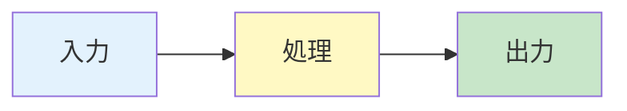
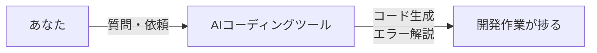
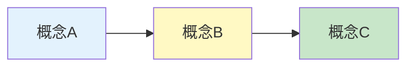
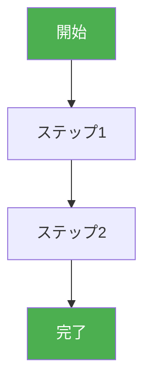
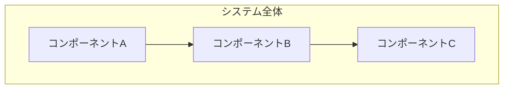

# Tutorial Article Generator — 入門者向けチュートリアル記事 自動生成

## Overview

技術ドキュメントを入力として、入門者・駆け出しエンジニア向けのハンズオンチュートリアル記事を自動生成するスキル。前提知識の整理から実践的なハンズオン手順、用語集、FAQまで、初学者が迷わず学べる構成の記事を出力する。

**提案元の実績:**
- nablarch-mcp-server-for-junior-engineers.md（589行）: 駆け出しエンジニア向け入門記事を生成
  - 用語集25項目、FAQ5項目
  - Mermaid図7つ、コード例8つ
  - ハンズオン6ステップ
  - PR #49で公開

**主な用途:**
- 技術ドキュメントを初学者向けに噛み砕いて説明したい
- 新しいツール・フレームワークの入門記事を作成したい
- 社内向けのオンボーディング資料を作成したい
- 技術ブログ用のチュートリアル記事を作成したい
- ハンズオン形式の学習コンテンツを作成したい

**このスキルの特徴:**
- 対象読者のレベルに合わせた前提知識の整理と解説
- ステップバイステップで迷わず進められるハンズオン設計
- 技術用語の抽出と解説付記（用語集自動生成）
- Mermaid図による概念の視覚化
- FAQ自動生成（よくある質問・つまずきポイント）
- コード例の正確性確認（FQCN、コンパイル可能性）

## When to Use

以下のいずれかに該当する場合にこのスキルを使用する：

- 「初心者向けチュートリアルを作って」
- 「入門記事を生成して」
- 「ハンズオン形式の解説を作って」
- 「駆け出しエンジニア向けの記事が欲しい」
- 「○○の使い方をステップバイステップで説明して」
- 「初学者でもわかるように説明して」
- 「前提知識から丁寧に解説した記事を作って」
- 「技術ドキュメントを噛み砕いて記事にして」
- 「ハンズオン付きの入門ガイドを作成して」
- 「用語集とFAQ付きのチュートリアルを生成して」
- 技術ドキュメントを初学者向けにリライトしたい場合
- 新しいツール導入時のオンボーディング資料が必要な場合

**トリガーキーワード**: チュートリアル, 入門, ハンズオン, 初心者向け, 駆け出し, ステップバイステップ, 前提知識, 用語集, FAQ, オンボーディング, tutorial, hands-on, beginner, getting started

## Input Format

```yaml
# 必須パラメータ
source_documents:                           # 元となる技術ドキュメント（パスまたは内容）
  - "path/to/overview.md"
  - "path/to/architecture.md"
  - "path/to/setup-guide.md"

# 任意パラメータ（デフォルト値あり）
target_audience: "junior"                   # "complete-beginner" | "junior" | "mid-level"
                                            # デフォルト: "junior"（実務1-2年目）
technology_name: null                       # 対象技術名（ドキュメントから自動抽出も可）
                                            # デフォルト: null（自動抽出）
language: "ja"                              # "ja" | "en" — 出力言語
                                            # デフォルト: "ja"
output_path: null                           # 出力ファイルパス
                                            # デフォルト: "docs/articles/{technology}-tutorial.md"
include_hands_on: true                      # ハンズオンセクションを含めるか
                                            # デフォルト: true
include_glossary: true                      # 用語集を含めるか
                                            # デフォルト: true
include_faq: true                           # FAQを含めるか
                                            # デフォルト: true
max_prerequisites: 5                        # 前提知識として説明する項目数上限
                                            # デフォルト: 5
hands_on_environment: null                  # ハンズオン環境（"local" | "docker" | "cloud"）
                                            # デフォルト: null（ドキュメントから判断）
```

## Output Format

出力はMarkdown形式のチュートリアル記事。以下のセクション構成:

```markdown
# {技術名} 入門チュートリアル

> この記事は、{対象読者の説明}を対象としています。
> 前提知識から丁寧に解説し、実際に手を動かして試せるハンズオンも含みます。

---

## 目次

1. [はじめに：この記事で学べること](#1-はじめにこの記事で学べること)
2. [前提知識の整理](#2-前提知識の整理)
   - [{前提知識1}とは](#21-前提知識1とは)
   - [{前提知識2}とは](#22-前提知識2とは)
3. [問題提起：なぜ{技術名}が必要なのか](#3-問題提起)
4. [解決策：{技術名}の仕組み](#4-解決策)
5. [ハンズオン：実際に動かしてみよう](#5-ハンズオン)
6. [発展：さらに学ぶために](#6-発展)
7. [まとめ](#7-まとめ)

---

## 用語集

| 用語 | 読み | 説明 |
|------|------|------|
| {用語1} | {読み} | {説明} |
| ... | ... | ... |

---

## FAQ

### Q1: {よくある質問1}
**A:** {回答}

### Q2: {よくある質問2}
**A:** {回答}

...
```

## Instructions

### Phase 1: 元技術ドキュメントの読み込みと分析

#### Step 1.1: ドキュメントの読み込み

```
【実行手順】

1. source_documents で指定された全ファイルを読み込む
   - Readツールで各ファイルを読み込み
   - ファイルが存在しない場合はエラーを報告

2. 各ドキュメントから以下を抽出:
   - 技術名/プロジェクト名
   - 主要な概念・機能
   - 技術用語
   - コード例
   - 図表
   - セットアップ手順（あれば）

3. ドキュメント全体の構造を把握:
   - 対象読者レベル（ドキュメントが想定している読者）
   - 前提知識として必要な技術
   - 解決しようとしている課題
```

#### Step 1.2: 技術用語の抽出

```
【実行手順】

1. ドキュメント内の技術用語を全て抽出:
   - 略語（MCP, RAG, FQCN等）
   - 専門用語（ハンドラキュー、セマンティック検索等）
   - ツール名・フレームワーク名
   - プロトコル名・規格名

2. 各用語について以下を記録:
   - 用語（英語/日本語）
   - 読み方
   - 簡潔な説明（初学者向け）
   - 関連用語

3. 用語の難易度を評価:
   - Level 1: 一般的なIT用語
   - Level 2: 特定分野の専門用語
   - Level 3: 対象技術固有の用語

【目標】
- 最低15個の用語を抽出
- 用語集セクションの素材とする
```

### Phase 2: 対象読者のレベル設定

#### Step 2.1: 読者ペルソナの定義

```
【読者レベル定義】

■ complete-beginner（完全な初学者）
  - プログラミング学習中
  - IT業界未経験または経験半年未満
  - 基本的なIT用語も説明が必要
  - 前提知識: PC操作、テキストエディタ使用程度

■ junior（駆け出しエンジニア）★デフォルト
  - 実務経験1-2年目
  - 基本的なプログラミングは可能
  - フレームワークの経験が浅い
  - 前提知識: 1言語のプログラミング、Git基礎、コマンドライン基礎

■ mid-level（中堅エンジニア）
  - 実務経験3年以上
  - 複数の技術に触れた経験あり
  - 新しい技術のキャッチアップが主目的
  - 前提知識: 複数言語、各種ツール、アーキテクチャ基礎

【出力】
読者ペルソナを「この記事の対象読者」として冒頭に明記する
```

#### Step 2.2: 前提知識の洗い出し

```
【実行手順】

1. Phase 1.1で抽出した前提知識リストを確認

2. 対象読者レベルに応じて説明が必要な前提知識を選定:
   - complete-beginner: 全ての前提知識を説明
   - junior: 専門的な前提知識のみ説明（max_prerequisites件）
   - mid-level: 対象技術固有の概念のみ説明

3. 各前提知識について以下を準備:
   - 「○○とは」セクションのタイトル
   - 一言での説明
   - 詳細な解説（図解含む）
   - 具体例

【優先順位】
1. 対象技術を理解するために必須の前提知識
2. 頻出する概念・用語
3. 初学者が混乱しやすい概念
```

### Phase 3: 前提知識の整理と解説生成

#### Step 3.1: 前提知識セクションの生成

```
【テンプレート】

## 2. 前提知識の整理

### 2.1 {前提知識1}とは

#### そもそも「{前提知識1}」って何？

**{前提知識1}** とは、{一言での説明}です。

> 「{たとえ話や比喩}」のようなものです。

#### もう少し詳しく

{詳細な解説。2-3段落。}

```mermaid
{概念を視覚化する図}
```

#### 具体例

{具体的な使用例やシナリオ}

---

【ルール】
- 各前提知識に Mermaid 図を1つ以上含める
- たとえ話や比喩を活用して親しみやすく
- 「そもそも」「つまり」など平易な言葉を使う
- 技術用語は初出時に必ず説明を付ける
```

### Phase 4: 技術用語の抽出と解説付記

#### Step 4.1: 用語集の生成

```
【テンプレート】

## 用語集

| 用語 | 読み | 説明 |
|------|------|------|
| MCP | エムシーピー | Model Context Protocol。AIと外部ツールを繋ぐ標準規格 |
| FQCN | エフキューシーエヌ | Fully Qualified Class Name。完全修飾クラス名 |
| ... | ... | ... |

【ルール】
- Phase 1.2で抽出した用語を全て含める
- 最低15項目、推奨25項目以上
- 読み方は日本語での発音（カタカナ）
- 説明は1-2文で簡潔に
- アルファベット順または出現順でソート
- 関連する用語はまとめて配置
```

### Phase 5: ハンズオン手順の設計

#### Step 5.1: ハンズオン環境の決定

```
【確認事項】

1. hands_on_environment パラメータを確認
   - 指定がある場合: その環境を前提に設計
   - 指定がない場合: ドキュメントから最適な環境を判断

2. 環境別の特性:
   - local: ローカルマシンに直接インストール
     - メリット: 最もシンプル
     - デメリット: 環境差異が発生しやすい
   - docker: Dockerコンテナを使用
     - メリット: 環境差異を吸収
     - デメリット: Docker知識が前提
   - cloud: クラウドサービスを使用
     - メリット: セットアップ不要
     - デメリット: アカウント登録が必要

3. 対象読者に応じた環境選定:
   - complete-beginner: local（最もシンプル）
   - junior: local または docker
   - mid-level: 任意
```

#### Step 5.2: ステップバイステップ手順の設計

```
【テンプレート】

## 5. ハンズオン：実際に動かしてみよう

### 準備するもの

| 項目 | 要件 | 確認方法 |
|------|------|---------|
| {ツール1} | {バージョン要件} | `{確認コマンド}` |
| {ツール2} | {バージョン要件} | `{確認コマンド}` |

### Step 1: {最初のステップ}

**目的**: {このステップで達成すること}

**手順**:

1. {具体的な操作1}
   ```bash
   {コマンド}
   ```

2. {具体的な操作2}
   ```bash
   {コマンド}
   ```

**確認ポイント**:
- [ ] {確認事項1}
- [ ] {確認事項2}

**うまくいかない場合**:
- {トラブルシューティング1}
- {トラブルシューティング2}

---

【ルール】
- 各ステップに「目的」「手順」「確認ポイント」「トラブルシューティング」を含める
- コマンドは全てコピペ可能な形式で記載
- スクリーンショットの代わりに期待される出力を記載
- 5-8ステップが適切（多すぎると挫折の原因）
- 最終ステップは「動作確認」で成功体験を得られるように
```

### Phase 6: 動作確認コード例の生成

#### Step 6.1: コード例の作成

```
【ルール】

1. コード例の品質基準:
   - コンパイル/実行可能であること
   - FQCNを使用（インポート文省略しない）
   - バージョン番号を明記
   - コメントで各行の意味を説明

2. コード例のフォーマット:
   ```{言語}
   // {コードの目的を説明}
   {コード}
   ```

3. 実行結果の明示:
   ```
   # 期待される出力
   {出力例}
   ```

4. エラーケースの説明:
   - よくあるエラーとその対処法を記載
   - 「うまくいかない場合」セクションに集約
```

### Phase 7: Mermaid図による図解

#### Step 7.1: 図の設計と生成

```
【必須の図】

1. 全体像を示す図（冒頭または「解決策」セクション）
   - コンポーネント間の関係
   - データフロー

2. 前提知識の概念図（Phase 3で各前提知識に1つ）
   - 抽象概念の視覚化

3. ハンズオンのフロー図（Phase 5）
   - 手順の全体像

【Mermaid図のルール】

- 日本語ラベルを使用
- ノードのスタイルを設定して視認性向上
- 複雑になりすぎない（ノード10個以内）
- 代替としてASCII図も併記（Mermaidが表示できない環境向け）

【テンプレート例】


```

### Phase 8: 用語集の生成

Phase 4.1で作成済み。最終的な用語集を出力に含める。

### Phase 9: FAQの生成

#### Step 9.1: FAQ項目の収集と生成

```
【FAQの情報源】

1. ドキュメント内の注意事項・警告
2. ハンズオンのトラブルシューティング
3. 技術特有のよくある間違い
4. 対象読者レベルで想定される疑問

【テンプレート】

## FAQ

### Q1: {よくある質問}

**A:** {回答}

{必要に応じてコード例や図を追加}

---

【ルール】
- 最低5件のFAQを生成
- 「なぜ○○なのですか？」形式の理由を問う質問を含める
- 「○○が動かないのですが」形式のトラブルシューティングを含める
- 回答は簡潔に（3文以内）、必要に応じて詳細リンク
```

### Phase 10: 記事の組み立て

#### Step 10.1: 全セクションの統合

```
【統合順序】

1. タイトルとリード文
2. 目次
3. はじめに：この記事で学べること
4. 前提知識の整理（Phase 3）
5. 問題提起
6. 解決策（技術の仕組み）
7. ハンズオン（Phase 5-6）
8. 発展：さらに学ぶために
9. まとめ
10. 用語集（Phase 8）
11. FAQ（Phase 9）
12. フッター（フィードバック募集等）

【最終チェック】
- 目次のリンクが正しいか
- Mermaid図が正しくレンダリングされるか
- コード例がコピペ可能か
- 用語の初出時に説明があるか
```

#### Step 10.2: 品質チェック

```
【品質チェックリスト — 全項目確認必須】

□ 構造チェック
  □ 全セクション（1-7 + 用語集 + FAQ）が揃っている
  □ 目次のリンクが全て有効
  □ 各セクションに適切な見出しレベルが設定されている

□ 読者体験チェック
  □ 冒頭に対象読者の明記がある
  □ 前提知識が適切に説明されている
  □ 技術用語の初出時に説明がある
  □ ハンズオンが迷わず進められる詳細度

□ ビジュアルチェック
  □ Mermaid図が最低3つある
  □ 図が正しくレンダリングされる
  □ テーブルのフォーマットが崩れていない

□ コード品質チェック
  □ コード例がコピペ可能
  □ 期待される出力が明記されている
  □ FQCNが正確（存在するクラス名）
  □ バージョン番号が記載されている

□ 完全性チェック
  □ 用語集に15項目以上
  □ FAQに5項目以上
  □ 総行数が300行以上
  □ 外部リンクのURL有効性確認

□ 初学者フレンドリーチェック
  □ 「そもそも」「つまり」など平易な表現の使用
  □ たとえ話・比喩の活用
  □ 成功体験で終わる構成（ハンズオン最終ステップ）
```

## Examples

### Example 1: nablarch-mcp-server入門記事

```yaml
# 入力
source_documents:
  - "docs/01-overview.md"
  - "docs/02-architecture.md"
  - "docs/07-setup-guide.md"
target_audience: "junior"
technology_name: "nablarch-mcp-server"
language: "ja"
include_hands_on: true
include_glossary: true
include_faq: true
```

```markdown
# 出力（抜粋）

# 駆け出しエンジニアのためのnablarch-mcp-server入門

> この記事は、プログラミング学習中〜実務1-2年目のエンジニア、
> Nablarchを初めて触る方、AIコーディングツールに興味がある初学者を対象としています。

---

## 2. 前提知識の整理

### 2.1 AIコーディングツールとは

#### そもそも「AIコーディングツール」って何？

**AIコーディングツール**とは、ChatGPTやClaudeのような対話型AIを、
プログラミング作業に特化させたツールです。



...

## 用語集

| 用語 | 読み | 説明 |
|------|------|------|
| MCP | エムシーピー | Model Context Protocol。AIと外部ツールを繋ぐ標準規格 |
| ハンドラキュー | — | Nablarchのリクエスト処理パイプライン |
...（25項目）

## FAQ

### Q1: MCPサーバーとは何ですか？
**A:** AIアシスタントに追加の機能や知識を提供するサーバーです。...

### Q2: Javaがインストールされているか確認するには？
**A:** ターミナルで `java -version` を実行してください。...
```

### Example 2: Docker入門チュートリアル

```yaml
# 入力
source_documents:
  - "docs/docker-overview.md"
  - "docs/docker-getting-started.md"
target_audience: "complete-beginner"
technology_name: "Docker"
language: "ja"
hands_on_environment: "local"
```

出力: Docker未経験者向けに、コンテナの概念から hello-world 実行までを丁寧に解説した記事

### Example 3: React Hooks入門

```yaml
# 入力
source_documents:
  - "docs/react-hooks-api.md"
target_audience: "mid-level"
technology_name: "React Hooks"
language: "ja"
max_prerequisites: 2
```

出力: JavaScript経験者向けに、React Hooks の概念と実践的な使い方を解説した記事（前提知識の説明は最小限）

## Anti-Patterns

### 避けるべきこと

1. **前提知識の説明不足**
   - NG: 「MCPを使ってツールを作ります」（MCPの説明なし）
   - OK: 「MCP（Model Context Protocol）とは...」から始める
   - 対策: Phase 3で全ての前提知識を説明

2. **抽象的すぎるハンズオン**
   - NG: 「セットアップを行ってください」
   - OK: 具体的なコマンドと期待される出力を明記
   - 対策: Phase 5で全ステップを詳細化

3. **トラブルシューティングの欠如**
   - NG: ハンズオンの手順だけ
   - OK: 「うまくいかない場合」セクションを各ステップに
   - 対策: Phase 5.2のテンプレートに従う

4. **用語集の貧弱さ**
   - NG: 5項目程度の用語集
   - OK: 15項目以上、できれば25項目以上
   - 対策: Phase 1.2で徹底的に用語を抽出

5. **図の不足**
   - NG: テキストのみの説明
   - OK: 各主要概念にMermaid図
   - 対策: Phase 7で最低3つの図を生成

6. **読者レベルの無視**
   - NG: 初学者向けに専門用語を多用
   - OK: 対象読者に合わせた説明レベル
   - 対策: Phase 2でペルソナを明確化

7. **成功体験のない終わり方**
   - NG: 「以上で説明を終わります」
   - OK: 動作確認で「できた！」を体験させる
   - 対策: ハンズオン最終ステップを動作確認に

8. **コピペできないコード例**
   - NG: 省略記号（...）を含むコード
   - OK: そのままコピペして動作するコード
   - 対策: Phase 6.1のルールに従う

9. **FAQの形式化**
   - NG: 「Q: 何ですか？ A: ○○です」の羅列
   - OK: 実際によくある疑問・つまずきを反映
   - 対策: Phase 9でトラブルシューティングと連携

10. **外部リンクの放置**
    - NG: 404になるリンク
    - OK: 全リンクの有効性を確認
    - 対策: Phase 10.2の品質チェックで確認

## Guidelines

### 必須ルール

1. **対象読者の明記**: 記事冒頭に必ず対象読者を明記する
2. **用語の初出説明**: 技術用語は初出時に必ず説明を付ける
3. **Mermaid図の活用**: 抽象概念は必ず図で視覚化する
4. **ハンズオンの詳細化**: 各ステップに目的・手順・確認ポイント・トラブルシューティングを含める
5. **用語集15項目以上**: 技術用語を網羅的に収集・説明
6. **FAQ5項目以上**: よくある疑問・つまずきを予測して回答
7. **成功体験での終了**: ハンズオン最終ステップは動作確認
8. **コード例の正確性**: FQCN、バージョン、コンパイル可能性を確認

### 品質基準

| 項目 | 基準 |
|------|------|
| 総行数 | 300行以上 |
| Mermaid図 | 3つ以上 |
| 用語集 | 15項目以上 |
| FAQ | 5項目以上 |
| ハンズオンステップ | 5-8ステップ |
| コード例 | 5つ以上 |

### 出力ファイルのメタデータ

```markdown
# {技術名} 入門チュートリアル

> **作成日**: {日付}
> **対象読者**: {読者レベルの説明}
> **元ドキュメント**: {source_documentsのリスト}
> **作成者**: {agent_id} (shogun-tutorial-article-generator)

---
```

## Appendix

### A. 対象読者レベル別の説明深度

| 項目 | complete-beginner | junior | mid-level |
|------|------------------|--------|-----------|
| 基本IT用語 | 説明必須 | 軽く触れる | 省略可 |
| プログラミング基礎 | 説明必須 | 省略可 | 省略可 |
| 対象技術の前提知識 | 詳細説明 | 説明必須 | 軽く触れる |
| 対象技術固有の概念 | 詳細説明 | 詳細説明 | 説明必須 |
| ハンズオン詳細度 | 最高（スクショ相当） | 高 | 中 |
| 用語集項目数 | 30+ | 20+ | 15+ |

### B. Mermaid図テンプレート集

#### B.1 概念関係図



#### B.2 フロー図



#### B.3 コンポーネント図



### C. 品質チェック用コマンド

```bash
# 行数確認
wc -l docs/articles/*-tutorial.md

# 用語集項目数確認
grep -c "^|" docs/articles/*-tutorial.md | grep "用語集" -A5

# Mermaid図数確認
grep -c "```mermaid" docs/articles/*-tutorial.md

# リンク抽出（手動確認用）
grep -oP 'https?://[^\s)]+' docs/articles/*-tutorial.md | sort -u
```
